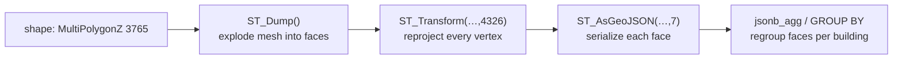

# Zagreb 3D buildings — performance (the "Učitavanje zgrada…" wait)

Loading the 3D buildings for Zagreb (`POST /buildings/near`) was the slowest thing in the app —
~11–13 s per query, and it made every proposal open in 3D feel sluggish. This documents why, the
fix (precompute), and the prod runbook.

## Root cause (measured, `EXPLAIN (ANALYZE, BUFFERS)`)

The `building_3d` table holds 357,683 LOD2 meshes as `MultiPolygonZ` in EPSG:3765. The old query did
this **on every request**, per building in range:



For one block that fanned **531 buildings → 17,581 faces**, all dumped, reprojected and serialized
per request — for data that **hasn't changed since 2022**. Time breakdown of the ~13 s:

| Part | Time |
|---|---|
| JIT compilation (triggered by the high query cost) | ~4.5 s |
| Planning | ~2 s |
| `ST_Dump`+`ST_Transform`+`ST_AsGeoJSON` on 17.5k faces | ~5 s |
| `ST_DWithin` recheck on full 3D meshes | ~1.7 s |
| GROUP BY sort spilling to disk (`work_mem`=4MB) | ~0.15 s |

Indexes were **not** the problem — there's a working GiST index on `shape`. And this systemic JIT tax
hit every high-cost PostGIS query, which is why other endpoints felt slow too.

## The fix — precompute the static geometry once

The dataset is static, so we do the expensive decomposition **once** and store the result. New
columns on `building_3d`:

| Column | Purpose |
|---|---|
| `faces_4326 jsonb` | Face polygons already reprojected to EPSG:4326 (precision 7) — served as-is |
| `z_min`, `z_max real` | Vertical extent (no `ST_ZMin/Max` per request) |
| `geom2d_3765 geometry(Geometry,3765)` | 2D footprint for the spatial filter, GiST-indexed |

`backend/buildings/zagreb-3d.js` then just spatial-filters on the 2D footprint and reads the JSONB —
no `ST_Dump`/`ST_Transform`/`ST_AsGeoJSON` at request time. The endpoint response shape is
**unchanged** (`{object_id, z_min, z_max, faces}`), so the frontend needed no changes.

### Results

| | Before | After |
|---|---|---|
| `/buildings/near` query | ~13,000 ms | **~89 ms** (~145×) |
| JIT | on, wasting ~4.5 s | on, untouched — the query is now too cheap to trigger it |
| `building_3d` size | 623 MB | 2001 MB (+1.4 GB precomputed faces) |

Note: JIT was **not** disabled. Simplifying the query removed the JIT cost naturally (cost dropped
from ~508k to ~650, below `jit_above_cost`). The +1.4 GB is the storage cost of the precomputed faces.

## Migration & rollout

The migration is `backend/buildings/building-3d-precompute.sql`. It is idempotent and **batched** — a
`plpgsql` procedure that processes 2000 buildings and `COMMIT`s per chunk (never one giant
transaction; resumable; PG11+ for procedure-level COMMIT — prod & local are PG17).

**Prod rollout order (matters — backfill before the new code goes live):**

1. Confirm prod has ~1.5 GB free disk.
2. Run the migration against the prod DB (adds columns, backfills ~357k rows ≈ 10 min, creates the
   GiST index, `ANALYZE`). The **old** backend keeps serving correctly during this.
   ```sh
   # on the server (do), against the prod building_3d DB (docker; check the server .env for PG*),
   # e.g.:  docker exec -i <pg-container> psql -U <user> -d <db> < building-3d-precompute.sql
   ```
3. Deploy the backend (`deploy-backend.sh` → git pull + PM2 restart) so the new query goes live
   against the now-populated columns.

## Static-data assumption

The 3D building model is a one-time 2022 capture and doesn't change. If it is ever re-ingested, just
re-run the migration — the batched procedure only touches rows where `faces_4326 IS NULL`, so it
populates any new rows and leaves the rest untouched. (If it ever became a live-updating dataset,
move the precompute into the ingest pipeline or a trigger instead.)

## Possible follow-ups (not done)

- Drop `ST_AsGeoJSON` precision 7→6 (~1 cm → ~10 cm) to shrink the JSONB / payload.
- Stream buildings as NDJSON so the client can render them progressively while the DB is still
  returning — pairs well with a client-side incremental renderer.
