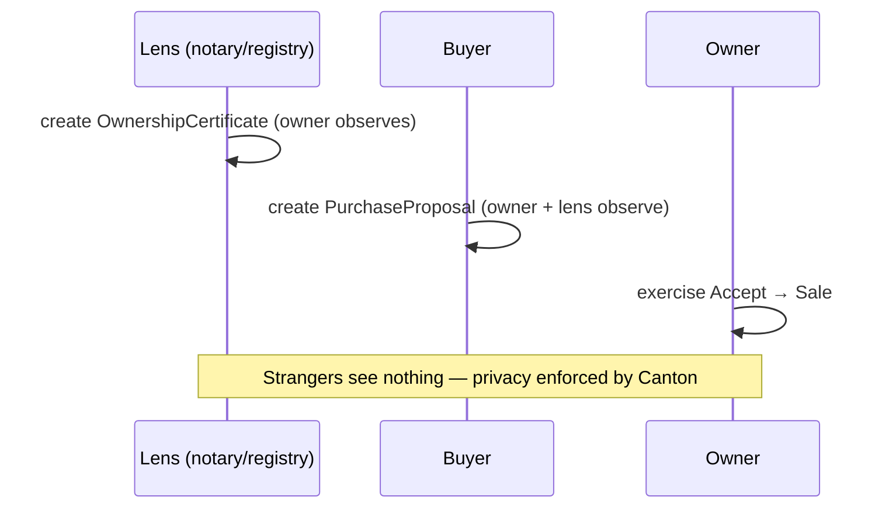
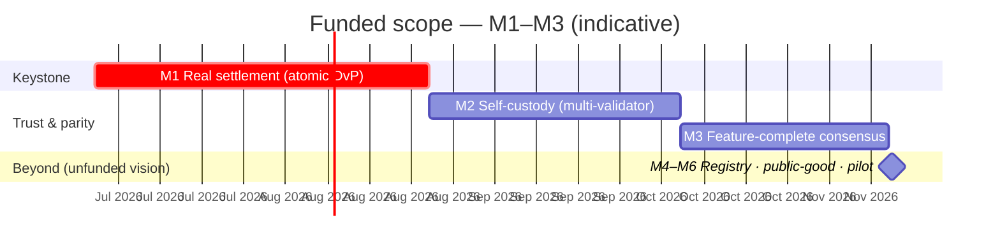

<!-- Canton roadmap + funding-alignment deck for the post-hackathon BD/devrel call.
     Funded ask is tightened to 3 milestones (M1-M3) with an indicative USD budget
     (paid in CC, milestone-gated); M4-M6 kept as a short unfunded vision. Pairs the
     work with Canton's two funding taps (Dev Fund grants vs App Rewards) plus a
     concrete ask. Source of truth for the call; keep in sync with feature-daml*.md. -->

# Urban Game Theory on Canton — Milestones & Funding Plan

*Prepared for the Canton Network follow-up call (devrel + BD, US/Europe).*

**Urban Game Theory** ([urbangametheory.xyz](https://urbangametheory.xyz)) is a toolkit for collaborative urban planning: land is modelled as **parcels**, and every development or transaction is a **proposal** that the affected owners accept. We built a Canton/DAML integration at the NYC hackathon (prize-winning) and it is **live on Canton DevNet today**. This document proposes a focused, three-milestone next phase and how it maps onto Canton's funding mechanisms.

---

## TL;DR — the ask

1. **Champion us** through the Canton Dev Fund proposal process (a Tech & Ops Committee champion is required for non-members).
2. A focused **~$95k, three-milestone grant** (paid in CC, milestone-gated) for **M1–M3** — delivered as a *privacy-preserving land/RWA settlement reference implementation* — plus putting Urban Game Theory on the path to **Featured App** status once real Canton Coin settlement is live (M1).
3. **Unblock M1** (our keystone): scan/registry endpoints, DevNet Canton Coin, and CIP-56 token-standard guidance.
4. **Intro to a land-registry / real-estate pilot partner** for the vision phase — we already run a real cadastre data pipeline, which is our moat.

> This is squarely on-thesis for the **$355M a16z-led round** to *"deepen engagement with developers"* and bring real-world assets onchain.

---

## Where we are today (live on DevNet)

A single-parcel purchase runs **end-to-end on Canton DevNet**, integrated into the main map app as a third chain option (alongside EVM/Base and Solana). Canton's **selective disclosure is demonstrated live** by switching identities.

| Phase | What works | Status |
|---|---|---|
| **P0** Enter Canton mode | Network switch + identity picker in the main app | ✅ |
| **P1** Proposal-count signal | On-ledger `ProposalMarker` → map badges, no terms leaked | ✅ |
| **P2** Create proposal from the map | Canton mode mints via `/canton/proposals` (skips NFTs) | ✅ |
| **P3** View / accept on the parcel | Owner accepts; stakeholders see terms, strangers see "private" | ✅ |
| **P4** Identity tooling + state explorer | Pick / paste / generate parties; in-app ledger explorer | ✅ |

**The DAML model** (`blockchain/daml/daml/Proposal.daml`, SDK 3.4.11, `daml test` green):

- `OwnershipCertificate` — a buyer-chosen **lens** (notary / registry / the buyer) attests `owner` owns `parcelId`.
- `PurchaseProposal` — buyer offers; `Accept` (owner) → archives the proposal, creates a `Sale`; `Withdraw` (buyer).
- `Sale` — bilateral, signed by buyer + owner, with the lens as an optional read-only observer.
- `ProposalMarker` — public existence signal (parcel + opaque cid only) → drives map counts **without disclosing terms**.

**Deliberately deferred** (these become M1 and M2 below — we name our own gaps):

- **Real money** — `price` is a Canton-Coin-denominated number; no value moves yet (blocked on scan/registry URL).
- **Owner self-custody** — runs custodially today (all parties on our validator); true cross-participant custody hits `PACKAGE_SELECTION_FAILED`.

---

## The funded ask — three milestones

**M1 is the keystone:** it is the deliverable a grant funds *and* the precondition for App Rewards.

### M1 — Real settlement (atomic DvP) · KEYSTONE 🔑 · ~$40k

- **Goal:** make `price` move for real. Extend `PurchaseProposal.Accept` to atomically consume the buyer's payment Holding (Canton Coin / CIP-56 token-standard asset) and credit the owner *in the same Daml transaction* that creates the `Sale` — delivery-versus-payment with no escrow contract and no counterparty risk.
- **Demo:** owner Accepts → ownership (`Sale`) and CC payment settle atomically; reverting either reverts both.
- **Why Canton:** native atomic DvP is the thing EVM fakes with escrow. And real CC transfers mean the app starts generating network activity → **App Rewards eligibility begins here.**
- **Unblock / ask:** scan + registry URL, DevNet Canton Coin, CIP-56 token-standard guidance.
- **Funding tap:** App Rewards (unlocks Featured App) **+** Dev Fund grant (as a *privacy-preserving RWA settlement reference implementation*).

### M2 — True self-custody (multi-validator) · ~$30k

- **Goal:** move lens / owner / buyer off our single custodial backend onto independent participant nodes; solve DAR distribution / cross-participant package vetting (`PACKAGE_SELECTION_FAILED`).
- **Demo:** a parcel owner on an independent validator (Splice wallet) accepts a proposal; our backend never sees the private terms.
- **Why Canton:** privacy is only *credible* once parties are on separate nodes — this makes the selective-disclosure story honest rather than custodial.
- **Ask:** engineering guidance on cross-participant package vetting + wallet onboarding — this is where we'd most value your engineers.
- **Funding tap:** Dev Fund grant (reusable multi-participant onboarding reference) + BD/eng support.

### M3 — Feature-complete consensus · ~$25k

- **Goal:** bring the full EVM proposal model to DAML: multi-parcel proposals, multi-owner with fractional share splits (`shareBps`), third-party fund contribution, conditional acceptance, withdrawal, and expiry.
- **Demo:** a 3-owner parcel where each owner accepts independently and funds distribute proportionally — all terms private to non-parties.
- **Why Canton:** multi-party authorization + privacy is DAML's home turf; the multi-party version is *cleaner* here than on EVM. Answers "can you do everything EVM does?" → yes, and better.
- **Funding tap:** App Rewards (richer flows = more transactions) + Dev Fund (multi-party settlement pattern reference).

### Summary + indicative budget

| # | Milestone | Primary demo | Effort | Budget (USD) | Funding tap |
|---|---|---|---|---|---|
| **M1** 🔑 | Real settlement (atomic DvP) | Ownership + payment settle atomically | ~8 wks | **~$40,000** | App Rewards + Dev Fund |
| **M2** | Self-custody (multi-validator) | Owner accepts from their own node | ~6 wks | **~$30,000** | Dev Fund + eng support |
| **M3** | Feature-complete consensus | 3-owner proportional distribution | ~5 wks | **~$25,000** | App Rewards + Dev Fund |
| | **Total** | | **~19 wks (~5 mo)** | **~$95,000** | |

> **Budget basis:** indicative, **milestone-gated** (released on accepted delivery), **paid in Canton Coin fixed in USD terms per milestone** — each milestone is under 6 months, matching the program's USD-fixed rule. Figures reflect ~19 engineering-weeks of specialized DAML/Canton work at an indie blended rate; they **exclude** an optional external security audit and validator-infra hosting, which can be added as line items. Scales up (audit, co-marketing) or down. *For scale: the OpenZeppelin corporate stack is 28.4M CC over 24 months — this is a deliberately focused solo ask.*

---

## Beyond the funded scope (vision — priced later)

Where M1–M3 take us next. We'd scope and price these once the first three land; this is where **BD/strategic support and a pilot-partner intro** come in.

- **M4 — Registry-as-issuer:** promote the "lens" from a hackathon stand-in to a real land registry / notary / KYC'd party issuing `OwnershipCertificate`s against **real cadastre parcels** (we already run the pipeline). The bridge from demo to a *regulated* pilot, and where our cadastre data is a moat.
- **M5 — Privacy-preserving public-good layer:** give the city/public aggregate signal — activity per block, consensus levels, contested parcels — *without* exposing private terms. "Transparency of activity, confidentiality of terms" — the core urban-planning value prop.
- **M6 — Pilot + cross-app composition:** run one real scope (a city block) end-to-end on Canton, and compose atomically with a **second Canton app** (tokenized cash from a bank, a mortgage/lending app) over the Global Synchronizer — the network-effect story Canton most wants to tell.

---

## How this maps to Canton's funding (the two taps)

Canton has **two distinct money channels**, and the ask is built to hit both. M1 is the keystone because it unlocks each.

| Tap | What it is | Fits us via |
|---|---|---|
| **Dev Fund / Grants Program** ([canton.foundation](https://canton.foundation/grants-program/)) | 5% of CC emissions, milestone-based, paid in CC, via PR to [canton-dev-fund](https://github.com/canton-foundation/canton-dev-fund). **Funds common-good work, not individual dapps.** | The **~$95k M1–M3 reference implementation** (settlement + multi-participant onboarding + multi-party pattern) — reusable by every Canton builder. |
| **App Rewards / Featured App** | ~50% of CC emissions flow to apps; a featured app mints **≥ ~$100 of CC per CC transfer** through its workflows. Usage-based, ongoing. | **Urban Game Theory directly** — but only once **M1** makes it drive real CC transactions. |
| **BD / strategic** | Discretionary corporate support from the $355M round; ecosystem expansion + RWA showcases. | The **vision phase (M4–M6)** — regulated land transactions + cadastre data are on-thesis; the reason BD is in the room. |

**Grant comparables already in the Dev Fund** (so we know the shape and scale):

- **OpenZeppelin – Canton Ecosystem Stack**: 28,378,378 CC / 24 months / 8 milestones (corporate scale).
- Solo / small-team scale (our comparables): *Deepthi – Payment Streams*, *Srikanth – Settlement Pattern Reference (DEX)*, *Noders – Go SDKs*, *Peaceful Studio – C#/.NET SDK*, *IEU – DAML Code Assistant*.

---

## The ask (call agenda)

1. **Champion** — will you champion a Canton Dev Fund proposal for us? (names the actual gating mechanism for non-members)
2. **Grant** — a **~$95k, milestone-gated** grant for the **M1–M3 settlement + consensus reference implementation**, paid in CC.
3. **Featured App** — put Urban Game Theory on the path to App Rewards eligibility once **M1** makes it drive real CC settlement.
4. **Unblock M1** — scan + registry endpoints, DevNet Canton Coin, CIP-56 token-standard guidance.
5. **Eng support** — cross-participant DAR vetting / wallet onboarding for **M2**.
6. **Pilot intro** — a land-registry or real-estate partner for the vision phase (M4–M6), leveraging our cadastre pipeline.
7. **Framing** — "You raised $355M led by a16z to deepen developer engagement and bring RWAs onchain; privacy-preserving land transactions backed by a real cadastre is exactly that — what's the right vehicle?"

---

## Appendix — technical grounding

- **Contracts:** `blockchain/daml/daml/Proposal.daml` · tests in `Test.daml`.
- **Backend (custodial today):** `backend/canton/{token,ledger,proposals}.js`, `backend/routes/canton.js` — OIDC secret stays server-side; 8h JWT; JSON Ledger API v2.
- **Frontend:** `frontend/js/canton/*` (canton-mode, canton-counts, canton-parcel, canton-read, canton-explorer) → REST `/canton/*`.
- **Full status:** `feature-daml-readme.md` (what's built) · `feature-daml.md` (spec + decisions log) · `blockchain/daml/DEVNET-ACCESS.md` (endpoints, Canton Coin findings).
- **Cross-chain context:** EVM (Base Sepolia) is the full-featured reference (parcels, ETH+ERC20 proposals, EAS-attested acceptance, fractional owner lists, ENS, city token); Solana is a near-complete port. Canton is the privacy + real-settlement path — M1–M3 bring the consensus core to parity *and beyond* where Canton is differentiated (privacy, atomic DvP, multi-party).
