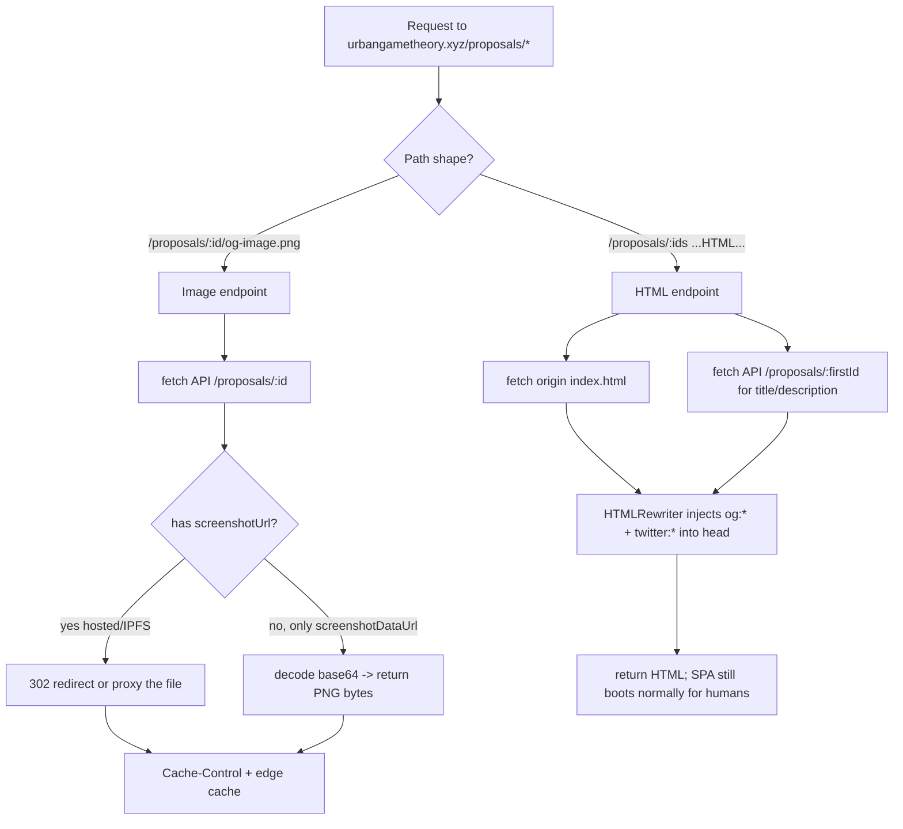

# Per-proposal social preview images (og:image) — implementation plan

Goal: when a proposal link (`https://urbangametheory.xyz/proposals/46?city=zg`) is shared on
forums, X/Twitter, Facebook, Discord, Slack, WhatsApp, etc., the embed shows **that proposal's
own preview image**, title and description — not the generic site card.

## Why the SPA can't do this today

Social/forum crawlers **do not run JavaScript**. They fetch the raw HTML and read the
`<meta property="og:*">` tags in `<head>`. Our app serves the same static `index.html` for every
`/proposals/*` route, so every share looks identical. Fixing this requires injecting per-proposal
meta tags **server-side / at the edge**, before the crawler sees the HTML.

## The image-hosting reality (important constraint)

We investigated where proposal images actually live:

| Proposal state | Where the image is | Field on `GET /proposals/:id` |
|---|---|---|
| Created locally, not uploaded | `data:` URL in IndexedDB only | — (not on server) |
| **Uploaded, no wallet (not minted)** | **base64 `data:` URL inside `proposal_data` JSONB** | `screenshotDataUrl` |
| Minted on local chain | file on our server | `screenshotUrl` = `https://api.urbangametheory.xyz/uploads/images/<name>.png` |
| Minted on real chain | Pinata IPFS | `screenshotUrl` = `https://gateway.pinata.cloud/ipfs/<cid>` |

Key point (answers "where do we host images without a wallet?"): **we don't** — the image exists
only as a `data:` URL. `og:image` must be an absolute `http(s)` URL, so for the common wallet-less
case there is nothing to point at. The Worker therefore has to **serve the image itself**, decoding
the `data:` URL from the API into real PNG bytes at a stable URL.

- **Self-hosted images (`/uploads/images/...`) and IPFS URLs both work** — they're public and a
  Worker can `fetch()` them and redirect/proxy. (The API's `/proposals/:id` is not WAF-blocked;
  server-to-server fetch from a Worker has no CORS restriction.)
- **`data:` URLs are the majority case** and are what the Worker must transcode.

## Is the Cloudflare approach free?

Yes for this use case. Cloudflare **Workers free plan**: 100,000 requests/day, 10 ms CPU/request,
and `HTMLRewriter` is available on the free tier. Every `/proposals/*` hit (humans + crawlers) runs
the Worker, but a small app stays well under 100k/day; the Cache API (also free) absorbs repeats.
No paid add-on needed. (If traffic ever approaches the limit, the Workers Paid plan is $5/mo.)

## Architecture — a single Cloudflare Worker, no backend changes (Phase 1)

Route `urbangametheory.xyz/proposals/*` through one Worker with two responsibilities:

### Route 1 — HTML meta injection: `GET /proposals/:ids`
1. `fetch(request)` the origin `index.html` (nginx SPA fallback) — unchanged for humans.
2. `fetch https://api.urbangametheory.xyz/proposals/<firstId>` for `name`/`title` + `description`.
3. Stream the HTML through `HTMLRewriter`, injecting into `<head>`:
   - `og:title` = proposal name (fallback: "Proposal #<id> · Urban Game Theory")
   - `og:description` = proposal description (fallback: a generic line)
   - `og:image` = `https://urbangametheory.xyz/proposals/<firstId>/og-image.png` (Route 2)
   - `og:url`, `og:type=website`, `twitter:card=summary_large_image`, `twitter:image`
4. Return the rewritten HTML. The SPA boots exactly as before; only `<head>` changed.
   - Multi-proposal links (`/proposals/47,48,49`) use the first id's image + a "N proposals" title.

### Route 2 — image endpoint: `GET /proposals/:id/og-image.png`
1. `fetch https://api.urbangametheory.xyz/proposals/:id`.
2. If `screenshotUrl` is a hosted/IPFS URL → `302` redirect (or proxy) to it.
3. Else if `screenshotDataUrl` is a `data:image/...;base64,...` → decode base64 → return the bytes with
   `Content-Type: image/png`.
4. Else → return a static fallback OG image (a branded default bundled with the Worker).
5. Set `Cache-Control: public, max-age=86400` and use the Cache API so we don't refetch the big JSON
   on every crawler/CDN hit.

### Requirements crawlers enforce (bake into the plan)
- `og:image` must be an **absolute HTTPS** URL (Route 2 satisfies this).
- Recommended size **1200×630**; our stitched map PNGs are usually large enough. If some are too
  small/oddly-shaped, add an optional resize step (see Phase 2).
- Correct `Content-Type` and a real byte length (no `data:`), which Route 2 guarantees.

## Phase 2 — optional hardening (recommended follow-ups, not required for launch)

1. **Populate `screenshot_url` on wallet-less upload.** The frontend already has dead-code helpers
   (`uploadProposalScreenshotDataUrl` → `/assets/upload`, `patchProposalScreenshotOnServer` →
   `PATCH /proposals/:id/screenshot`) that are never called. Wire them into the plain "Upload" flow
   (`dialog-upload.js`) so every uploaded proposal gets a real hosted file and `screenshot_url` set.
   Then Route 2 becomes a trivial redirect and the Worker stops shipping big base64 blobs. Existing
   proposals can be backfilled by a one-off script that reads `screenshotDataUrl` from `proposal_data`
   and POSTs it to `/assets/upload`, then PATCHes the URL.
2. **Lightweight meta endpoint.** Add `GET /proposals/:id/meta` returning `{ title, description,
   imageUrl }` **without** the huge `screenshotDataUrl`, so Route 1 stops pulling the full blob just
   for title/description.
3. **Server-side resize/normalize** to exactly 1200×630 (`sharp` already used in the backend) for
   consistent crops across platforms.

## Implementation steps (Phase 1)

1. Create the Worker (`workers/og-proposals/`), with:
   - path routing for `/proposals/:id/og-image.png` vs `/proposals/:ids`
   - `HTMLRewriter` head-injection
   - base64 `data:` decoding + hosted-URL redirect
   - a bundled fallback OG image
   - `escapeHtml` on injected attribute values
2. Add a `wrangler.toml` with the route `urbangametheory.xyz/proposals/*` and deploy via
   `wrangler deploy` (Cloudflare account already manages the zone).
3. Guard against loops: the origin `index.html` subrequest must bypass the Worker (same-zone
   subrequests don't re-invoke the same Worker; verify).
4. Keep the existing SPA routing intact — the Worker only augments `<head>` and adds one image path.

## Testing / validation

- `curl -A "facebookexternalhit/1.1" https://urbangametheory.xyz/proposals/46?city=zg` → confirm the
  injected `og:*` tags in the returned HTML.
- `curl -sI https://urbangametheory.xyz/proposals/46/og-image.png` → `200`, `image/png`, sane length.
- Facebook Sharing Debugger, X Card Validator, and a Discord/Slack paste for real-world rendering.
- A normal browser load of `/proposals/46` must behave exactly as today (SPA boots, no regression).

## Effort estimate

- Phase 1 (Worker, no backend changes): ~half a day, and it covers **all** proposals (minted, IPFS,
  and wallet-less data-URL) because it transcodes the `data:` URL.
- Phase 2 (upload wiring + backfill + meta endpoint + resize): ~another half day, optional.
