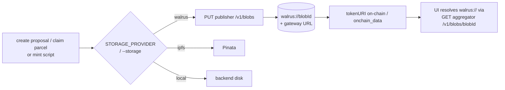

# Walrus storage

Walrus (Sui decentralized blob storage) is a config-selectable backend for NFT metadata + images,
alongside the existing IPFS/Pinata and local-filesystem options. It does **not** replace them —
it's an additional provider you turn on via config. Design + rationale live in
[`feature-walrus.md`](./feature-walrus.md); this file is the operational guide.

## How it works

- The canonical on-chain / DB pointer is **`walrus://<blobId>`** (content-addressed, host-independent,
  mirrors the existing `ipfs://<CID>` convention). The browser-renderable form is
  `{aggregator}/v1/blobs/<blobId>`.
- Smart contracts are **unchanged** — `ParcelNFT`/`ProposalNFT` store an opaque metadata-URI string,
  so `walrus://…` works as-is.
- Walrus dedups by content: re-uploading identical bytes returns the same `blobId` (no extra cost).



## Configuration (env)

Defaults target the **public Walrus testnet** — zero config needed for testnet. All optional:

| Var | Default | Notes |
|---|---|---|
| `WALRUS_PUBLISHER_URL` | `https://publisher.walrus-testnet.walrus.space` | where blobs are written |
| `WALRUS_AGGREGATOR_URL` | `https://aggregator.walrus-testnet.walrus.space` | where blobs are read |
| `WALRUS_EPOCHS` | `5` | storage duration (testnet epoch ≈ 1 day) |
| `WALRUS_PERMANENT` | `false` | set `true` instead of epochs (mainnet) |
| `WALRUS_SEND_OBJECT_TO` | set to our project Sui address | the wallet that receives (owns) each `Blob` object — see below |

Backend (`backend/storage/walrus.js`, `backend/routes/walrus.js`) and the mint scripts
(`blockchain/scripts/walrus-storage.js`) read the same vars.

### Blob ownership (`WALRUS_SEND_OBJECT_TO`)
Each stored blob creates a Sui `Blob` object; whoever owns it controls its lifecycle (extend/delete).
**The public testnet publisher honors `send_object_to`** — verified — so even though the publisher
*pays* the storage, the `Blob` object is transferred to **our** wallet. We set
`WALRUS_SEND_OBJECT_TO` (in `backend/.env` and `blockchain/.env`) to our project Sui address, so:
- uploads are still free (publisher-funded), **and** we self-custody the `Blob` objects;
- only that owning wallet can later **extend** storage (it pays the WAL + SUI gas to do so).

Without it, blobs are owned by the publisher and expire after their epochs with no way for us to renew.
For mainnet, point it at a dedicated project/treasury Sui wallet.

### Frontend toggle
In `frontend/js/environment.js` (or set before the bundle loads):
- `window.STORAGE_PROVIDER = 'walrus'` — routes `target:'auto'` uploads (create-proposal,
  claim-parcel) to `POST /walrus/upload`. Empty string keeps the legacy chain-id heuristic.
- `window.WALRUS_AGGREGATOR_URL` — aggregator used to resolve `walrus://` for display.

## Backend route

`POST /walrus/upload` — same request/response contract as `/ipfs/upload`:
```jsonc
// request
{ "imageData": "data:<type>;base64,…", "metadata": { … }, "fileName": "…" }
// response
{ "imageUri":"walrus://…", "imageGatewayUrl":"…/v1/blobs/…",
  "metadataUri":"walrus://…", "metadataGatewayUrl":"…/v1/blobs/…",
  "storage":"walrus", "suiObjectId":"0x…", "endEpoch":123, "cost":1358658 }
```
(`cost` is in FROST; 1 WAL = 1e9 FROST.)

## Minting with Walrus

Parcel and proposal mint scripts accept `--storage=walrus`:

```bash
# Parcels — note the env: NYC data is in the `zagreb` DB, and base-sepolia needs ETHEREUM_RPC_URL.
cd blockchain
ETHEREUM_RPC_URL=https://sepolia.base.org \
PGDATABASE=zagreb PGUSER=consensus PGPASSWORD=consensus PGHOST=localhost PGPORT=5432 \
node scripts/mint-parcels-nyc.js --network=base-sepolia --storage=walrus --limit=20 [--dry-run]

# Proposals
node scripts/mint-proposals.js --network=base-sepolia --storage=walrus
```

`mint-parcels-nyc.js` mints one NFT per NYC tax lot (`swis_sbl_id`), id `US-NY-<swis_sbl_id>`,
from `parcel_nyc_geom ⋈ parcel_nyc_unit`. Cost is logged as a running WAL total per parcel.

### Gotchas (learned the hard way)
- **DB**: the ~42k NYC parcels live only in the local `zagreb` database, not `consensus` — set
  `PGDATABASE=zagreb` (or load the tables into the target DB).
- **RPC**: the harness prefers `ETHEREUM_RPC_URL` over `RPC_URL` for `base-sepolia` — point it at a
  Base Sepolia endpoint (`https://sepolia.base.org`).
- **Public RPCs strip revert data**, so `ownerOfParcelId` on an unminted parcel surfaces as a
  data-less `CALL_EXCEPTION`. `isParcelMissingError` handles this; `--no-check` skips the precheck.

## Deployments (Base Sepolia, chainId 84532)

Current deployments (Base Sepolia):
- **ParcelNFT**: `0x20e0A2897c642565905c0B45BBfaf7D8F96D1639` — **soulbound** (non-transferable;
  ownership is EAS-attested, the holder is a registry custodian). Mint all parcels to one custodian
  via `PARCEL_REGISTRY_ADDRESS`.
- **ProposalNFT**: `0x9699AcBc70a32E5a7Ff30566dD496e080a4FAE2F` — wired to the soulbound ParcelNFT and the
  EAS predeploy `0x4200000000000000000000000000000000000021`, with **real EAS schema UIDs** (the
  acceptance flow's claim/endorsement/owner-list schemas, registered on Base Sepolia 2026-06-13):
  - `OWN_THIS`   `0x6ea2f8780bc0ca556318a6d0d7ff13563b518bdb39f06a0544a69d51057f0f7c` — `string I_OWN_THIS,string TARGET_CHAIN,string TARGET_ADDRESS,string TARGET_ID`
  - `ENDORSE`    `0x90140d098b101dc061bc6a3a5a5662c7478ffc11e7f121b66ce188a18777c5f2` — `bool THIS_ATTESTATION_IS_TRUE`
  - `OWNER_LIST` `0xdbcb52ecd23fd52d43bc8cad21b0411a7f1be78a55efd17ba7b42c1f80e652a2` — `string TARGET_CHAIN,string TARGET_CONTRACT,string TARGET_TOKEN_ID,(string name,address owner,string dptoNumber,uint256 shareBps)[] owners`

  (UIDs also in `blockchain/.env`. Schema strings match the encoders in `attest-ownership.js` /
  `create-owner-list.js`; UIDs are deterministic = `keccak256(schema, resolver=0x0, revocable=true)`.)
- **CityMemeToken**: `0x3F7FF9fC46F32b462f4Cc2d02D07Ac3b6c0c2AeE` (a recompile made hardhat-deploy
  redeploy it during the ProposalNFT dependency chain; harmless for the ETH-funded demo).

### Minting a proposal on Walrus
`mint-proposals.js` needs lens addresses and the `zagreb` DB (NYC geometries):
```bash
ETHEREUM_RPC_URL=https://sepolia.base.org PGDATABASE=zagreb PGUSER=consensus PGPASSWORD=consensus \
PGHOST=localhost PGPORT=5432 LENS_ADDRESSES=0x<some-eoa> \
node scripts/mint-proposals.js --network=base-sepolia --storage=walrus --parcel-id=US-NY-<swis_sbl_id>
```
`fetchParcelGeometries` now resolves NYC parcels (`US-NY-<swis_sbl_id>` → `parcel_nyc_*`) in addition
to Zagreb/BA. Verified: proposal `tokenURI` is `walrus://…` and resolves to metadata + SVG image.

## Throughput & scale (the 40k question)

Measured with concurrency 8 against the **public testnet publisher**: **~30 parcels/min** (the
public publisher rate-limits, so 8-way concurrency doesn't run flat-out). Each parcel = 2 blobs.

- **Uploads dominate**: 40k parcels ≈ **~21 h** at ~30/min.
- Mint-status precheck is 1 sequential RPC read per parcel (~3 h for 40k) — use `--no-check` to skip.
- Minting txs: ~2000 batches of 20 (~2–3 h), but the **public Base Sepolia RPC is flaky under load**
  (`could not coalesce` / replacement-underpriced); a reliable RPC + bigger `--batch-size` helps.
- Tunables: `WALRUS_CONCURRENCY` (default 8), `WALRUS_MAX_RETRIES` (default 4, backoff on 429/5xx).

**Estimate**: as-is on public infra ≈ **~a day** (upload-bound), and the run must be restartable
(it is — already-minted parcels are skipped on rerun). With a **self-hosted Walrus publisher** (no
rate limit) + a reliable RPC + `--no-check --batch-size=50`, realistically **~2–4 h**.

## Cost

Storage is USD-pegged (~$5/GB/epoch), paid in WAL (+ SUI gas) by whoever writes. Our blobs are tiny
but hit Walrus's minimum encoded-unit floor: **~0.00116 WAL per parcel** (2 blobs: SVG + metadata),
so the full ~42k parcels ≈ **~49 WAL (~$4)** for one epoch. **Testnet is free** (public publisher
pays). Mainnet has no public publisher — you must run your own writer with a funded Sui+WAL account.

## Verification

```bash
# Live testnet round-trip through the client (opt-in test):
cd backend && WALRUS_LIVE_TEST=1 npx vitest run test/walrus.integration.test.js

# Read any blob back:
curl https://aggregator.walrus-testnet.walrus.space/v1/blobs/<blobId>
```
On-chain check: read `tokenURI(tokenId)` → it returns `walrus://<blobId>` → fetch it from the
aggregator → metadata JSON whose `image` is another `walrus://` blob.
