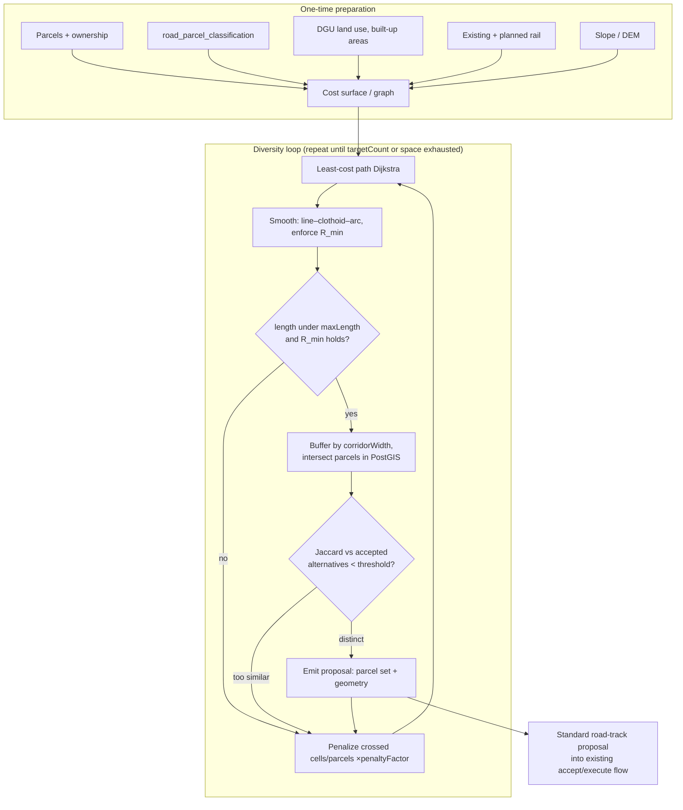

# Algorithmic Corridor Proposals

Design/research doc for bot-generated corridor proposals: given an origin and destination, generate dozens of distinct, curvature-legal alignments, each expressed as a set of cadastral parcels, and emit each as a standard proposal that triggers only when all affected owners accept. First target case: a railway between Trogir and Split. Companion doc: [prediction-markets.md](prediction-markets.md) (attaching a passive prediction market to every proposal — sibling corridor proposals are its richest use case).

## 1. Problem and idea

Linear infrastructure dies on holdouts. A single alignment crossing 400 parcels needs 400 "yes" answers; one strategic holdout (or one unreachable heir community) kills it, and knowing this, every owner is tempted to be the holdout. The classic answers are expropriation (slow, political — the real Split–Trogir rail extension has been stalled since 2020 partly on expropriation objections) or secret assembly through straw buyers.

This platform already has the third answer built in: **a proposal only executes when every affected parcel owner has accepted, and until then nobody is bound**. The all-accept gate exists twice in the codebase:

- Off-chain: `frontend/js/proposals/execution.js:1453` — when `acceptedParcelIds.length === parcelIds.length`, the proposal flips to `Executed` and (for roads) `updateParcelsWithRoad(...)` runs.
- On-chain: `blockchain/contracts/ProposalNFT.sol:215` — when `acceptanceCount == parcelIds.length`, status becomes `Executed` and `_distributeFunds` releases the escrow.

What's missing is the supply side: today corridors are drawn by hand (`frontend/js/road-drawing.js`), one at a time. The idea here is to make **bots generate dozens of alternative alignments for the same origin–destination pair**. Two places can be connected not just by the straight line but by many winding lines, each respecting the curve constraint of the vehicle that will use it. Then:

- No single owner is a chokepoint — a holdout on route A just redirects attention (and the offer money) to routes B through K that don't cross their parcel.
- Owners compete to be on the route that assembles, instead of competing to be the last holdout. The game flips from "hold out for rent" to "accept early or the corridor routes around you."
- Whichever alternative reaches all-accept first wins; the siblings can then be cancelled.

### Proposal identity = parcel set

The output of the generator is **not a geometry, it is a set of parcels**. Two alignments that cross exactly the same parcels are the same proposal — the owners being asked are identical, so the consent question is identical; the precise centerline within the corridor is an engineering detail that can be optimized after assembly. Formally:

- `identity(proposal) = sorted set of ancestor parcel ids`
- Exact-duplicate rule: same parcel set ⇒ same proposal (the generator must dedupe before emitting).
- Near-duplicate rule: parcel-set Jaccard similarity `|A∩B| / |A∪B|` above a threshold (e.g. 0.9) ⇒ treat as the same proposal for diversity purposes; below a lower threshold (e.g. 0.6) ⇒ genuinely distinct alternative worth publishing. The band in between is tunable.

This matches how the platform already thinks: proposals store `ancestor_parcel_ids` / `accepted_parcel_ids` (JSONB, `backend/routes/proposals-ddl.sql`), and acceptance is counted per parcel, not per geometry.

## 2. Generator parameters

```
generateCorridors({
  origin,               // point (or small polygon: station area tolerance)
  destination,          // point/polygon
  minCurveRadius,       // meters — from design speed, see below
  maxLength,            // meters — cap so routes don't wander (e.g. 1.4 × great-circle distance)
  corridorWidth,        // meters — buffer applied to centerline (rail: ~12–25 m incl. embankment)
  costWeights,          // weights for the cost surface layers (see §3.1)
  penaltyFactor,        // multiplier applied to crossed cells/parcels between iterations (e.g. ×1.5)
  jaccardThreshold,     // max parcel-set similarity vs already-accepted alternatives (e.g. 0.6)
  targetCount,          // stop after N distinct proposals (e.g. 24) or when penalties exhaust the space
})
```

### Minimum curve radius from design speed

The governing rail formula is `R ≈ 11.8 · v² / (h_a + h_b)` with `v` in km/h, applied cant `h_a` and cant deficiency `h_b` in mm (conventional values 160 mm + 100 mm):

| Design speed | R_min (conventional) | R_min (tilting stock) |
|---|---|---|
| 120 km/h | ~630 m | ~450 m |
| 160 km/h | ~1,100 m | ~800 m |
| 200 km/h | ~1,800 m | ~1,300 m |

For a Trogir–Split regional line, **R_min ≈ 600–1,100 m** (120–160 km/h) is the realistic band. Transition (clothoid) lengths are ~40–80 m at 100 km/h and scale with speed. Gradient (~2.5–3.5% max for regional rail) is deliberately treated as a *cost term* (penalize steep cells), not a hard generator constraint, in v1.

Sources: [Minimum railway curve radius (Wikipedia)](https://en.wikipedia.org/wiki/Minimum_railway_curve_radius), [California HSR alignment design standards TM 2.1.2](https://hsr.ca.gov/wp-content/uploads/docs/programs/eir_memos/Proj_Guidelines_TM2_1_2R00.pdf).

The same generator serves other vehicle types by swapping parameters: tram (R_min ~25 m), road (per design class), bike path (~15 m) — corridor proposals already share one model (goal key `road-track`).

## 3. Algorithm

The recommended pipeline is the one the railway-alignment literature actually uses (distance-transform / least-cost search first, smooth to legal curvature second — Li, Pu & Schonfeld's bidirectional distance transform + genetic refinement, applied to the real Sichuan–Tibet railway: [Wiley, mice.12280](https://onlinelibrary.wiley.com/doi/10.1111/mice.12280)), combined with the **iterative penalty method** for diversity — an established technique from the alternative-routes literature ([survey, arXiv 2406.05388](https://arxiv.org/html/2406.05388); [k-most-diverse near-shortest paths, SIGSPATIAL'21](https://pbour.github.io/docs/sigspatial21a.pdf)).



### 3.1 Cost surface

Rasterize (or build a cell-adjacency graph over) the area between origin and destination, EPSG:3765, cell size ~10–25 m. Per-cell cost is a weighted sum over data **we already have in the `geodata` DB**:

| Layer | Source | Effect |
|---|---|---|
| Existing road/rail parcels | `road_parcel_classification` (score ≥40), existing rail | strong discount — public corridors are the cheapest land to reuse |
| Planned corridors | `planned_road`, `corridor_reservation` | discount |
| Parcel fragmentation | `parcel` — many small parcels per cell | penalty — more owners = harder assembly |
| Built-up / buildings | DGU land use, `building_3d` footprints | heavy penalty (demolition ≈ near-blocker) |
| Slope | DEM (to be added) | penalty ∝ grade; cliffs effectively blocked |
| Water, protected areas | DGU land use | very heavy penalty / hard block |
| Sea | coastline | hard block (no bridges in v1) |

A useful pre-step is **corridor-band analysis**: compute `cost_from_origin + cost_to_destination` per cell and keep only cells within ~10–15% of the global minimum — the classic GIS "corridor" ([least-cost path & corridor analysis](https://www.aaroads.com/blog/least-cost-path-and-corridor-analysis/)). Everything the diversity loop produces then stays "reasonable" by construction, which also enforces `maxLength` softly before the hard check.

### 3.2 Least-cost path

Plain Dijkstra/A* over the cost grid. At 25 km × ~5 km at 20 m cells this is ~3M cells — trivial for `skimage.graph.route_through_array` (Python sidecar), GRASS `r.cost`/`r.drain`, or pgRouting `pgr_dijkstra` on an edge graph. **Explicitly rejected alternatives**: Yen's k-shortest-paths alone (successive paths differ by a few edges — no spatial diversity), RRT* (documented to perform poorly at km scale), and full curvature-constrained search as v1 (heavier; see 3.4 for when to upgrade).

### 3.3 Diversity via iterative penalty

After each accepted alternative, multiply the cost of every crossed cell (or every cell of every crossed *parcel* — the better variant for us, since parcels are the identity) by `penaltyFactor`, and re-run the search. Penalties are cumulative, so each round is pushed away from all previous routes. This is the named "path penalization" method from the alternative-routing literature, adapted to parcel granularity. Candidates that are still too similar (Jaccard vs any accepted alternative above threshold) are not emitted but still add penalty, so the loop always makes progress. Stop at `targetCount` or when the cheapest remaining route exceeds `maxLength`.

Penalizing at parcel granularity has a second, product-level meaning: a parcel whose owner has *declined or ignored* previous proposals can carry a standing penalty, so later generations automatically route around known holdouts.

### 3.4 Curvature smoothing — and why the parcel set is extracted after it

The raw LCP polyline has grid-artifact corners a train cannot take. Fit a curvature-legal geometry through it: tangent segments joined by circular arcs of radius ≥ R_min with clothoid transitions (Dubins word types as the feasibility primitive; clothoid fitting per [PythonRobotics](https://atsushisakai.github.io/PythonRobotics/modules/5_path_planning/dubins_path/dubins_path.html)-style modules). Reject the candidate if smoothing pushes length over `maxLength` or cannot satisfy R_min inside the corridor band.

**Order matters**: smoothing moves the line, which changes which parcels are crossed. The parcel set — the proposal's identity — must be derived from the *smoothed* geometry buffered by `corridorWidth`, via PostGIS `ST_Intersects`/`ST_Intersection` against `public.parcel`. If in practice smoothing shifts parcel sets too much (thrashing the dedupe), the upgrade path is a natively curvature-constrained search (hybrid A* / state lattice with min-radius motion primitives, as in ROS2's Smac planner — [arXiv 2401.13078](https://arxiv.org/html/2401.13078)) where the searched path is already legal and the parcel set is final.

### 3.5 Emit as standard proposals

Each surviving alternative is serialized as a normal `road-track` proposal (the corridor drawing model in `road-drawing.js` / `frontend/js/proposals/roads.js` is the target format: centerline segments + width + derived locked parcel set), with a bot identity as proposer, and inserted through the existing upload path into `consensus.proposal`. From there, **zero new machinery**: they appear in the proposal list, owners accept per parcel, the existing gate executes whichever assembles first. The generator runs server-side (the browser-side turf intersection in `recomputeLockedParcelsFromPolygon`, `road-drawing.js:2995`, is for hand-drawing; bots should intersect in PostGIS where all parcels live).

Sibling proposals (same origin/destination batch) should share a `corridor_group` id so the UI can present them as one race rather than 24 unrelated proposals, and so a trigger of one can auto-expire the others (open question §6).

## 4. Case study: Trogir–Split

Well-chosen first case — it is real, stalled, and already has a human-made shortlist to validate against.

- **Existing line**: Split suburban railway (Splitska gradska željeznica), 17.8 km Split harbour → Kaštel Stari, reopened 2006 ([Wikipedia](https://en.wikipedia.org/wiki/Splitska_gradska_zeljeznica)). Any Trogir corridor effectively *continues* this line west — which dovetails with the just-landed corridor-continuation feature (commit `a01e09a`): generated corridors can seed from the existing rail's segments.
- **The missing piece**: ~8–13 km from Kaštel Stari to Split Airport and Trogir, projected ~5.6M passengers/year, floated for 2021 and 2025–26, no progress since 2020.
- **Three real studied alternatives** (our validation targets — the generator should rediscover approximately these before we trust its "dozens"):
  1. Kaštel Stari → Rudine → Airport (~8 km, bypasses Kaštela's built-up strip) — the 2019 feasibility study's preferred option.
  2. Kaštel Kambelovac branch through Kaštela along the D58 road.
  3. Kaštel Sućurac variant (~12.6 km, underground through dense fabric, >€200M) — our generator would price this out via the built-up penalty, correctly.
- **Constraints encoded in the cost surface**: narrow coastal shelf between the Kozjak slopes and the sea, dense Kaštela ribbon settlement, agricultural parcels (small, fragmented — high owner counts), the airport itself, and the existing line as a cheap spine.
- **Parameters**: `minCurveRadius` 600–1,100 m; `maxLength` ~1.4 × the ~20 km straight line ⇒ ~28 km cap; `targetCount` ~24.

One honest limitation: Croatian cadastral ownership data for the Kaštela strip is exactly where multi-owner/unresolved-heir parcels are common; the fragmentation penalty is a proxy for assembly difficulty, and per-parcel owner counts (`parcel_ownership`) should feed it directly where available.

## 5. Why many proposals beat one proposal (mechanism notes)

- **Holdout deterrence is probabilistic, not confrontational.** With one route, a holdout has monopoly power. With k routes, the expected payoff of holding out drops with each alternative that doesn't need you; accepting early (and collecting the escrowed offer from `mintAndFund`) becomes the dominant strategy on parcels common to many routes.
- **Parcels shared by many alternatives are the true bottlenecks.** The generator's output doubles as analysis: a parcel appearing in 20 of 24 parcel sets (e.g. the only pass between the hill and the sea) is where negotiation effort — and offer money — should concentrate. Worth surfacing as a per-parcel "criticality" score.
- **The race needs an odds board.** Dozens of live siblings raise the question "which one is actually going to make it?" — that is precisely what the attached prediction markets in [prediction-markets.md](prediction-markets.md) answer, and why corridors are their best first application.

## 6. Open questions

- **Endpoint tolerance**: are origin/destination exact points (existing station throat at Kaštel Stari; a defined Trogir station polygon) or areas the optimizer may place stations within? Station placement co-optimization exists in the literature ([ScienceDirect S0360835218300044](https://www.sciencedirect.com/science/article/abs/pii/S0360835218300044)) but is v2.
- **Partial parcels**: when the corridor clips a corner of a parcel, does the proposal need the whole parcel or a reparcellization (split, acquire the sliver)? The platform has reparcellization proposals; combining them multiplies complexity — v1 probably takes whole parcels and accepts the overcount.
- **Sibling lifecycle**: when one alternative in a `corridor_group` executes, do the others auto-cancel (returning escrow) immediately, or persist as future capacity options? Auto-cancel seems right; needs a rule in both `execution.js` and `ProposalNFT`.
- **Acceptances shared across siblings?** An owner whose parcel is in 5 alternatives arguably accepts "a railway across my parcel on these terms" once. Per-proposal acceptance (current model) is simpler and stays v1; cross-proposal acceptance would drastically cut friction and deserves its own design.
- **Gradient/vertical alignment**: v1 treats slope as cost only; real feasibility needs a vertical profile check (bridges/tunnels change everything, incl. the Sućurac-style underground option).
- **Cost-surface calibration**: weights are guesses until validated against the Trogir–Split human shortlist (§4) — that validation is the point of the prototype.

## 7. Prototype results (2026-07-11)

Steps 1–4 of the original roadmap are implemented and validated in [`corridors/`](corridors/README.md) (standalone, Node + PostGIS, no UI, no writes to shared tables). Outcome of the first full run:

- **12/12 distinct proposals in 26 penalty-loop iterations (~6 s total** after one-time layer fetches), Trogir → Kaštel Sućurac. Lengths 15.9–21.5 km, 961–1,460 parcels each, max pairwise parcel-set Jaccard **0.18** (threshold 0.6 — the alternatives are far more distinct than required).
- **Geographic validation**: the generated family fans across a ~2–3 km band on the plateau above the Kaštela towns and converges parallel to the existing rail near Sućurac — the same family as the real 2019 feasibility study's preferred option (Kaštel Stari → Rudine → airport, bypassing the built-up strip). The strictly-coastal D58 variant does not appear: the towns' built-up penalty prices it out, consistent with why it was the expensive/disruptive option in reality.
- **Bottleneck analysis works**: 27 parcels are shared by ≥10 of the 12 corridors (the endpoint funnels at Trogir and Sućurac) — these are the parcels where negotiation effort and offer money should concentrate (§5).
- **Fragmentation is the real enemy**: ~1,000+ parcels per 16 km corridor (avg parcel ~250 m² along the routes) means ~a thousand owners per alternative — which is precisely the argument for generating many alternatives and for the platform itself.

Adjustments discovered while building (now defaults):
- **Destination is Kaštel Sućurac, not Split station** — the cadastre for Split city proper (KOs Split, Solin, Kamen, …) is not ingested (checked local **and** prod); the existing suburban line covers Sućurac → Split anyway. If Split KOs are ever ingested (`cadastre-data/parcels/fetch-parcels-zip-by-ko.js --insert --ko …`), flip `DESTINATION` back.
- **Cells without cadastral parcels are blocked** — this elegantly handles the sea with no coastline data, but requires allowing short **bridged excursions** (≤200 m single, ≤800 m total) or arc smoothing near the coast never succeeds.
- **Soft keep-away costs near blocked cells** are essential: raw least-cost paths hug obstacle edges, leaving R_min arcs no room; without keep-away, smoothing rejects ~everything.
- Hard slope block at 40% (not 25%) with the quadratic penalty governing below — rail crosses moderate slopes with cuts; blocking too early starves the diversity loop.

## 8. Next steps

1. **Emit real `road-track` proposals** (bot proposer, `corridor_group` id) from `proposals.json` into the existing flow; only then touch UI (sibling grouping, per-parcel criticality display).
2. Ingest the missing Split-agglomeration KOs to extend corridors to Split proper.
3. Clothoid transitions between tangents and arcs (current geometry is tangent+arc only).
4. In parallel, decide the market track's Phase 0/1 per [prediction-markets.md](prediction-markets.md) — the 12 sibling corridors are exactly the odds-board use case.
