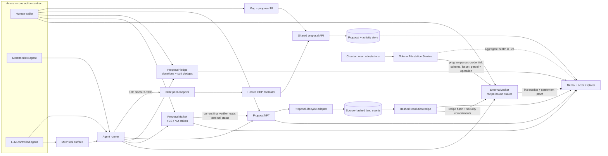

# Hackathon architecture

Urban Game Theory uses the parcel as the canonical object connecting intent, capital, belief, and
outcome. Both the proposal-lifecycle resolver and the external SAS resolver are live on devnet.

## Implemented boundaries

1. **One parcel identity.** Proposal records carry cadastral parcel IDs; their ProposalNFT account,
   funding positions, market, activity, and evidence all point back to the same proposal.
2. **One actor/action model.** People, deterministic controllers, and LLM controllers produce the
   same activity envelope. The controller is provenance, not a different product path.
3. **One paid agent front door.** `POST /agent/proposals` applies x402 payment and payer binding,
   then calls the same proposal-creation handler used by the free human-facing route.
4. **Three Solana lifecycles.** ProposalNFT owns proposal terminal state; ProposalPledge owns funded
   donations and soft commitments; ProposalMarket owns parimutuel stake and payout state.
5. **Deterministic evidence.** The current oracle materializes only terminal ProposalNFT state that
   has a matching source transaction. It records source time, transaction, account bytes, and hash.
6. **Public review surfaces.** The Demo Center and actor explorer read public APIs and chain links;
   they do not substitute hard-coded success states for missing evidence.
7. **External verifier without a second trust service.** `ExternalMarket` commits a canonical recipe,
   SAS trust set, subject and outcome mapping before trading. After close, any caller may submit the
   matching SAS account; the Solana program parses it and derives the result without an API signer.

## Current resolution path

`proposal_market` does not delegate its final decision to the API, an LLM, or an administrator. Any
caller may resolve the market after the referenced ProposalNFT account becomes `Executed` or
`Cancelled`; the program reads that account itself. The API publishes the equivalent
`proposal-lifecycle-v1` recipe and independently materialized event so people and agents can inspect
the rule and its evidence.

The backward-compatible `ExternalMarket` path implements the external rule directly. Its PDA is
derived from the recipe hash; it additionally stores the SAS credential, schema, issuer, parcel
hash, YES/NO operation hashes and close time. Resolution is permissionless and records both the
attestation address and hash of its complete account bytes. The outcome is derived from the
attestation rather than supplied by the caller.

That path is live on devnet. V1 has a complete two-sided market, permissionless SAS settlement and
winner claim. The V2 schema, source-timed court attester and upgraded market chronology guard are
also live; five V2 attestations prove the scraper → interpreter → SAS path. Those records predate a
new market close, so the remaining proof is intentionally temporal: open a market first and wait for
a genuinely later matching court record before settling it.

## Source map

| Concern | Source |
|---|---|
| Paid proposal route | `backend/routes/agent-proposals.js` |
| Discovery and agent schema | `backend/routes/agent-discovery.js`, `backend/routes/agent-recipe-schema.json` |
| Shared agent runtime | `backend/agents/` |
| MCP action surface | `backend/agents/mcp-server.mjs`, `backend/agents/ugt-agent-tools.js` |
| Proposal lifecycle recipe and event adapter | `backend/oracle/proposal-lifecycle.js` |
| Court SAS recipe adapter | `backend/oracle/court-parcel-operation.js` |
| Public oracle routes | `backend/routes/land-events.js` |
| Solana programs and IDLs | `blockchain/solana/programs/`, `blockchain/solana/idl/` |
| Browser market and support clients | `frontend/js/solana/market-client.js`, `frontend/js/solana/pledge-client.js` |
| Judge surfaces | `frontend/hackathon-demo.html`, `frontend/actor-explorer.html`, `frontend/deck.html` |

See [`protocol.md`](protocol.md) for identifiers, schemas, adapter rules, and trust assumptions.
