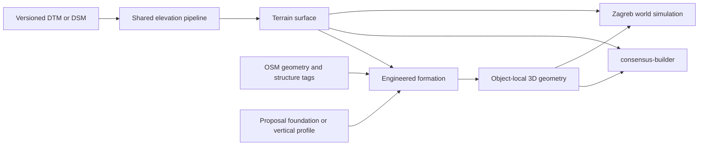
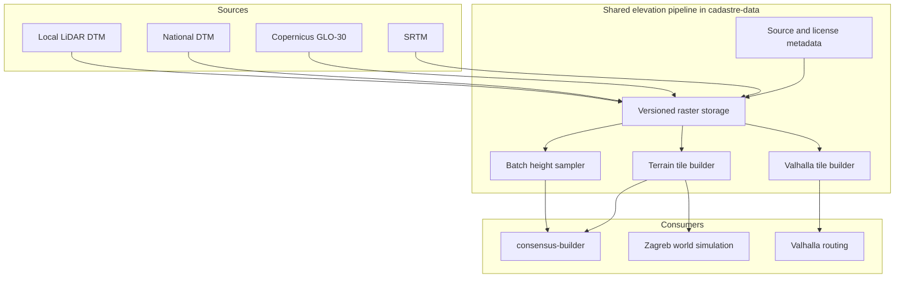

<!-- This document records the elevation-data research and the proposed architecture and rollout for terrain-aware planning and simulation. -->

# Elevation realism

Research date: 2026-07-14

## Executive summary

`consensus-builder` and `zagreb-isochrone-main` both need a terrain model, but the correct abstraction is not simply to add a third coordinate to every OSM vertex. The implementation should distinguish three vertical layers:

1. **Terrain surface**: the physical bare-earth ground supplied by a DTM, with a DSM only as a fallback.
2. **Engineered formation**: building foundations, road and railway profiles, bridge decks, tunnels, plazas, water levels, cuts and fills.
3. **Object-local geometry**: buildings, models, street furniture, vehicles and other meshes positioned relative to their formation.



The recommended source hierarchy is:

`local LiDAR DTM -> national DTM -> Copernicus GLO-30 -> SRTM fallback`

The recommended implementation order is:

1. Establish a shared elevation pipeline, preferably in `cadastre-data`.
2. Add elevation to Valhalla as an independent routing improvement.
3. Implement the first complete terrain renderer and proposal semantics in `consensus-builder`.
4. Reuse the shared data and proposal model in `zagreb-isochrone-main`, where terrain affects many more rendering and physics systems.

## What OSM does and does not provide

OpenStreetMap normally stores latitude and longitude, not continuous terrain height. It supports several useful optional tags:

- [`ele=*`](https://wiki.openstreetmap.org/wiki/Key%3Aele) is a height above the EGM96 geoid, but OSM explicitly states that it is not intended to be a general elevation database.
- [`incline=*`](https://wiki.openstreetmap.org/wiki/Key%3Aincline) describes the slope of a way, often only where a steep section is signposted or otherwise significant.
- [`layer=*`](https://wiki.openstreetmap.org/wiki/Key%3Alayer) records relative vertical ordering, not a height in metres.
- `bridge=*`, `tunnel=*`, `embankment=*`, `cutting=*` and related tags describe structural intent and are essential when deriving road or railway profiles.

An audit of the Croatia PBF currently stored in `zagreb-isochrone-main`, timestamped 2026-03-24, found:

| Item | Count |
|---|---:|
| All nodes | 25,066,534 |
| All ways | 2,551,962 |
| Nodes with `ele` | 17,972 |
| Ways with `ele` | 392 |
| Relations with `ele` | 4 |
| Elevation-tagged nodes that also have `highway` | 3 |
| Highway ways with `ele` | 19 |
| Highway ways with `incline` | 8,393 |
| Highway ways with `bridge` | 11,829 |
| Highway ways with `tunnel` | 3,681 |

This is enough to confirm topology and some engineered structures, but nowhere near enough to reconstruct terrain or even continuous road grades.

The current local ingestion path also discards potential node-level elevation:

- [`cadastre-data/roads/fetch-osm-roads.js`](../cadastre-data/roads/fetch-osm-roads.js#L119) requests way geometry and constructs a 2D `LINESTRING`.
- [`cadastre-data/db/osm_road.sql`](../cadastre-data/db/osm_road.sql#L15) stores a two-dimensional line and buffered polygon.
- The world-simulation road endpoint returns buffered polygons without most of the structural tags needed for elevation-aware rendering.
- The checked road, tram and rail exports contain only two-coordinate positions.

OSM should therefore supply horizontal geometry, connectivity and structural constraints. A DEM must supply terrain height.

## Elevation sources

### Global sources

| Source | Resolution and type | Access and datum | Suitability |
|---|---|---|---|
| [Copernicus DEM GLO-30](https://dataspace.copernicus.eu/explore-data/data-collections/copernicus-contributing-missions/collections-description/COP-DEM) | Global 30 m DSM; buildings and vegetation remain | Free license; EGM2008; stated absolute vertical accuracy under 4 m at 90% | Recommended global default. Good for city-scale terrain and routing, but too coarse and too surface-like for parcel earthworks. |
| [FABDEM](https://research-information.bris.ac.uk/en/datasets/fabdem-v1-2/) | Approximately 30 m; buildings and forests removed from Copernicus | CC BY-NC-SA 4.0 | Better terrain semantics, but the noncommercial restriction makes it unsuitable as a general product default. |
| [ALOS AW3D30](https://www.eorc.jaxa.jp/ALOS/en/dataset/aw3d30/) | Approximately 30 m global DSM | Commercial and noncommercial use under JAXA's terms; registration required | Useful secondary source, comparison dataset or gap filler. |
| [SRTM 1 Arc-Second](https://www.usgs.gov/centers/eros/science/usgs-eros-archive-digital-elevation-shuttle-radar-topography-mission-srtm-1) | Approximately 30 m; acquired in 2000; roughly 60 degrees north to 56 degrees south | Public domain; EGM96 | Straightforward Valhalla fallback, but older and not globally complete. |

Copernicus EEA-10 is a 10 m European product, but general-public downloads are restricted to GLO-30 and GLO-90. EEA-10 is therefore not a dependable open default for a multi-city product.

No global 30 m dataset is adequate for realistic foundations, road cuttings, retaining walls or small terrain features. Those require national or local high-resolution data.

### Croatia and Zagreb

#### DGU nationwide LiDAR

The technically best confirmed source is the recent national LiDAR survey. The project specifies:

- 8 points per square metre in urban areas;
- 1 m DTM and DSM products;
- a stated project target of plus or minus 10 cm vertical accuracy;
- LiDAR acquisition updated in 2022-2023.

Sources: [DGU digital terrain model product](https://dgu.gov.hr/print.aspx?id=180&url=print) and the [multisensor survey description](https://potresnirizik.zagreb.hr/o-projektu/multisenzorsko-zracno-snimanje-republike-hrvatske-za-potrebe-procjene-smanjenja-rizika-od-katastrofa-kk-05-2-1-10-0001/34).

The current [DGU LiDAR reuse request](https://dgu.gov.hr/UserDocsImages/dokumenti/Pristup%20informacijama/Podnesi%20zahtjev/PODACI%20ZA%20PONOVNU%20UPORABU/ZAHTJEV%20-%20LIDAR%20PODACI.pdf?vel=189120) offers:

- classified LAS or LAZ point clouds;
- 1 x 1 m DTM GeoTIFF plus world files;
- 1 x 1 m DSM GeoTIFF plus world files;
- commercial and noncommercial reuse.

The data is request-based rather than an anonymous bulk download. Its current license also says that a public presentation must not allow an individual coordinate and height to be obtained directly. That language needs written clarification before exposing a high-resolution public height endpoint or decodable terrain tiles. It does not prevent initial internal processing and evaluation.

#### City of Zagreb DTM

The City has a 2012 DTM covering its administrative area. The raw NIPP metadata records:

- 2 m spatial resolution;
- EPSG:3765 horizontal coordinates;
- aerial photogrammetry and LiDAR lineage;
- access by written request.

The [NIPP dataset registry](https://registri.nipp.hr/izvori/437) lists no access or use restrictions. The public WMS is a rendered view service rather than a usable numeric height raster, so the raw ESRI grid still needs to be requested. Although older than the national LiDAR, it is sufficiently detailed for a parcel-scale terrain proof of concept.

#### DGU anonymous national elevation feed

DGU lists an anonymous elevation feed on its [open-data page](https://dgu.gov.hr/otvoreni-podaci/6596). Inspection of the linked [Atom/GML feed](https://geoportal.dgu.hr/services/atom/el-cov/xml) found:

- approximately 20 m grid spacing;
- a bare-earth DTM rather than a DSM;
- EPSG:3045 horizontal coordinates;
- EVRF2000 heights, EPSG:5730;
- GeoTIFF tiles covering Croatia.

This can support an immediate Croatia proof of concept, but it is not the recent 1 m LiDAR product. The current DGU open-data page grants broad commercial and noncommercial reuse, while the older Atom document still includes a restriction string. That metadata discrepancy should be confirmed before redistributing source tiles.

### Recommended source policy

| Geography | Preferred source | Fallback |
|---|---|---|
| Zagreb | DGU 1 m LiDAR DTM after access and license clarification | Zagreb 2 m DTM, then DGU 20 m DTM |
| Rest of Croatia | DGU 1 m LiDAR where available and permitted | DGU 20 m DTM, then Copernicus GLO-30 |
| Other cities | Best available municipal or national DTM | Copernicus GLO-30, then SRTM |
| Valhalla routing | DGU/Copernicus converted to Valhalla's elevation format | Standard SRTM-derived elevation tiles |

## Shared elevation architecture

The elevation ingestion and query layer should be shared rather than implemented independently in the two renderers. `cadastre-data` is the natural home because it already owns the relevant roads, buildings and shared geodata APIs.

### Responsibilities

1. Ingest source GeoTIFF, XYZ or point-cloud products.
2. Convert rasters to versioned Cloud-Optimized GeoTIFFs or an equivalent efficient source format.
3. Record source metadata:
   - source identifier and version;
   - acquisition or publication date;
   - horizontal CRS;
   - vertical datum;
   - resolution and nodata value;
   - DTM or DSM classification;
   - license and redistribution restrictions.
4. Provide an internal batch sampler for proposal calculations and derived objects.
5. Produce bounded grids for `consensus-builder`.
6. Produce multiresolution height or terrain-mesh tiles for the moving world.
7. Produce or convert elevation tiles for Valhalla.
8. Cache derived terrain, foundations and profiles; do not make one request per rendered vertex.



High-resolution DGU data may need an internal-only path until its public-display terms are clarified. The architecture must support per-source delivery restrictions rather than assuming that every ingested raster may be exposed through the same public endpoint.

## Coordinates and vertical datums

The two renderers use different scene axes:

- `consensus-builder`: X and Y horizontal, Z up;
- `zagreb-isochrone-main`: X and Z horizontal, Y up.

The shared service should return geographic height semantics, not renderer-specific vectors.

The relevant sources also use incompatible vertical references:

| Source | Vertical reference |
|---|---|
| OSM `ele` | EGM96 orthometric height |
| Copernicus GLO-30 | EGM2008 orthometric height |
| DGU anonymous DTM | EVRF2000, EPSG:5730 |
| Strict RFC 7946 GeoJSON third coordinate | WGS 84 ellipsoidal height |
| Zagreb LOD2 buildings | Absolute Z is present, but its vertical datum is not documented in the current code |

An unqualified `[longitude, latitude, z]` is therefore unsafe. [RFC 7946](https://www.rfc-editor.org/rfc/rfc7946.html) permits a third coordinate but defines it as WGS 84 ellipsoidal height. The planner's current relative `+10/-10 m` coordinate is also not an absolute GeoJSON elevation.

Every absolute or derived height should carry, directly or through its containing dataset:

```json
{
  "heightM": 122.35,
  "verticalDatum": "EPSG:5730",
  "sourceId": "dgu-lidar-dtm",
  "sourceVersion": "2022-2023",
  "heightType": "orthometric"
}
```

At render time, keep coordinates near zero for numerical stability:

```text
sceneUp = normalizedHeight - sceneAnchorHeight
```

For Zagreb's existing LOD2 buildings, datum calibration against the selected terrain source is a required early test. Once aligned, vertices should use `absoluteBuildingZ - sceneAnchorHeight`, not `absoluteBuildingZ - eachBuildingZMin`.

## Vertical behaviour by object type

| Object | Recommended behaviour |
|---|---|
| Parcel and reparcellisation boundaries | Remain legally two-dimensional. Drape only their displayed lines over terrain. |
| Parks and soft landscape | Drape by default unless a grading design is supplied. Trees and furniture follow terrain height but normally remain upright. |
| Existing roads | Densify and sample the centreline, smooth the longitudinal profile, enforce sensible grades and honour bridge/tunnel/layer/cutting constraints. Do not drape every raw high-resolution sample. |
| Proposed roads and tracks | Store a chainage-based vertical profile and structure mode. Derive the road ribbon, cross-section and earthworks from the centreline and profile. |
| Existing buildings | Preserve authoritative absolute Z where available and datum-compatible. Otherwise derive a foundation elevation from terrain. |
| Proposed buildings | Use one or more horizontal foundation pads. Never drape ordinary floors and walls over the terrain. |
| Plazas and squares | Use a designed plane, gentle grade or terraces, with steps, ramps and retaining structures where required. |
| Lakes and ponds | Use a constant water elevation and cut the terrain to form the basin and shoreline. |
| glTF and point objects | Store an anchor, height-reference mode and vertical offset; keep most objects upright instead of aligning them to the terrain normal. |
| Bridges | Store a deck profile and generate supports down to terrain or other supporting structures. |
| Tunnels | Store an underground profile; render the tube separately and cut terrain only at portals, shafts and open sections. |

### Building foundation policy

The recommended order for a proposed building is:

1. Use a nominated entrance or street datum when one exists.
2. Otherwise calculate a balanced foundation pad from samples within the footprint.
3. Allow explicit fixed, minimum-terrain and maximum-terrain modes when deliberately chosen.
4. Display the resulting cut, fill, retaining wall and exposed plinth.
5. Allow multiple stepped pads for large or irregular buildings.

The statistical fallback must be named rather than hidden:

- The median approximately minimises total absolute cut/fill depth.
- The mean approximately balances cut and fill volumes under simple equal-area assumptions.
- The minimum terrain height minimises fill but embeds the uphill side and requires cutting or buried walls.
- The maximum terrain height avoids uphill burial but can require substantial downhill fill, plinth or supports.

None of these substitutes for a surveyed engineering design, but they produce explicit, reproducible planning assumptions.

### Roads, railways, bridges and tunnels

Raw DEM sampling is not a road design. High-resolution terrain contains noise and local features that would produce an unrealistic roller-coaster surface. Existing and proposed transport corridors need a longitudinal formation profile.

A proposed profile should support control points such as:

```json
{
  "verticalProfile": [
    { "chainageM": 0, "elevationM": 121.4, "structureMode": "ground" },
    { "chainageM": 180, "elevationM": 124.0, "structureMode": "embankment" },
    { "chainageM": 420, "elevationM": 126.2, "structureMode": "bridge" }
  ]
}
```

The profile generator and editor eventually need:

- maximum longitudinal grade by road or rail type;
- vertical-curve smoothing;
- consistent elevations at intersections and junctions;
- bridge and tunnel clearance;
- portal placement;
- cut and fill surfaces;
- crossfall or superelevation if higher realism is required later.

OSM `incline` is useful as a validation hint. `bridge`, `tunnel`, `layer`, `embankment` and `cutting` constrain structure type. None supplies a complete metre-accurate profile.

## Proposal data model

Proposal storage already uses flexible JSONB in [`backend/routes/proposals-ddl.sql`](backend/routes/proposals-ddl.sql#L45), so supporting elevation should not require a large relational migration. The important work is to define and version the semantics, update deterministic proposal IDs, and propagate the fields through export, sync and both renderers.

Do not store an absolute altitude on every vertex by default. Store the minimum semantic information needed to reproduce the engineered object:

### Buildings

```json
{
  "foundation": {
    "mode": "entrance",
    "elevationM": 122.35,
    "verticalDatum": "EPSG:5730",
    "entrancePoint": [15.9812, 45.8123],
    "terrainSourceId": "dgu-lidar-dtm",
    "terrainSourceVersion": "2022-2023"
  }
}
```

### Roads and tracks

Store the horizontal centreline separately from the vertical profile. Do not encode the final road surface as elevations on a buffered polygon. The profile must be included in the deterministic proposal identity; the current [`serialiseRoadDefinition`](frontend/js/proposals/roads.js#L38) hashes only longitude, latitude and width.

### Terrain-following objects

```json
{
  "elevationMode": "terrain",
  "terrainSourceId": "dgu-lidar-dtm",
  "terrainSourceVersion": "2022-2023",
  "offsetM": 0.04
}
```

Accepted proposals should freeze their derived foundation elevations and vertical profiles. If they store only "drape over latest terrain", a future DEM update could silently change an old proposal's geometry and earthworks.

## `consensus-builder` audit

### Current state

The abstract Three.js mode is explicitly flat:

- [`frontend/js/three-mode.js`](frontend/js/three-mode.js#L858) creates each polygon at one constant Z.
- Parcel borders and other lines also use one constant Z.
- Camera targeting and picking intersect an infinite Z=0 plane.
- Roads, corridor strips, tunnel liners, proposal surfaces and cross-sections use global fixed Z offsets.
- Zagreb's building API supplies absolute Z, but [`buildMeshFromBuilding3D`](frontend/js/three-mode.js#L2207) subtracts each building's `z_min`, independently placing every building back on zero.
- Proposed footprint buildings extrude from zero, and glTF models are placed at zero or clamped without a stored foundation policy.

There is also a scale issue. [`latLngToXY`](frontend/js/three-mode.js#L804) uses EPSG:3857 pseudo-metres horizontally while building height and future terrain Z are true metres. At Zagreb latitude, Web Mercator inflates the horizontal scale by roughly 1.43. Simply adding real-metre elevation to this frame would make slopes and vertical proportions inconsistent. The abstract renderer should use a local east/north metric frame, comparable to the local equirectangular frame in the world simulation.

The Cesium photoreal mode is a partial exception:

- It already uses Cesium World Terrain.
- It clamps glTF proposals to ground.
- [`refineBase`](frontend/js/photoreal-mode.js#L391) samples terrain at footprint vertices.
- It sets the entire proposed building base to the minimum sampled height.

That minimum policy is not neutral: it minimises fill but can bury the uphill part of a building. It is a useful prototype for asynchronous height sampling, not a complete foundation design.

### Proposed phases

#### Phase CB-1: terrain-aware visual MVP

1. Replace EPSG:3857 scene coordinates with a local metric frame.
2. Load a bounded terrain grid around the proposal or camera focus.
3. Render a triangulated terrain surface.
4. Replace Z=0 picking and framing with terrain raycasting.
5. Drape parcel borders, parks and other terrain-following surfaces.
6. Convert global Z constants into offsets from terrain or formation.
7. Preserve Zagreb LOD2 absolute Z after datum calibration.
8. DEM-anchor synthetic or non-authoritative buildings in other cities.
9. Add source fallback, loading, nodata and performance tests.

This produces visual terrain realism but not complete civil-engineering behaviour.

#### Phase CB-2: proposal elevation semantics

1. Add versioned foundation, vertical-profile and terrain-reference fields.
2. Update normalisation, sync, import/export and deterministic hashes.
3. Add building foundation selection and entrance-datum controls.
4. Add road and track vertical-profile generation and editing.
5. Make plazas, water and point models use explicit vertical policies.
6. Freeze accepted design elevations and terrain-source versions.

#### Phase CB-3: earthworks and structures

1. Introduce local terrain-modification patches rather than destructive global mesh booleans.
2. Generate and visualise cut and fill.
3. Add building pads, retaining walls and exposed foundations.
4. Add road cuttings, embankments and bridge supports.
5. Add tunnel portals, open cuts and shafts while keeping tunnel interiors as separate meshes.
6. Add lake basins and terrain/water shoreline intersections.

### Small independent improvement

Changing the Cesium photoreal building-base policy from implicit minimum height to an explicit entrance/balanced/fixed policy is only a few days of work. It improves the existing photoreal mode but does not reduce the need for the abstract renderer and proposal-schema work.

## `zagreb-isochrone-main` audit

### Current state

Terrain assumptions are much more pervasive in the moving world:

- [`scene/setup.js`](../zagreb-isochrone-main/website/station-3d/scene/setup.js#L407) creates one flat 2 km plane.
- Cab mode slides that plane under the player to create an infinite-ground illusion.
- [`world/roads.js`](../zagreb-isochrone-main/website/station-3d/world/roads.js#L571) remaps every road-polygon vertex to one fixed Y.
- [`world/buildings.js`](../zagreb-isochrone-main/website/station-3d/world/buildings.js#L1577) subtracts each LOD2 building's `z_min`, discarding city-scale absolute altitude.
- [`modes/cab.js`](../zagreb-isochrone-main/website/station-3d/modes/cab.js#L1446) treats street level Y=0 as the default walk support surface.
- Roads, tracks, trams, cars, trees, streetlights, proposal surfaces, shadows and debris contain similar fixed-height assumptions.
- Proposal rendering creates constant-height surface geometries and extrudes proposal buildings from zero.

The current working tree already has useful engineered elevation for planned tracks and stations. [`world/planner-elevation.js`](../zagreb-isochrone-main/website/station-3d/world/planner-elevation.js#L1) deliberately treats the third coordinate as a relative elevation above or below flat zero and ignores 2D OSM features. That concept should be preserved as formation/profile information rather than reinterpreted as absolute terrain altitude.

The future relation is:

```text
sceneY = normalizedFormationHeight - sceneAnchorHeight
```

For a terrain-following object, formation height is terrain plus a small offset. For a bridge, tunnel, station or planned railway, formation height comes from its engineered profile.

### Valhalla quick win

The current [`scripts/setup-valhalla.sh`](../zagreb-isochrone-main/scripts/setup-valhalla.sh#L1) downloads only the Croatia OSM PBF. The generated configuration points to an absent elevation directory, and local `/height` requests returned `null` for tested Zagreb and Medvednica points.

Valhalla already supports elevation tiles and samples DEM heights when building routing tiles. It derives weighted grade and applies it especially to pedestrian and bicycle costing. See the [Valhalla elevation setup](https://valhalla.github.io/valhalla/elevation/) and [grade-costing description](https://valhalla.github.io/valhalla/sif/elevation_costing/).

This can be implemented independently:

1. Add standard SRTM tiles or converted DGU/Copernicus data.
2. Rebuild routing tiles.
3. Validate `/height` output.
4. Compare walking and bicycle catchments before and after.

### Proposed visual-world phases

#### Phase ZI-1: moving terrain MVP

1. Integrate an LOD terrain layer with the existing world tile streamer.
2. Add one authoritative height/formation sampling interface.
3. Downsample high-resolution sources into multiple terrain LODs.
4. Make terrain seams deterministic and crack-free.
5. Retain a local scene anchor for numerical stability.

#### Phase ZI-2: terrain-relative world

1. Convert fixed surface constants into offsets above terrain or formation.
2. Rebuild roads and tracks from centrelines and smoothed profiles.
3. Carry `bridge`, `tunnel`, `layer`, `incline`, `embankment` and `cutting` through the API.
4. Correct existing and proposed building placement.
5. Move trees, lights, street furniture and other decor onto terrain.
6. Update walking support, vehicle orientation, camera collision and shadows.
7. Update proposal rendering to consume the new proposal elevation model.

#### Phase ZI-3: infrastructure and terrain modification

1. Generate bridge decks, piers and abutments from formation profiles.
2. Generate tunnels separately below terrain.
3. Apply terrain cutouts only at portals, open cuts, stations and shafts.
4. Add road and railway cut/fill deformation patches.
5. Combine the planner's current relative levels with sampled terrain and grade-constrained transitions.
6. Validate walking, driving and tram movement across tile boundaries and engineered structures.

## Effort estimate

These are engineer-weeks for one experienced JavaScript, Three.js and GIS engineer. They assume production-quality implementation and tests. Administrative waiting for DGU or City data is excluded.

| Outcome | Work after shared foundation | Cumulative from zero |
|---|---:|---:|
| Shared elevation ingestion, metadata, sampler and one terrain-tile format | - | 3-5 weeks |
| Add and validate a Zagreb 1 m or 2 m source | - | Additional 2-4 weeks |
| `consensus-builder` visual terrain MVP | 5-8 weeks | 8-13 weeks |
| `consensus-builder` full proposal profiles, foundations and earthworks | 13-22 weeks | 16-27 weeks |
| Valhalla elevation and catchment validation | Independent 1-2 weeks | 1-2 weeks |
| World-simulation visual terrain MVP | 11-18 weeks | 14-23 weeks |
| World-simulation bridges, tunnels, cuts and full planner integration | 16-27 weeks | 19-32 weeks |

The shared foundation is paid once. If `consensus-builder` implements it first, the world simulation reuses the source selection, metadata, datum handling and proposal semantics.

## Recommended rollout

### Step 1: unblock data access

- Submit a request for the DGU 1 m DTM for a representative Zagreb area.
- Request the City of Zagreb 2 m raw grid as a comparison/fallback.
- Ask DGU to clarify whether browser-delivered terrain meshes or height tiles comply with the public-display clause.
- Confirm the vertical datum of the Zagreb 2022 LOD2 building model.

These requests can proceed in parallel with implementation using the anonymous DGU 20 m DTM and Copernicus GLO-30.

### Step 2: build the shared foundation

- Ingest DGU 20 m and Copernicus GLO-30 first.
- Define source metadata and vertical-reference contracts.
- Implement internal batch sampling and one terrain-tile representation.
- Establish datum-overlap tests and source fallbacks.

### Step 3: fix routing independently

- Populate Valhalla elevation tiles and rebuild the Croatia graph.
- Validate height and grade-aware pedestrian/bicycle catchments.

### Step 4: implement `consensus-builder` first

This is the lower-risk first renderer because:

- the scene is spatially bounded;
- fewer dynamic systems depend on ground height;
- the Cesium path already demonstrates asynchronous terrain sampling;
- the proposal schema is upstream of the world simulation's proposal renderer;
- foundation and vertical-profile semantics can be settled before the more pervasive world conversion.

### Step 5: convert the moving world

Reuse the elevation pipeline and proposal schema, then replace the flat plane, fixed-height object placement and Y=0 physics in staged passes.

## Validation criteria

### Data and datum

- The same test point produces a documented, repeatable height for each source.
- Source transitions do not create unexplained vertical jumps.
- Zagreb LOD2 building bases align with the chosen DTM within a measured tolerance.
- Every cached or proposed absolute height records its source and vertical datum.

### `consensus-builder`

- Terrain picking, framing and proposal placement work away from elevation zero.
- Parcel borders and terrain-following surfaces remain attached to terrain.
- Buildings stay level and visibly expose their cut/fill assumption.
- Distinct foundation or road profiles produce distinct deterministic proposal IDs.
- Accepted proposals do not change when the default terrain source is later updated.

### World simulation

- Terrain tiles have no visible cracks or height discontinuities.
- Walking, cars and trams remain supported across slopes and tile boundaries.
- Existing buildings preserve their relative city-scale elevation.
- Bridges remain above terrain and tunnels below it without false surface intersections.
- Planner tracks combine terrain and engineered profiles without violating configured grades.
- Pedestrian and bicycle catchments change plausibly in hilly areas after Valhalla elevation is enabled.

## Open decisions and risks

1. **DGU LiDAR delivery rights**: clarify public WebGL tile and height-query use before selecting it as the public production source.
2. **Zagreb LOD2 vertical datum**: determine it before using absolute building Z with DGU or Copernicus terrain.
3. **Canonical vertical reference**: choose whether normalization is global, per country or per city; never mix raw datums silently.
4. **Terrain tile encoding**: balance precision, decoding cost, licensing exposure and mobile performance.
5. **Engineering scope**: decide where visual plausibility ends and quantified planning validation begins. None of these DEMs replaces a site survey for construction design.
6. **Source updates**: define whether existing context refreshes automatically while accepted proposal formation remains frozen.
7. **Large building policy**: determine when one balanced pad becomes multiple stepped pads.
8. **Road authoring UX**: decide whether users edit explicit profile points or higher-level constraints from which profiles are generated.
