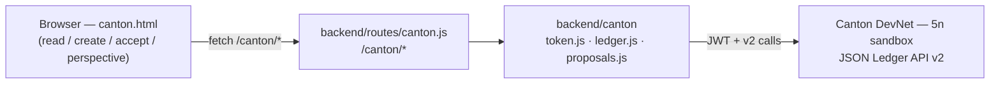
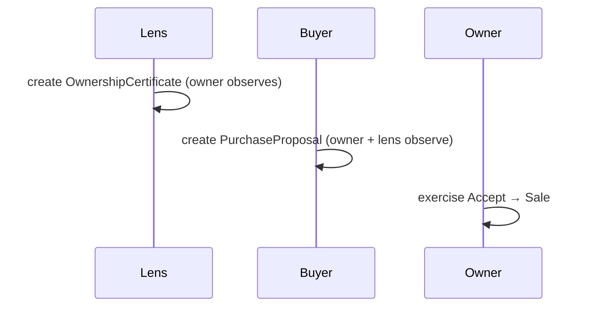

# Canton / DAML — what's built (README)

This complements `feature-daml.md`: the **spec** says what to build; this README
describes **what exists and how it works**. It's a living doc — updated as we go.

> **Status:** a working vertical slice of a single-parcel purchase on the live
> **Canton DevNet** (5n sandbox), end-to-end through a web UI. Money is not yet
> moved (price is a Canton-Coin-denominated number); the slice runs **custodially**
> (all parties hosted on our validator, driven by the backend). See the
> [decisions log](feature-daml.md#12-decisions-log-build).

## At a glance

| Layer | Where | Status |
|---|---|---|
| DAML contracts | `blockchain/daml/daml/Proposal.daml` | ✅ built, `daml test` green |
| Ledger client (token + API) | `backend/canton/{token,ledger}.js` | ✅ verified on DevNet |
| Domain logic | `backend/canton/proposals.js` | ✅ list / create / accept |
| REST API | `backend/routes/canton.js` | ✅ mounted in the app |
| Web UI (standalone console) | `frontend/canton.html` + `js/canton/canton-read.js` | ✅ standalone page |
| Enter Canton mode (P0) | `js/canton/canton-mode.js` + `user-management.js` | ✅ network switch + identity picker |
| Parcel proposal-count signal (P1) | `ProposalMarker` + `/canton/parcel-counts` + `js/canton/canton-counts.js` | ✅ on-ledger marker → map badges |
| Real Canton Coin transfer | — | ⛔ parked (needs scan/registry URL) |
| Create/View/Accept in main app (P2/P3) | — | ⬜ pending |
| Owner self-custody | — | ❌ out of scope (see decisions log) |

Integration phases (see [feature-daml.md §13](feature-daml.md#13-integration-plan-folding-canton-into-the-main-app)):
**P0** ✅ enter Canton mode · **P1** ✅ counts (Option B markers) · **P2** create via map · **P3** view/accept on parcel · **P4** fold the rest.

## Architecture



The OIDC **client secret never leaves the backend**. The browser only calls
`/canton/*`. The backend exchanges the secret for an 8h JWT (cached/refreshed) and
talks to the validator's JSON Ledger API v2.

## The DAML model (`blockchain/daml/`)

SDK **3.4.11** (the DevNet target). Three templates in `daml/Proposal.daml`:

- **`OwnershipCertificate`** — signatory `lens`, observer `owner`. The buyer-chosen
  lens attests that `owner` owns `parcelId`.
- **`PurchaseProposal`** — signatory `buyer`, observers `owner` + `lens`. Choices:
  - `Accept` (controller `owner`) → archives the proposal, creates a `Sale`.
  - `Withdraw` (controller `buyer`).
- **`Sale`** — signatory `buyer` + `owner` (the executed agreement).

`daml test` covers the happy path, owner-only Accept, and Withdraw.

## The flow + privacy



Visibility is enforced by Canton, demonstrated live via the **perspective switcher**:
- Before Accept: **buyer, owner, lens** all see the proposal; a **stranger** sees nothing.
- After Accept: **owner** (and buyer) see the **Sale**; the **lens** sees nothing
  (not a stakeholder of `Sale`); stranger still sees nothing.

## Backend (`backend/canton/`, `backend/routes/canton.js`)

- **`token.js`** — `cantonConfig(env)` + `getAccessToken()` (OIDC client-credentials,
  cached until ~1 min before expiry, force-refreshed on 401).
- **`ledger.js`** — JSON Ledger API v2 calls: `uploadDar`, `allocateParty`,
  `grantActAs`, `submitAndWait` / `createContract` / `exerciseChoice`,
  `activeContracts(party, templateId)` (scoped by party+template — a wildcard query
  exceeds the node's 200-element cap on the shared validator).
- **`proposals.js`** — `listProposalsForParty`, `listSalesForParty`,
  `createProposal` (lens attest + buyer create; blanks auto-allocated),
  `acceptProposal`, `allocateDemoParty`.
- **Routes** (`setupCantonRoute`, mounted in `backend/index.js`, no DB):
  - `GET  /canton/ledger-end`
  - `GET  /canton/proposals?party=…`
  - `GET  /canton/sales?party=…`
  - `POST /canton/proposals` — `{ parcelId, price, buyer?, owner?, lens? }`
  - `POST /canton/proposals/:cid/accept` — `{ owner }`
  - `POST /canton/parties` — `{ hint? }` (demo/stranger party)
- Helpers: `check.js`, `check-route.js` (verify module + routes vs DevNet),
  `seed.js` (seed a demo proposal), `dev-serve.js` (static frontend + routes, no DB).

## Identity model (custodial)

Our M2M token authenticates as Canton user **`6`** (`participant_admin`, primaryParty
`5nsandbox-devnet-2::…`). The backend allocates `lens`/`owner`/`buyer` **on our
validator** and self-grants `actAs`, so it can act as all of them. This is what
makes the perspective switcher possible — and why real owner self-custody is out of
scope (a Loop-wallet party on another participant can't hold our contracts).

## Run it locally

```bash
# 1. (once) build the DAR
cd blockchain/daml && daml build

# 2. start the dev server with DevNet creds (no DB needed)
cd ../../
set -a; . blockchain/daml/spike/.env; set +a
node backend/canton/dev-serve.js          # → http://localhost:3000/canton.html
```

Open the page, click **Create proposal**, then use **View as** to switch
perspectives and **Accept** as the owner. (The DAR must be deployed to the
validator once — `seed.js`/`check.js` upload it via `DAR_PATH`, or deploy via Seaport.)

## Verified against live DevNet

- Auth + full flow via `blockchain/daml/spike/json-ledger-spike.mjs`.
- Module + routes via `backend/canton/check.js` and `check-route.js`.
- End-to-end in a real browser (create → perspectives → accept → sale).

## Deferred / not built

- **Real money** — `price` is a Canton-Coin number; no transfer yet (M4, parked on
  the scan/registry URL).
- **Main-app integration** — `canton.html` is standalone; folding it into the app
  shell is pending.
- **Owner self-custody** — out of scope (see decisions log).
- **Parcel→proposal discovery** — how parcels signal attached Canton proposals is
  under discussion.

## See also

- `feature-daml.md` — the spec + decisions log.
- `blockchain/daml/DEVNET-ACCESS.md` — endpoints, auth, Canton Coin findings.
- `blockchain/daml/spike/README.md` — the auth/API spike + runbook.
