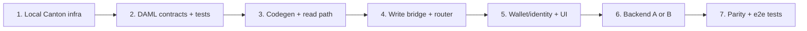
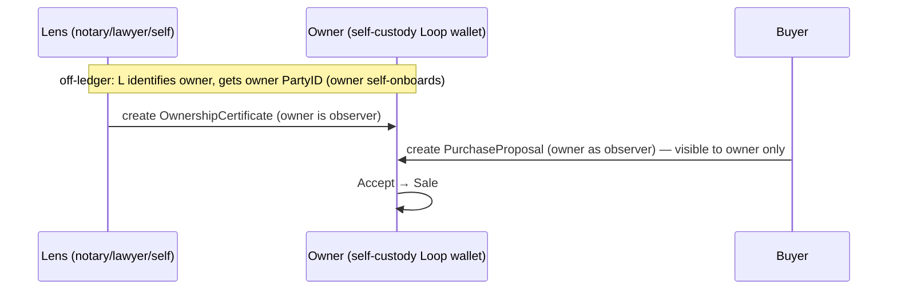

# Feature: DAML / Canton support (third blockchain option)

Initial plan for adding **DAML smart contracts on Canton** as a third, fully
parallel blockchain option alongside the existing **EVM/Solidity** and **Solana**
backends. This does **not** replace EVM or Solana — it is an additional choice,
selected the same way the others are (by which wallet/network is connected).

Status: **draft for refinement.** Nothing here is implemented yet. Open
questions are collected in [§9](#9-open-questions).

Docs:
- DAML language reference: https://docs.canton.network/appdev/reference/daml-language-reference
- Concept translation (blockchain → Canton): https://docs.canton.network/appdev/modules/m2-concept-translation

---

## 1. Why this is a clean fit

The app's chains are abstracted by a **facade + runtime routing** pattern, not a
shared interface. Selection is *implicit*: "which wallet is connected" decides
the chain. Adding a chain means adding a parallel module set and one more branch
in the router — exactly how Solana was added next to EVM.

Key insertion points (all have a Solana precedent):

| Layer | EVM | Solana | Canton (new) |
|---|---|---|---|
| Write bridge | `frontend/js/blockchain-proposals.js` | `frontend/js/solana/proposal-bridge.js` → `window.SolanaProposalChainBridge` | `frontend/js/canton/proposal-bridge.js` → `window.CantonProposalChainBridge` |
| Read loader | `frontend/js/chain-data-loader.js` | `frontend/js/solana/chain-data-loader.js` | `frontend/js/canton/chain-data-loader.js` |
| Wallet/identity | `frontend/js/wallet-connection.js` → `window.walletManager` | `frontend/js/solana/wallet-adapter.js` → `window.solanaWalletManager` | `frontend/js/canton/wallet-adapter.js` → `window.cantonWalletManager` |
| Router | `*WithRouting()` in `blockchain-proposals.js:866-906` | same (delegates on `isSolanaWalletConnected()`) | add `isCantonConnected()` branch |
| Contract registry | `frontend/contracts/addresses.json` key `"31337"` etc. | keys `"solana"`, `"solana-devnet"` | keys `"canton"`, `"canton-testnet"` |
| Contracts | `blockchain/contracts/*.sol` (Hardhat/Foundry) | `blockchain/solana/programs/*` (Anchor) | `blockchain/daml/*` (DAML SDK) |
| Backend | none (persists `onchain_data` JSONB) | none | **possibly net-new** (see [§6](#6-backend-the-one-real-divergence)) |

---

## 2. The domain model we are mapping

The on-chain object is a **Proposal**: an urban-planning change affecting one or
more **parcels**. Consensus = **unanimous acceptance** by all affected parcel
owners (`acceptanceCount == parcelIds.length`), not token-weighted voting.
A proposal locks ETH/SOL + a city token, distributed on execution.

`Proposal` (from `ProposalNFT.sol:52-68`): `parcelIds[]`, `isConditional`,
`imageURI`, `acceptancePossible`, `status {Active,Executed,Cancelled,Expired}`,
`ethBalance`, `tokenBalance`, per-parcel `hasAccepted`/`acceptedBy`,
per-parcel `ParcelOwnerState` (owner list + share-bps + accepted flags),
`lens[]` (display/authorized addresses), `acceptanceCount`, `expiryTimestamp`.

Bridge method surface to replicate (from `SolanaProposalChainBridge`,
`proposal-bridge.js:556-566`):
`isSupported`, `mintProposal`, `contributeToProposal`, `acceptProposal`,
`withdrawAcceptance`, `distributeFunds`, `cancelAndRefund`,
`resolveProposalProgramId`/`resolveParcelProgramId`.

---

## 3. Concept mapping — our terms → Canton/DAML

### 3.1 Infrastructure

| Our concept | EVM | Solana | **Canton / DAML** |
|---|---|---|---|
| "Blockchain" | EVM chain (numeric chainId) | Solana cluster | **Synchronizer** — coordinates participants; chain key `canton` / `canton-testnet` |
| Node / RPC access | `JsonRpcProvider` (ethers) | `Connection` (web3.js) | **Ledger API** (gRPC) or its **JSON Ledger API** wrapper, reached via a **participant node** |
| Deployment unit | deployed bytecode at an address | program at a program ID | **DAR package** (`.dar`), *vetted* (not permissionless) on the participant |
| Transaction | tx hash | signature | **Command** → **Transaction ID** (privacy-partitioned per party) |
| Explorer link | etherscan/basescan | explorer.solana.com | Canton has no public explorer; surface tx/contract IDs, link to a console if available |

### 3.2 Contracts & state

| Our concept | EVM | Solana | **Canton / DAML** |
|---|---|---|---|
| Smart contract (code) | Solidity `contract` | Anchor program | **Template** (`template Proposal where …`) |
| Contract instance (a specific proposal) | ERC721 tokenId + `Proposal` struct | PDA account (Borsh) | **Contract** — an active instance of a template, addressed by **Contract ID** |
| "Contract address" we store | deployed contract address | program ID | **Template ID** (package:module:entity) for the type; **Contract ID** for a specific proposal |
| Mutable state | struct fields mutated in place | account data mutated | **immutable** — a choice **archives** the old contract and **creates** a new one with updated fields |
| Function / write op | `function mintAndFund(...)` | instruction `mint_and_fund` | **choice** (`choice MintAndFund : … controller … do …`) |
| Constructor / create | `mint` | `initialize`/`mint_and_fund` | **`create`** (returns a `ContractId`) |
| `require(...)` / guard | `require` | `require!`/`Err` | **`ensure`** clause + **signatory/controller** authorization (compile-time) |
| Status enum | `ProposalStatus` enum | `ProposalStatus` enum | DAML `data ProposalStatus = Active \| Executed \| …` (or model each status as a distinct template) |

### 3.3 Identity & authorization (the biggest conceptual shift)

| Our concept | EVM | Solana | **Canton / DAML** |
|---|---|---|---|
| Account / wallet "address" | `0x…` hex | base58 pubkey | **Party** (a string party-id hosted on a participant) |
| `msg.sender` / signer | `msg.sender` | `Signer<'info>` | **controller** of the exercised choice (declared, not runtime-read) |
| Who must consent to create | n/a (owner mints) | account constraints | **signatory** — authorization is part of the contract, enforced by protocol |
| Who can see it | events / public state | account is public | **observer** — explicit visibility; nothing is globally public |
| Parcel-owner = approver | EAS attestation proves ownership | PDA-derived parcel cert account | a parcel-owner **Party** referenced as signatory/observer; ownership proof via a `Parcel`/ownership template (see [§9](#9-open-questions)) |
| Lens / authorized viewers | `lens[]` addresses | `lens` vec | **observer** parties on the `Proposal` contract |

### 3.4 Tokens / value

| Our concept | EVM | Solana | **Canton / DAML** |
|---|---|---|---|
| Native value locked | ETH (`msg.value`) | lamports (SOL) | Canton has no implicit native gas-coin in the contract; model funds as **holding contracts** (e.g. Canton Coin / a custom `Token` template) transferred into an escrow contract |
| City token | ERC20 `cityToken` | SPL token | a DAML `Token`/`Holding` template (or the Canton token-standard interfaces) |
| Locking funds in a proposal | balance held by contract | lamports in PDA | an **escrow** pattern: holding contracts whose signatory/observer set ties them to the proposal; distribution = archive + re-create to recipients |

> **Note:** value transfer is the area with the *least* 1:1 mapping. EVM/Solana
> move a native coin trivially; on Canton, money is itself contracts. This needs
> an explicit design decision (custom token template vs. Canton token standard)
> in refinement — see [§9](#9-open-questions).

---

## 4. DAML contract design (sketch)

Proposed package layout under `blockchain/daml/`:

```
blockchain/daml/
  daml.yaml                 # SDK version, deps, package name
  daml/
    Parcel.daml             # parcel + ownership template(s)
    Proposal.daml           # main Proposal template + choices
    Token.daml              # city-token holding/escrow (or use std token)
  scripts/                  # Daml Script for init/test deploy
  .daml/                    # build output (gitignored)
```

Sketch of the core template (illustrative, to be refined):

```haskell
template Proposal
  with
    issuer        : Party            -- creator (was `to`/minter)
    parcelOwners  : [Party]          -- one party per affected parcel owner
    parcelIds     : [Text]
    isConditional : Bool
    imageURI      : Text
    status        : ProposalStatus
    accepted      : [Party]          -- who has accepted so far
    lens          : [Party]          -- observers
    -- fund references (escrow contract ids) — see §3.4
  where
    signatory issuer
    observer parcelOwners, lens
    ensure (length parcelIds > 0)

    -- a parcel owner accepts; archives + recreates with them added
    choice Accept : ContractId Proposal
      with who : Party
      controller who
      do
        assert (who `elem` parcelOwners)
        let accepted' = dedup (who :: accepted)
        let status' = if length accepted' == length parcelOwners
                        then Executed else status
        create this with accepted = accepted'; status = status'

    choice WithdrawAcceptance : ContractId Proposal
      with who : Party
      controller who
      do create this with accepted = filter (/= who) accepted

    -- distribute / cancel: archive escrow holdings to recipients
    choice Distribute : () controller issuer do …
    choice Cancel     : () controller issuer do …
```

Decisions to settle during refinement:
- **Status as enum field vs. distinct templates** (Active/Executed/Cancelled).
  DAML idiom often prefers distinct templates per lifecycle state.
- **Per-parcel share-bps & partial acceptance** (the `ParcelOwnerState` detail) —
  do we port it fully or simplify for v1?
- **Funds model** — custom `Token` template vs. Canton token standard.
- **Contract keys** — give `Proposal` a stable key (e.g. `(issuer, proposalSeq)`)
  so the frontend can look it up like a tokenId/PDA.

---

## 5. Frontend integration

Mirror the Solana module set under `frontend/js/canton/`:

- `wallet-adapter.js` → `window.cantonWalletManager`
  - Canton has **no browser wallet** like MetaMask/Phantom. "Connecting" means
    establishing a **party** + an authenticated session to a participant's
    JSON Ledger API. Likely a config-driven party + token (JWT) rather than a
    popup. This is the biggest frontend divergence — see [§9](#9-open-questions).
  - Expose the same shape as `solanaWalletManager` (`getState()` →
    `{status, accounts}`) so the router and UI work unchanged.
- `chain-data-loader.js` → `window.CantonChainDataLoader`
  - Query active `Proposal` contracts via the JSON Ledger API
    (`/v1/query`), map them to the same proposal DTO the UI already consumes.
- `proposal-bridge.js` → `window.CantonProposalChainBridge`
  - Implement the full method surface from [§2](#2-the-domain-model-we-are-mapping);
    each method issues a `create`/`exercise` command via the JSON Ledger API.

Wiring (same files Solana touched):
- **Router**: add `isCantonConnected()` branch to each `*WithRouting()` in
  `blockchain-proposals.js:866-906`. Consider refactoring the now-three-way
  checks into an **ordered bridge registry** to stop the drift.
- **Reads**: add a Canton branch wherever consumers do
  `if (useSolana) … else (ChainDataLoader) …` — notably
  `frontend/js/agents.js:1985-2225` and `frontend/js/minted-proposals.js`.
- **Connect modal**: register Canton connectors in the merge logic
  (`wallet-connection.js:542-560`).
- **Network switcher**: add Canton entries + a `canton-*` branch in
  `user-management.js` `getAvailableChainOptions()` (1783),
  `requestChainSwitch()` (1859), and `NETWORK_LABELS` (143).
- **Config**: add `"canton"`/`"canton-testnet"` keys to
  `frontend/contracts/addresses.json` (template IDs + participant JSON-API base
  URL); add a Canton endpoint map mirroring Solana's `CLUSTERS`.
- **Load order**: add `canton/*` scripts + any Canton JS SDK to
  `frontend/index.html` before `blockchain-proposals.js` (like the Solana block
  at ~1209-1213).

---

## 6. Backend — the one real divergence

EVM and Solana sign **entirely in the browser**; the backend
(`backend/routes/proposals.js`) only persists `onchain_data` JSONB and never
talks to a chain. Canton typically requires a **participant node** and an
**authenticated Ledger API** session, which a static frontend cannot safely hold.

Two options to decide in refinement:

- **A. Direct browser → JSON Ledger API.** Frontend talks straight to a
  participant's JSON API with a party JWT. No backend change. Simplest, but
  exposes the participant endpoint and embeds/serves a token to the browser.
- **B. Thin backend proxy.** A new `backend/routes/canton.js` proxies
  create/exercise/query to the participant, holds the auth, and maps parties.
  This is **net-new infra with no precedent in the repo** (the other two chains
  need none) and is the main cost of this feature.

Recommendation: prototype on **A** against a local/test participant to validate
the contract model, then move to **B** before anything non-local.

> **Resolved (see [§11](#11-proposed-route--lens-trust-model)):** the DevNet-via-Seaport
> route uses a **shared validator** (5n sandbox) that hosts the ledger, so we go
> with **option A** (direct browser → JSON Ledger API, OIDC/JWT auth) and **never
> run our own participant node**. The "thin backend proxy" (B) is no longer needed
> for the MVP. The backend keeps its existing role (persist `onchain_data`); the
> only possible addition is an optional, non-authoritative attestation index
> ([§11.4](#114-sending-proposals-to-parcels-visible-to-owners)).

---

## 7. Contracts / tooling

- Add `blockchain/daml/` with `daml.yaml` (DAML SDK).
- Build → `.dar`; deploy/vet onto a participant node.
- **Local dev**: DAML Sandbox + JSON Ledger API (the Hardhat-node / Anchor-localnet
  equivalent). Need to stand up a participant + synchronizer locally (Docker, per
  Canton quickstart).
- **Testing**: DAML Script for ledger setup; unit tests in DAML test scenarios
  (`daml test`) — the Forge/Anchor-test equivalent. Add tests covering the
  acceptance-consensus flow, mirroring existing contract tests.
- Generate a JS client/types from the DAR (Canton's `daml codegen js`) for the
  frontend bridge, analogous to the Solana IDL JSON the bridge consumes.

---

## 8. Phased implementation

1. **Spike / infra** — stand up a local Canton sandbox + JSON Ledger API in
   Docker; confirm create/exercise/query from a script. (de-risks [§6](#6-backend-the-one-real-divergence)/[§9](#9-open-questions))
2. **Contracts** — `Proposal` + `Parcel`/ownership + funds model in
   `blockchain/daml/`; `daml test` for the consensus flow.
3. **Codegen + read path** — `daml codegen js`; `CantonChainDataLoader` mapping
   contracts → existing proposal DTO; render Canton proposals read-only.
4. **Write path** — `CantonProposalChainBridge` full method surface; wire into
   `*WithRouting()`.
5. **Wallet/identity + UI** — `cantonWalletManager`, connect-modal entry, network
   switcher, addresses.json keys.
6. **Backend decision** — implement A or B per [§6](#6-backend-the-one-real-divergence).
7. **Parity pass + tests** — match EVM/Solana behavior incl. the asymmetries in
   [§9](#9-open-questions); end-to-end test on test participant.



---

## 9. Open questions

**Resolved** (see [§11](#11-proposed-route--lens-trust-model)):
- ~~**Identity / "wallet".**~~ → Loop wallet party + OIDC/JWT; `@c7/ledger` SDK.
- ~~**Participant access.**~~ → Option A, shared DevNet validator via Seaport; no own node.
- ~~**Ownership proof.**~~ → buyer-chosen **lens** attestation (`OwnershipCertificate`),
  owners **self-custody** their party. No central authority.
- ~~**Networks.**~~ → local `daml sandbox` for dev/test, **Canton DevNet** (via Seaport)
  as the deployment target; chain keys `canton` / `canton-devnet`.

**Still open:**
1. **Funds model.** Custom `Token`/escrow templates vs. Canton token standard /
   Canton Coin? How are ETH/SOL "amounts" represented when there's no native
   in-contract coin? (M4)
2. **Feature parity.** `distributeFunds`/`cancelAndRefund` are Solana-only today;
   does Canton implement the full set or follow the "throw if unsupported"
   convention (`blockchain-proposals.js:898,905`)?
3. **State modeling.** Status as an enum field vs. distinct lifecycle templates;
   port full per-parcel share-bps (`ParcelOwnerState`) or simplify for v1.
4. **Multi-lens.** When we add it (future), confirm **"any one of them"** semantics
   and how the contract verifies which lens attested. *Not implemented in MVP.*
5. **Router refactor.** Refactor three-way `*WithRouting()` into a bridge
   registry now, or keep adding branches?

---

## 10. Simplest first slice — what we're building first

The MVP is a **single-parcel purchase** modeled with the classic DAML
**propose-accept** pattern, plus a prior ownership attestation. **Money is
deferred** (the hardest Canton concept) — v1 only proves the consensus/authorization
mechanics. Lives in `blockchain/daml/`.

Three parties:
- **Lens** — vouches that the owner is the owner (signs *first*). **Buyer-chosen**
  (a notary, a lawyer, or even the buyer themselves), not a central authority.
  MVP = exactly **one** lens. See [§11](#11-proposed-route--lens-trust-model) for the trust model.
- **Owner** — owns the parcel.
- **Buyer** — wants to buy it.

Flow:

```mermaid
sequenceDiagram
    participant L as Lens (buyer-chosen)
    participant B as Buyer
    participant O as Owner
    L->>L: create OwnershipCertificate (parcel X → Owner)
    B->>B: create PurchaseProposal (parcel X, price, refs cert; Owner as observer)
    O->>O: exercise Accept → Sale (signed by Buyer + Owner)
```

1. **Lens** creates `OwnershipCertificate` ("Owner owns parcel X").
2. **Buyer** creates `PurchaseProposal` for parcel X at a price, referencing the cert,
   with **Owner as observer** — so it appears in the owner's ledger view, and no one else's.
3. **Owner** exercises `Accept`: the proposal is archived and a bilaterally-signed
   `Sale` is created. One parcel + one owner ⇒ consensus in a single accept.

This exercises every core Canton concept at minimum size — **Party** (×3),
**signatory** vs **observer**, **controller**, a **choice** that **archives + creates**
(the immutability model), and the **propose-accept** authorization handshake —
without value transfer. The cert is passed as a `ContractId` and `fetch`ed inside
`Accept` (owner is an observer of the cert, so the fetch is authorized) — avoids
contract-key maintainer-authorization rules in v1.

### Build milestones

| # | Milestone | Output | Touches frontend? |
|---|---|---|---|
| **M0** | Local infra spike | `daml` SDK + local sandbox/JSON API runs; create/exercise/query from a script | no |
| **M1** | Contracts + tests | the 3 templates + `daml test` running lens→buyer→owner end-to-end | no |
| **M2** | Read path | `daml codegen js`; `CantonChainDataLoader` maps contracts → existing proposal DTO; render read-only | yes (read) |
| **M3** | Write path | `CantonProposalChainBridge` (`mintProposal`=create, `acceptProposal`=exercise Accept) wired into `*WithRouting()`; "wallet" = config party + JWT | yes |
| **M4** | Funds | token/escrow template so `price` is locked & transferred on Accept | contracts + bridge |
| **M5** | Parity | multiple parcels/owners, share-bps, lens as observer list, status enum, expiry | all |

**M0/M1 first, then stop for review** before touching the frontend.

### Local stack decision (v1)

Start with **`daml sandbox` + `daml json-api`** (the in-memory dev ledger) — the
simplest possible local ledger, equivalent to a Hardhat node / Anchor localnet.
The shared DevNet validator (see [§11](#11-proposed-route--lens-trust-model)) is the
M3+ target. This keeps §6 option **A** (direct browser → JSON Ledger API) viable
throughout — we never run our own node.

---

## 11. Proposed route + lens trust model

This is the **chosen direction** (resolves much of §6/§9). It is the route the
Canton ecosystem tooling expects, and it removes the need to run our own node.

### 11.1 Deployment route — Canton DevNet via Seaport

> "Seaport" here is **5North's Canton web IDE / deployment platform**
> (`app.devnet.seaport.to`) — *not* OpenSea's Seaport protocol.

- **Contracts in Daml, no EVM wrappers** — our `blockchain/daml/` DAR transfers
  directly; Daml is identical on local sandbox and on DevNet.
- **Deploy the DAR to Canton DevNet through Seaport**, onto the shared
  **"5n sandbox" validator** → **we never run our own validator/participant node.**
- **Frontend** uses the **`@c7/ledger`** SDK against the **JSON Ledger API v2**;
  TS bindings via `dpm codegen-js`. (Replaces the older `daml codegen js` mention
  in [§7](#7-contracts--tooling) for the DevNet path.)
- **Auth** = **OIDC / JWT**; the token maps a user to the party(ies) it may act as.
- **Demo expectation**: a web dApp that can **switch party perspectives live**
  (lens / owner / buyer) to show the privacy/visibility differences.

### 11.2 How parties are onboarded (wallets / keys)

A Canton **Party is not an address.** It is `hint::fingerprint`, where the
fingerprint is the cryptographic fingerprint of the **namespace key** of the node
managing it (e.g. `alice::1220f2fe…eb72`).

- **Party creation is not permissionless.** A party must be **allocated by a
  participant/validator** (`POST /v2/parties {"partyIdHint":"..."}`); that node
  becomes the party's host. You cannot mint one locally like an ETH keypair.
- **Custody models:** *local party* (validator holds keys, signs on the party's
  behalf — custodial) vs *external party* (user holds keys, external signing —
  non-custodial).
- **Wallet ≠ MetaMask.** For DevNet you get a **Loop wallet** at
  `devnet.cantonloop.com`, which yields your Party ID on the shared validator.
  (A **Canton Wallet SDK** exists for building wallet UX.)

**Decision — owners self-custody.** Parcel owners hold their own party via a Loop
wallet; the lens merely records the owner's Party ID in the attestation. We do
**not** use lens-custodial parties. The owner's accept is therefore always signed
by the owner's own key.

### 11.3 Lens trust model (buyer-chosen)

The **lens is the buyer's trust anchor**, chosen per-proposal — a notary, a
lawyer, several of them, or the buyer themselves. There is **no central authority
and no required global registry.** Two independent trust questions, and the lens
touches only the first:

1. **"Who is the owner?"** → answered by the **lens**. Establishes which Party the
   proposal is addressed to. This is the buyer's own risk surface.
2. **"Does the owner agree to sell?"** → answered by the **owner accepting with
   their own key**. Trustless, on-ledger. The lens cannot fake this.

So the owner need not trust the lens — they just see the claim and decide to
accept or ignore.

**MVP: exactly one lens, always.** The contracts take a single `lens : Party`.

> **Future (noted, not implemented):** multiple lenses with **"any one of them"**
> semantics — a proposal is valid if *any* of its listed lenses has attested the
> owner. Mirrors EVM's `lens[]`. Do **not** build this yet; keep the single-lens
> field until we explicitly take it on.

### 11.4 Sending proposals to parcels, visible to owners

Canton has **no global state and no broadcast** — a contract is visible only to
its signatory/observer parties. We use that directly:

- **Owner-side visibility is native.** The buyer sets the **owner as an observer**
  on the `PurchaseProposal`; it then appears in the owner's JSON Ledger API
  `active-contracts` query instantly, and in no one else's. "Proposals visible to
  parcel owners" needs no feed, no polling, no directory — the dApp logged in as
  the owner just lists the proposals addressed to them.
- **The owner must already be a Party** for the buyer to name them as observer.
  Onboarding therefore folds into the lens's (off-ledger) work: the lens
  identifies the real owner and obtains their Party ID (the owner self-onboards a
  Loop wallet — see [§11.2](#112-how-parties-are-onboarded-wallets--keys)), then
  issues the attestation naming that Party.
- **Buyer-side discovery** ("who owns parcel X?") is the **lens's off-ledger job**
  (land registry, notarial records), not a protocol feature. An optional,
  non-authoritative index of attestations the app has seen could be added later;
  it is not part of the MVP.



---

## 12. Decisions log (build)

What we actually committed to as the build progressed. See `feature-daml-readme.md`
for what's been built and how it works.

### 2026-06-14 — after the DevNet spike

- **Custodial MVP confirmed; production self-custody (Loop wallet) dropped.**
  Creating a contract with a Loop-wallet party as stakeholder fails with
  `PACKAGE_SELECTION_FAILED` — that party's participant hasn't **vetted** our DAR,
  and managed Loop wallets won't vet arbitrary app packages. So a real owner
  **cannot hold our `PurchaseProposal`** in their wallet. All app parties stay
  hosted on our validator, driven by the backend (M2M user `6`). Real
  cross-participant identity is **out of scope** for this MVP.
  → supersedes the self-custody decision in [§11.2](#112-how-parties-are-onboarded-wallets--keys).

- **Integration narrowed to a UI fold; no chain-router parity.** We will fold
  `canton.html` into the main app shell as a **Canton section**, but **not** wire
  Canton into the wallet-driven `*WithRouting` ([§5](#5-frontend-integration)).
  Reason: that router selects a chain by *which browser wallet is connected*;
  Canton here is backend-custodial with **no browser wallet to detect**, so there
  is nothing for an `isCantonConnected()` branch to key off. Forcing it in would
  mean inventing a separate selector and fighting the existing pattern.

- **M4 real Canton Coin transfer: chosen (custodial buyer→owner), but parked.**
  We hold ~16.1M CC on the validator party and confirmed on-ledger `Holding`
  visibility, but a token-standard transfer needs the Amulet **registry/scan**
  (the `TransferFactory`), reachable at `${validator-app-api}/v0/scan-proxy`. We
  were only given the **ledger-api** host, so this is **blocked on obtaining the
  validator app API / scan URL** from the organizer. Until then `price` stays a
  CC-denominated number. See `blockchain/daml/DEVNET-ACCESS.md`.

### 2026-06-14 — integration complete (P0–P4) + deployed

- **Canton is integrated and live.** P0–P4 ([§13](#13-integration-plan-folding-canton-into-the-main-app))
  done: enter Canton mode via the network pill + identity picker; public parcel
  count via `ProposalMarker`; create from the map flow; view/accept in the parcel
  panel; identity tooling. Merged to `2026-nyc-demo` and **deployed to
  https://urbangametheory.xyz** (frontend rsync + backend git-pull on `do`).
- **Lens sees the accepted sale.** `Sale` gained an **`Optional lens` observer**
  (carried through `Accept`) so buyer **and** owner **and** lens keep visibility
  after acceptance (status "Accepted"); a stranger still sees nothing. Optional
  keeps the package upgrade-compatible. Package → **0.3.0**.
- **No double count.** A Canton proposal also gets a local/in-memory copy from the
  create flow; it's now excluded from the EVM count + EVM list
  (`CantonMode.isCantonProposal`), so it shows only as the purple Canton badge.
- **Config folded into `backend/.env`** (`CANTON_*`), so the real API serves
  `/canton`; the `blockchain/daml/spike/` dir was removed (superseded by
  `backend/canton/`).
- **`canton.html` kept** as an internal **state explorer** + backup demo, linked
  from the identity picker (same ledger + same-origin localStorage).

### Under discussion (not yet decided)

- **Parcel ↔ proposal discovery without NFTs.** Canton has no public NFT/contract
  state, so a parcel cannot publicly advertise its proposals the way EVM does.
  → **Resolved in [§13](#13-integration-plan-folding-canton-into-the-main-app):**
  Option B (on-ledger `ProposalMarker` observed by a public party) signals
  existence only; terms stay private to stakeholders.

---

## 13. Integration plan (folding Canton into the main app)

Goal: move the proven `canton.html` functionality into the main map app so Canton
sits alongside EVM/Solana — **without** the wallet-driven `*WithRouting` parity
(Canton is backend-custodial; there's no browser wallet to detect).

### Entry mechanism (agreed)

Canton has no wallet, so identity can't come from a connected wallet. Two parts:

1. **Network switch to "Canton".** Add a **"Canton (DevNet)"** entry to the existing
   network pill → chain-selection modal (`user-management.js`:
   `getAvailableChainOptions` / `openChainSelectionModal` / `requestChainSwitch`).
   Unlike EVM/Solana it needs **no connected wallet**. Selecting it sets a persisted
   `cantonActive` flag; `isCantonActive()` is checked **first** in the routing
   functions in `blockchain-proposals.js`.
2. **"Acting party" picker = the wallet stand-in.** When Canton is active, the
   wallet button becomes a **Canton identity chip** showing the current party;
   clicking opens a picker built from the remembered test-parties (pick / paste /
   "new test party"). The selected party (`cantonCurrentParty`, persisted) is the
   identity for reads, Accept, and as buyer when creating.

### Discovery / counts — Option B (on-ledger marker)

- **`ProposalMarker { buyer, public, parcelId, proposalCid }`** — signatory `buyer`,
  observer a fixed **public registry party**. Carries only parcel + opaque cid —
  **no price/terms**. Created with each `PurchaseProposal`; archived when the
  proposal is accepted/withdrawn (backend controls `buyer`, so it archives the
  marker too). Genuine selective disclosure: existence public, terms private.
- **`GET /canton/parcel-counts`** — query active markers **as the public party**,
  group by `parcelId` → `{ parcelId: count }`.
- **Map**: `canton-counts.js` fetches+caches that map; `parcels/ui/proposal-counts.js`
  adds Canton counts to the labels, styled distinctly. Canton-only parcels show
  "N Canton proposal(s) — terms private"; if the current identity is a stakeholder,
  details + Accept appear.

### Phases (incremental, each verifiable)

- **P0 — Entry** *(no contract changes)*: `canton-mode.js` (state: `cantonActive`,
  `cantonCurrentParty`; identity picker; `CantonProposalChainBridge` stub) +
  network-modal entry + `isCantonActive()` checked first in routing (create throws
  a clear "wired in P2" until then).
- **P1 — Counts (Option B)**: `ProposalMarker` template + redeploy; `/canton/parcel-counts`;
  `canton-counts.js` into the map's proposal-count labels.
- **P2 — Create via map**: Canton branch in `createProposal()`/`mintProposalWithRouting`
  → `POST /canton/proposals` using the selected parcel + price + current party.
- **P3 — View/Accept on a parcel**: parcel panel shows Canton proposals for the
  current identity (details if stakeholder, "private" otherwise) + Accept.
- **P4 — Fold the rest**: CCView + test-parties into a Canton panel; demote
  `canton.html` to a dev console.

---

## 14. Loop wallet SDK — integration assessment

The 5N **Loop wallet SDK** (`@fivenorth/loop-sdk`,
[github](https://github.com/fivenorth-io/loop-sdk),
[npm](https://www.npmjs.com/package/@fivenorth/loop-sdk)) is the browser-wallet
client we earlier said Canton "lacked". Loop is a **self-custodial** wallet
(external party ids, passkey auth, no extension), so this is the MetaMask/Phantom
equivalent. There's also a vendor-neutral standard, `@canton-network/dapp-sdk`
(CIP-0103), with Loop as one adapter.

### What it can do (browser dApp)

- `loop.init(...)` + `loop.connect()` → user approves via Loop (QR/popup/passkey);
  `onAccept(provider)` returns a **`provider`** with `party_id`, `public_key`, `email`.
- `provider.getHolding()` — the user's token holdings (CC, CIP-56 tokens, LOOP, …).
- `provider.transfer(recipient, amount, instrument?)` — **prepares + wallet-signs a
  token transfer** (i.e. a real **Canton Coin payment**).
- `provider.submitTransaction(cmd)` / `getActiveContracts({templateId|interfaceId})`.
- `loop.autoConnect()` / `verifySession()` / `logout()`; server-side signing variant.

### The decisive limitation

> "Currently, we only support DAML transactions from the **built-in Splice DAR
> files and Utility app DAR files. There is no plan to upload and support third
> party DAR at this moment.**"

So Loop **cannot create or exercise our custom `consensus-builder-daml` contracts**
(`PurchaseProposal`, `Sale`, …). This is the same wall as the
`PACKAGE_SELECTION_FAILED` finding ([§12](#12-decisions-log-build)) — now confirmed
by the wallet vendor. Consequence: a Loop user **can't** Accept our proposal or be
a stakeholder on it. App-contract self-custody via Loop is **not** possible.

### What Loop *does* unblock — Canton Coin payments (M4)

`provider.transfer(...)` is the token-standard transfer we were blocked on (we
lacked the validator scan/registry URL) — **the wallet performs it for us**. So the
viable integration is a **hybrid**:

- **Agreement** (cert → proposal → accept → sale + markers) stays **custodial on
  our validator** (unchanged — Loop can't touch it).
- **Identity + money via Loop**: the real buyer connects Loop; on purchase they
  `provider.transfer(owner-recipient, price, CC)` — a real Canton Coin payment from
  their own wallet. We link that transfer (`update_id`) to the proposal off-ledger.
  The owner (a recipient party) needs a transfer pre-approval or to accept the
  incoming holding.

### Integration options

1. **Connect + balance (small):** "Connect Loop wallet" in the Canton identity area
   → show real `party_id` + CC balance (`getHolding`). Proves real wallet connect.
2. **Real CC payment (M4, medium):** option 1 + a `provider.transfer` payment leg
   tied to a proposal. Unblocks M4 without the scan/registry URL.
3. **Full self-custody of the app flow:** **not possible** with Loop (third-party
   DAR unsupported). Would require Loop to vet our package — out of our control.

Recommendation: pursue **(2)** if we want real money in the demo; otherwise **(1)**
as a quick "real wallet" proof. Both keep the app agreement custodial.
