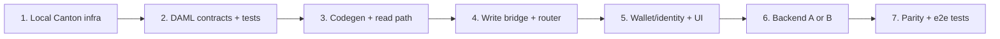

# Feature: DAML / Canton support (third blockchain option)

Initial plan for adding **DAML smart contracts on Canton** as a third, fully
parallel blockchain option alongside the existing **EVM/Solidity** and **Solana**
backends. This does **not** replace EVM or Solana — it is an additional choice,
selected the same way the others are (by which wallet/network is connected).

Status: **draft for refinement.** Nothing here is implemented yet. Open
questions are collected in [§9](#9-open-questions).

Docs:
- DAML language reference: https://docs.canton.network/appdev/reference/daml-language-reference
- Concept translation (blockchain → Canton): https://docs.canton.network/appdev/modules/m2-concept-translation

---

## 1. Why this is a clean fit

The app's chains are abstracted by a **facade + runtime routing** pattern, not a
shared interface. Selection is *implicit*: "which wallet is connected" decides
the chain. Adding a chain means adding a parallel module set and one more branch
in the router — exactly how Solana was added next to EVM.

Key insertion points (all have a Solana precedent):

| Layer | EVM | Solana | Canton (new) |
|---|---|---|---|
| Write bridge | `frontend/js/blockchain-proposals.js` | `frontend/js/solana/proposal-bridge.js` → `window.SolanaProposalChainBridge` | `frontend/js/canton/proposal-bridge.js` → `window.CantonProposalChainBridge` |
| Read loader | `frontend/js/chain-data-loader.js` | `frontend/js/solana/chain-data-loader.js` | `frontend/js/canton/chain-data-loader.js` |
| Wallet/identity | `frontend/js/wallet-connection.js` → `window.walletManager` | `frontend/js/solana/wallet-adapter.js` → `window.solanaWalletManager` | `frontend/js/canton/wallet-adapter.js` → `window.cantonWalletManager` |
| Router | `*WithRouting()` in `blockchain-proposals.js:866-906` | same (delegates on `isSolanaWalletConnected()`) | add `isCantonConnected()` branch |
| Contract registry | `frontend/contracts/addresses.json` key `"31337"` etc. | keys `"solana"`, `"solana-devnet"` | keys `"canton"`, `"canton-testnet"` |
| Contracts | `blockchain/contracts/*.sol` (Hardhat/Foundry) | `blockchain/solana/programs/*` (Anchor) | `blockchain/daml/*` (DAML SDK) |
| Backend | none (persists `onchain_data` JSONB) | none | **possibly net-new** (see [§6](#6-backend-the-one-real-divergence)) |

---

## 2. The domain model we are mapping

The on-chain object is a **Proposal**: an urban-planning change affecting one or
more **parcels**. Consensus = **unanimous acceptance** by all affected parcel
owners (`acceptanceCount == parcelIds.length`), not token-weighted voting.
A proposal locks ETH/SOL + a city token, distributed on execution.

`Proposal` (from `ProposalNFT.sol:52-68`): `parcelIds[]`, `isConditional`,
`imageURI`, `acceptancePossible`, `status {Active,Executed,Cancelled,Expired}`,
`ethBalance`, `tokenBalance`, per-parcel `hasAccepted`/`acceptedBy`,
per-parcel `ParcelOwnerState` (owner list + share-bps + accepted flags),
`lens[]` (display/authorized addresses), `acceptanceCount`, `expiryTimestamp`.

Bridge method surface to replicate (from `SolanaProposalChainBridge`,
`proposal-bridge.js:556-566`):
`isSupported`, `mintProposal`, `contributeToProposal`, `acceptProposal`,
`withdrawAcceptance`, `distributeFunds`, `cancelAndRefund`,
`resolveProposalProgramId`/`resolveParcelProgramId`.

---

## 3. Concept mapping — our terms → Canton/DAML

### 3.1 Infrastructure

| Our concept | EVM | Solana | **Canton / DAML** |
|---|---|---|---|
| "Blockchain" | EVM chain (numeric chainId) | Solana cluster | **Synchronizer** — coordinates participants; chain key `canton` / `canton-testnet` |
| Node / RPC access | `JsonRpcProvider` (ethers) | `Connection` (web3.js) | **Ledger API** (gRPC) or its **JSON Ledger API** wrapper, reached via a **participant node** |
| Deployment unit | deployed bytecode at an address | program at a program ID | **DAR package** (`.dar`), *vetted* (not permissionless) on the participant |
| Transaction | tx hash | signature | **Command** → **Transaction ID** (privacy-partitioned per party) |
| Explorer link | etherscan/basescan | explorer.solana.com | Canton has no public explorer; surface tx/contract IDs, link to a console if available |

### 3.2 Contracts & state

| Our concept | EVM | Solana | **Canton / DAML** |
|---|---|---|---|
| Smart contract (code) | Solidity `contract` | Anchor program | **Template** (`template Proposal where …`) |
| Contract instance (a specific proposal) | ERC721 tokenId + `Proposal` struct | PDA account (Borsh) | **Contract** — an active instance of a template, addressed by **Contract ID** |
| "Contract address" we store | deployed contract address | program ID | **Template ID** (package:module:entity) for the type; **Contract ID** for a specific proposal |
| Mutable state | struct fields mutated in place | account data mutated | **immutable** — a choice **archives** the old contract and **creates** a new one with updated fields |
| Function / write op | `function mintAndFund(...)` | instruction `mint_and_fund` | **choice** (`choice MintAndFund : … controller … do …`) |
| Constructor / create | `mint` | `initialize`/`mint_and_fund` | **`create`** (returns a `ContractId`) |
| `require(...)` / guard | `require` | `require!`/`Err` | **`ensure`** clause + **signatory/controller** authorization (compile-time) |
| Status enum | `ProposalStatus` enum | `ProposalStatus` enum | DAML `data ProposalStatus = Active \| Executed \| …` (or model each status as a distinct template) |

### 3.3 Identity & authorization (the biggest conceptual shift)

| Our concept | EVM | Solana | **Canton / DAML** |
|---|---|---|---|
| Account / wallet "address" | `0x…` hex | base58 pubkey | **Party** (a string party-id hosted on a participant) |
| `msg.sender` / signer | `msg.sender` | `Signer<'info>` | **controller** of the exercised choice (declared, not runtime-read) |
| Who must consent to create | n/a (owner mints) | account constraints | **signatory** — authorization is part of the contract, enforced by protocol |
| Who can see it | events / public state | account is public | **observer** — explicit visibility; nothing is globally public |
| Parcel-owner = approver | EAS attestation proves ownership | PDA-derived parcel cert account | a parcel-owner **Party** referenced as signatory/observer; ownership proof via a `Parcel`/ownership template (see [§9](#9-open-questions)) |
| Lens / authorized viewers | `lens[]` addresses | `lens` vec | **observer** parties on the `Proposal` contract |

### 3.4 Tokens / value

| Our concept | EVM | Solana | **Canton / DAML** |
|---|---|---|---|
| Native value locked | ETH (`msg.value`) | lamports (SOL) | Canton has no implicit native gas-coin in the contract; model funds as **holding contracts** (e.g. Canton Coin / a custom `Token` template) transferred into an escrow contract |
| City token | ERC20 `cityToken` | SPL token | a DAML `Token`/`Holding` template (or the Canton token-standard interfaces) |
| Locking funds in a proposal | balance held by contract | lamports in PDA | an **escrow** pattern: holding contracts whose signatory/observer set ties them to the proposal; distribution = archive + re-create to recipients |

> **Note:** value transfer is the area with the *least* 1:1 mapping. EVM/Solana
> move a native coin trivially; on Canton, money is itself contracts. This needs
> an explicit design decision (custom token template vs. Canton token standard)
> in refinement — see [§9](#9-open-questions).

---

## 4. DAML contract design (sketch)

Proposed package layout under `blockchain/daml/`:

```
blockchain/daml/
  daml.yaml                 # SDK version, deps, package name
  daml/
    Parcel.daml             # parcel + ownership template(s)
    Proposal.daml           # main Proposal template + choices
    Token.daml              # city-token holding/escrow (or use std token)
  scripts/                  # Daml Script for init/test deploy
  .daml/                    # build output (gitignored)
```

Sketch of the core template (illustrative, to be refined):

```haskell
template Proposal
  with
    issuer        : Party            -- creator (was `to`/minter)
    parcelOwners  : [Party]          -- one party per affected parcel owner
    parcelIds     : [Text]
    isConditional : Bool
    imageURI      : Text
    status        : ProposalStatus
    accepted      : [Party]          -- who has accepted so far
    lens          : [Party]          -- observers
    -- fund references (escrow contract ids) — see §3.4
  where
    signatory issuer
    observer parcelOwners, lens
    ensure (length parcelIds > 0)

    -- a parcel owner accepts; archives + recreates with them added
    choice Accept : ContractId Proposal
      with who : Party
      controller who
      do
        assert (who `elem` parcelOwners)
        let accepted' = dedup (who :: accepted)
        let status' = if length accepted' == length parcelOwners
                        then Executed else status
        create this with accepted = accepted'; status = status'

    choice WithdrawAcceptance : ContractId Proposal
      with who : Party
      controller who
      do create this with accepted = filter (/= who) accepted

    -- distribute / cancel: archive escrow holdings to recipients
    choice Distribute : () controller issuer do …
    choice Cancel     : () controller issuer do …
```

Decisions to settle during refinement:
- **Status as enum field vs. distinct templates** (Active/Executed/Cancelled).
  DAML idiom often prefers distinct templates per lifecycle state.
- **Per-parcel share-bps & partial acceptance** (the `ParcelOwnerState` detail) —
  do we port it fully or simplify for v1?
- **Funds model** — custom `Token` template vs. Canton token standard.
- **Contract keys** — give `Proposal` a stable key (e.g. `(issuer, proposalSeq)`)
  so the frontend can look it up like a tokenId/PDA.

---

## 5. Frontend integration

Mirror the Solana module set under `frontend/js/canton/`:

- `wallet-adapter.js` → `window.cantonWalletManager`
  - Canton has **no browser wallet** like MetaMask/Phantom. "Connecting" means
    establishing a **party** + an authenticated session to a participant's
    JSON Ledger API. Likely a config-driven party + token (JWT) rather than a
    popup. This is the biggest frontend divergence — see [§9](#9-open-questions).
  - Expose the same shape as `solanaWalletManager` (`getState()` →
    `{status, accounts}`) so the router and UI work unchanged.
- `chain-data-loader.js` → `window.CantonChainDataLoader`
  - Query active `Proposal` contracts via the JSON Ledger API
    (`/v1/query`), map them to the same proposal DTO the UI already consumes.
- `proposal-bridge.js` → `window.CantonProposalChainBridge`
  - Implement the full method surface from [§2](#2-the-domain-model-we-are-mapping);
    each method issues a `create`/`exercise` command via the JSON Ledger API.

Wiring (same files Solana touched):
- **Router**: add `isCantonConnected()` branch to each `*WithRouting()` in
  `blockchain-proposals.js:866-906`. Consider refactoring the now-three-way
  checks into an **ordered bridge registry** to stop the drift.
- **Reads**: add a Canton branch wherever consumers do
  `if (useSolana) … else (ChainDataLoader) …` — notably
  `frontend/js/agents.js:1985-2225` and `frontend/js/minted-proposals.js`.
- **Connect modal**: register Canton connectors in the merge logic
  (`wallet-connection.js:542-560`).
- **Network switcher**: add Canton entries + a `canton-*` branch in
  `user-management.js` `getAvailableChainOptions()` (1783),
  `requestChainSwitch()` (1859), and `NETWORK_LABELS` (143).
- **Config**: add `"canton"`/`"canton-testnet"` keys to
  `frontend/contracts/addresses.json` (template IDs + participant JSON-API base
  URL); add a Canton endpoint map mirroring Solana's `CLUSTERS`.
- **Load order**: add `canton/*` scripts + any Canton JS SDK to
  `frontend/index.html` before `blockchain-proposals.js` (like the Solana block
  at ~1209-1213).

---

## 6. Backend — the one real divergence

EVM and Solana sign **entirely in the browser**; the backend
(`backend/routes/proposals.js`) only persists `onchain_data` JSONB and never
talks to a chain. Canton typically requires a **participant node** and an
**authenticated Ledger API** session, which a static frontend cannot safely hold.

Two options to decide in refinement:

- **A. Direct browser → JSON Ledger API.** Frontend talks straight to a
  participant's JSON API with a party JWT. No backend change. Simplest, but
  exposes the participant endpoint and embeds/serves a token to the browser.
- **B. Thin backend proxy.** A new `backend/routes/canton.js` proxies
  create/exercise/query to the participant, holds the auth, and maps parties.
  This is **net-new infra with no precedent in the repo** (the other two chains
  need none) and is the main cost of this feature.

Recommendation: prototype on **A** against a local/test participant to validate
the contract model, then move to **B** before anything non-local.

---

## 7. Contracts / tooling

- Add `blockchain/daml/` with `daml.yaml` (DAML SDK).
- Build → `.dar`; deploy/vet onto a participant node.
- **Local dev**: DAML Sandbox + JSON Ledger API (the Hardhat-node / Anchor-localnet
  equivalent). Need to stand up a participant + synchronizer locally (Docker, per
  Canton quickstart).
- **Testing**: DAML Script for ledger setup; unit tests in DAML test scenarios
  (`daml test`) — the Forge/Anchor-test equivalent. Add tests covering the
  acceptance-consensus flow, mirroring existing contract tests.
- Generate a JS client/types from the DAR (Canton's `daml codegen js`) for the
  frontend bridge, analogous to the Solana IDL JSON the bridge consumes.

---

## 8. Phased implementation

1. **Spike / infra** — stand up a local Canton sandbox + JSON Ledger API in
   Docker; confirm create/exercise/query from a script. (de-risks [§6](#6-backend-the-one-real-divergence)/[§9](#9-open-questions))
2. **Contracts** — `Proposal` + `Parcel`/ownership + funds model in
   `blockchain/daml/`; `daml test` for the consensus flow.
3. **Codegen + read path** — `daml codegen js`; `CantonChainDataLoader` mapping
   contracts → existing proposal DTO; render Canton proposals read-only.
4. **Write path** — `CantonProposalChainBridge` full method surface; wire into
   `*WithRouting()`.
5. **Wallet/identity + UI** — `cantonWalletManager`, connect-modal entry, network
   switcher, addresses.json keys.
6. **Backend decision** — implement A or B per [§6](#6-backend-the-one-real-divergence).
7. **Parity pass + tests** — match EVM/Solana behavior incl. the asymmetries in
   [§9](#9-open-questions); end-to-end test on test participant.



---

## 9. Open questions

1. **Identity / "wallet".** What is a Canton "connect" in this UX? Config-driven
   party + JWT? A self-hosted participant per user? This shapes
   `cantonWalletManager` and [§6](#6-backend-the-one-real-divergence).
2. **Participant access.** Direct browser → JSON API (A) or backend proxy (B)?
   Where does the participant run (the `do` server? Canton testnet?)?
3. **Funds model.** Custom `Token`/escrow templates vs. Canton token standard /
   Canton Coin? How are ETH/SOL "amounts" represented when there's no native
   in-contract coin?
4. **Ownership proof.** EVM uses EAS attestations, Solana uses PDA parcel certs.
   What proves a party owns a parcel on Canton — a `Parcel` ownership template?
   Who is its signatory (a city authority issuer)?
5. **Feature parity.** `distributeFunds`/`cancelAndRefund` are Solana-only today;
   does Canton implement the full set or follow the "throw if unsupported"
   convention (`blockchain-proposals.js:898,905`)?
6. **State modeling.** Status as an enum field vs. distinct lifecycle templates;
   port full per-parcel share-bps (`ParcelOwnerState`) or simplify for v1.
7. **Networks.** Which Canton networks do we target — local sandbox only first,
   then a testnet? What are the `canton-*` keys and endpoints?
8. **Router refactor.** Refactor three-way `*WithRouting()` into a bridge
   registry now, or keep adding branches?
