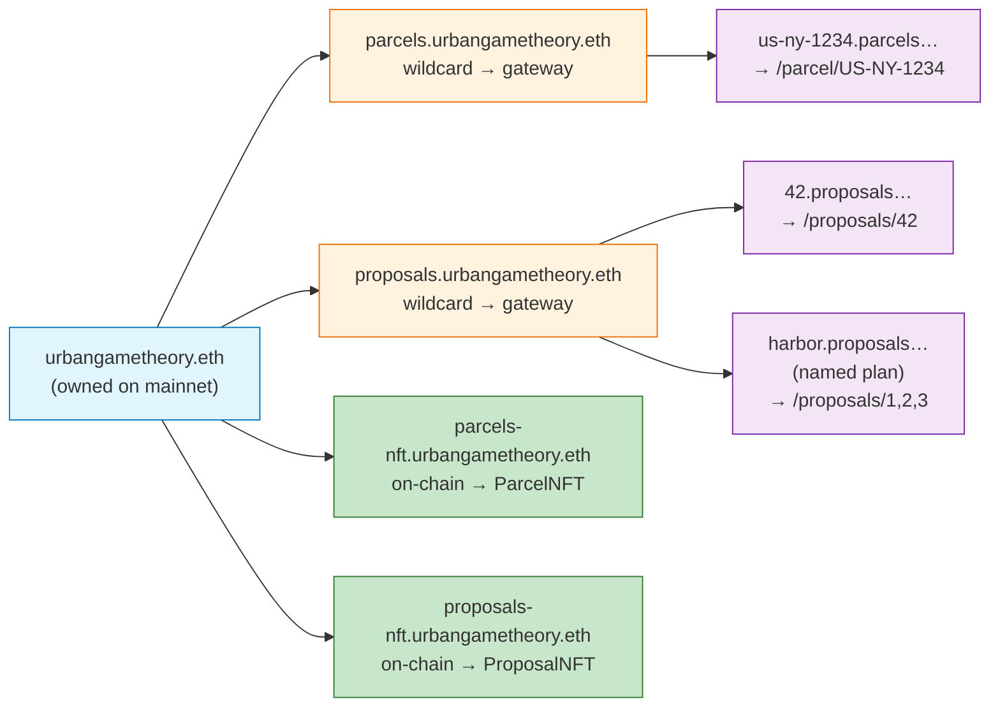
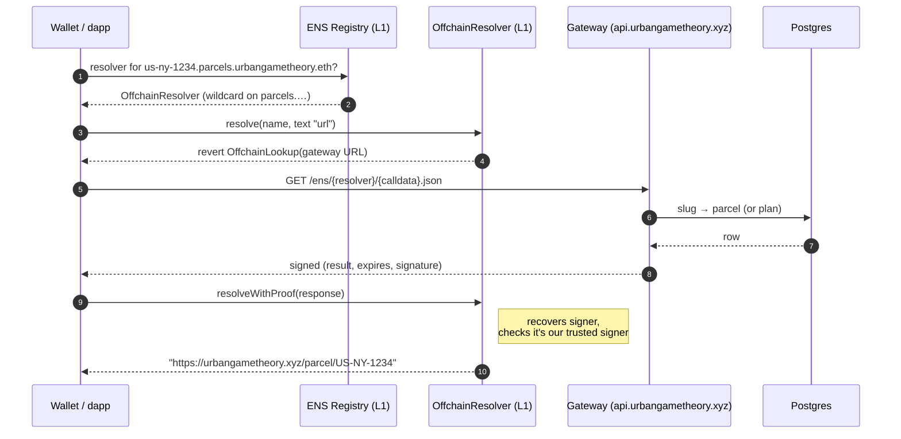
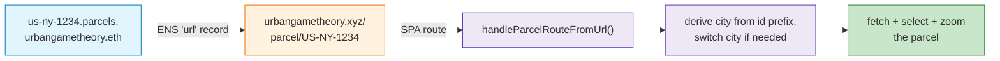
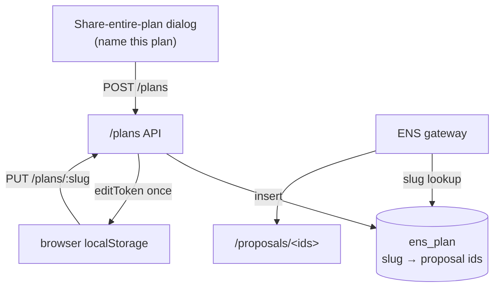
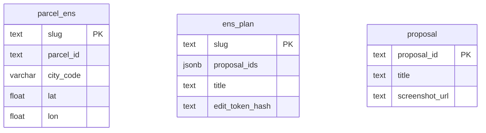

# ENS for Urban Game Theory — what we built & how it works

> A reader's guide, not the implementation spec. For build details, env vars, and
> open work see [`feature-ens.md`](./feature-ens.md).

## Overview

Every parcel, every minted proposal, and the NFT contracts now have **human-readable
ENS names** under `urbangametheory.eth`. A name like
`us-ny-1234.parcels.urbangametheory.eth` is a real mainnet ENS name you can paste into
any wallet or explorer — and resolving it **deep-links into the app** and selects that
parcel on the map. The name is also shown right in the app: a compact ENS line on the
parcel info panel, on every minted-proposal card, and in the proposal details panel — the
"ENS ↗" chip opens the name on `app.ens.domains`, and clicking the name copies it.

The clever part: there are **40,000+ parcels** and a growing number of proposals, and
**none of them are individually registered on-chain**. Instead one wildcard name resolves
*all* of them through an off-chain gateway, using ENS's CCIP-Read standard. New parcels
and proposals are nameable the moment they exist — zero per-item transactions.



## What you can resolve

| ENS name | Resolves to | How |
|---|---|---|
| `<slug>.parcels.urbangametheory.eth` | `/parcel/<parcelId>` — opens + zooms the parcel | wildcard gateway |
| `<id>.proposals.urbangametheory.eth` | `/proposals/<id>` — a minted proposal | wildcard gateway |
| `1-2-3.proposals.urbangametheory.eth` | `/proposals/1,2,3` — a chain of proposals | wildcard gateway |
| `<name>.proposals.urbangametheory.eth` | a **named plan**'s proposals (mutable) | wildcard gateway + DB |
| `parcels-nft.urbangametheory.eth` | the ParcelNFT contract address | plain on-chain record |
| `proposals-nft.urbangametheory.eth` | the ProposalNFT contract address | plain on-chain record |

Each parcel/proposal name also carries `text` records: `url` (the deep link),
`description` (e.g. *"Parcel US-NY-1234 in New York"*), and where available `geo` /
`avatar`.

## Key concepts

- **ENS name / subname** — `urbangametheory.eth` is the name we own. `parcels.…` is a
  *subname*; `us-ny-1234.parcels.…` is a subname of that.
- **Apex vs children** — the *apex* is a name itself (`parcels.urbangametheory.eth`); its
  *children* are everything below it (`*.parcels.urbangametheory.eth`).
- **Wildcard resolution (ENSIP-10)** — a resolver set on `parcels.…` answers for *all*
  children, so we don't register each parcel.
- **CCIP-Read (ERC-3668)** — the standard that lets an on-chain resolver say *"ask this
  HTTPS gateway,"* then cryptographically verify the gateway's signed answer. This is how
  40k names resolve without 40k registrations.
- **Slug** — an ENS-safe label derived from a parcelId (`HR-335258-4341/2` →
  `hr-335258-4341-2`, since `/` isn't allowed in ENS labels).

## How a name resolves (the CCIP-Read flow)

When a wallet resolves `us-ny-1234.parcels.urbangametheory.eth`, ENS finds no resolver on
that exact node and walks **up** to `parcels.urbangametheory.eth`, whose resolver is our
**OffchainResolver**. That resolver doesn't store records — it bounces the query to our
gateway and verifies the signed reply.



The gateway signs every answer with a private key whose address is registered as the
resolver's **trusted signer**, so a tampered or spoofed response is rejected on-chain.

## From a name to the map (deep links)

The `url` text record points at a normal app URL. A small SPA route turns that into a
selected, zoomed parcel.



(Proposals reuse the app's existing `/proposals/<id>` route.)

## Named plans

A "plan" is just a set of proposals (the app shares them as `/proposals/1,2,3`). From the
**Share entire plan** dialog you can give that set a memorable, globally-unique name —
`harbor-redevelopment.proposals.urbangametheory.eth` — which resolves to the plan's
proposals. Unlike a raw id list, a named plan is **mutable**: the creator gets a one-time
edit token (stored in the browser) and can re-point the name at a different set later, no
wallet required.



## Data the gateway reads



- `parcel_ens` — slug → parcelId for every parcel (populated per city; NYC = 42,120 rows).
- `ens_plan` — named plans (slug → proposal id list, mutable, edit-token gated).
- `proposal` — existing app table; used to enrich a proposal/plan name's `description`/`avatar`.

## On-chain pieces

| Thing | Address (mainnet) | Role |
|---|---|---|
| `urbangametheory.eth` owner | `0x15731543…8C06` | owns the name; sets resolvers/subnames |
| Hybrid OffchainResolver | `0x72684C77…1a4B` | resolves apex records **on-chain**, children via gateway |
| Gateway signer | `0x870e9b35…ff57` | signs gateway answers; trusted by the resolver |

`parcels.urbangametheory.eth` and `proposals.urbangametheory.eth` both point at the one
hybrid resolver, so a single contract + single gateway serve both namespaces.

**Apex on-chain (Option B, built).** The resolver is a *hybrid*: for the apex names themselves
it returns records stored **on-chain** (no gateway), so `parcels.urbangametheory.eth` resolves
to the ParcelNFT contract (`addr`) + a description, and `proposals.urbangametheory.eth` to the
ProposalNFT — the namespace root doubles as the contract's name. Wildcard *children* (with no
on-chain record) still fall through to the gateway. (A superseded resolver `0x874a520C…572F`
and the earlier separate `parcels-nft` / `proposals-nft` names are now redundant.)

## Why this design

- **No per-item registration** — wildcard + CCIP-Read means every parcel/proposal is
  nameable for free, instantly, including future ones.
- **Trust-minimised** — answers are signed and verified on-chain; the gateway can't forge
  records, only serve them.
- **Cheap to evolve** — names, records, and named plans live in Postgres and code, not in
  thousands of transactions. The only on-chain actions were deploying one resolver and
  pointing a few names at it.

The apex `addr` records are set under both the ETH coinType (60) and the **ENSIP-11 coinType for
Base Sepolia** (`0x80014A34`, where the contracts actually live), so chain-aware clients get the
right answer.

## Future options (not built)

- `ownerOf`-based `addr` records on individual parcel/proposal names, more cities in `parcel_ens`,
  named-plan abuse controls (wallet-ownership), and optional Durin L2 subname NFTs.
```
