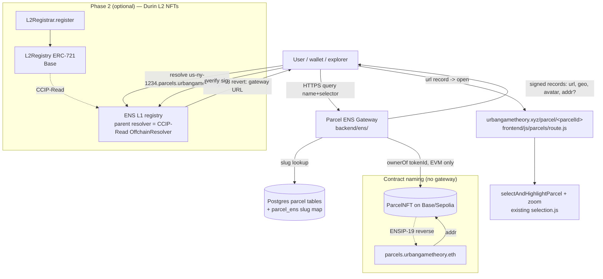

# Feature: ENS naming for parcels & contracts (EVM-only resolution layer)

Spec + brainstorm for giving every parcel a **human-readable, globally-unique ENS name** that
resolves to the parcel's page in the app, and for **naming the deployed contracts**. ENS is added
as a thin **EVM-only read layer that sits entirely outside the smart contracts** — no contract
changes, no Solana code touched. It reads the parcel data we already have (Postgres + on-chain
`ParcelNFT`) and exposes it under the ENS namespace.

> Status: **DRAFT — for review / brainstorm.** Implement after refinement (§9 decisions first).

---

## 1. Why

Every parcel today is identified by an opaque internal string (`US-NY-1234`, `HR-12345-678/9`) and
is only reachable by clicking around the map. ENS turns each parcel into a **human-readable,
globally-unique, shareable name** that **resolves to the parcel's page and selects/zooms it on the
map** — a real address you can paste into a wallet, explorer, chat, or link.

**Goal:** give each parcel a name like `us-ny-1234.parcels.urbangametheory.eth` that resolves to a
live deep link (`urbangametheory.xyz/parcel/<parcelId>`, §4.5) carrying the parcel's location,
image, and (if minted) owner address. Plus: **name the deployed contracts**
(`parcels.urbangametheory.eth` → the `ParcelNFT` address) so they show a name in explorers/wallets.

The mechanism: **`*.parcels.urbangametheory.eth` resolves any of the ~40k+ parcels across every
city** via a CCIP-Read wildcard resolver backed by our existing Postgres — **zero per-parcel
minting required** — with the contracts carrying primary names. We own `urbangametheory.eth` on
mainnet, so the namespace lives under it.

---

## 2. What ENS gives us (the parts we use)

ENS maps **names → records**. A name can resolve to:
- **`addr`** records (ETH + other coin types) — a wallet/contract address,
- **text records** (ENSIP-5): `url`, `description`, `avatar`, `geo` (lat/lon), arbitrary keys,
- **`contenthash`** — an IPFS/Arweave/etc. pointer to content,
- **reverse / primary name** (ENSIP-19) — address → name, incl. cross-chain for contracts.

Two ways to issue the *huge* number of subnames we need without registering each on L1:

### 2.1 Offchain / wildcard resolution — CCIP-Read (ERC-3668 + ENSIP-10) ← **recommended core**
A parent name (`parcels.urbangametheory.eth`) gets a **CCIP-Read resolver** on L1. Any lookup of
`<anything>.parcels.urbangametheory.eth` (at **any depth** — ENSIP-10 wildcard) is bounced to an
**HTTP gateway we run**, which computes the records on the fly and returns a signed response the
resolver verifies.

- **No per-parcel transaction.** All 40k+ parcels (every city) are instantly resolvable the moment
  the gateway is live. New parcels are covered automatically.
- **Arbitrary hierarchy is free** → both flat `us-ny-1234.parcels.urbangametheory.eth` and deeper
  `us-ny-1234.nyc.parcels.urbangametheory.eth` are parsed by the gateway — so a city-scoped variant
  costs nothing if we want it (§4.1).
- Records are **derived from our DB / chain reads** at request time (deep-link `url`, `geo`,
  `avatar` = parcel image, `addr` = `ParcelNFT.ownerOf` if minted).
- Trade-off: subnames are **not NFTs**, don't show in wallets, and the gateway is a (signed) server
  we operate. Fine for "name → page" UX; not for "trade the parcel-name itself."

Refs: [ENS subnames docs](https://docs.ens.domains/web/subdomains/),
[ERC-3668 / CCIP-Read](https://eco.com/support/en/articles/10944302-what-is-erc-3668-ccip-read).

### 2.2 Onchain L2 subnames — Durin ← **optional / phase 2 (premium parcels)**
[Durin](https://durin.dev) ([github](https://github.com/namestonehq/durin), by NameStone) is the
opinionated way to issue **L2 subnames as ERC-721 NFTs**. It deploys three contracts and hosts the
L1 resolver + gateway for you:
- **L2Registry** — ERC-721 on an L2 (Base/Optimism/Arbitrum/…); each subname is an NFT holding its
  own addr/text/contenthash records.
- **L2Registrar** — customizable mint logic (`register()`, pricing, allowlist, token-gating).
- **L1Resolver** — forwards L1 queries to the L2 registry via CCIP-Read.

Trade-off for us: **one tx per subname.** Minting 40k subname NFTs (even on cheap L2) is a lot and
duplicates `ParcelNFT` (which is *already* an ERC-721 of parcels). So Durin is **not** the right
tool for "name every parcel," but it's a great **phase-2** story for **claimed/premium parcels**
("mint your parcel's ENS name as an NFT") and it's the same `Base Sepolia` we already deploy to.

**Decision (see §4.2):** ship §2.1 (offchain wildcard) for full coverage; keep Durin as an optional
upgrade path for individually-claimed parcels.

---

## 3. Current architecture (what we're plugging into)

(Findings verified against the repo.)

- **ONE global contract set per chain — not city-specific.** `blockchain/contracts/ParcelNFT.sol`
  (ERC721Enumerable, "Urban Game Theory Parcel"/`UGTP`) + `ProposalNFT.sol`. Live EVM deployments:
  **Base Sepolia (84532)** and **Ethereum Sepolia (11155111)** in `frontend/contracts/addresses.json`;
  plus a Solana program set. City is encoded in the **string `parcelId`**, and
  `tokenId = uint256(keccak256(parcelId))`, so **parcel IDs are globally unique already.**
- **Parcel ID formats** (city-prefixed strings): Zagreb `HR-<maticni_broj_ko>-<broj_cestice>`
  (e.g. `HR-12345-678/9` — note the `/`), New York `US-NY-<swis_sbl_id>`, Buenos Aires SMP string.
  Generated in `blockchain/scripts/mint-parcels-*.js`; normalized in `frontend/js/parcels/parcel-id.js`.
- **Frontend = single-page vanilla JS app** at one URL. City is a **query param** `?city=<code>`
  (`frontend/js/city-config.js` `CITY_QUERY_MAP`: `ba/bg/zg/lj/co/ny`, default `new_york`). Parcel
  selection is **client state** (`window.selectedParcelId`, `frontend/js/parcels/selection.js`
  `selectAndHighlightParcel`) — **there is no per-parcel URL route today.** Proposals *do* have
  path routing (`/proposals/<id>` via `frontend/js/proposals.js handleProposalRouteFromUrl`) — that
  is the pattern to copy for parcel deep-links.
- **Multi-chain seam:** EVM keys off numeric `chainId` (`normalizeChainId()` in
  `frontend/js/contracts-loader.js`, `chain-data-loader.js`); Solana is a parallel stack keyed by
  the literal `'solana'` (`frontend/js/solana/*`). Wallets merged in `frontend/js/wallet-connection.js`.
  **No Canton in the repo.**

**Implication:** ENS attaches at the *data layer* (parcel exists in Postgres regardless of chain)
and the *EVM frontend layer* only. The flat global `*.parcels.urbangametheory.eth` namespace works precisely
because parcel IDs are already global + city-prefixed.

---

## 4. Design

### 4.1 Naming scheme — `<slug>.parcels.urbangametheory.eth` (flat, human-readable)
Parent is **`parcels.urbangametheory.eth`** (we own `urbangametheory.eth` on mainnet). With offchain
wildcard (§2.1) the subname depth is free, so the design choice is just flat vs city-scoped:

```
<parcel-slug>.parcels.urbangametheory.eth        e.g.  us-ny-1234.parcels.urbangametheory.eth
                                                       hr-12345-678-9.parcels.urbangametheory.eth
```

- **Flat is canonical** — the slug **already carries the city prefix** (`us-ny-`, `hr-`), so an extra
  `nyc.` level would be redundant *and* push the name to 5+ labels. The gateway derives the city from
  the prefix.
- City-scoped (`<slug>.<city>.parcels.urbangametheory.eth`, `<city>` = the 2-letter code from
  `CITY_QUERY_MAP`) can be supported as an **accepted alias** if we want the city visible in the
  name — but it's not the default. (Decision in §9.)

**Label encoding (important — ENSIP-15 normalization).** ENS labels are lowercase and cannot contain
`/`, spaces, etc. `HR-12345-678/9` is **not** a valid label. The gateway owns a deterministic,
reversible slug:
```
slug(parcelId) = lowercase(parcelId) with every run of non-[a-z0-9] → "-"
  HR-12345-678/9  ->  hr-12345-678-9
  US-NY-1234      ->  us-ny-1234
```
To guarantee reversibility/uniqueness, the gateway keeps a small **`parcel_ens` lookup**
(`slug PRIMARY KEY, parcel_id, city_code`) populated from existing parcel tables — so name→parcel
is an indexed lookup, not fragile string surgery. (Collisions across the slug fn are caught at
populate time and disambiguated; expected to be none given the prefixes.)

### 4.2 Resolution backend — offchain CCIP-Read wildcard gateway (core), Durin optional
Per §2: ship the **wildcard gateway** for full, mint-free coverage of all parcels in all cities;
treat **Durin L2 NFTs** as an optional phase-2 for individually-claimed/premium parcels. Both can
coexist (Durin handles specific minted labels; the wildcard gateway answers everything else).

### 4.3 Records returned per parcel (the payload that makes it useful)
For `<slug>.parcels.urbangametheory.eth` the gateway returns:
| Record | Value | Source |
|---|---|---|
| `text("url")` | `https://urbangametheory.xyz/parcel/<parcelId>` (deep link, §4.5) | derived |
| `text("description")` | `Parcel <parcelId> in <CityName>` + area | DB |
| `text("geo")` | `lat,lon` of parcel centroid (ENSIP geo convention) | `ST_Centroid` |
| `text("avatar")` | parcel image (existing IPFS/Walrus image URL, or rendered SVG) | DB/storage |
| `addr(60)` (ETH) | `ParcelNFT.ownerOf(tokenId)` **if minted on this chain**, else omit (or contract addr) | chain read |
| `contenthash` | *(optional)* IPFS metadata pointer if present | DB |

`addr` is **best-effort and EVM-only**: minted-on-EVM → owner; minted-on-Solana or unminted → omit
`addr` (a parcel isn't required to have an Ethereum address). The name still resolves its `url`/geo/
avatar, so the UX (name → page) works for **every** parcel regardless of mint state or chain. This
is the graceful-degradation seam that keeps Solana/Canton-free design intact.

### 4.4 Contract naming (`parcels.urbangametheory.eth` → ParcelNFT)
The parcel-namespace root **is** the contract's name — a clean story: `parcels.urbangametheory.eth`
resolves to the `ParcelNFT` contract, and `<id>.parcels.urbangametheory.eth` are the parcels under it.
- **Forward record:** the gateway returns `addr = ParcelNFT` for the **apex** name
  `parcels.urbangametheory.eth` (the resolver already routes the apex through CCIP-Read; the apex is
  just a special case in the gateway). `proposals.urbangametheory.eth` → `ProposalNFT` likewise. We
  can expose the right address per chain (multichain addr / per-network subnames like `base.parcels.…`).
- **Primary (reverse) name:** optionally set the **contract's primary name** via ENSIP-19 cross-chain
  reverse resolution so explorers/wallets self-identify the contract as `parcels.urbangametheory.eth`.

### 4.5 Deep-link route (`/parcel/<parcelId>`) — make the resolved `url` actually select the parcel
Today selection is client state with no URL. Add SPA route handling **mirroring the existing
`/proposals/<id>` route** (`frontend/js/proposals.js handleProposalRouteFromUrl`):
- Canonical form is **`/parcel/<parcelId>`** — namespaced exactly like `/proposals/`, so it drops
  into the same routing pattern with **no collision** with other top-level paths, static files, or
  the `kako-koristiti*.html` pages. The city is **derived from the globally-unique ID prefix**
  (`US-NY-` → `ny`, `HR-` → `zg`, …), so it doesn't need to be in the URL. (`/<city>/<parcel>` was
  considered and rejected: the city is redundant and a root-level `/<city>` segment is collision-
  prone; bare `/<parcel>` at root is the most fragile catch-all.)
- A new `frontend/js/parcels/route.js` `handleParcelRouteFromUrl()` parses the path on load, sets
  `?city=<code>` for the derived city, waits for that city's parcel layer, then calls
  `selectAndHighlightParcel(parcelId)` + zooms — reusing `navigateToCity()` and the existing
  selection/highlight code. No new selection logic, just a URL entry point.
- The static host rewrites unknown `/parcel/*` paths to `index.html` (SPA fallback), same as
  `/proposals/*` today. The gateway emits `https://urbangametheory.xyz/parcel/<parcelId>` as the
  `url` record.

### 4.6 The parent name & resolver (L1)
- We own **`urbangametheory.eth`** on mainnet. Create the subname **`parcels.urbangametheory.eth`**
  and use it as the wildcard parent.
- Set `parcels.urbangametheory.eth`'s **resolver to our CCIP-Read resolver** (deploy an
  ENSIP-10/ERC-3668 `OffchainResolver` pointing at our gateway URL + signer pubkey), using the
  standard `@ensdomains` CCIP-Read offchain-resolver pattern. Durin can also provision the L1
  resolver if we go that route for the contract/premium names.
- The gateway signs responses with a key the resolver trusts; rotate via resolver config.

### 4.7 EVM-only isolation (don't touch Solana / don't assume Canton)
- **Contracts:** zero changes (EVM or Solana). ENS reads existing state only.
- **Backend gateway:** a **new, standalone service/route**; reads Postgres parcel tables that exist
  irrespective of chain. EVM chain reads (`ownerOf`) are isolated to the `addr` enrichment and are
  wrapped so a Solana-only / unminted parcel simply omits `addr` — never throws into other paths.
- **Frontend:** a new `frontend/js/ens/` module, **lazy and additive**. ENS name display/resolution
  is gated to EVM context (`normalizeChainId()` numeric) and **must not import or alter**
  `frontend/js/solana/*` or the shared selection code beyond adding the route entry point. If ENS is
  disabled by config, the app behaves exactly as today.
- **Config flag** `ENS_ENABLED` (frontend + backend) defaults safe; the namespace/gateway can be
  shipped dark and flipped on when ready.

---

## 5. Architecture



---

## 6. Impact summary (files to add / change)

**New**
- `backend/ens/gateway.js` (+ `index.js`) — CCIP-Read gateway: resolve `name+selector` → signed
  records; slug→parcel lookup; `addr` via EVM `ownerOf` (best-effort).
- `backend/ens/slug.js` — `slug(parcelId)` + `parcel_ens` populate/lookup helpers.
- `backend/routes/ens.js` *(or standalone service)* — HTTP endpoint the resolver calls.
- `db/parcel-ens-ddl.sql` — `parcel_ens(slug PK, parcel_id, city_code, created_at, updated_at)`.
- `frontend/js/parcels/route.js` — `handleParcelRouteFromUrl()` for `/parcel/<parcelId>` deep links.
- `frontend/js/ens/` — name display/format + (optional) resolve-name-in-search; EVM-gated.
- `blockchain/contracts` *(or Durin-provisioned)* — `OffchainResolver` (L1) config; optional Durin
  L2Registry/Registrar for phase 2.
- `blockchain/scripts/ens-setup.js` — set parent resolver, contract `addr` records, primary names.
- Tests (see §8).

**Changed (additive; no behavior change when `ENS_ENABLED` is off)**
- `backend/index.js` — wire the ENS route/service.
- `frontend/js/app bootstrap` (where `handleProposalRouteFromUrl` is called) — also call
  `handleParcelRouteFromUrl()`.
- Static host / nginx — SPA fallback rewrite for `/parcel/*` (same as the existing `/proposals/*`).
- `readme.md`, `.env.example` — ENS section + new vars.

**Unchanged (intentionally)**
- **All smart contracts** (EVM + Solana) — ENS reads existing state only.
- All `frontend/js/solana/*` and shared selection logic (beyond the additive route entry point).
- DB parcel tables — `parcel_ens` is a thin additive index, not a schema change to parcels.

---

## 7. Config (env)

```
# Backend / gateway
ENS_ENABLED=true
ENS_PARENT_NAME=parcels.urbangametheory.eth      # the wildcard parent we control
ENS_GATEWAY_URL=https://api.urbangametheory.xyz/ens/{sender}/{data}.json
ENS_GATEWAY_SIGNER_KEY=0x...                      # signs CCIP-Read responses (keep in .env only)
ENS_ADDR_CHAIN_ID=84532                           # which EVM deployment to read ownerOf from
ENS_PUBLIC_BASE_URL=https://urbangametheory.xyz   # for building url records / deep links

# Frontend (injected via existing config path, like getBackendBase)
ENS_ENABLED=true
ENS_PARENT_NAME=parcels.urbangametheory.eth
```
Signer key lives only in `.env` (never committed). Parent `parcels.urbangametheory.eth` lives on
mainnet; `ENS_ADDR_CHAIN_ID` selects which EVM deployment supplies `ownerOf`.

---

## 8. Testing

- **Unit (gateway):** `slug()` round-trips all three ID formats incl. the `/` case; resolver query
  decode → correct records; missing parcel → proper CCIP-Read "not found"; `addr` enrichment omitted
  cleanly when `ownerOf` reverts (unminted) or chain is Solana.
- **Signature:** gateway response verifies against the resolver's trusted signer (use the
  `@ensdomains` CCIP-Read test harness pattern).
- **Resolution integration:** point the parent's ENSIP-10 resolver at the gateway, resolve
  `us-ny-1234.parcels.urbangametheory.eth` via a public client (viem/ethers) → assert `url`, `geo`,
  `avatar`, and `addr` (for a known minted parcel).
- **Deep-link route:** loading `/parcel/<parcelId>` selects + zooms the parcel (Playwright/agent-browser
  against the running frontend), incl. the city correctly derived from the ID prefix.
- **Isolation:** with `ENS_ENABLED=false` the app and Solana flows behave exactly as today (no new
  imports execute); Solana-minted/unminted parcel names still resolve url/geo/avatar (no `addr`).
- **Contract naming:** `ens-setup.js` sets `addr` on `parcels.…` → forward resolves to the contract;
  primary name shows on the explorer (manual check on testnet).

---

## 9. Open questions (resolve during refinement)

1. **City-scoped alias?** Flat `<slug>.parcels.urbangametheory.eth` is canonical (slug already carries
   the city prefix). Do we *also* accept the city-scoped alias `<slug>.<city>.parcels.urbangametheory.eth`,
   or flat only? (Gateway can do both at no cost.)
2. **`addr` semantics:** for minted parcels, point `addr` at the **owner** (changes on transfer) or
   at the **ParcelNFT contract** (stable, but identical for all parcels)? Recommend owner; omit if unminted.
3. **Durin phase 2?** Ship offchain wildcard alone (covers every parcel), or also stand up Durin on
   Base for a "claim your parcel as an NFT name" upgrade? (Extra contracts + per-name minting — only
   worth it if claimable/tradeable parcel names are a product goal.)
4. **Which chain for `ownerOf`:** Base Sepolia vs Ethereum Sepolia — pick the live deployment
   (`ENS_ADDR_CHAIN_ID`), or try multiple and prefer first hit.
5. **Gateway hosting:** co-locate with the existing API (`api.urbangametheory.xyz/ens/…`) — confirm
   it can serve the ERC-3668 JSON shape and is reachable for CCIP-Read.
6. **Reverse for parcels:** do we want address→name (reverse) for parcel *owners*, or only the
   forward name→page + contract primary names? (Reverse adds little for the core UX.)

---

## 10. Phased implementation plan

1. **Namespace + gateway (core):** `parcel_ens` table + `slug()`; `backend/ens/` gateway returning
   signed records from Postgres (`url`/`geo`/`avatar`/`description`); unit + signature tests.
2. **L1 resolver wiring:** deploy/point an ENSIP-10 CCIP-Read `OffchainResolver` for the parent at
   the gateway + signer; resolve a parcel name end-to-end from a public client (testnet).
3. **`addr` enrichment (EVM-only):** add best-effort `ownerOf` lookup, omit gracefully when
   unminted/Solana.
4. **Deep-link route:** `frontend/js/parcels/route.js` so the resolved `url` selects + zooms the
   parcel; SPA fallback config.
5. **Contract naming:** `ens-setup.js` sets `addr` records + primary names for `ParcelNFT`/`ProposalNFT`.
6. **(Optional) Durin phase 2:** L2Registry/Registrar on Base Sepolia for claimable parcel-name NFTs.
7. **Verify + docs:** resolve `us-ny-1234.parcels.urbangametheory.eth` in a wallet/explorer → opens
   the parcel selected on the map; README ENS section, `.env.example`, screenshots.

---

## 11. Implementation status (built so far)

Phases 1, 3 (deep-link), and the gateway core are **implemented, tested, and verified locally**.
The L1 resolver + contract naming (mainnet) and the optional Durin phase remain.

### Built

| Area | Files | Notes |
|---|---|---|
| Deep-link route | `frontend/js/parcels/route.js`; wired in `frontend/index.html`; `navigateToCity` exposed in `frontend/js/city-config.js` | `/parcel/<parcelId>` (and `?parcel=`); derives city from id prefix, switches city preserving the path, then fetch+select. Verified live (incl. Zagreb's `/`). |
| Slug + city map | `backend/ens/slug.js` | `parcelToSlug()` (ENSIP-15-safe) + `parcelIdToCity()`. 13 unit tests. |
| CCIP-Read gateway | `backend/ens/gateway.js`, `backend/routes/ens.js`; wired in `backend/index.js` | `GET /ens/{sender}/{data}.json`; signs ENS `SignatureVerifier` responses. `text(url/description/geo/avatar)`, `addr`, apex. 11 tests incl. recovered-signer checks. Dark (503) until `ENS_GATEWAY_SIGNER_KEY` set. |
| Mapping table | `backend/ens/parcel-ens-ddl.sql` | `parcel_ens(slug PK, parcel_id, city_code, …)`; geo/avatar/token columns nullable for later enrichment. |
| Populate | `backend/ens/populate-parcel-ens.js` | CLI, restartable, progress/ETA. NYC source live (42,120 rows, 0 collisions). Add cities via the `CITY_SOURCES` registry. |

Dependency added: **`ethers@^6`** in `backend/`.

### Env vars (backend `.env`; `.env*` is gitignored — set per environment)

```
ENS_GATEWAY_SIGNER_KEY=0x...      # signs CCIP-Read responses; MUST match the resolver's trusted signer. Gateway is dark (503) without it.
ENS_PARENT_NAME=parcels.urbangametheory.eth
ENS_PUBLIC_BASE_URL=https://urbangametheory.xyz   # http://localhost:8080 in local dev — builds the url record / deep link
# ENS_TTL_SECONDS=300
# Optional addr (ownerOf) — leave unset until the ParcelNFT chain is confirmed:
# ENS_ADDR_RPC_URL=...
# ENS_PARCEL_NFT_ADDRESS=0x...
```

### How to run (LOCAL — host localhost:5432 may tunnel to prod, so go through the container)

```bash
# 1) apply the table
docker exec -i consensus-builder-db-1 psql -U zagreb_user -d zagreb < backend/ens/parcel-ens-ddl.sql
# 2) populate (dry-run first, then real)
docker compose exec backend node ens/populate-parcel-ens.js --city=ny --dry-run --limit=20
docker compose exec backend node ens/populate-parcel-ens.js --city=ny
# 3) set ENS_* in backend/.env, restart backend, resolve a name via the gateway
```

For **production**, the same steps run against the prod DB/host, the gateway must be publicly
reachable (e.g. `https://api.urbangametheory.xyz/ens/{sender}/{data}.json`), and `ENS_PARENT_NAME`
must match the on-chain parent — then do §12.

### Verified locally
- 42,120 NYC slugs populated (0 collisions); gateway lookup SQL matches the real table.
- Live `GET /ens/{sender}/{callData}.json` → HTTP 200, `url` record `…/parcel/US-NY-…`, and the
  response signature **recovers to the configured signer**. Full backend suite: 474 passed.

## 12. L1 resolver & contract naming

**Live on prod (Step 2 done):** backend branch `2026-nyc-ens` deployed to `do`; gateway at
`https://api.urbangametheory.xyz/ens/{sender}/{data}.json`; 42,120 NYC rows in prod `parcel_ens`.
Prod gateway signer address: **`0x870e9b35D48702E2B20E3ebF604763e2F4E4ff57`** (key lives only in
prod `backend/.env`).

**Mainnet OffchainResolver (Step 3 done):**
- Address: **`0x874a520C1D2c395F19a3c8eC3eb51fAb6e08572F`** (mainnet)
- `url()` = the gateway URL; `signers(0x870e…)` = true; `owner()` = deployer `0xfCF94DD4…1A45`.
- Deployed via `npm run deploy -- --network mainnet --tags OffchainResolver`. Note: hardhat-deploy's
  ethers-v5 internals choke formatting contract-creation tx responses from RPCs that return `to:""`
  (e.g. publicnode) — the tx still mines; verify the CREATE address on-chain. `hardhat.config.ts`
  mainnet `url` now defaults to the live Alchemy host and honors `MAINNET_RPC_URL`.

**Step 4 — point the name at the resolver (pending; needs the `urbangametheory.eth` owner wallet
`0x15731543…8C06`, which is NOT the deploy wallet):**
- `scripts/ens-set-parcels-resolver.mjs` — creates `parcels.urbangametheory.eth` and sets its
  resolver to the OffchainResolver in one `ENS registry.setSubnodeRecord` tx. Requires
  `ENS_OWNER_PRIVATE_KEY` (the name owner). Or do it in the ENS app: add subname `parcels`, set its
  resolver to `0x874a520C1D2c395F19a3c8eC3eb51fAb6e08572F`.

**Step 5 (pending):** resolve `us-ny-….parcels.urbangametheory.eth` from a mainnet client end-to-end.

**Later:** `ens-setup.js` (apex `addr` → `ParcelNFT`, `proposals.…` → `ProposalNFT`, ENSIP-19 primary
names); wire `ownerOf` (confirm ParcelNFT chain); populate other cities; optional Durin L2 NFTs.
