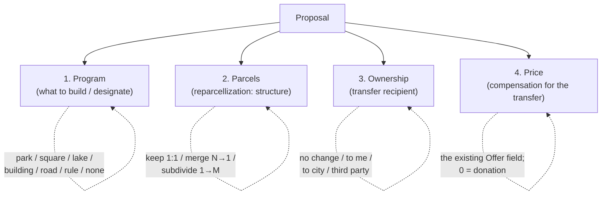

# Proposal goals → orthogonal facets

Reorganizing the "Create Proposal" dialog so a proposal is described by a few
**independent facets** instead of one overloaded list of nine buttons.

## Why

The current dialog has a single **"Proposal Goal"** section with nine buttons
(`square`, `park`, `lake`, `single`/Building(s), `road-track`, `decide-later`,
`urban-rule`, `reparcellization`, `ownership-transfer`). That single list quietly
mixes **three unrelated questions**:

1. **What gets built / designated** on the land (park, square, building, road, rule…).
2. **How the parcels are restructured** (kept, merged, subdivided).
3. **Who ends up owning the land, and for how much** (purchase, sale, donation, transfer).

Because all three are crammed into one enum, several buttons are really the *same*
operation wearing different costumes, and some combinations can't be expressed at all:

- **`decide-later`** is not a goal — it's "acquire the parcels + **merge** them into one,
  decide the use later." It's named after *time* but its mechanic is *consolidation*.
- **`reparcellization`** (subdivide, N→M) and **`decide-later`** (merge, N→1) are the
  **same operation** at different input/output cardinality. They live in different code
  paths with asymmetric names.
- **`ownership-transfer` to-me / from-me** and the implicit "purchase" baked into every
  build goal are all the **same primitive**: a transfer of ownership from A to B at price P.
  "to-me"/"from-me" only exist because the proposer is hardwired as one side.
- "Buy three lots, merge them, build a tower" — acquire + merge + building — **can't be
  expressed today**; you'd have to abuse `decide-later` or file multiple proposals.

The taxonomy is also fragmented in code: there is **no single source-of-truth** for goals —
three different normalizers (`normalizeProposalGoalKey`, `normalizeGoalKey`,
`ProposalManager._normalizeGoalKey`), three label maps (`goalLabels`,
`PROPOSAL_GOAL_ICON_MAP`, the `generateDefaultProposalName` map), and dual
`data-proposal-tool` / `data-proposal-type` attributes on every button.

## The model: a proposal = up to four orthogonal facets



Each facet defaults to a no-op, so a trivial proposal stays trivial, and every one of the
old nine buttons becomes a *combination*:

| Old button | Program | Parcels | Ownership | Price |
|---|---|---|---|---|
| Park / Square / Lake | that use | **Merge** | **To city** (default) | offer |
| Building(s) | building | No change (locked) | To me | offer |
| Road/Track | road | **Merge** | **To city** | offer |
| Urban Rule | urban-rule | Keep as-is | No change | — |
| **Reparcellization** | none | **Readjust** | Per slice | offer |
| **Decide later** | none | **Merge** | To me | offer |
| Ownership transfer *to me* | none | No change | **To me** | offer |
| Ownership transfer *from me* (sale) | none | No change | **Third party · Anyone** | asking price |

- **`decide-later` disappears** → it's just `Parcels: Merge` with no program. The awkward
  name goes; the consolidation operation stays.
- **Merge + Subdivide unify** under Parcels as the two cardinalities of *reparcellization*
  (`Keep as-is` is the third — identity, 1:1).
- **Acquire / to-me / from-me / sale unify** under Ownership as `recipient + price`;
  the direction is *derived* from where the proposer sits, not a separate concept.

### Program drives the defaults

Picking a Program pre-sets the other facets to the common case (all overridable):

| Program | Parcels | Ownership | Rationale |
|---|---|---|---|
| Park | Merge | To city | Public good; consolidate the footprint, public owner |
| Square | Merge | To city | "" |
| Lake | Merge | To city | "" |
| Road/Track | Merge | To city | Infrastructure is typically municipal |
| Building(s) | No change (locked) | To me | Build on parcels as-is, like Urban Rule; no merge/subdivide |
| Urban Rule | Keep as-is | No change | A regulation overlay, not a land transaction |
| None | Keep as-is | To me | Pure restructure/transfer ("decide later" lives here) |

### Price = the existing Offer field

Price is the **consideration** for the ownership transfer. We did **not** add a separate
Price control — it reuses the dialog's existing **Offer** field (with its currency select).
For a sell (Third party · Anyone) the Offer is the **asking price**; `0` expresses a
donation. It stays distinct from **build-funding / contributions** (the escrow pool that pays
to *execute* a proposal), which is a different money concept.

## Trust model (decisions, mostly for a later phase)

The reorg makes two trust levers *expressible*; enforcing them is staged.

**Recipient ≠ proposer, and the recipient must accept.** A public-good proposal can send
the land to the **City** rather than the proposer — removing the proposer's bait-and-switch
incentive. You can't force-gift: the recipient is simply **another required accepter** in
the existing acceptance flow (today only the current owners must accept). If the City
declines, the proposal **never executes** — it expires and escrow returns, exactly like the
current expired-proposal path; no parcel moves. This also makes the seller's acceptance
*implicitly conditional on the named terms*: an acceptance attestation is bound to a
specific proposal (recipient + use included), so "I'll sell only if the **City** takes it as
a **park**" is expressible for free.

**Covenant = constraint + evidence, not magic cross-jurisdiction law.** Optionally binding a
use to the output parcel ("must remain a park") is valuable as (a) an *in-system constraint*
the protocol honors on future change-of-use proposals, and (b) *cryptographic evidence of
contractual terms* — a signed, timestamped record that the buyer promised a park, which is a
strong exhibit in an ordinary breach-of-contract claim even where formal land covenants don't
run. We do **not** rely on the covenant being self-executing law. (Deferred — surfaced as a
disabled "bind this use" affordance in phase 1.)

## Facet → mechanics mapping (what executes)

The existing apply/mint mechanics are reused; the new facets route into them:

| Facet value | Existing mechanic | Where |
|---|---|---|
| Parcels: **Merge** | merge selected parcels → one child, hide parents | `_applyDecideLaterProposal` / `_mergeParcelGeometries` (`proposal-manager.js`) |
| Parcels: **Readjust** | split parents → N owner-share children | `_applyReparcellizationProposal` |
| Parcels: **Keep as-is** | auto-geometry from parcels, or drawn geometry | `buildGeometryFromParcels` / draw tools |
| Program: building / road / rule | structure / road / typology appliers | `_applyStructureProposal`, `_applyRoadProposal`, … |
| Ownership: recipient + Price | purchase/transfer offer + acceptance gating | `ownershipTransferProposal`, ProposalNFT accept flow |

A combination like Park + Merge + To-city runs the merge to produce the consolidated parcel,
assigns the program (park geometry/designation) to it, and records a transfer to the City at
the given price.

## Dialog layout (shipped)

The three facets are **persistent** — all visible until *Create Proposal* is clicked, never
collapsed away — so the proposer always sees (and consciously decides, or accepts the
defaults for) what happens to land use, parcels, and ownership.

```
┌─ Create Proposal ──────────────────────────────────────────┐
│  🟢 Jure                                              [×]   │  ← avatar + name (no box)
│  LAND USE                                                   │
│  [No change] [⛲️ Square] [🌳 Park] [🐟 Lake]               │  ← segmented pills, filled = selected
│  [🏠 Building(s)] [🛣️ Road/Track] [📜 Urban Rule]          │
│    ┌ inset (Building/Road/Urban Rule) ───────────┐         │
│    │ ✏️ Edit   ⬆️ Upload   (outlined actions)     │         │  ← subordinate, indented
│    └──────────────────────────────────────────────┘         │
│  PARCELS                                                    │
│  [No change] [🪡 Merge] [✂️ Readjust]                       │   (Merge disabled if 1 parcel)
│      — or, when locked —  🔒 No change · Building(s)         │  ← static line, not dead pills
│  OWNERSHIP                                                  │
│  [No change] [To me] [To city] [Third party]                │
│    ┌ inset (Third party) ─────────────────┐                 │
│    │ [Anyone] [Specific address]          │                 │  Anyone = open offer to sell
│    │ (0x… / name, only for Specific)      │                 │
│    └──────────────────────────────────────┘                 │
│  ───────────────────────────────────────────────────────── │  ← divider
│  Name / Description / Offer (price) / ▸ Options             │
│              [ Create proposal ]                            │
└────────────────────────────────────────────────────────────┘
```

(Default no-op base: No change / No change / No change — Create disabled until something is
chosen. Picking a Land use re-sets Parcels + Ownership per the matrix above.)

### Control vocabulary (visual convention)
- **Pills** = single-select state (Land use / Parcels / Ownership / Acquisition / typology);
  **filled blue = selected**.
- **Outlined, auto-width buttons** = *actions* (geometry Edit / Upload), kept distinct from
  the filled state pills, and placed inside an **inset** panel (indent + left accent + recessed
  bg) so they read as subordinate to the choice that opened them.
- **Locked facets** render as a quiet static line (`🔒 <value> · <reason>`) instead of a row
  of dead/disabled pills.
- The `decide-later`, standalone `ownership-transfer`, `reparcellization` buttons, and the
  locked single/multiple-owner box are **gone**; the `ownership-transfer` direction machinery
  is kept hidden and driven from the Ownership facet.

## Decisions (locked)

- **Naming**: the split operation is **"Readjust"** (N→M re-slicing) — not "Subdivide". Parcels
  options: **No change · Merge · Readjust**. Single term **"No change"** for the unchanged
  default across all three facets.
- **Forcing = lock-the-hard, default-the-soft**:
  - **Locked**: Park/Square/Lake/Road → Parcels **Merge** (but **No change** for a single
    parcel — nothing to merge); Parcels **Readjust** → Ownership **Per slice**;
    Urban Rule → Parcels **No change** + Ownership **No change**; Building(s) → Parcels **No
    change** (build on parcels as-is, like Urban Rule).
  - **Soft default**: Building(s) → Ownership **To me**; public-good uses → Ownership **To city**.
- **Sell flow**: Ownership **Third party** offers **Anyone** (default — an open offer to sell,
  routed to the `from-me` accepted-unfunded mechanic) or **Specific address** (directed
  transfer). The auto-title reflects the recipient ("Offer to sell", "Ownership transfer to
  city", …).
- **Single parcel**: **Merge** disabled (needs ≥2 parcels).

## Status — what's shipped vs deferred

**Shipped (this dialog):** the full facet UI and its **intent capture** — pills, locked-static,
insets, the constraint matrix, the sell flow, single-parcel guard, recipient-aware titles. On
submit the facets are mapped onto the **existing** goal-key machinery and recorded
(`proposal.facets`, `ownershipTransferProposal.recipient/recipientScope/recipientAddress`).

**Deferred — the execution layer has *not* caught up to the UI.** This is the honest gap:
- The submit **derives a legacy goal key** and the **apply/mint mechanics are unchanged**.
  So Park + Merge + To-city does *not* yet perform a true parcel merge **and** a city-ownership
  transfer at execution — much of the new semantics (recipient = city / third party, "offer to
  sell", per-slice ownership beyond the existing reparcellization path) is **recorded as
  metadata**, not enforced.
- **Recipient-as-required-accepter** (Phase 2) and **covenant / bound use** (Phase 3) are
  expressible in intent but **not enforced** on-chain or in-app.

In other words: the dialog now *captures* a clean, orthogonal intent; making every captured
combination *execute* faithfully (real merge+transfer, recipient acceptance, sale settlement,
covenants) is the remaining work. Treat the current state as clarified intent-capture, not a
fully-wired transaction engine.
