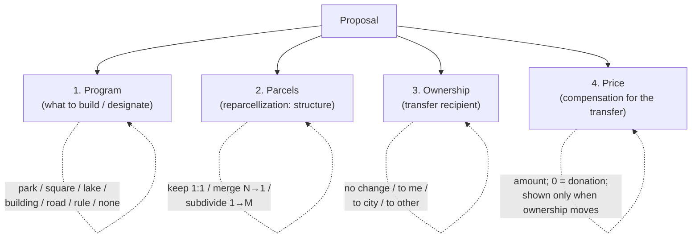

# Proposal goals → orthogonal facets

Reorganizing the "Create Proposal" dialog so a proposal is described by a few
**independent facets** instead of one overloaded list of nine buttons.

## Why

The current dialog has a single **"Proposal Goal"** section with nine buttons
(`square`, `park`, `lake`, `single`/Building(s), `road-track`, `decide-later`,
`urban-rule`, `reparcellization`, `ownership-transfer`). That single list quietly
mixes **three unrelated questions**:

1. **What gets built / designated** on the land (park, square, building, road, rule…).
2. **How the parcels are restructured** (kept, merged, subdivided).
3. **Who ends up owning the land, and for how much** (purchase, sale, donation, transfer).

Because all three are crammed into one enum, several buttons are really the *same*
operation wearing different costumes, and some combinations can't be expressed at all:

- **`decide-later`** is not a goal — it's "acquire the parcels + **merge** them into one,
  decide the use later." It's named after *time* but its mechanic is *consolidation*.
- **`reparcellization`** (subdivide, N→M) and **`decide-later`** (merge, N→1) are the
  **same operation** at different input/output cardinality. They live in different code
  paths with asymmetric names.
- **`ownership-transfer` to-me / from-me** and the implicit "purchase" baked into every
  build goal are all the **same primitive**: a transfer of ownership from A to B at price P.
  "to-me"/"from-me" only exist because the proposer is hardwired as one side.
- "Buy three lots, merge them, build a tower" — acquire + merge + building — **can't be
  expressed today**; you'd have to abuse `decide-later` or file multiple proposals.

The taxonomy is also fragmented in code: there is **no single source-of-truth** for goals —
three different normalizers (`normalizeProposalGoalKey`, `normalizeGoalKey`,
`ProposalManager._normalizeGoalKey`), three label maps (`goalLabels`,
`PROPOSAL_GOAL_ICON_MAP`, the `generateDefaultProposalName` map), and dual
`data-proposal-tool` / `data-proposal-type` attributes on every button.

## The model: a proposal = up to four orthogonal facets



Each facet defaults to a no-op, so a trivial proposal stays trivial, and every one of the
old nine buttons becomes a *combination*:

| Old button | Program | Parcels | Ownership | Price |
|---|---|---|---|---|
| Park / Square / Lake | that use | **Merge** | **To city** (default) | offer |
| Building(s) | building | No change (locked) | To me | offer |
| Road/Track | road | **Merge** | **To city** | offer |
| Urban Rule | urban-rule | Keep as-is | No change | — |
| **Reparcellization** | none | **Subdivide** | per-slice | offer |
| **Decide later** | none | **Merge** | To me | offer |
| Ownership transfer *to me* | none | Keep as-is | **To me** | offer |
| Ownership transfer *from me* | none | Keep as-is | **To other**, proposer sells | offer |

- **`decide-later` disappears** → it's just `Parcels: Merge` with no program. The awkward
  name goes; the consolidation operation stays.
- **Merge + Subdivide unify** under Parcels as the two cardinalities of *reparcellization*
  (`Keep as-is` is the third — identity, 1:1).
- **Acquire / to-me / from-me / sale unify** under Ownership as `recipient + price`;
  the direction is *derived* from where the proposer sits, not a separate concept.

### Program drives the defaults

Picking a Program pre-sets the other facets to the common case (all overridable):

| Program | Parcels | Ownership | Rationale |
|---|---|---|---|
| Park | Merge | To city | Public good; consolidate the footprint, public owner |
| Square | Merge | To city | "" |
| Lake | Merge | To city | "" |
| Road/Track | Merge | To city | Infrastructure is typically municipal |
| Building(s) | No change (locked) | To me | Build on parcels as-is, like Urban Rule; no merge/subdivide |
| Urban Rule | Keep as-is | No change | A regulation overlay, not a land transaction |
| None | Keep as-is | To me | Pure restructure/transfer ("decide later" lives here) |

### Why Price is its own section

Price is the **consideration** for the ownership transfer, so it's logically *part of*
Ownership — but we surface it separately because:

- It only applies when ownership actually moves (no transfer → no price).
- **0 = donation**, which is a meaningful, first-class case (esp. "donate to the city").
- It is distinct from **build-funding / contributions** (the existing escrow pool that
  pays to *execute* the proposal) — keeping price separate avoids conflating "what I pay
  the current owner" with "what it costs to build."

So: a dedicated **Price / compensation** section, shown only when there is a transfer.

## Trust model (decisions, mostly for a later phase)

The reorg makes two trust levers *expressible*; enforcing them is staged.

**Recipient ≠ proposer, and the recipient must accept.** A public-good proposal can send
the land to the **City** rather than the proposer — removing the proposer's bait-and-switch
incentive. You can't force-gift: the recipient is simply **another required accepter** in
the existing acceptance flow (today only the current owners must accept). If the City
declines, the proposal **never executes** — it expires and escrow returns, exactly like the
current expired-proposal path; no parcel moves. This also makes the seller's acceptance
*implicitly conditional on the named terms*: an acceptance attestation is bound to a
specific proposal (recipient + use included), so "I'll sell only if the **City** takes it as
a **park**" is expressible for free.

**Covenant = constraint + evidence, not magic cross-jurisdiction law.** Optionally binding a
use to the output parcel ("must remain a park") is valuable as (a) an *in-system constraint*
the protocol honors on future change-of-use proposals, and (b) *cryptographic evidence of
contractual terms* — a signed, timestamped record that the buyer promised a park, which is a
strong exhibit in an ordinary breach-of-contract claim even where formal land covenants don't
run. We do **not** rely on the covenant being self-executing law. (Deferred — surfaced as a
disabled "bind this use" affordance in phase 1.)

## Facet → mechanics mapping (what executes)

The existing apply/mint mechanics are reused; the new facets route into them:

| Facet value | Existing mechanic | Where |
|---|---|---|
| Parcels: **Merge** | merge selected parcels → one child, hide parents | `_applyDecideLaterProposal` / `_mergeParcelGeometries` (`proposal-manager.js`) |
| Parcels: **Subdivide** | split parents → N owner-share children | `_applyReparcellizationProposal` |
| Parcels: **Keep as-is** | auto-geometry from parcels, or drawn geometry | `buildGeometryFromParcels` / draw tools |
| Program: building / road / rule | structure / road / typology appliers | `_applyStructureProposal`, `_applyRoadProposal`, … |
| Ownership: recipient + Price | purchase/transfer offer + acceptance gating | `ownershipTransferProposal`, ProposalNFT accept flow |

A combination like Park + Merge + To-city runs the merge to produce the consolidated parcel,
assigns the program (park geometry/designation) to it, and records a transfer to the City at
the given price.

## Dialog layout (target)

The three facets are **persistent** — all visible until *Create Proposal* is clicked, never
collapsed away — so the proposer always sees (and consciously decides, or accepts the
defaults for) what happens to land use, parcels, and ownership. Parcels and Ownership are
**radio groups** with safe defaults, not buttons that spawn more buttons.

```
┌─ Create Proposal ───────────────────────────────────────┐
│  LAND USE  (what to build — buttons, default "As is")    │
│    [As is] [Park] [Square] [Lake] [Building(s)]          │
│    [Road/Track] [Urban Rule]                             │
│                                                          │
│  PARCELS  (how the land is restructured — radios)        │
│    (•) As is    ( ) Merge (N→1)    ( ) Readjust (N→M)    │
│      └─ Readjust → algorithm: [Sweep line ▾]            │
│                                                          │
│  OWNERSHIP  (who receives the land — radios)             │
│    (•) No change  ( ) To me  ( ) To city  ( ) Third party│
│        [0x… / name]            ( ) Per slice (readjust)  │
│                                                          │
│  PRICE  (compensation to current owners — when transfer) │
│    [______]   0 = donation                               │
│                                                          │
│  …author, description, geometry (if drawn), options…     │
└──────────────────────────────────────────────────────────┘
```

(Defaults shown are the no-op base: As is / As is / No change — a permissible
"discussion" proposal. Picking a Land use re-sets Parcels + Ownership per the matrix above.)

## Decisions (locked)

- **Naming**: the split operation is **"Readjust"** (accurately N→M re-slicing, matching the
  "land readjustment" umbrella) — not "Subdivide" (which reads as 1→M). The Parcels facet
  options are **As is · Merge · Readjust**.
- **Forcing = lock-the-hard, default-the-soft**:
  - **Locked** (intrinsic to the choice): Park/Square/Lake/Road → Parcels **Merge**;
    Parcels **Readjust** → Ownership **Per slice**; Urban Rule → Parcels **No change** +
    Ownership **No change**; Building(s) → Parcels **No change** (build on parcels as-is,
    like Urban Rule — no merge/subdivide).
  - **Default but overridable** (soft): Building(s) → Ownership **To me**; public-good land
    uses → Ownership **To city**.
- **Per slice** is an Ownership option that appears only for Readjust (each slice carries its
  own owner share via the reparcellization plan), and is the locked Ownership for Readjust.

## Implementation plan

No backward compatibility is required (negligible existing usage), so we introduce a single
source-of-truth and drop the old goal-key sprawl where practical.

**Phase 1 — dialog reorg (this change):**
1. Add one canonical facet definition (program list + parcels modes + ownership recipients)
   as the single source of truth, replacing scattered label/icon/normalizer maps where the
   dialog reads them.
2. Rebuild the `#proposalGoalGroup` markup into the four sections above; remove the
   `decide-later` and standalone `ownership-transfer`/`reparcellization` buttons (their
   behavior is now reachable via facets).
3. Wire `Program → defaults` (auto-set Parcels + Ownership, overridable).
4. Geometry: `Subdivide` requires the reparcellization plan; `Merge`/auto-geometry programs
   keep their current auto/optional-draw behavior; `Building`/`Road` keep manual draw.
5. On submit, **derive** the internal goal/payload (`goal`, `decideLaterProposal`/merge,
   `reparcellization`, `ownershipTransferProposal`, recipient, price) from the facet state so
   the apply + mint mechanics run unchanged.
6. i18n: new section labels in en/es/hr/sr.

**Phase 2 (later):** recipient as a required accepter in the on-chain acceptance flow.

**Phase 3 (later):** covenant — in-system change-of-use constraint + attested use terms.
