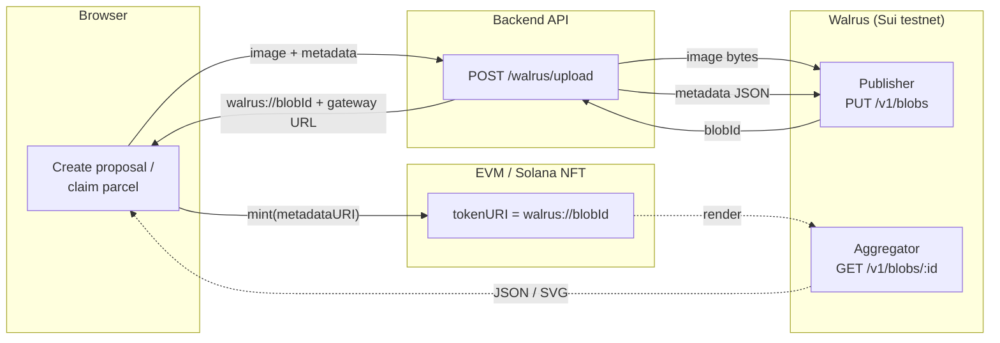
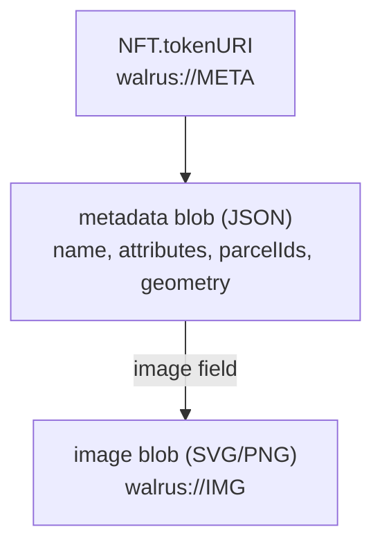
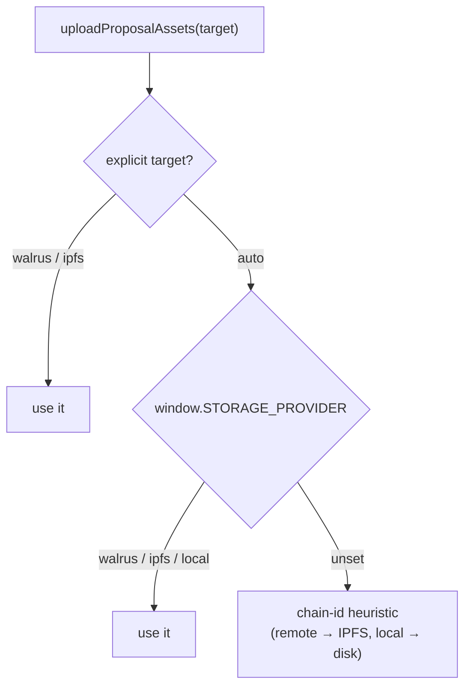

# Walrus storage — how it works

This document describes **what we built** and **how it works**. It's the outcome, not the plan —
for the design/requirements see [`feature-walrus.md`](./feature-walrus.md), and for day-to-day
operations (env vars, run commands, troubleshooting) see [`WALRUS.md`](./WALRUS.md).

## What we added

[Walrus](https://walrus.xyz) (Sui's decentralized blob storage) is now a **config-selectable
storage backend** for NFT metadata and images, sitting alongside the existing IPFS/Pinata and
local-filesystem options. Selecting it is a single config flag — nothing else changes, and the
existing storage paths are untouched.

When Walrus is active:

- A parcel or proposal's **image (SVG/PNG) and metadata (JSON)** are stored as Walrus blobs.
- The **on-chain pointer** in the NFT is the canonical `walrus://<blobId>` URI.
- The UI **reads it back** through a Walrus aggregator (the equivalent of an IPFS gateway).

The smart contracts didn't need to change — they store an opaque metadata-URI string, so
`walrus://<blobId>` slots in exactly where `ipfs://<CID>` or an `https://` URL used to go.

## The big picture



**Write path:** the browser sends the image + metadata to the backend's `/walrus/upload`, which
PUTs both as blobs to a Walrus **publisher** and gets back content-addressed `blobId`s. The
metadata's `image` field is set to the image blob's `walrus://` URI, and the metadata blob's
`walrus://` URI becomes the NFT's `tokenURI`.

**Read path:** anywhere the UI shows an NFT, it turns `walrus://<blobId>` into
`https://<aggregator>/v1/blobs/<blobId>` and fetches the content.

## The `walrus://` URI scheme

We store the **content-addressed** `walrus://<blobId>` as the canonical pointer — it's
host-independent and future-proof (mirrors how `ipfs://<CID>` already worked), and we *also* carry a
ready-to-render gateway URL alongside it. A blob is rendered by rewriting the scheme to an
aggregator URL:

```
walrus://QWmNLSOtQZqcwep9RmPTXuTFACEhcDY0hqIK8bdLHX8
        ↓  resolve
https://aggregator.walrus-testnet.walrus.space/v1/blobs/QWmNLSOtQZqcwep9RmPTXuTFACEhcDY0hqIK8bdLHX8
```

The aggregator is the **gateway** (the `ipfs.io` equivalent). The default is the public testnet
aggregator; it's overridable via `window.WALRUS_AGGREGATOR_URL`.

A minted NFT's data is a small graph of two blobs:



## How the storage backend is chosen

A single resolver decides which backend an upload uses, in priority order:



The frontend now **defaults `window.STORAGE_PROVIDER = 'walrus'`**, so the standard create-proposal
and claim-parcel flows use Walrus out of the box. `'ipfs'`, `'local'`, or `''` (legacy heuristic)
remain available without code changes. Upload status messages reflect the chosen backend
(e.g. "Uploading proposal image to **Walrus**…").

## Components

| Layer | What it does | Where |
|---|---|---|
| **Walrus client (backend)** | PUTs bytes to the publisher, parses `newlyCreated`/`alreadyCertified`, returns `blobId` + Sui object id + cost | `backend/storage/walrus.js` |
| **Upload route** | `POST /walrus/upload` — same request/response contract as `/ipfs/upload` | `backend/routes/walrus.js` |
| **Frontend uploader** | `target:'walrus'` + provider resolution + `getStorageProviderLabel()` | `frontend/js/ipfs.js` |
| **Config knobs** | `STORAGE_PROVIDER` default + `WALRUS_AGGREGATOR_URL` | `frontend/js/environment.js` |
| **`walrus://` resolvers** | render blobs in proposal/parcel/OG views | `frontend/js/{proposals,minted-proposals,og-metadata}.js` |
| **Walrus client (scripts)** | CJS port with retry/backoff for batch minting | `blockchain/scripts/walrus-storage.js` |
| **Mint scripts** | `--storage=walrus`, bounded-concurrency uploads, running WAL cost | `blockchain/scripts/mint-parcels.js`, `mint-proposals.js` |
| **NYC minter** | mints NYC parcels (one NFT per `swis_sbl_id`, id `US-NY-<id>`) | `blockchain/scripts/mint-parcels-nyc.js` |

The client handles Walrus's content-addressing transparently: re-uploading identical bytes returns
the same `blobId` (the `alreadyCertified` response), so there's no duplicate storage or extra cost.

## Soulbound parcels + EAS-attested ownership

Land parcels are now **soulbound** — `ParcelNFT._update` blocks owner-to-owner transfers (minting
and burning are still allowed). The on-chain holder is just a **registry custodian**; real-world
ownership is established off-chain and proven via **EAS attestations** (the `ParcelNFT` is referenced
by `ProposalNFT`, whose acceptance flow verifies claim / endorsement / owner-list attestations
against registered EAS schemas — not by who holds the token).

The mint harness supports this with `PARCEL_REGISTRY_ADDRESS`, which mints every parcel to a single
custodian address instead of distributing across demo accounts.

## Deployed contracts (Base Sepolia, chainId 84532)

| Contract | Address | Notes |
|---|---|---|
| ParcelNFT | `0x20e0A2897c642565905c0B45BBfaf7D8F96D1639` | soulbound |
| ProposalNFT | `0x9699AcBc70a32E5a7Ff30566dD496e080a4FAE2F` | wired to ParcelNFT + real EAS schema UIDs |

> Note: the EVM contracts store an opaque metadata-URI string, so the same `walrus://` data works
> across chains. (During testing, proposals minted on Ethereum Sepolia's older ProposalNFT also
> carry `walrus://` pointers — the storage is identical regardless of which chain holds the NFT.)

## Using and verifying it

**Create a proposal / claim a parcel** through the normal UI with `STORAGE_PROVIDER='walrus'` (the
default). The data is stored on Walrus and the NFT's `tokenURI` becomes `walrus://<blobId>`.

**Verify any item directly** — read its `tokenURI` and open the gateway URL:

```
# metadata (JSON)
https://aggregator.walrus-testnet.walrus.space/v1/blobs/<metadataBlobId>
# image (SVG/PNG — the metadata's `image` field)
https://aggregator.walrus-testnet.walrus.space/v1/blobs/<imageBlobId>
# explorer view
https://walruscan.com/testnet/blob/<blobId>
```

> The aggregator serves blobs without a `Content-Type` header (with `X-Content-Type-Options:
> nosniff`), so a browser may **download** an SVG/JSON rather than render it inline. The app sets the
> right type when it displays the content.

## Cost & scale

- Storage is USD-pegged (~$5/GB/epoch), paid in **WAL** (+ SUI gas) by whoever runs the publisher.
- Our blobs are tiny but hit Walrus's minimum-encoded-unit floor: **~0.00116 WAL per parcel**
  (2 blobs), so the full ~42k NYC parcels ≈ **~49 WAL (~$4)** for one epoch.
- On **testnet the public publisher pays**, so it's free to us — at the cost of its rate limit
  (~30 parcels/min). A self-hosted publisher removes the rate limit but needs a funded Sui+WAL
  account; on testnet that's gated by faucet limits, so the public publisher is the practical path
  for large runs (restartable, chunked).
