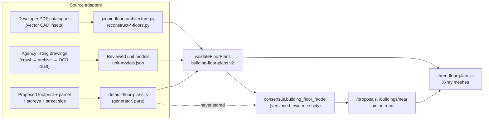

<!-- Status and architecture of building floor plans: what exists, how it fits together, what is pending. -->
# Floor plans

Buildings in the app can carry an architectural interior that X-ray mode renders in 3D: slabs, walls,
doors, windows, stairs, lifts. This file is the working map of that feature: what is done, how the
pieces fit, and what is still open. The storage and import contract is specified in
[`docs/building-floor-models.md`](docs/building-floor-models.md); the agency evidence pipeline in
[`backend/floor-plans/README.md`](backend/floor-plans/README.md). Dates are 2026.

## Status at a glance

| Part | State | Where |
|---|---|---|
| Floor-plan data model (`building-floor-plans.v2`), validation, 3D rendering, X-ray + cutaway UI | **Done** (Oct 6–7) | `frontend/js/building-floor-plans.js`, `frontend/js/three-floor-plans.js`, `frontend/js/three-mode.js` |
| Versioned registry of authored models, joined onto proposals and surveyed buildings on read | **Done** (Oct 7) | `consensus.building_floor_model`, `backend/buildings/floor-models.js`, `backend/scripts/import-building-floor-plans.mjs` |
| Source adapter for developer PDF catalogues (vector CAD insets → architecture) | **Done**, 67 floors / 9 buildings / 4 sites | `backend/scripts/pionir_floor_architecture.py`, `backend/scripts/reconstruct-*-floors.py`, `rekonstrukcije/**/floor-plan-sources.json` |
| Agency floor-plan archive (public listing drawings → immutable archive → OCR drafts → reviewed unit models) | **Done**, daily crawl; 5 reviewed apartment units for one project | `backend/floor-plans/`, schema `floor_plan`, `frontend/floor-plan-archive.html` |
| **New buildings**: a repeatable way to obtain more or less every floor plan | **Done** through the two sources above | this file, section "New buildings" |
| **Old buildings**: deduce floor plans where no drawing exists | **Pending** (TBD); first step: typical layouts by era behind "Existing buildings too" | section "Pending: old buildings", section "Existing buildings" |
| **Proposed buildings**: default layouts to see something in X-ray for every proposal / urban rule | **Built on branch `default-floor-plans`** (this document's branch): cores, rooms, balconies, wings, blind walls, shops, garage, regional presets, 2D layer | `frontend/js/default-floor-plans.js`, `default-floor-plan-rooms.js`, `default-floor-plan-context.js`, `suggested-layouts-2d.js` |

## The data model, once

Everything downstream shares one contract, `consensus-builder.building-floor-plans.v2`:

- **registration** — four WGS84 corners of a quadrilateral, a textual `basis`, an `accuracy` word.
  Layout geometry is expressed in unit UV coordinates of that quad and mapped bilinearly, so a
  layout is portable between a PDF crop, a survey and a generator.
- **layouts[]** — reusable `floor-architecture.v1` objects: `dimensionsM`, `wallHeightM`,
  `slabThicknessM`, polygons for `walls`, `slabs`, `landings`, `platforms`, and element lists for
  `openings` (door / window / glazedDoor / slidingDoor, with sill, head, depth, hinge and swung leaf),
  `stairs` (run, width, steps, from/to height) and `railings`. Each layout names its **source**: a
  document (`url`, `sha256`, optional PDF `page` and `crop`) or, since this branch, a generator
  (`kind: 'generated'`, `generator`, `parameters`).
- **floors[]** — level, `elevationM`, `elevationBasis` (`documented` | `estimated`), the layout
  used, optional apartments with areas and listing URLs.
- **notes / inference** — what was measured and what was assumed. An estimated dimension is never
  presented as a measurement.

The browser turns this into meshes (`three-floor-plans.js`): one geometry per layout and material
kind, shared by every floor that reuses the layout, with a floor cutaway and a below-ground cut.
Buildings without a model keep the ordinary exterior. Validation is the same function everywhere
(`validateFloorPlans`), called by the importer, the registry, the renderer and the generator.



## New buildings: what exists

### 1. Developer catalogues (whole floors)

For large recent projects the developer's sales catalogues contain whole-floor plans as vector PDF
insets. `pionir_floor_architecture.py` reads the vectors with PyMuPDF/Shapely: closed narrow
regions are walls, quarter-circle swings locate doors and casements, repeated tread lines locate
flights; furniture strokes are ignored. Reviewed manifests (`floor-plan-sources.json` per site)
carry the crop, the scale, reviewed outlines and stair traces where the drawing needs a human
reading. `reconstruct-*-floors.py` registers each layout to the proposal's footprint and writes
`floorPlans` into the canonical reconstruction archive; the importer validates footprint identity
and versions the model into the registry.

Corpus: 67 floors across nine buildings on four sites (one site contributes 54 floors over six
buildings; one office tower levels −1 and 0–7; one site levels 1, 7 and a recessed top floor; one
shared basement attached once under its owning building). Missing floors stay missing: unmodelled
vertical intervals keep the source massing in X-ray.

### 2. Agency archive (apartment units)

Real-estate agencies publish apartment plans in listings. The archive pipeline fetches the official
broker registry, verifies agency websites, crawls listing pages and assets politely, stores every
byte by SHA-256, extracts OCR/linework drafts, and matches listings to buildings. Drafts are **not**
models; a reviewed unit model (`unit-floor-models.v1`, same `floor-architecture.v1` geometry) is
imported only when its source hash is archived at the declared URL. One project has five reviewed
units, none yet with a verified whole-floor registration, so they are reviewable locally but not
published as building interiors. A review UI (`frontend/floor-plan-archive.html`) browses registered
buildings, unit models and archived sources.

Together these give a repeatable path: find the drawing, archive it, extract geometry, review,
register, import. Each new source needs an adapter to the schema, not a new renderer.

## Proposed buildings: suggested default layouts (this branch)

A proposal drawn with the tool has a footprint and a height, nothing inside. The generator gives
every such building a plausible default interior so X-ray always shows something, while making it
unmistakable that it is a suggestion: a separate toggle, a cooler palette, a note, and never any
write into the proposal.

### What the default is

- **Point-access core.** A staircase wrapped around a lift (or an open stairwell for small
  buildings), entered through a glazed entrance door into a floor-level landing. Flight 1 rises
  along one side of the lift, a half landing turns at the back, flight 2 returns to the front at
  the next floor. Apartment doors open from the landing. Above the high-rise limit the landing
  deepens into a fire lobby and the lift is always there.
- **Rooms.** Each apartment is furnished: a hall along the core wall that turns across the back,
  a bedroom and a bathroom (or bathroom and storage when the strip is narrow) beside the hall, and
  behind the core a kitchen next to the hall, a living room and further bedrooms along the back
  facade. Partitions are 12 cm walls with 80 cm doors into every room. Bedroom widths follow the
  facade design's bay width when the building has one, so interior windows and the painted
  exterior fall into the same rhythm.
- **Windows and balconies.** Every room gets a window on each free facade it touches (bedroom
  1.4 m, living 2.4 m, kitchen 1.2 m, bathroom a small high one). The living room gets a 1.5 m
  balcony with a glazed door on its sunniest facade that is not the entrance side, on every floor
  above the ground. Corner apartments receive windows on the end facades the same way.
- **Shops on an active ground floor.** A block-rule building of five storeys or more gets shops
  on the ground floor (a parameter otherwise): storefront glazing and a shop door per unit on the
  entrance facade, a stockroom at the back, the residential entrance kept.
- **Garage level.** A building of four storeys or more with 300 m² or more of usable floor gets
  one parking level below ground: a column grid, the cores continued, and a 3.5 m ramp inside the
  building at 15 % (never over 20 %) that surfaces through the ground slab. Where the ramp cannot
  fit the level has none, and the note says so.
- **Entrances on the longer side.** Of the facades running along the building's long axis, the
  one facing the nearer road hosts the entrances, at any distance: a road only breaks the tie,
  since many entrances open onto service drives rather than the street, and a road behind a facade
  never makes it a front. A near-square footprint takes the side facing the nearest road; without
  street data the longest free facade is used. Party walls never host an entrance.
- **Two apartments per core**, one each side of the core's axis, both reaching the front and the
  back facade (double orientation). A dividing wall runs behind the core to the back facade.
- **Blind walls.** Party walls stay blind: slices of the same building, neighbouring proposed
  buildings and touching existing footprints make them. So do facades whose outside, at the
  boundary setback (3 m), already lies beyond the parcel and not on a road. The entrance facade is
  never blind. Without a parcel nothing is blind.
- **One parcel, one building.** The building drawn by the tool is cut into its parcel slices (the
  same intersection the 3D view already uses for exterior slices), and each slice gets its own
  core, entrance and apartments. A block rule over many parcels therefore produces one building per
  parcel with blind walls between them.
- **Wings.** A compound slice (L, U, a courtyard ring) is split into bar-like wings along the
  bisectors of its inside corners and courtyard corners. Each wing is planned as its own building
  with the other wings as party walls, so a perimeter block gets entrances on every street side.
  Bars, jogged slabs and stair bump-outs stay whole.
- **More cores for large floors.** Above 2 × 120 m² of usable floor per core the building gets
  another core, as many as the street-facing facades can take (each core needs its width plus a
  room on either side). Cores are spread evenly along the total length of every facade that faces
  the street side (a jogged facade or a stair bump-out counts), the building is partitioned at the
  midpoints between cores by dilatation walls, and each segment has its own entrance. Legally one
  building on one parcel, architecturally several.
- **Flagging.** When the minimum core does not fit behind the front facade, or no apartment of
  30 m² remains, the slice gets no layout and is painted red; the note says how many and why
  ("too small for a minimum stair core"). Too narrow for two apartments falls back to one per
  floor with a notice.

### Dimensions and their basis

Regulation numbers live in presets chosen by region; the region comes from the city's locale
(`hr-HR` → HR), and a city without a configured regulation gets the generic preset.

| | HR (NN 12/2023, NN 29/2013) | generic |
|---|---|---|
| Riser / tread | ≤ 15 cm / ≥ 33 cm (čl. 13) | 17 cm / 29 cm |
| Flight width | ≥ 110 cm (čl. 13) | 120 cm |
| Lift cabin / door | ≥ 110 × 140 cm / 90 cm (čl. 14) | same |
| Common corridor, apartment door | 150 cm (čl. 19), 110 cm (čl. 24) | 150 cm, 100 cm |
| High-rise | top occupied floor above 22 m (NN 29/2013 čl. 4): protected stair with lobby, firefighting lift (čl. 44) | 22 m |

The accessibility regulation applies to residential buildings with ten or more apartments (čl. 7).
The fire rulebook asks ≥ 1.10 m evacuation routes and ≥ 0.90 m doors. Everything else — wall
thicknesses (0.30 exterior, 0.20 core, 0.25 dilatation, 0.12 partitions), shaft size for that cabin
(2.0 × 2.2 m), room and window sizes, apartment limits (30–120 m²), lift policy (automatic from
P+3 or ten apartments), the boundary setback for blind facades (3 m), the shop and garage rules —
is a design default in `COMMON_RULES`, with a comment per value, and can be overridden per call.
The storey height is the drawn height divided by the storeys (declared storeys first; else the
rule's storey height, else the shared 3.3 m default).

For a 3.0 m storey the HR core is 4.60 × 5.87 m with a lift and 2.85 × 5.87 m without; 20 risers
of 150 mm, two flights of ten. The generic core is 4.80 × 5.22 m. **Open question:** whether and
when Croatian regulation makes the lift itself mandatory by storey count; the 2023 regulation ties it
to height differences on the accessible route, not to storeys. The threshold is a parameter until
that is settled.

### Existing buildings

The same generator can guess a typical interior for the existing buildings around a proposal
("Existing buildings too", inside the Suggested layouts toggle). Footprints and heights come from the
2D building pool; a footprint without a height stays a plain volume, and one a proposal builds over
is skipped. Era presets choose the rules from whatever the footprint says: a construction year where
one exists, else the storey height as a proxy. Pre-war (or storeys of 3.4 m and more): no lift,
flats up to 160 m², shops on the ground floor from three storeys. Post-war slabs (or storeys up to
3.05 m from four floors): the default scheme without a lift up to five storeys. Anything else uses
the contemporary defaults. The interiors draw inside the transparent built volumes and are never
painted red; they are labelled as a guess in the note. This is the first step of the pending "old
buildings" work, not evidence.

### How it is wired

```mermaid
sequenceDiagram
    participant TM as three-mode.js (buildProposedBuildings3D)
    participant CX as default-floor-plan-context.js
    participant GEN as default-floor-plans.js
    participant R as three-floor-plans.js
    TM->>TM: X-ray on, Suggested layouts on, no evidence model, no glTF
    TM->>CX: planBuilding(build-out feature, parcels, neighbours, streets, height)
    CX->>CX: slice by parcels · storeys · party neighbours · entrance side (long side nearer a road)
    CX->>GEN: planDefaultFloorPlans(slice, floors, storey, neighbours, front)
    GEN-->>CX: floorPlans (suggested) or warnings
    CX-->>TM: per slice, cached by content key
    TM->>R: createBuildingGroup(feature + floorPlans) — same path as evidence models
    TM->>TM: red volume for flagged slices; note lines; streets fetched per cell, rebuild once
```

- `frontend/js/default-floor-plans.js` — the generator. Pure (footprint, floors, storey height,
  neighbours, blind edges, front, typology in; `floorPlans` or warnings out), turf for planar
  polygon work, same UMD shape as the other classic modules (`window.__defaultFloorPlans`,
  `module.exports`). Rule presets by region live here.
- `frontend/js/default-floor-plan-rooms.js` — the interiors: rooms, partitions and doors for an
  apartment, windows and balconies on its facades, the shop variant, the garage level.
- `frontend/js/default-floor-plan-context.js` — parcel slicing, wing decomposition, storey
  derivation, the entrance-side decision (long axis from the smallest bounding rectangle, then road
  distance as the tie-break), blind facades from the parcel, neighbour collection, era presets for
  existing buildings, region from the city locale, street cell keys and the per-wing cache.
  Everything injected, so node tests drive it.
- `frontend/js/three-mode.js` — the **Suggested layouts** button beside X-ray (visible only in
  X-ray; `?suggested=1` on the URL turns it on), the **Existing buildings too** checkbox
  (`?suggestedExisting=1`), the render path, the `flagged` material and the note lines. Roads for
  the entrance side are street centrelines from `GET /streets/near` once per ~500 m cell, the plan's
  own applied corridors, and road parcels of the fabric; each source is optional. Until streets
  arrive the entrance takes the longest facade and the note says so; their arrival drops the cache
  and rebuilds once. Clicking a building opens the parcel panel with its suggested layout (cores,
  apartments per floor, rooms) or the reason nothing fits; the proposal panel totals its buildings.
- `frontend/js/suggested-layouts-2d.js` — the 2D counterpart: the "Suggested layouts (ground
  floor)" toggle in the Layers sheet under the building layers (`?suggested2d=1`) draws the ground
  floor of every suggested layout on the map from the same generator and `floorPlanToGeoJSON`, on
  its own pane above the proposed-buildings canvas, from zoom 17 for the buildings in view plus a
  margin. A slice with no layout is a red dashed outline whose reasons follow the pointer. It
  rebuilds when proposals or the parcel fabric change and when the map moves; street data is not
  fetched in 2D, so the entrance takes the longest facade there.
- `frontend/js/three-floor-plans.js` — a cooler palette for `suggested: true` models and a
  `suggestedBuildings` count in summaries.
- `frontend/js/building-floor-plans.js` — the validator accepts `source.kind = 'generated'` only
  inside a model flagged `suggested: true`.
- `backend/buildings/floor-models.js` — `prepareFloorModel` **refuses** suggested models: the
  registry stores evidence, suggestions are derived at display time.
- Tests: `backend/test/default-floor-plans.test.js`, `default-floor-plan-context.test.js`, new
  cases in `three-xray-wiring.test.js`, `three-floor-plans.test.js`,
  `building-floor-model-registry.test.js`.

Nothing is persisted: the generated `floorPlans` exist in the scene and an in-memory cache keyed by
proposal, building index, slice geometry, storeys, storey height, front and neighbours.

### Limitations

- A user cannot yet pick the entrance side; the generator already takes a `front` edge for that.
- Rooms follow one scheme (hall along the core, wet rooms beside it, living and bedrooms along the
  back facade); a very deep floor plate gets deep rooms and a notice rather than a second row.
- Wings are cut along corner bisectors; a wing narrower than a core, or a sliver under 25 m², is
  dropped from the plan and reported.
- No loggias or roof shapes; one garage level at most; the ramp always sits at a building end.
- Existing neighbours come from the loaded footprint pool; a demolished neighbour is excluded by
  overlap, but a neighbour not yet loaded in the 2D layer is not known.
- The facade shader keeps painting windows by bay; only the bedroom rhythm follows it, not the
  exact window positions, so the exterior and the interior agree in rhythm rather than one to one.
- A block with dozens of parcels plans dozens of wings on the first toggle (tens of milliseconds
  each); the cache makes the second toggle free.

## Pending

### Old buildings: deducing floor plans (TBD)

Buildings older than the catalogues and listings have no drawing we can fetch. Candidate approaches,
none decided:

1. **Typology inference** — classify an existing footprint by era, depth, length and the GDI height
   (interwar block, 1960s slab, 1980s tower, family house) and generate a typology default with the
   same generator, parameterised per typology (core type, corridor vs point access, bay depth).
   Cheap, honest if labelled "typical for this type", wrong in detail. **A first step exists**: the
   era presets behind "Existing buildings too" (see above), driven by year or storey height alone.
2. **Archive matching** — the agency archive already associates listings with buildings; a reviewed
   unit plan plus the footprint can anchor a whole-floor layout where the unit's position in the
   building is evidenced (balcony pattern, corner, orientation).
3. **Public records** — building permits, energy certificates and the city's own archives sometimes
   contain plans; this is the catalogue path with a different fetcher.
4. **Field observation** — window rhythm and entrance positions read off the facade (street imagery
   or the Google mesh) fix core positions and bay widths for a generated layout.

Each of these needs the same thing: a registration to the footprint and an explicit `basis`, so the
model can say what it knows. The generator's `suggested` flag and generated sources are the hook.

### Suggested layouts: next steps

- Choosing the entrance side and the number of cores in the editor. Saving a layout belongs only
  to single-building proposals: an urban rule is massing, never a blueprint, so suggestions stay
  display-only for rules.
- Settle the lift obligation threshold; add regional presets beyond HR and generic.
- Thumbnails: the server-side renderer would need the generator and the parcels; the 2D layer
  shows the same drawing live instead.
- Feed the generated apartment counts into plan yield so the stats dialog and X-ray agree; today
  the proposal panel in 3D shows them beside the area figures.
- Drive the facade shader from the layout's openings one to one; today only the bay rhythm is shared.

### Evidence pipeline

- Verified whole-floor registration for the agency unit models, so they can be published as
  building interiors rather than reviewed locally.
- More catalogue sites: the source inventory lists which of the twelve reconstructed sites have
  recoverable drawings and which do not.
