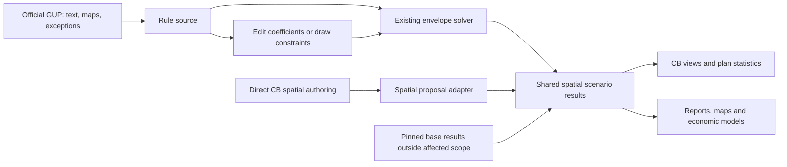

<!-- Inventory and proposed integration of Consensus Builder plans with the GUP solver and report consumers. -->

**Direction confirmed with the user: Built / Currently permitted / Proposed, compared through shared spatial results. Official or edited GUP rules compile into spatial results; CB proposals are authored spatially. Proposal-to-GUP-text conversion is out of scope.** Represent an alternative plan as a pinned base GUP plus explicit, spatially scoped amendments, with the implementation details below still proposed.

**Solver scope confirmed with the user: evaluate existing cadastral parcels only.** Compare GUPs and amended plans on the same parcel snapshot. Do not generate or solve hypothetical merged, subdivided or newly formed plots; the possible combinations are outside this task. Directly authored CB spatial results enter through their adapter.

**Incremental evaluation required by the user: inherit unaffected, compatible base results without resolving or solving those parcels again.** Store and evaluate the amendment's actual effects, while reporting the complete effective plan.

Inventory date: 2026-09-14; updated after the user's questions about names, complete definitions and reuse of base solutions. This records the confirmed product direction and proposed implementation; no runtime code has been changed. Sources are local checkouts, with public hub/report navigation checked where accessible and the official 2025 GUP checked for boundary semantics. The initial inventory used clean `main` in Consensus Builder at `9d17641` and cadastre-data at `977484e`. Three report checkouts were one commit behind their existing `origin/main` references: Maksimalni, Izgrađenost, and troškovi-gradnje; those three commits add GUP reader links. This was not a production-data or deployment audit.

**What already exists**

Consensus Builder already distinguishes a rule's permitted massing from illustrative construction. `urban-rule-variation.js` normalizes `max`, `range`, and `exact` rules for parcel-based, block, and row authoring. Randomization affects a realization, not the proposal's permitted volume. This is substantially closer to a planning language than a collection of proposed buildings alone. The existing design is recorded in [urban-rule-massing.md](./urban-rule-massing.md).

There is a Plan Stats **modal**: the sidebar's `planStatsButton`, also opened by `?planStats=1`. It measures currently applied local proposals, including floor area, apartments, people, jobs, open space, and sales value; it does not include the inherited capacity of the untouched city. The pure `plan-yield.js` module is shared with a backend reporting script. Its resulting-parcel calculation uses the live parcel fabric and immutable cadastral provenance. [Modal calculation](/Users/simun/Code/consensus-builder/frontend/js/proposals/plan-stats.js:78), [entrypoint](/Users/simun/Code/consensus-builder/frontend/js/proposals/plan-stats.js:458), [yield calculation](/Users/simun/Code/consensus-builder/frontend/js/proposals/plan-yield.js:152).

Parcel EUR gain is a separate calculation: proposed floor area minus built floor area, multiplied by a selected EUR/m². Plan Stats similarly multiplies GFA by a price, defaulting to EUR 5,000/m². Neither is the residual land value model used in Stambeni potencijal. Even the floor-area methods differ: Plan Stats derives whole floors, while the gain module divides volume by floor height. [Gain](/Users/simun/Code/consensus-builder/frontend/js/proposals/gain.js:62), [stats assumptions](/Users/simun/Code/consensus-builder/frontend/js/proposals/plan-stats.js:152).

Cadastre-data already separates the important stages:

- Text extraction and corrections produce the `urban_rule_variable.variables` vocabulary; spatial layers supply zones, uses and exceptions. [Vocabulary](/Users/simun/Code/cadastre-data/government_plans/ur-variables.md:1).
- `resolveRuleContextForGeometry` resolves those rules for geometry, including land-use masks, exceptions and rule deferrals. [Resolver](/Users/simun/Code/cadastre-data/lib/zagreb-rule-context.mjs:250).
- `solveMaxBuilding` computes capacity using the geometry, variables and physical context. The numeric constraints are shared with `validateDesign`, although their complete geometry/context coverage differs. [Solver](/Users/simun/Code/cadastre-data/lib/solver.mjs:1068), [checker](/Users/simun/Code/cadastre-data/lib/rule-engine.mjs:38).
- Batch results populate `parcel_build_envelope`. Several reports read stored results or derived snapshots rather than solving on every request. The current key includes numeric `gup_id` and cadastral `cestica_id`. [Stored result schema](/Users/simun/Code/cadastre-data/db/parcel_build_envelope.sql:12).
- `/api/build-envelope/preview` already compares edited rule variables against the base using the same current solver and parcel sample. It preserves exception-specific rules. This is a useful parameter-amendment prototype, but its scaled sample is not a complete plan evaluation. [Preview route](/Users/simun/Code/cadastre-data/api/src/domains/envelope/routes.js:420), [pure preview orchestration](/Users/simun/Code/cadastre-data/lib/envelope-preview.mjs:20).

The existing rule editor is reachable at **Urbana pravila → Potencijal izgradnje → pencil beside a zone → select rule → edit values → Pregled**. It renders existing numeric/null-valued keys, such as coefficients and numeric limits; it does not edit free-form GUP prose, add new variable keys, expose boolean/conditional rules, or draw building lines. The browser requests a random sample of up to 400 parcels; the API accepts sample sizes up to 800. It solves baseline and edited rules on the same sample, retains exception rules, and scales the aggregates to the stored rule cohort. Results show buildable parcels, maximum GBP and the residential regulatory unit limit. Nothing is saved and no modified spatial layer is returned. [Pencil entrypoint](/Users/simun/Code/zagreb-urbana-pravila/public/index.html:827), [editor and preview](/Users/simun/Code/zagreb-urbana-pravila/public/index.html:1468).

Extend this editor into a reusable source of spatial scenarios: structured controls with readable labels, explicit geographic scope, optional drawn constraints, and persistent edits. Saving a draft does not start a full calculation. An explicit evaluation calculates the complete affected set and creates a versioned result for reports; a save-and-calculate action can combine these operations. Keep sampled preview visibly separate from complete evaluation. The same rule-editing workflow can be opened from CB or a report and save into the same plan; reports should not maintain their own rule or geometry engines.

**Where the user edits a plan**

Urbana pravila should be the primary interface for choosing a base GUP, creating a named alternative, editing structured rule parameters and their geographic scope, drawing rule/land-use boundaries or building lines, previewing changes, and requesting a complete evaluation. Extend the existing report's editor into this workflow. CB retains direct spatial proposal authoring, plan composition and the Built / Currently permitted / Proposed comparison. A CB action can open the Urbana pravila editor with the same plan and selected area; the first implementation does not need a second rule editor in CB. Both save into one plan model and consume the cadastre-data evaluation API. Other reports select its completed results.

**Report inventory**

| Consumer | Actual dependency | Change needed for arbitrary plans |
|---|---|---|
| [Urbana pravila](https://zagreb.lol/urbana-pravila/) — frontend `zagreb-urbana-pravila/public`, pipeline `cadastre-data/reports/urban-rules` | API serves prebuilt summary and rule/land-use geometry; interactive area, preview and parcel queries use envelope APIs. UI builds plan buttons from `DATA.gups`, but the builder hardcodes 2016/2025, the height tab fixes 2025, and parcel links admit only those two years. | Best first aggregate consumer. Generalize scenario metadata, build cohorts, all tabs, spatial layers and grouping. A CB amendment needs its own source/rule label; retaining the old zone as geographic context must not imply the old rule still governs. |
| [Maksimalni Zagreb](https://zagreb.lol/maksimalni/) — `zagreb-maksimalni` | Citywide 3D uses immutable massing releases and tiles. Parcel detail additionally reads stored 2016/2025 comparisons and a live 2025 solve. | Select a scenario evaluation/release; make parcel comparisons dynamic and keep tile, detail and statistics revisions aligned. A selector alone cannot manufacture a new citywide tile release. |
| [Izgrađenost](https://zagreb.lol/izgradjenost/) — `zagreb-izgradjenost` | `/api/build-envelope/utilization/:gup` compares existing residential GBP with stored permitted capacity. | Relatively small consumer migration after the shared API exists. Preserve residential scope, comparable area definitions and missing-data status. |
| [Stambeni potencijal](https://zagreb.lol/stambeni-potencijal/) — `zagreb-stambeni-potencijal` | Hybrid: charts fetch urban-rules summary at runtime; parcel comparisons/loss use APIs; maps, figures, ownership subsets and effect decomposition also use built artifacts. | Generalize both selected scenarios and all derived artifacts. Ordinary capacity/loss comparisons can migrate first. The current GUP-variable decomposition is a specialized analysis, not automatically available for arbitrary geometry amendments. |
| [Stanocid](https://zagreb.lol/stanocid/) — `zagreb-stanocid` | Separate older calculator with embedded `urban-rules.js` and `getFlatsOldGUP` / `getFlatsNewGUP` formulas. Does not use the canonical envelope results. | Replace its arithmetic with shared scenario results if keeping the interactive calculator. Do not introduce a third arbitrary-plan formula. Distinct from both Stambeni potencijal and the Markdown article in `zagreb-articles/stanocid`. |
| [Neboderi](https://zagreb.lol/neboderi/) — `zagreb-troskovi-gradnje/skyscraper-viability` | Market data plus `ppv.block_height_cap` and `ppv.block_developability`, derived from envelope rows; PPV APIs also expose block parcels. | Make regulatory aggregates scenario-specific while holding prices/cost assumptions explicit. Existing block views are 2025-scoped and refreshed after the 2025 envelope batch. |
| [Lovac](https://zagreb.lol/lovac/) — `zagreb-lovac-na-prilike` | Fetches envelopes for advertised land, then stores residential development economics and ranking results. | Carry scenario and economic-model revisions through opportunity evaluation and saved results. A changed scenario means recalculation, not relabeling the existing ranking. |
| [Dozvole](https://zagreb.lol/dozvole/) — `zagreb-dozvole` plus cadastre-data permit pipeline | Persisted permit-specific 2016/2025 maximum calculations, with a restricted comparable cohort and historical/project context. | Separate later migration: a scenario-by-permit evaluation matrix. Ordinary current-parcel capacity rows cannot substitute for permit-time project geometry. |
| [Moja parcela](https://zagreb.lol/parcele/) | Public parcel app backed by parcel and envelope APIs; site probes explicitly call the 2025 envelope. | Reuse generic scenario selection and comparison at parcel level. The public API dependency is verified; frontend source location was not established in this inventory. |
| GUP text reader, Gradonačelnik, regulatorni-porez, Donji grad visine, street/parcel analysis, article exports | Official-text navigation, fixed editorial calculations, market/built-stock data, or GUP extent/road layers; not the same capacity-selector pipeline. | Keep historical/legal text tied to its source. Treat editorial refresh and road/land-use overlays separately. Do not label a historical article or official text as another arbitrary-plan calculation. |

Source entrypoints for the table:

- Urbana pravila: [frontend/pipeline ownership](/Users/simun/Code/zagreb-urbana-pravila/README.md:16), [builder plan list](/Users/simun/Code/cadastre-data/reports/urban-rules/build-data.mjs:133), [envelope aggregate](/Users/simun/Code/cadastre-data/reports/urban-rules/build-data.mjs:304), [dynamic plan initialization](/Users/simun/Code/zagreb-urbana-pravila/public/index.html:443), [fixed height plan](/Users/simun/Code/zagreb-urbana-pravila/public/index.html:1022), [parcel-link guard](/Users/simun/Code/zagreb-urbana-pravila/public/js/parcel-selection.js:5). The HTML copy under cadastre-data is not the publication entrypoint; edit the separate frontend repository.
- Maksimalni: [fixed 2025 manifest request](/Users/simun/Code/zagreb-maksimalni/js/main.js:92), [parcel detail](/Users/simun/Code/zagreb-maksimalni/src/parcel-detail.js:148), [release builder](/Users/simun/Code/cadastre-data/government_plans/massing-release-builder.mjs:795).
- Izgrađenost: [frontend](/Users/simun/Code/zagreb-izgradjenost/report.js:35), [utilization API](/Users/simun/Code/cadastre-data/api/src/domains/envelope/routes.js:195).
- Stambeni: [architecture and publication path](/Users/simun/Code/zagreb-stambeni-potencijal/README.md:1), [runtime charts](/Users/simun/Code/zagreb-stambeni-potencijal/charts.js:132), [stored parcel comparison](/Users/simun/Code/zagreb-stambeni-potencijal/parcel-view.js:138), [effect decomposition](/Users/simun/Code/cadastre-data/government_plans/decompose-rule-effects.mjs:1).
- Stanocid: [old formula](/Users/simun/Code/zagreb-stanocid/script.js:83), [new formula](/Users/simun/Code/zagreb-stanocid/script.js:135), [embedded rules](/Users/simun/Code/zagreb-stanocid/urban-rules.js:1).
- Neboderi: [PPV API](/Users/simun/Code/cadastre-data/api/src/domains/ppv/routes.js:192), [derived-view refresh](/Users/simun/Code/cadastre-data/government_plans/build-envelopes-batch.mjs:336).
- Lovac: [opportunity pipeline](/Users/simun/Code/zagreb-lovac-na-prilike/src/build-opportunities.js:1). Dozvole: [comparison cohort](/Users/simun/Code/zagreb-dozvole/stats.js:787). Moja parcela: [public app probes](/Users/simun/Code/zagreb-site/scripts/check-cards.mjs:116).

**Two authoring methods, one spatial comparison**

The rule authoring method starts from an official GUP, edits coefficients or spatial constraints, and re-solves affected parcels. Retain the source rule, edits and drawn constraints as generator inputs so the author can reopen and adjust them. The direct authoring method uses CB's max/range/exact spatial prescriptions. Both publish spatial results under the same scenario contract; no consumer needs to recover GUP-like text from either output.

A graphical building-line edit fits the forward rule-solving path. The editor must store the line, its affected scope and which side is buildable, plus whether it is a limiting boundary or a required facade alignment. An arbitrary line cannot be replaced by one numeric front setback. The existing solver derives a setback from existing building/road context, while the design checker already accepts building-line geometry; authored lines are not yet wired through this report's preview into the solver. [Existing-line resolution](/Users/simun/Code/cadastre-data/lib/solver.mjs:1278), [checker line inputs](/Users/simun/Code/cadastre-data/lib/rule-engine.mjs:143).

“Spatial results” means geometry plus its capacity and use attributes. Preserve floor areas, dwelling caps, min/max/exact semantics, uncertainty and source provenance. Identical-looking volumes can permit different apartment counts, and a GUP solver's chosen maximum massing does not encode every permitted alternative. This keeps comparison spatial without throwing away facts the housing and EUR reports need. [Massing and validation](/Users/simun/Code/cadastre-data/lib/solver.mjs:789).

**The proposed shared boundary**

Reuse CB's rule interpretation, authored geometry and pure measurements. Cadastre-data should own the shared spatial scenario evaluation/results API next to the existing solver; CB should own proposal authoring and exporting a stable definition. Both should consume the same measurement contract. Retained GUP source text explains the input rules; generating GUP-like text from spatial proposals has no role in this workflow.

Use a plan ID distinct from a GUP year. Official GUPs and proposed alternatives are plan kinds under the same identity model; “scenario” describes an alternative, not another independent object users must name. Do not invent a year to fit a proposal into `gup_id int4`. Reports move to a plan-aware read layer over pinned official results and evaluated overrides.

The minimum definition needs: city and coverage; base-plan revision; exact proposal membership/content hashes; phase if relevant; explicit override types/scopes; and a definition revision. An evaluation additionally pins solver/compiler versions, cadastral and physical-context snapshots, measurement assumptions, and completion/coverage status. Price assumptions belong to a separately identified economic evaluation. A named ENS plan is currently a mutable proposal-ID list, not all of these things. Browser `applied` flags must not decide a report's published membership. [Named plans](/Users/simun/Code/consensus-builder/backend/routes/ens-plans.js:54), [authored-record boundary](/Users/simun/Code/consensus-builder/frontend/js/proposals/authored-record.js:1).

Each evaluated development unit should carry its geometry and source cadastral anchors, rule/proposal provenance, use allocation, min/max or exact semantics, explicit floors/areas where known, built-stock comparison, and diagnostics. Distinguish a permissible spatial boundary from a chosen maximum realization, and both from an illustrative build-out. Distinguish explicit no-new-build, a pending UPU/competition, an unresolved rule, absent data, and failed geometry; a missing envelope must not become an unexplained zero.

**Plans as a base plus amendments**

Make this the first-class plan definition: a pinned base revision, explicit amendments and a revision of their combined definition. A proposal based on GUP 2025 is a complete alternative scenario because every unchanged provision and area is inherited. It is not another official GUP year, and saving it does not modify the official source. The base can later be another frozen alternative-plan revision; prohibit ancestry cycles and resolve the chain into one effective definition for evaluation.

Keep rule definitions separate from the polygons that assign them. Changing a coefficient in every application of rule A, changing it only inside one selected zone, and changing that zone's boundary are distinct amendments. A local coefficient edit can be represented as a scoped variant of A without copying the whole GUP. The existing exception and deferral machinery must still participate in rule resolution. A parameter patch must not bypass geographic context using the current `ruleIdOverride` shortcut, which omits land-use masks and exception lookup. [Override behavior](/Users/simun/Code/cadastre-data/lib/zagreb-rule-context.mjs:254).

Resolve the effective assignment map, rule definitions and explicit precedence before solving. A boundary amendment assigning land to rule B must pick up any applicable B-parameter amendment in the same revision. Conflicting edits to the same field or area need an explicit resolution or supersession; array order alone is not a plan policy. Store the authored operations for editing and audit, and cache the effective definition for calculation.

**Naming and identity**

Separate a stable plan identity, its definition revision, and an evaluation of that revision. Use opaque internal IDs and readable slugs/titles; the proposed examples below are naming conventions, not existing records.

| Object | Example | Meaning |
|---|---|---|
| Official plan | `zagreb-gup-2025` — GUP Zagreba 2025 | The identified official edition |
| Alternative plan | `zagreb-vise-stanova` — Više stanova | A distinct proposal with a pinned base |
| Definition revision | `zagreb-vise-stanova@r4` | The fourth frozen definition of that alternative |
| Evaluation | an opaque evaluation ID referencing `r4` | Results using a specified solver, data snapshot and options |

Reserve `rN` for definition revisions. `solver_version` remains the engine's version, and rerunning a fixed definition with a different solver/data snapshot creates another evaluation, not another official GUP or an automatic rule amendment. Slug/title changes do not alter solver inputs. Report links pin evaluation IDs; the UI can show the readable plan title and base with revision details available separately. Avoid an unexplained `GUP-2025-v4`, which could mean the fourth official amendment, fourth data interpretation or fourth calculation.

The base reference belongs to a definition revision: revision 4 can explicitly rebase while preserving revisions 1–3. Previous revisions of the same alternative and its base GUP are different relationships. An alternative revision can hold its cumulative amendments relative to the pinned base; editing or removing an amendment then has an explicit meaning and does not accumulate arbitrary last-wins patches forever.

**Where complete definitions and results live**

Store the structured plan model in the shared `geodata` database, with schema and API ownership in cadastre-data and a link from CB's named plans. The existing official import tables remain source data. They are not a complete immutable plan manifest: `government_plan` is metadata/border/validity, `urban_rule_text` is textual content without a GUP revision key, `urban_rule_variable` has JSON variables keyed by `(gup_id, rule_id)`, and rule/land-use/exception layers have different revision conventions. CB's `ens_plan` is a mutable name and proposal list. [Official metadata](/Users/simun/Code/cadastre-data/db/government_plan.sql:6), [text](/Users/simun/Code/cadastre-data/db/urban_rule_text.sql:6), [variables](/Users/simun/Code/cadastre-data/db/urban_rule_variable.sql:7), [land-use layer](/Users/simun/Code/cadastre-data/db/planned_land_use.sql:6), [CB name](/Users/simun/Code/consensus-builder/backend/ens/ens-plan-ddl.sql:7).

Proposed tables, to be finalized with the first migration:

| Table | Responsibility |
|---|---|
| `planning_plan` | Stable ID, city, kind, slug/title, ownership, CB named-plan linkage and editable draft definition |
| `planning_plan_revision` | Immutable definition, revision number, optional `base_revision_id`, schema version and definition hash |
| `planning_plan_feature` | Immutable imported or authored spatial features, typed operation/target metadata and indexed PostGIS geometry, referenced by definition revisions |
| `planning_evaluation` | Definition revision, pinned base evaluation, solver build/options, parcel/context snapshots, progress and coverage |
| `planning_parcel_result` | New or changed parcel outputs for an evaluation, including effective-input fingerprint, explicit status and either capacity/geometry payload or a reference to an immutable reused result |

Use validated JSONB for structured rules, amendment payloads and the definition's source manifest; use PostGIS for spatial features. Autosave can update the draft, while saving a definition revision or requesting calculation freezes its exact content as `rN`. A complete official definition pins its source text and structured rules, urban-rule assignments, land-use layer, exceptions/deferrals, UPU or special regimes, planned lines/corridors and global planning policies. It can reference immutable snapshots rather than copy every source into every revision. An alternative stores its base plus typed coefficient/assignment/land-use/line/spatial-proposal amendments. CB references pin authored content, not only mutable proposal IDs. A root plan with no base must supply its own required inputs; missing coverage is explicit.

This is one definition format for simple and complex plans. A plan that appears textual already needs spatial inputs for the solver. Retain unmodelled provisions as source evidence without pretending that their prose is executable. Existing cadastral parcels, physical buildings/roads and solver settings are calculation context pinned by the evaluation; planned roads and authored planning constraints belong to the plan definition.

An immutable reference must identify immutable content. A year or a query for `current=true` is insufficient. The variable loader overwrites `(gup_id, rule_id)`, and the envelope batch currently uses `VERSION = 1` with an upsert that updates existing result rows. Freeze imported definitions and official result snapshots before using them as bases. Existing rows can seed those snapshots once; later alternatives store their deltas and inherit the rest. [Variable overwrite](/Users/simun/Code/cadastre-data/government_plans/ur-variables-to-db.js:162), [batch result version](/Users/simun/Code/cadastre-data/government_plans/build-envelopes-batch.mjs:35), [result upsert](/Users/simun/Code/cadastre-data/government_plans/build-envelopes-batch.mjs:173).

Legacy rows have no complete effective-input fingerprint. Import them with verified source provenance where available; do not assign a freshly frozen input manifest to older results without evidence they match. Rows whose compatibility cannot be established need a trusted baseline calculation. Once that baseline exists, ordinary amendments use incremental evaluation.

**Reuse before resolution and solving**

The current batch skips a parcel when its current result has the same `gup_id` and `solver_version`; it does not implement base-plan inheritance or check a complete effective-input fingerprint. This mechanism is useful for resuming one batch but insufficient for amended plans. [Resume predicate](/Users/simun/Code/cadastre-data/government_plans/build-envelopes-batch.mjs:103).

The new evaluation should:

1. Pin the target definition, existing parcel/context snapshots, solver settings and compatible base evaluation.
2. Compare the effective definitions and identify a conservative candidate set using rule dependencies and old/new feature scopes. A changed assignment with unchanged geometry still affects its area; additions/deletions must be included. Account for inherited exceptions, deferrals and supported context dependencies, including effects of newly introduced features.
3. Inherit results outside that set directly. Do not re-run per-parcel rule resolution, spatial-context queries or envelope solving there.
4. For candidates, resolve effective solver inputs and compare a normalized input fingerprint with an available compatible result. Reuse an identical result; invoke the solver only for changed or missing inputs. Include previously unbuildable parcels and parcels with no cached row.
5. Save overrides, including explicit unbuildable/unresolved outcomes, and finalize the complete logical evaluation with its inherited results, coverage and aggregates.

The per-parcel fingerprint covers the existing parcel geometry, effective rule values and masks, relevant physical context, solver build and solving options. It must not include the whole plan ID/revision or whole-plan definition hash: that would invalidate every parcel after every amendment. Provenance/display labels can change without a new geometric solve. Price or other downstream reporting changes invalidate their own computations, not envelope geometry. The first implementation can invalidate all solver results after an engine change; source changes with reliable spatial dependency information can invalidate a narrower set. Do not combine old-engine base rows and new-engine overrides into an apparently uniform evaluation.

Store a base-evaluation reference plus sparse override rows. An absent override means inherited only when that parcel has been established as unaffected/reusable; it must not conceal an unfinished affected parcel. Reuse from a previous evaluation outside the base chain needs an explicit result reference in the override, so it cannot accidentally read the different base value. A present non-buildable or unresolved override shadows the base even when its geometry or area is null. Read precedence is based on row/status presence, not `COALESCE(new_geometry, base_geometry)`. Completed evaluations provide one effective result per existing parcel. Aggregate tables, tile releases or a flattened parcel-to-result index can be materialized for reading without rerunning the solver or duplicating all geometry.

Illustrative workload: a base has 200,000 parcel results; an amendment has 1,200 candidate parcels. Inherit 198,800 immediately. If 100 candidates retain identical effective inputs, reuse those too and solve the remaining 1,100. The new plan still exposes 200,000 results. These are example counts, not an estimate of the actual Zagreb dataset.

For later revisions, a compatible previous evaluation or shared input cache can supply additional reuse. The chosen result provenance is fixed when the evaluation completes. Retrying an interrupted job resumes the same frozen evaluation; changing its definition or calculation inputs starts a different one. An unchanged compatible alternative should perform zero per-parcel solves.

**Calculation lifecycle**

Cadastre-data should expose the shared API and run the solver beside its spatial database. Urbana pravila hosts the GUP amendment editor; CB is another client for spatial authoring and comparisons. Durable background workers evaluate broad scopes; browser sessions should not own those jobs.

| Action | Work performed | Result |
|---|---|---|
| Type a coefficient or drag a boundary | Immediate form/map feedback and geometry validation; save the draft independently | Editable definition, with calculations marked out of date |
| Preview | Solve a selected existing parcel or bounded scope after a completed edit; use an explicit, stable sample for broad changes | Fast spatial and metric comparison, labelled with its actual scope |
| Calculate plan / Save and calculate | Freeze the exact revision, determine all affected existing parcels and dependencies, enqueue a complete evaluation | Progress, coverage and diagnostics, then a completed evaluation |
| Open a report or switch scenarios | Read one completed evaluation, including inherited compatible base results | Consistent totals, parcel detail and spatial output without a new citywide solve |

Small previews can refresh automatically after an edit settles, with cancellation or stale-response rejection. A global change should not launch thousands of solves on every keystroke. Reuse the same preview cohort for successive changes so sample noise does not look like a policy effect. Full evaluation means every affected unit is processed, not that unknown rules become computable or that the unchanged city must be recalculated. Show unresolved/failed coverage explicitly.

Illustrative API additions, not existing endpoints: `POST /api/planning/plans/:id/previews` for a bounded preview; `POST /api/planning/plans/:id/evaluations` with the requested definition revision to return a job/evaluation ID; and `GET /api/planning/evaluations/:id` for status/results. Definition persistence remains a separate operation. The current `/api/build-envelope/preview` supplies reusable solving logic but cannot yet evaluate saved plans or boundary amendments.

Keep the last completed evaluation readable while a newer revision is pending, and identify which revision each view shows. Switch to the new complete result atomically. A job for an older revision must never silently publish itself as the newest draft. Reuse base results only when source data, solver and analysis versions are compatible; otherwise the required recalculation may be broader than the amendment itself.

**Which existing parcels are affected**

For a global rule-definition change, find existing parcels in all geographic applications and rule dependencies, including deferred rules and exceptions that inherit the edited parameter. Resolve those candidates against the amended definition; an exception that fixes the parameter independently can keep its existing result. For a local amendment, restrict its application to the explicitly selected zone or drawn area. The editor should show this scope before calculation.

Find candidates from source planning and existing cadastral geometry, not only existing buildable envelope rows. Lowering a minimum parcel area can make a previously unbuildable existing parcel eligible, and changing an unresolved rule can create a first result. Both must be included.

For a moved rule boundary, find existing parcels intersecting the changed assignment area between the old and new maps, then re-resolve each complete existing parcel. This captures newly included and excluded parcels even when their cached rule ID is unchanged or missing. The parcel inputs remain fixed. Context edits, if supported, may expand the dependent parcel set through roads, access or party-wall effects; they do not authorize generating new parcels. Hold existing physical context fixed unless the scenario explicitly amends it; hypothetical maximum envelopes must not automatically become the neighbouring built context for further solves.

**Rule boundaries on fixed cadastral parcels**

Zagreb's GUP expressly addresses multiple urban rules on one building plot: Article 23(11) applies the rule covering the larger part of that plot. Article 23(1–2) also addresses map/cadastre misalignment and ambiguous boundaries; 23(5–8) gives separate mixed-land-use plot-formation conditions. Preserve the distinction between cadastral parcel, building plot and planning-zone intersection. [Official GUP 2025, Article 23](https://www.zagreb.hr/userdocsimages/arhiva/prostorni_planovi/izid%20gup%20grada%20zagreba_2023-/gup_2025_donesen%20plan/GUP%20GZ%20-%20pro%C4%8Di%C5%A1%C4%87eni%20tekst%202025%20%281%29.pdf#page=31).

Treat small rule-boundary crossings as a resolution concern, not evidence that authors intended separately buildable fragments. The source supports map precision as one explanation; this inventory has not measured how many crossings are artefacts. The majority provision selects an urban rule, not permission to erase a separate land-use restriction. Resolve applicable restrictions against the existing parcel without inventing new plots. Avoid exposing ordinary users to every raw GIS sliver or silently repairing authoritative geometry with an arbitrary tolerance.

The solver data model needs independent planning polygons and the fixed existing cadastral parcel snapshot. Record relevant intersections as evidence, then resolve the effective rules and masks on each parcel. An intersection fragment is not a new solver parcel or an independent denominator for KIS, KIG or unit caps. Changing a rule boundary changes the parcel's planning context, not its identity or cadastral geometry.

The legal distinction between a building plot and an existing cadastral parcel remains relevant when interpreting the source, but hypothetical plot formation is outside this solver's scope. The GUP definition says a building plot is in principle one suitable cadastral parcel. [Definition](/Users/simun/Code/cadastre-data/government_plans/GUPGZ.md:119).

Under a 400 m² minimum, two existing 300 m² parcels both remain unbuildable in the evaluation. The theoretical possibility of combining them does not contribute capacity. A plan amendment lowering the minimum to 300 m² can instead make each existing parcel eligible without changing parcel geometry.

This is the evaluation scope, not a temporary first-version shortcut. Record capacity as evaluated on existing cadastral parcels, and pin the same parcel snapshot in comparisons. CB's directly authored max/range/exact spatial prescriptions are measured by their adapter; they do not require the GUP solver to evaluate newly drawn plots.

The current resolver selects one land-use context and then one urban-rule context, with clipping and exception handling. Selecting one rule is not inherently a defect, but applying it over a selected use piece is not automatically equivalent to applying a parcel-wide boundary provision. Before publishing arbitrary boundary amendments, verify this interpretation on existing parcels; do not solve and add every intersection fragment. [Current selection](/Users/simun/Code/cadastre-data/lib/zagreb-rule-context.mjs:295), [mixed-use regression](/Users/simun/Code/cadastre-data/lib/zagreb-rule-context.test.mjs:73).

Add a rule-area drawing mode: edit an existing shared boundary, or draw a polygon and assign an existing or locally modified rule. Offer cadastral snapping without requiring it. Update adjacent base-rule assignments together so the effective map has no accidental overlaps or gaps; preserve explicit exception overlays with their own precedence and existing source ambiguities as diagnostics. Moving a rule boundary does not split a cadastral or building plot. Land-use (`namjena`) boundaries, urban-rule (`urbana pravila`) boundaries and building lines are different editable layers with different effects. The polygon-capable model belongs in the first scenario schema even if the first UI supports only coefficients and existing zones.

**Overlay semantics must be explicit**

1. Resolve “last valid GUP” when creating the scenario, then pin that base. Updating the base is a visible rebase/re-evaluation, so an old report link does not change silently.
2. A spatial development-rule proposal replaces development permissions within its declared scope. A parameter amendment changes named parameters. A land-use amendment changes uses. These rule-driven changes are evaluated on existing cadastral parcels. CB land-layout proposals remain directly authored spatial inputs to its adapter, rather than new parcel inputs to the GUP solver. Unspecified aspects remain inherited and are visible in the effective rule. Ownership/financial-only proposals have no capacity effect.
3. Explicitly list which inherited constraints a replacement supersedes. Otherwise a drawn larger envelope could still be constrained by hidden base GBP, height or reconstruction rules. Where retained constraints cannot yet be evaluated against a spatial prescription, expose prescribed capacity separately from validated capacity. Full-GUP authoring will also require making currently global policies configurable: e.g. the solver's global floor cap and its GUP-dependent housing standards.
4. In the direct CB adapter, cadastral IDs are provenance, not the override polygon. Compile authored geometry using the established fabric/closed-scope semantics and keep its scope explicit. Partial replacement needs a defined treatment of inherited capacity; prorating a cached parcel maximum by area is not valid. Reject unresolved competing prescriptions; do not use fetch order or arbitrary last-wins behavior.
5. Re-solve amended rules on affected existing cadastral parcels. Rule or land-use boundaries can constrain placement within them without creating new solver parcels or inventing setbacks at internal planning boundaries. Hypothetical splitting, merging and plot formation are outside the evaluation.
6. Rules outside the amended scope remain inherited, but their computed capacity can change when supported amendments alter roads, access or neighbouring buildings. The solver currently queries shared context tables. A scenario context provider is needed for those effects; passing a constraint polygon alone does not replace the roads/party-wall context it reads. This context support still uses the same existing parcel inputs; it is separate from parcel formation.

For compatible complete rule evaluations, city totals can reuse base results and replace the affected parcel results: base total minus old affected results plus newly evaluated affected results. Include any dependent existing parcels in that affected set, and recompute economic/other nonlinear results before aggregating. For direct CB spatial overlays, prevent overlap with replaced base results and never count one authored site's total once per source parcel. Partial-scope residual capacity must be explicit or unresolved, not silently estimated by area.

**One measurement vocabulary**

The shared results should keep gross and residential floor area, above/below-ground scope, footprint, floor geometry, and unit-count semantics separate. Sum explicit floor areas when available; use a declared estimation method otherwise. Apartment regulatory caps, physically modelled maxima and estimates at an assumed average size are different fields. Pin the same reporting assumptions across compared scenarios.

Current comparisons do not all use the same basis. CB defaults to 75% housing, 80% net/gross and a 65 m² apartment. The parcel comparison offers a fixed `1.35 × 60 m²` denominator, alongside solver apartment estimates. Official plan assumptions should remain available, while a common analysis profile provides an apples-to-apples comparison. [CB defaults](/Users/simun/Code/consensus-builder/frontend/js/proposals/plan-yield.js:24), [parcel comparison](/Users/simun/Code/cadastre-data/api/src/domains/envelope/comparison.js:11).

Keep three primary quantities visible: **built**, **base-GUP permitted**, and **scenario permitted**. From these derive unused base capacity, change in development rights, and scenario capacity relative to built stock. Preserve signed reductions; a plan turning a site into open space is not simply “no proposed value.” Existing buildings exceeding a new-build cap are not automatically demolition commitments.

For example, built 600 m², base-permitted 1,500 m² and scenario-permitted 2,200 m² means 900 m² existing headroom and a 700 m² change in rights. The 1,600 m² difference from built stock answers a different question.

EUR results must name their model: gross sales-value proxy; construction/project economics; or residual land value. Stambeni's landowner-loss endpoint compares residual land values under the two plans at the same prices/costs. It is not interchangeable with CB's area delta × price. Share the downstream economic calculation where the intent matches, retain a separately labelled simple area-price view, and keep unknown prices unknown. [Current landowner-loss model](/Users/simun/Code/cadastre-data/api/src/domains/envelope/routes.js:351).

For all citywide comparisons retain usable/total counts and area. The existing 2016 comparison joins a 2023 land-use snapshot and excludes the separate Sesvete scope. Neither convention can be inferred from an arbitrary scenario ID. GUP capacity is evaluated on existing cadastral parcels; it does not include theoretical assembly or subdivision potential. Summed parcel maxima also describe capacity under stated context assumptions, not guaranteed simultaneous construction or a forecast of market prices.

**Proposed implementation milestones**

The first usable milestone is: create a named alternative in Urbana pravila, change one rule coefficient, save and calculate it, then select it beside GUP 2025 and inspect its aggregate and parcel results. Both calculations use the same existing cadastral parcels. Steps 1 and 2 below deliver that complete workflow; subsequent steps connect the other authoring method and consumers. This is a proposed work sequence, not implementation already performed.

1. **Add shared plan identity, revisions and result access — cadastre-data and CB backend.** Use distinct plan, definition-revision and evaluation identities as proposed above, linking CB's named-plan identity and proposal membership. Add structured definitions and spatial features with a pinned base and typed amendments. Freeze official source/result snapshots so mutable imports cannot alter a saved evaluation. Introduce the common result API with base inheritance and sparse overrides, plus explicit geometry, capacity, provenance and coverage fields. Pin cadastral/context snapshots and solver versions. Establish floor-area and apartment-cap/estimate semantics so consumers do not invent conversions. Deliverable: an empty alternative inherits its compatible base with zero per-parcel resolution/solves, and reopening an evaluation returns the same revision.

2. **Make rule edits persistent and evaluable — Urbana pravila and cadastre-data.** Extend the existing pencil editor with create/name/save/reopen, explicit scope (all applications of a rule or a selected existing zone), and readable structured parameter controls. Reuse the current preview logic with a stable paired sample and add bounded parcel spatial results. Keep saving independent from calculation. Calculate plan freezes a revision, finds candidate existing parcels including currently unbuildable ones, and resolves their effective inputs while preserving applicable exceptions. Reuse identical inputs and solve only changed/missing ones; inherit unaffected base results directly. Show reused/recalculated counts, progress, completion and unresolved coverage, with no mixing of revisions. Add the alternative to Urbana pravila's selector and use its evaluation in both statistics and parcel detail. Deliverable: the first usable milestone above, including a reloadable link to the completed comparison.

3. **Add Built / Currently permitted / Proposed — CB frontend.** Use the shared official-capacity provider for the Currently permitted layer and parcel column, labelled with its base GUP. Reuse stored geometry and existing massing releases for broad views and bounded requests for detail. Enable by city and actual geographic coverage; show disabled “unavailable for this city” where unsupported and distinguish that from a temporary loading error. Keep Massing / Build-out as a separate display choice. Extend the Plan Stats modal and parcel comparisons with built area, current permission, proposal area and the corresponding signed deltas. Use the shared area definitions and label EUR calculations by model, separating a sales-value proxy from residual land value. Add a link to the Urbana pravila rule editor carrying the plan and selected area. Deliverable: current permitted capacity is visible beside built and authored proposal capacity without another rule editor in CB.

4. **Make CB proposals selectable as complete alternative plans — CB and cadastre-data.** Freeze the exact authored proposal content and adapt supported max/range/exact spatial prescriptions into the shared geometry/capacity result format. Preserve their semantics, declared replacement scope and source cadastral attribution. Combine them with inherited results outside that scope, prevent double-counting, and identify unsupported or unresolved effects rather than silently dropping them. Start with explicitly defined complete replacement scopes; partial-scope inheritance needs a defined composition rule before it can produce a complete report result. Do not send new CB plots to the GUP solver or generate GUP-like prose. Deliverable: a named CB plan can be selected in Urbana pravila, with matching CB parcel/plan statistics and a pinned evaluation revision.

5. **Connect the main report consumers — report repositories and cadastre-data.** Migrate Izgrađenost first, then Stambeni potencijal's ordinary capacity and economic comparisons, then Maksimalni's parcel details and versioned massing releases. Generalize selectors, links and derived data, not just button labels. Keep each report's cohort and economic assumptions explicit and ensure tiles, details and totals identify the same evaluation. Deliverable: one saved alternative can be chosen across these reports and yields consistent comparable metrics; Maksimalni only exposes a 3D scenario once its required release exists.

6. **Add graphical GUP amendments — Urbana pravila and cadastre-data.** Extend the same editor with rule-area boundary changes and reassignment, land-use polygons, and building lines with explicit scope and direction/meaning. Re-resolve affected existing parcels on both sides of an edited boundary, without changing the parcel set. Validate rule/land-use interpretation, exceptions and geometry before enabling complete evaluations of each new amendment type. Add scenario-specific physical context only for supported changes that require it. Deliverable: graphical amendments use the same save, preview, evaluation and report workflow as coefficient edits. Parcel assembly or subdivision is not part of this solver roadmap.

After the main report migration, move the legacy Stanocid calculator onto the shared results and add scenario-aware Neboderi and Lovac economic calculations. Treat the historical permit cohort as a separate migration. Effect decomposition requires named parameter amendments or an explicitly defined intervention experiment; it is not inferred from arbitrary spatial massing.

For the first milestone, verify that an empty alternative reproduces its base with zero resolver/solver calls, saved edits survive reopening, unaffected parcels retain their results without recalculation, exceptions remain effective, and a completed evaluation never mixes revisions. Test that a new unbuildable override hides an older buildable result and that a solver/source change cannot silently reuse incompatible rows. Include the user's concrete case: two 300 m² parcels both fail a 400 m² minimum; lowering that minimum can change their individual eligibility, and every recalculation still uses the original parcel set. Unknown results remain visibly unknown. Use fast headless tests of rule resolution, persistence and job/result composition, plus bounded API checks; no new test execution is part of this design-only task.

Meaningful acceptance checks for implementation: an empty amendment reproduces its pinned base; an unchanged-scope amendment leaves other base rules intact; min/max/exact survive export; randomization cannot change reported capacity; conflicts are independent of input order; CB spatial overlays do not double-count replaced base results; every GUP solve uses the fixed existing parcel snapshot; two 300 m² parcels remain individually unbuildable under a 400 m² minimum; boundary edits re-evaluate newly included/excluded existing parcels without creating fragments as new parcels; previously unbuildable parcels are included in relevant recalculation; stale preview/job results cannot overwrite newer revisions; absent data stays absent; cross-report parcel totals use identical assumptions; and 3D, detail and aggregate results identify the same evaluation. No runtime code changed and no test suite was run for this inventory.
