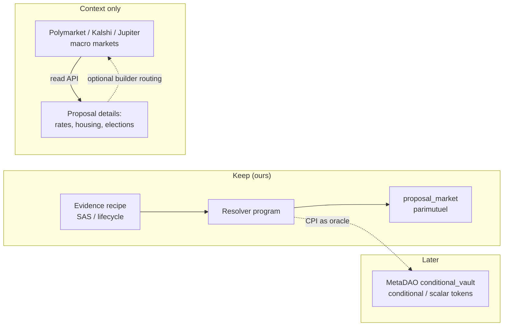

# Integrating existing prediction markets (Solana) — research

Should Urban Game Theory run its markets on an existing prediction-market protocol instead of our
own `proposal_market` program, to gain network effects, liquidity and mature technology?

Researched 2026-09-24 (web sources plus our own read-only RPC and API calls). Prediction markets move
fast: re-verify any number or status here before relying on it.

## TL;DR

- **The network-effects thesis does not hold for parcel markets.** On Solana, liquidity lives only in
  *operator-curated* venues (Jupiter Predict routing Polymarket/Kalshi, World inside Phantom). None of
  them lets a third party list a market, none would list "will parcel X be rezoned by 2027", and none
  would accept our evidence as the resolution source. Kalshi's own NYC affordable-housing market has
  0–7 contracts of lifetime volume, so even a listed city-policy market would sit empty.
- **The protocols that do allow open market creation have no liquidity.** PNP Exchange: 206 mainnet
  program transactions in six months. Hedgehog: idle since July. Drift BET: $285M hack in April,
  since rebranded. Integrating one buys technology, not users.
- **No live protocol resolves the way we do.** Every Solana market settles through an admin, a
  council, the creator's wallet, an LLM, or a price feed. Our design — anyone can settle, from a
  precommitted recipe over Solana Attestation Service (SAS) evidence, with strict chronology — appears
  to be novel. That is the part worth keeping.
- **One primitive is worth adopting later: MetaDAO's `conditional_vault`.** It is audited, heavily
  used, lets our resolver program be the oracle, and supports conditional ("if proposal X executes…")
  and scalar payouts. It is a settlement/token layer only (no trading mechanism), and its code is BSL
  (call the deployed program, don't copy it).
- **Cheap wins now:** read macro context markets (rates, housing, elections) from the Polymarket,
  Kalshi and Jupiter public APIs; optionally route users to them via Polymarket's builder program,
  which pays up to 1% on taker orders.
- **The real blocker is legal, not technical.** Real-money YES/NO markets on Zagreb decisions very
  likely count as unlicensed betting under Croatia's Zakon o igrama na sreću, and ESMA (July 2026)
  treats financial event contracts as binary options barred for EU retail. Stay on devnet or
  non-transferable points until a Croatian lawyer says otherwise.

**Recommendation:** keep `proposal_market` and our resolver; add a read-only macro-market feed now;
treat `conditional_vault` as the path to conditional markets later; do not integrate PNP, Hedgehog
or Drift; get a legal opinion before any real-value stakes.

## What our markets need

From the current build (`HACKATHON.md`, `proposal_market`):

| Need | Why |
|---|---|
| Binary (later scalar/conditional) markets on niche, local, long-horizon land events | "Will proposal 763 be executed?", "will a matching court record appear after close?" |
| Resolution from our own precommitted evidence recipe, permissionless, with chronology | The core "verifiable hyperstition" claim: a future can't declare itself true |
| Programmatic creation by agents | Agents open and stake markets via x402-paid APIs |
| USDC collateral, devnet for development | Everything currently runs on devnet |
| Composability | Our programs (proposal NFTs, pledges) should read or settle the market |
| Legal operability for Croatian/EU users | Zagreb is the focus city |

## Landscape

### Protocols that allow open market creation

| Protocol | Status (2026-09) | Who creates | Mechanism | Custom resolver | Verdict |
|---|---|---|---|---|---|
| **PNP Exchange** `8PyE2diz…HuTb` | Live, near-idle (206 mainnet txs Mar–Sep) | Anyone via `pnp-core` SDK (Apache-2.0) | Bonding-curve AMM (creator seeds USDC), parimutuel, zero-capital | Yes (`createMarketCustom({oracle})`), **but** PNP admins can also settle and the settler can move `endTime` | Closed program source, admin override, inconsistent fee docs, creator bears one-sided loss. Not worth it |
| **MetaDAO `conditional_vault`** `VLTX1ish…VVg` | Very active | Anyone (`initialize_question`) | Conditional tokens only (split/merge/redeem, 2–10 outcomes, payout numerators); no AMM | **Yes**: the question's `oracle` must sign `resolve_question`, so our resolver PDA can settle via CPI | Best primitive. BSL 1.1; audited (Neodyme, Zenith). Liquidity must come from elsewhere |
| **Hedgehog parimutuel** `PARrVs6F…vGu` | Idle since 2026-07-28 | Anyone | Parimutuel, N options | Yes (resolver field, Invalid outcome, inactivity refund) | Near-identical to our program, unaudited, no users. Adds nothing |
| **Triad** | Live, LatAm focus | Verified partner frontends | Orderbook, Pyth "fast markets" | No (authority sets the winner) | Not usable |
| **Melee** | Invite-only beta ($3.5M seed) | "Anyone" (claimed) | Parimutuel with guaranteed minimum return | Unknown | No SDK or program IDs yet — watch |
| **Drift BET → Velocity** | $285M admin-key hack 2026-04-01; relaunch reportedly perps-focused | Council only | — | No | Exclude |
| Monaco/BetDEX, Hxro | Dormant since 2024 | — | — | — | Exclude |
| WAGR, Path Protocol | Unverified / red flags | — | — | — | Exclude |

### Liquid venues reachable from Solana

| Venue | What it is | Can we create markets? | Useful for |
|---|---|---|---|
| **Jupiter Predict** | Solana front end routing Polymarket (default) and Kalshi; positions in Jupiter's program; USDC/JupUSD | No | Embedding macro markets via its beta API (no builder fee yet; blocks US/KR, "parts of the EU") |
| **Polymarket** | Polygon (own L2 announced); UMA optimistic oracle with whitelisted proposers; Solana deposits via bridge | No (team-curated; suggestions via X) | **Builder program**: route orders, earn up to 1% taker / 0.5% maker; **Croatia not geoblocked** |
| **Kalshi** | CFTC exchange; resolves under its own contract terms | Only via its ideas portal; no guarantee | Linking out; data (city housing, rates). KYC; builder-code status unclear |
| **DFlow (tokenized Kalshi)** | Kalshi positions as SPL tokens | No | Avoid: docs removed, zero volume since July (shutdown unconfirmed) |
| **World** (in Phantom) | Chainlink-resolved, SPL settlement | No | Avoid: anonymous team, no public API |

### How markets resolve

| Mechanism | Who uses it | Fits our evidence? |
|---|---|---|
| Admin / council sets the outcome | Drift, Triad, most apps | No — trust sits in a key (Drift's council is exactly what was drained) |
| Creator's wallet settles | PNP custom-oracle markets | Only if the settler can be a program PDA (unconfirmed) and admins can't override (they can) |
| LLM oracle + DAO backstop | PNP default | No — we never let an LLM pick the outcome |
| UMA optimistic oracle | Polymarket (EVM only; no Solana deployment) | No; proposers now whitelisted; a 2025 vote-capture incident settled a $7M market falsely |
| Switchboard On-Demand | Any program | Possible for HTTP-sourced facts, but swaps our signed attestation for oracle operators fetching a URL — not more trustworthy |
| Pyth | Price markets | Prices only |
| **Program-as-oracle** | MetaDAO `conditional_vault` | **Yes** — our resolver checks the SAS attestation/lifecycle state, then CPIs `resolve_question` |

No prediction market we found resolves from SAS attestations.

## Conditional markets (futarchy)

The idea: "what will [metric] be if proposal X executes, vs. if it doesn't?" is the natural question
for competing proposals over the same land.

- **MetaDAO** runs futarchy for DAOs: proposals trade in pass/fail conditional AMMs for 3 days and
  pass on a TWAP threshold. New DAOs come in through a curated launchpad; one proposal at a time.
- **Futarchy elsewhere is advisory**: GnosisDAO's 9-month pilot (GIP-145) shows conditional prices
  next to votes without binding them; Optimism and Uniswap used play-money conditional funding
  markets to rank grants.
- **Fit for us:**
  - The structure fits (two conditional questions, "executed" vs "not", paying on a metric).
  - The blocker is the metric: there is no land-value token, and real values (sale prices,
    cadastral valuations) arrive years later and would themselves need attesting. A near-term proxy
    ("court/registry event by date T, conditional on execution") is possible.
  - Comparing *competing* proposals hits the known decision-market problems: voided branches,
    selection effects, and cheap manipulation by whoever controls the decision.
  - In MetaDAO the market decides; for us the city or a court decides. Our markets can only be
    **advisory**, which matches "verifiable hyperstition".
- No real municipal or urban-planning deployment of decision markets exists that we could find. The
  canonical warning is DARPA's Policy Analysis Market (cancelled 2003).

## Regulation (EU / Croatia)

| | Status |
|---|---|
| **Croatia** | Zakon o igrama na sreću (latest NN 72/25): betting on outcomes of "other events" offered by an operator is a game of chance reserved for the state or licensees (čl. 3, 4, 5, 6); foreign operators are banned and residents may not take part (čl. 68). Fines: company €6,630–66,360, organiser €3,980–13,270, player in a foreign game €1,320–6,630. The law also expects the deciding event not to be influenceable by organiser or players — awkward when proposers can trade. **A real-money market on a Zagreb proposal very likely counts as unlicensed betting.** |
| **EU financial law** | ESMA statement 2026-07-03: event contracts that are financial instruments are binary options; selling them to retail is banned under the 2018 national measures. Non-financial events fall to national gambling law. |
| **EU gambling enforcement** | Polymarket blocked or close-only in France (ISP block 2026-07-16), Belgium, Poland, Romania, Portugal, Hungary, Bulgaria, Spain, Denmark, the Netherlands; Ireland requires a licence from 2026-07-01. |
| **MiCA review** | Commission consultation on where prediction markets belong closes **2026-09-30**; reports due by 2027-06-30. |
| **US** | Kalshi and Polymarket US are CFTC-regulated; CFTC's June 2026 proposal treats terrorism/assassination/war contracts as against the public interest and flags insider trading by candidates. |

Integrating an external protocol does **not** change our legal position: we would still be the ones
offering Croatians markets on Zagreb events.

### Design constraints we should adopt regardless

1. Markets only on proposals and institutional outcomes — never on a person's health, death, arrest
   or conduct, and never on outcomes reachable through harm.
2. Nothing pays out on obstruction by a single party ("a lawsuit is filed", "a permit is denied"):
   leave those out of the settlement set or make them void conditions.
3. Proposers, parcel owners and linked officials may not trade their own markets (best effort, via
   attested role flags).
4. Stake and position caps; play money or non-transferable points while on devnet; all positions public.
5. Keep strict chronology (built); add a void/refund path for ambiguous evidence and a challenge
   window before finalization.
6. Label markets advisory: they never bind a decision.
7. Attester keys in a multisig or rotated, and the attester named in each recipe.

## Options for us

| Option | What it buys | Costs / risks | Verdict |
|---|---|---|---|
| **A. Keep `proposal_market` + our resolver** | Our novel, trust-minimised resolution; full control; already built and tested | We own maintenance and audits; no outside liquidity (none is available anyway) | **Keep** |
| **B. Adopt MetaDAO `conditional_vault` as the settlement/token layer** | Audited standard outcome tokens; conditional and scalar markets; composability with MetaDAO AMMs | We still supply liquidity; BSL (use via CPI only); migration work | **Later**, when conditional markets are on the roadmap |
| **C. Create markets on PNP with our PDA as settler** | Ready AMM + SDK, creator fees | Admin can override settlement; closed source; ~no users; creator loses on one-sided markets | No |
| **D. Route users to macro markets** (Polymarket builder program; Jupiter API) | Relevant context (rates, housing, elections) next to proposals; possible fee revenue | Polygon for Polymarket (bridge from Solana); Jupiter API beta without builder fee; EU geoblocks | **Optional**, after legal check |
| **E. Read macro markets as a data feed** | Free, keyless context signals | None of them covers Zagreb | **Do now** |

## Suggested next steps

1. **Legal opinion (Croatia)** before any real-value stakes; meanwhile devnet or non-transferable
   points only. Consider responding to the EU MiCA consultation before 2026-09-30.
2. **Macro context feed**: read-only integration of Polymarket Gamma/CLOB and Kalshi public APIs,
   curated per city (e.g. ECB rate, Croatian elections, EU housing), shown as context — no trading.
3. **Write the design constraints above into the market-creation code** (allowed subjects, no
   obstruction payouts, participant exclusions, caps, void path).
4. **Prototype B on devnet** only when conditional markets are next: create a `conditional_vault`
   question with our resolver PDA as oracle and settle it via CPI (confirms the one untested claim).
5. **Re-check in 6 months**: Melee (open creation, guaranteed-return parimutuel), Polymarket
   permissionless creation, and any Solana optimistic oracle.

## Unconfirmed / possibly stale

- Whether PNP settlement works via CPI from a program (docs say yes; untested).
- DFlow's prediction product shutdown (inferred from removed docs and zero volume; no announcement).
- Kalshi builder-code status in 2026; Kalshi's treatment of Croatian users.
- Which EU countries Jupiter Predict blocks.
- Hedgehog's claimed 2026 relaunch and volumes; Melee's volume figures; Path Protocol's existence.
- Whether Polymarket remains reachable from Croatia in practice.

## Sources (accessed 2026-09-24)

- PNP: https://docs.pnp.exchange/ · https://www.npmjs.com/package/pnp-core
- MetaDAO: https://github.com/metaDAOproject/programs · https://docs.metadao.fi/governance/proposals.md · https://docs.metadao.fi/governance/twaps.md
- Hedgehog: https://github.com/Hedgehog-Markets/hedgehog-program-library
- Triad: https://docs.triadmarkets.app/
- Melee: https://pmm.melee.markets/litepaper
- Drift hack: https://www.chainalysis.com/blog/lessons-from-the-drift-hack/
- Jupiter Predict: https://developers.jup.ag/docs/prediction · https://www.coindesk.com/markets/2026/02/02/jupiter-brings-polymarket-to-solana-and-lands-usd35-million-investment-deal
- DFlow: https://solana.com/news/dflow-prediction-markets-api · https://solanacompass.com/news/phantoms-disclosure-page-reveals-world-prediction-markets-as-its-solana-infrastructure-provider
- World: https://www.theblock.co/post/406900/solana-based-prediction-market-app-on-phantom-wallet-launches
- Kalshi: https://help.kalshi.com/en/articles/13823833-suggesting-a-new-market · https://news.kalshi.com/p/kalshi-solana-tokenized-predictions
- Polymarket: https://help.polymarket.com/en/articles/13364541-how-are-markets-created · https://docs.polymarket.com/programs/builders/fees.md · https://docs.polymarket.com/api-reference/geoblock · https://docs.polymarket.com/concepts/resolution.md
- Switchboard: https://docs.switchboard.xyz/docs-by-chain/solana-svm/prediction-market/prediction-market-tutorial
- SAS: https://solana.com/news/solana-attestation-service
- Futarchy pilots: https://gov.optimism.io/t/futarchy-v1-preliminary-findings/10062 · Chen, Kash et al., "Decision Markets with Good Incentives"
- ESMA: https://www.esma.europa.eu/press-news/esma-news/esma-reminds-firms-existing-rules-and-obligations-under-binary-option-measures
- MiCA review: https://finance.ec.europa.eu/regulation-and-supervision/consultations-0/targeted-consultation-review-mica-regulation_en
- Croatian law: https://www.zakon.hr/z/315/zakon-o-igrama-na-srecu
- EU enforcement: https://fintelegram.com/france-blocks-polymarket-europe-prediction-markets-regulation/
- CFTC: https://www.cftc.gov/PressRoom/PressReleases/9185-26
