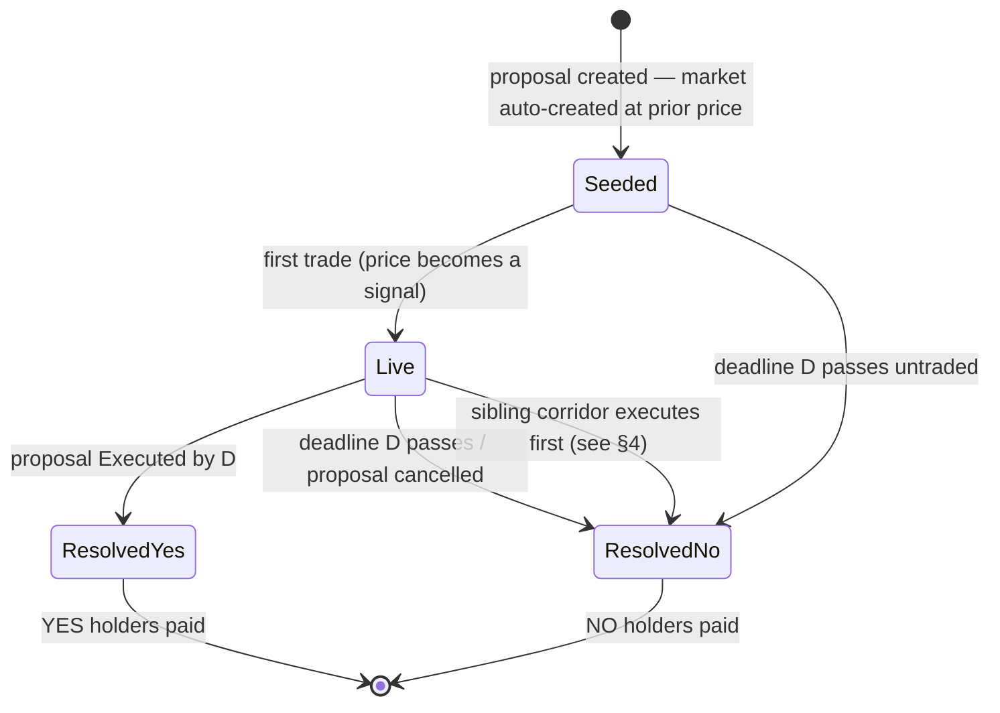

# Prediction Markets on Proposals

Research/viability doc for attaching a passive, automatically-created prediction market to every proposal ("will this proposal reach all-accept by date D?"). Focus: whether markets are viable when tiny or empty, how to bootstrap them cheaply, and whether they actually help proposals — especially the bot-generated corridor races in [algorithmic-corridors.md](algorithmic-corridors.md) — reach fruition. Verdict up front: **yes, viable even at zero traders, if built as an AMM-backed market with a small bounded subsidy and honest zero-trade UX; play-money first for EU-regulatory reasons.**

## 1. The idea

Every proposal, at creation, automatically gets a binary market: *"Will proposal X be Executed (all affected owners accepted) by date D?"* Nobody sets it up, nobody has to market-make it, and resolution is mechanical.

The oracle problem — usually the hardest part of prediction markets — is trivial here: the resolving event is **objective, on-platform state we already maintain**. Off-chain it is the `status='Executed'` transition (`frontend/js/proposals/execution.js:1453`); on-chain it is `ProposalNFT.sol` reaching `acceptanceCount == parcelIds.length` (`:215`), with `expiryTimestamp` already on the proposal struct as a natural resolution date. No external oracle, no dispute layer (no Augur/UMA machinery) needed.

## 2. The empty-market problem (the core question)

A naive market with an order book and no participants is a dead page: nobody to trade against, no price, no information. Classical theory says it can stay dead — the **no-trade theorem** (Milgrom & Stokey 1982): purely information-motivated traders won't trade with each other, because someone offering you a bet is itself evidence you should refuse it.

The fix is **an automated market maker (AMM)**: the platform itself is always willing to take either side at a quoted price, at a bounded, pre-known worst-case cost. That dissolves both problems at once — there is always a counterparty, and the AMM plays the "uninformed liquidity" role that lets informed traders profit and thus reveal what they know.

### 2.1 LMSR — the canonical mechanism

Hanson's **Logarithmic Market Scoring Rule** ([implementation guide](http://blog.oddhead.com/2006/10/30/implementing-hansons-market-maker/), [Chen & Pennock](https://lance.fortnow.com/papers/files/LMSR.pdf)):

- Cost function `C(q) = b·ln(Σᵢ exp(qᵢ/b))`; the price of outcome i is `exp(qᵢ/b) / Σⱼ exp(qⱼ/b)` — prices always sum to 1 and move continuously with each purchase.
- The liquidity parameter **b** sets depth: small b → a tiny bet swings the price a lot (fast aggregation, fragile); large b → sticky prices (stable, expensive to move, larger subsidy).
- **The worst-case loss of the operator is bounded and known in advance: `b·ln(N)`** — for a binary market, `b·ln 2 ≈ 0.69·b`. That bound *is* the price of the information: a pre-committed budget to buy an aggregated forecast.

Concrete numbers for auto-creating markets at scale:

| b | Max loss per binary market | 200 live markets, total worst case |
|---|---|---|
| 10 | ~6.9 units | ~1,386 units |
| 50 | ~34.7 units | ~6,931 units |
| 100 | ~69.3 units | ~13,863 units |

("Units" = whatever the market trades in — points, city tokens, or euros.) Worst case only occurs when every market resolves maximally against the maker; realized cost is typically far lower. **Dozens-to-hundreds of auto-created micro-markets are affordable by construction.**

Two refinements worth knowing:

- **LS-LMSR** (liquidity-sensitive LMSR, [Othman, Pennock, Reeves, Sandholm](https://www.cs.cmu.edu/~sandholm/liquidity-sensitive%20market%20maker.EC10.pdf)): depth grows with trading volume and a small spread funds the subsidy, so the operator can approach zero loss and **doesn't have to guess b per market up-front** — picking b is acknowledged as LMSR's hardest practical problem, so this is the better default for hundreds of unattended markets.
- **CPMM / Maniswap** (Manifold's constant-product variant, [mechanics](https://news.manifold.markets/p/above-the-fold-market-mechanics)): simpler pool math, parametrized directly by an initial probability; Manifold's subsidy schedule (~20 mana per unique trader for the first 50 traders) is the reference pattern for play-money "liquidity grows with participation." Polymarket's move from AMM to an order book — which then needed paid market-maker programs to avoid empty books — is the cautionary tale for why micro-markets should stay AMM-based.

### 2.2 What does a zero-trade price mean?

Nothing — and the UX must say so. Before the first trade, the price is exactly the **seeded prior**: whatever we initialized it to (50%, or better, a model-derived prior — see §6 Phase 0). It becomes a signal at the *first informed trade*, because with an AMM one trader suffices; no counterparty needs to show up.

UX rules that follow:

- Show "no trades yet — starting estimate X%" instead of a bare percentage.
- Surface trade count / unique traders / total liquidity as confidence badges; "moved by 7 traders" is the honest headline, not volume.
- A market that sits at its prior until deadline resolves normally and cost the platform ~nothing — an untraded market is cheap, not broken.

## 3. Do tiny markets actually work? (evidence)

The empirical record on thin markets is surprisingly good:

- **Corporate internal markets** — Cowgill & Zitzewitz, *Corporate Prediction Markets: Evidence from Google, Ford, and Firm X* ([paper](https://funginstitute.berkeley.edu/wp-content/uploads/2014/04/CorporatePredictionMarkets1.pdf), Rev. Econ. Studies 2015): despite thinness, weak incentives, and participants with ulterior motives, prices beat expert forecasts by up to ~25% lower mean squared error, and biases *shrank* over time as a few experienced traders arbitraged them. Recurrent finding: **roughly 3% of traders do most of the price discovery**. We don't need crowds; we need a handful of informed participants — and on this platform, the *most* informed people (parcel owners, the proposer) are already users.
- **Iowa Electronic Markets** — stakes capped at $500, modest volume, yet beat polls ~75% of the time with errors of 1–3 points vs ~4.5 for polls ([long-run accuracy](https://www.biz.uiowa.edu/faculty/trietz/papers/long%20run%20accuracy.pdf)).

Known failure modes to design around:

- **Favorite–longshot bias**: low-probability outcomes get overpriced. Most corridor-race siblings *are* longshots — expect their prices to overstate their chances somewhat; interpret ranked prices (route B ≫ route A), not absolute tails.
- **Far-future anchoring / discounting** (Page & Clemen, InTrade evidence): markets on events years away drift toward 50% because capital is locked and time-discounted. **This is our main accuracy risk** — corridor assembly takes years. Mitigations: shorter-horizon **milestone markets** ("≥50% of parcels accepted by end of year", "the critical Kaštela-gap parcel accepted by June"), and/or interest-bearing collateral so parking money in a position isn't dead weight.
- **Thin-market manipulation** — see §5; the literature's answer is unexpectedly favorable.

## 4. Would markets help corridors get built?

This is the strategic question, and the answer is yes through four channels — the first one being the interesting mechanism-design twist:

1. **The bettor-lobbyist alignment.** In most markets, a participant who can influence the outcome they bet on is a problem. Here it is the point: an owner (or corridor enthusiast) who buys YES and then *lobbies the holdout neighbors* to make it come true is doing exactly what the platform wants. The manipulation literature backs this up: Hanson & Oprea show a manipulator's activity adds liquidity and raises returns to informed trading, *increasing* net accuracy ([A Manipulator Can Aid Prediction Market Accuracy](https://hanson.gmu.edu/biashelp.pdf)); experimentally, incentivized manipulators failed to make observers less accurate ([Oprea et al.](https://digitalcommons.chapman.edu/esi_working_papers/148/)). The market converts forecasting into an **incentive to act**.
2. **An odds board over the corridor race.** With 24 sibling alignments from [algorithmic-corridors.md](algorithmic-corridors.md), the central coordination question is "which route is actually going to assemble?" Live prices ("route B at 62%, route A stuck at 15%") concentrate everyone's attention, acceptances, and offer money on the viable route — the race's missing scoreboard. When one sibling executes, its siblings' markets resolve NO (a rule to encode explicitly, see the lifecycle diagram in §1).
3. **A signal for the proposer.** A price sagging toward zero months before deadline tells the bot/proposer to raise the offer, re-route around the parcels the market has identified as stuck, or abandon early — cheaper than waiting for expiry.
4. **A (small) hedge for owners.** An owner banking on the payout can buy NO as insurance against the corridor failing. At play-money scale this is symbolic; it becomes real only in a later real-money phase.

The honest counter-case: with a small user base, **most markets will sit at their prior forever**, giving no signal. That costs almost nothing (the subsidy is only lost to *informed* traders), but it means markets should be judged as a cheap option that pays off on exactly the contested, high-attention proposals — corridor races — not as guaranteed signal on every parking-lot proposal. Also: prices on the platform's own proposals create reflexivity (a low price can demoralize acceptance). Mitigation is the same honesty rule — an untraded prior is displayed as a prior, not as doom.

A note on **futarchy**: conditional markets ("land value *if* corridor built" vs "*if not*") are the Hanson/futarchy territory now live in production at MetaDAO on Solana ([Helius writeup](https://www.helius.dev/blog/futarchy-and-governance-prediction-markets-meet-daos-on-solana)). Our plain "will it trigger" market dodges futarchy's main critiques (conditional prices reveal correlation, not causation — [dynomight](https://dynomight.net/futarchy/), [LessWrong](https://www.lesswrong.com/posts/mW4ypzR6cTwKqncvp/futarchy-is-parasitic-on-what-it-tries-to-govern)) because it predicts an objective event rather than steering a decision. Conditional value-markets are a possible v3, as decision support only — never as an execution trigger.

## 5. Regulation (decisive for the design)

- The **EU has no prediction-market framework**. Real-money event contracts risk classification as unlicensed gambling (member-state law) or as MiFID II binary options — which ESMA has effectively banned for retail. Spain blocked Kalshi and Polymarket in May 2026; only Gibraltar has licensed an operator. **MiCA does not cover prediction markets** ([Norton Rose Fulbright overview](https://www.nortonrosefulbright.com/en/knowledge/publications/290d594a/the-eus-approach-to-prediction-markets-and-event-contracts), [legal tracker 2026](https://europeangaming.eu/portal/latest-news/2026/05/21/204906/prediction-markets-regulation-in-europe-legal-tracker-2026/)).
- Real-money markets where affected owners trade on outcomes they influence would add insider-trading-flavored concerns on top.
- **Conclusion: launch play-money** (points or the existing per-city `CityMemeToken` in a explicitly-valueless mode). Play-money forecasting has a decent accuracy record (Manifold; Servan-Schreiber et al. found play ≈ real money accuracy — cite to verify when writing the implementation spec). Real money on Base becomes a later, clearly-flagged experiment if a compliant path appears.

## 6. Recommendation and phased plan

**Attach markets to all proposals; build them as play-money LS-LMSR micro-markets with model-seeded priors; treat corridor races as the flagship use case.**

- **Phase 0 — prior only, no market.** Compute and display a heuristic "likelihood of execution by D" per proposal: parcel count, distinct-owner count, acceptance velocity so far, offer size vs assessed value, parcel criticality across siblings (from the corridor generator). Ships value immediately and later becomes the seeded prior. Pure backend+UI, no mechanism.
- **Phase 1 — play-money AMM.** One binary LS-LMSR market per proposal (b-equivalent loss budget ~5–50 points), auto-created on upload, resolved by the existing execution/expiry/cancel transitions and the sibling-executes-first rule. Milestone sub-markets for long-horizon corridors. Zero-trade-honest UI (badges from §2.2). This is where we learn whether *our* users trade at all.
- **Phase 2 — optional real money on-chain.** Only if Phase 1 shows genuine trading and a regulatory path exists: a market contract alongside `ProposalNFT` (which already holds per-proposal escrow, `ethBalance`/`tokenBalance`, and emits `ProposalAccepted`/`FundsDistributed` events a market contract can resolve against), USDC-collateralized, on Base. Gnosis conditional-token framework is the natural building block.

Viability verdict, restated: the mechanism is sound at zero traders (AMM + bounded subsidy), the cost is capped and small, the oracle is free, and the strategic upside (bettor-lobbyists + an odds board over algorithmic corridor races) is aligned with the platform's core goal. The genuine unknown is participation — which Phase 1 measures for the price of a few thousand play-points.

## 7. Open questions

- **Who funds subsidies** in a real-money phase — platform treasury, the proposer (as part of `mintAndFund`), or the corridor bot's budget? In play-money it's a non-issue.
- **Prior model** for Phase 0: what features, trained/calibrated on what (few executed proposals exist yet — start heuristic, calibrate later)?
- **Disclosure**: should owners of affected parcels be labeled when trading their own proposal's market (transparency), or is anonymous participation the point (reduces social pressure on holdouts)?
- **Resolution date D**: proposal `expiryTimestamp` is the natural default, but corridors may want rolling deadlines or milestone chains instead of one far date.
- **Sibling resolution**: when corridor alternative B executes, do A/C/…-markets resolve NO instantly or at their original D? Instant NO is cleaner and is what the lifecycle above assumes.
- **Croatian gambling law** treatment of play-money contests with any prize component — verify before attaching any reward to play-money performance.
