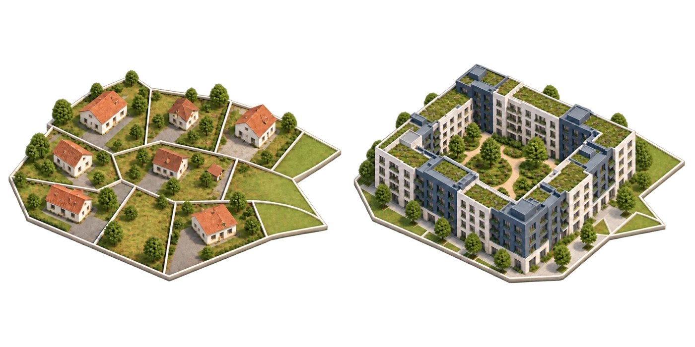

<!-- Public introduction to Consensus Builder, its live capabilities, and the developer reference. -->
# Consensus Builder · Urban Game Theory

**Explore real land. Draw a possible future. Share it with the people it affects.**

Consensus Builder is a free browser-based toolkit for exploring and sharing urban development ideas. Start with a familiar neighbourhood, design buildings, streets and public spaces, and combine your proposals into a plan others can inspect in 2D and 3D.

**[Open the website](https://urbangametheory.xyz/)** · [How to use](https://urbangametheory.xyz/how-to-use.html) · [Roadmap](https://urbangametheory.xyz/roadmap.html) · [X / @UrbanGameTheory](https://x.com/UrbanGameTheory) · [Telegram](https://t.me/urbangametheory)

## What you can do

| Capability | What it lets you explore |
| --- | --- |
| **Real parcels and local context** | Inspect cadastral geometry, buildings, streets and available ownership information from city-specific sources. |
| **Buildings and neighbourhoods** | Create city blocks, row houses, detached houses and freeform buildings; edit their geometry and heights directly on the map. |
| **Streets and transit** | Draw roads and rail tracks, adjust corridor cross-sections, and place bus, tram and rail stations. |
| **Public space** | Propose parks, squares and lakes alongside new development. |
| **Land readjustment** | Explore new parcel boundaries and how a group of parcels could accommodate a different urban layout. |
| **Reversible alternatives** | Apply, unapply and edit designs to explore different combinations before choosing what to share. |
| **2D and 3D** | Move between the map and a spatial model. Photorealistic context and street-level walkthroughs are available where supported. |
| **Shareable proposals and plans** | Publish a single intervention or a multi-proposal plan as a link, so recipients can open and inspect the same design. |
| **Plan analysis** | Inspect plan statistics, building density and road measurements; explore ownership and acquisition context where the underlying data is available. |
| **Area monitoring** | Define areas to follow land-related changes through the monitoring tools available in supported locations. |
| **Multiple languages** | Use the interface in English, Croatian, Serbian or Spanish. |

Drawing and exploring do not require a crypto wallet. Available datasets, ownership detail, monitoring and advanced views vary by location; a city preset does not imply complete or equally detailed coverage.

## A growing world of cities

The live website has **97 city presets as of 7 October 2026**, alongside a world view for discovering places and exploring beyond the configured cities. The deployed app currently includes more city integrations than this repository's `main` branch.

Try [New York](https://urbangametheory.xyz/?city=new_york&lang=en), [Amsterdam](https://urbangametheory.xyz/?city=amsterdam&lang=en), [Tokyo](https://urbangametheory.xyz/?city=tokyo&lang=en), [São Paulo](https://urbangametheory.xyz/?city=sao_paulo&lang=en), [Cape Town](https://urbangametheory.xyz/?city=cape_town&lang=en) or [Sydney](https://urbangametheory.xyz/?city=sydney&lang=en). Choose another city from the world view.

See the full city list

| Region | Configured cities |
| --- | --- |
| Europe | Zagreb, Split, Šibenik, Belgrade, Ljubljana, Paris, Lyon, Amsterdam, Rotterdam, Antwerp, Berlin, Essen, Cologne, Dortmund, London, Manchester, Birmingham, Madrid, Barcelona |
| Asia | Shenzhen, Hong Kong, Tokyo, Nagoya, Osaka, Savar, Doha, Dubai, Amman, Muscat |
| Africa | Cape Town, Cotonou, Bamako, Luanda, Lusaka |
| Latin America | Buenos Aires, Bogotá, São Paulo, Lima |
| Canada | Toronto, Montreal |
| Australia | Melbourne, Sydney |
| United States | New York, Denver, Los Angeles, Miami, Washington, D.C., San Francisco, Montgomery, Juneau, Phoenix, Little Rock, Sacramento, Hartford, Dover, Atlanta, Honolulu, Boise, Springfield (Illinois), Baton Rouge, Augusta (Maine), Annapolis, Boston, Indianapolis, Des Moines, Lansing, Saint Paul, Jefferson City, Helena, Lincoln, Concord (New Hampshire), Trenton, Santa Fe, Albany, Raleigh, Bismarck, Columbus, Salem, Nashville, Austin, Salt Lake City, Montpelier, Richmond, Carson City, Charleston (West Virginia), Cheyenne, Columbia (South Carolina), Harrisburg, Jackson (Mississippi), Madison, Olympia, Providence, Tallahassee, Topeka, Frankfort, Oklahoma City, Pierre |

City integrations combine different public sources. Some are regional, partial or historical datasets. Consult the app's source information before using a particular area in a workshop or analysis.

## Start with a place you know

1. Open the map and choose a city or neighbourhood.
2. Select parcels, or draw a site where the live app supports planning without cadastral coverage.
3. Add a building, block, park, square, road or track and adjust the design.
4. Explore alternatives in 2D and 3D, then share a proposal or plan link.

The tool can support early design discussions, planning workshops, architecture teaching and community proposals. We welcome city planning teams, researchers and civic groups interested in trying it on one concrete local site. [Get in touch on Telegram](https://t.me/urbangametheory).

## Experimental coordination tools

Urban Game Theory also explores how humans and AI agents could propose, back and forecast changes to real land. **Hyperstition: Markets for Possible Cities** demonstrates proposal support, prediction markets and public-record evidence on **Solana Devnet**, alongside agent/API integrations. These are experimental paths with their own setup and scope.

[Explore the live demo](https://urbangametheory.xyz/hackathon-demo.html) · [Read the deck](https://urbangametheory.xyz/deck.html) · [Browse the hackathon branch](https://github.com/Poglavar/consensus-builder/tree/colosseum-worlds-fair)

## Code and local development

The planning client uses JavaScript, Leaflet and Three.js; the backend uses Node.js, Express and PostgreSQL/PostGIS. Optional blockchain integrations live under `blockchain/`.

- [`frontend/`](frontend/) — map, editing tools, visualisations and interface.
- [`backend/`](backend/) — parcel/data services, shared proposals, monitoring and agent services.
- [`blockchain/`](blockchain/) — chain contracts and experimental integrations.
- [`rekonstrukcije/`](rekonstrukcije/) — reconstructed plans and built projects with source provenance.
- [`world-parcels/`](world-parcels/) — parcel-source research and coverage evidence.

For local development, install the backend dependencies with `npm ci` in `backend/`, configure `backend/.env` for your existing PostgreSQL/PostGIS database and required services, and make the `serve` CLI available. Run `./dev.sh` from the repository root; it selects local frontend/API ports and prints the URL. Optional datasets and provider integrations need their own configuration.

Run the fast backend checks with `npm test` in `backend/`. See [`TEST.md`](TEST.md) for the wider test setup.

Developer reference: terminology, interface elements and proposal lifecycle

Reconstructed real plans and built projects live in [`rekonstrukcije/`](rekonstrukcije/). That directory preserves their source geometry and provenance while expressing the reconstructed urban form through the same proposal model used by the app.

Terminology notes:

- A key concept is a Proposal
- Plans are (unordered) collections of proposals
- Parcel is a geographically bounded piece of land
  - all land is covered in parcels
  - parcels never overlap
  - parcels have owners
- A Block is a group of parcels fully enclosed by public-access roads or track (corridor) with vehicular access. Within the block exist only footpaths (bicycles too?). A very large block will have various internal crosspaths, but if these are not through-traffic it is still a block. If you can pass through a block on a public access road it is actually two blocks, not one, even if from the air it looks like a block otherwise.
- Parcels do not (directly) descend from parcels, but from proposals. Proposals do not (directly) descend from proposals, but from parcels.
- Parcels have ancestor/descendant proposals
- Proposals have parent/child parcels

List of UI objects.

- modal: takes over the input, is large (most of screen), lots of functionality
- dialog: takes over the input, is small, little functionality, can be alert only
- panel: a UI element that takes only a part of the screen and doesn't take over the input

Modals:

- Agent Details
- Proposal List

Panels:

- Parcel Info
- Proposal Details
- Block Info
- Sidebar

Dialogs:

- Share proposal dialog
- Mint parcels as NFTs dialog

Object lifecycle (the SimCity model):

- Drawing or clicking a Build tool creates an APPLIED object on the map immediately — auto-named, no dialogs. What is on the map IS the draft: it stays editable (geometry, cross-section, width) until it is proposed.
- Objects can be Unapplied (kept in the proposals list, removed from the map), edited in place, or deleted. Unapplied proposals render nowhere except as a preview when selected.
- Entry points: the Build palette on the parcel info panel (Block, Row houses, Freeform, Detached, Reparcel, Park, Square, Lake, Offer) for parcel-scoped types; R for roads, T for tracks. Park/square/lake are one click — their geometry is the selection's union.
- "Create proposal" on an object opens the terms dialog (offer, expiry, minting). Submitting absorbs the unminted source object so exactly one thing remains; minted proposals are immutable and stay behind as superseded.
- Roads are authored formations: one proposal may contain several centerline stretches, including disconnected stretches left by a taking or an edge removal. Editing creates one replacement snapshot and never absorbs, splits, or rewrites another road. The full derived corridor polygon is both the taking and cutting geometry; level tunnels take the surface too.
- Roads built through applied parks/squares/lakes cut them at render time only: the structure remains ONE proposal and heals if the road moves or is removed.

