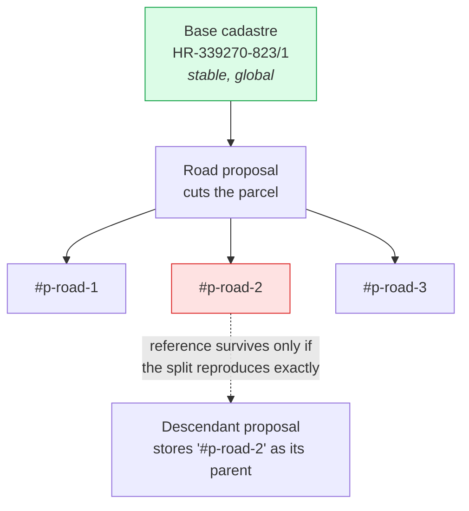
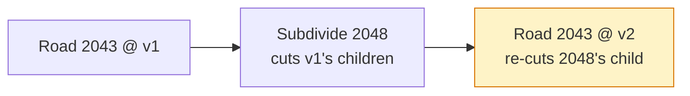

# Rethinking proposals, parcels and ancestry

Working document. Captures what broke, what we measured, which dilemmas are still open, and which
approaches are worth investigating. Nothing here is implemented yet except where marked SHIPPED.

Written 2026-07-21 after two production failures traced to the same root: **proposals identify the
land they affect by pointing at parcels that only exist in one browser's memory.**

---

## 1. The model we have today

Every proposal stores `parentParcelIds` — the parcels it was authored against. Those ids come in two
very different flavours, and the system treats them as one thing:

| Flavour | Example | Exists where |
|---|---|---|
| **Base cadastral** | `HR-339270-823/1` | Everywhere. Real-world land registry. |
| **Derived** | `HR-339270-823/1#p-2g0teu3onpu-2` | Only in the browser that generated it. |

A derived id is minted when a *fabric-changing* proposal (road, reparcellization) cuts a parcel. The
id is composed from `(root parcel, proposal token, running index)` and is **re-derived on every
apply** — deliberately:

> child parcel ids are assigned solely by the id subsystem from the current rules — deterministically
> derived from (proposalId → token, root parcel, running index). A proposal never carries a canonical
> id list to reproduce […] No canonical list is honored anywhere.
> — `proposal-parcel-identity.js`

That is sound as long as the split reproduces identically. It does not, and cannot in general.



---

## 2. What actually broke

### 2.1 The parcel hole (fixed)

An applied freeform building was counted as a *blocker* by
`_filterChildFeaturesBlockedByDescendants`. When the road beneath it was re-applied after an edit, the
road hid the parent parcel and skipped re-creating the slices the building claimed. Measured on prod:
parent `HR-339270-6804/1` (13,350 m²) came back as 2,644 m² of children — a **9,919 m² hole** with no
clickable parcel under the building.

Fixed in `350a9ed`: only typologies that genuinely *consume* their parents (road, reparcellization,
decide-later) may block a slice. Buildings and structures overlay, and `apply/buildings.js` /
`apply/structures.js` never touch the parcel layer at all. — **SHIPPED**

### 2.2 The unshareable plan (partly fixed)

Sharing a plan required every ancestor to already be on the server before its descendant could be
POSTed. Two proposals were each other's ancestor, so no order existed and five rows were permanently
stuck.

Fixed in `baddb2b`: the gate now checks **completeness** (is every ancestor part of the plan being
shared) rather than **order**. Nothing depends on upload order — proposals are POSTed independently,
the server stores ancestor ids as an opaque `ancestor_parcel_ids` column with no foreign key, and
apply order is decided at apply time. — **SHIPPED for the plan dialog only.** The single-proposal
upload paths (`dialog-upload.js`, `dialog-create.js`) still gate on order and can still deadlock.

### 2.3 Replay in a fresh browser (open)

The uploaded plan (#97–#104) applied 6/8 in a clean browser. The two failures were both
fabric-changers, both reporting "Missing prerequisite parcels". Root cause below.

---

## 3. Measured evidence

All numbers below are reproducible with:

```
node scripts/analyze-plan-ancestry.js --ids 97-104
```

Read-only — it fetches the plan and the cadastre from the public API and writes nothing.

### 3.1 Ghost references exist at rest, on the server

Of 14 derived-parent references in the plan, **3 are ghosts** — they name parcels their own creator no
longer mints:

```
#100 -> #102  via HR-339270-823/1#p-2g0teu3onpu-2   << creator no longer mints this id
#100 -> #102  via HR-339270-823/2#p-2g0teu3onpu-1   << creator no longer mints this id
#100 -> #102  via HR-339270-823/6#p-2g0teu3onpu-1   << creator no longer mints this id
```

Road 2043's recorded children are `823/1#…-1, -3, -4` and `823/2#…-2`. The ids Subdivide 2048 depends
on were minted by an **earlier version** of Road 2043 and destroyed when it was edited. This is not a
race or a partial apply: the reference was already dead in the database before any recipient touched
it. These three are exactly the "Missing prerequisite parcels" from the failed replay.

### 3.2 The cycle is an artefact of having no proposal versions

```
#100 Road 2107-2043  ⇄  #102 Subdivide 2107-2048
```

Road 2043 lists **both** `HR-339270-823/1` (base) and `HR-339270-823/1#p-1mkonr8j4t2-1` (a child of
Subdivide 2048) as parents. That is two versions of one proposal collapsed into a single record. The
real history was linear:



As a sequence: fine. As a graph with one node per proposal: unsatisfiable. **We manufacture the cycle
ourselves by discarding the version dimension.**

### 3.3 Fabric-changers do not geometrically conflict

Pairwise intersection of every proposal footprint in the plan:

| Pair | Intersection | Relationship |
|---|---|---|
| #100 Road 2043 × #102 Subdivide 2048 | **0 m²** (raw 0.0012) | the "cycle" pair — they *abut*, sharing a border |
| #97 Subdivide 2042 × #98 Road 2045 | 128 m² | road operates **inside** the subdivided area (nesting) |
| #98 Road 2045 × #102 Subdivide 2048 | 15 m² | road clips the edge of the subdivided area |
| #97 Subdivide 2042 × #99 Square 2054 | 4,388 m² (100%) | overlay sits inside fabric — by design |
| #102 Subdivide 2048 × #103 Square 2049 | 2,907 m² (100%) | overlay sits inside fabric — by design |

The pair that made the plan unshareable **does not overlap on the map** — it shares a boundary and
nothing else. Where fabric-changers genuinely do intersect, one is *nested inside* the other's output
— a sequence, not a conflict.

This makes sense structurally: two proposals that were applied simultaneously on the author's machine
cannot be in true geographic conflict, or the apply would have refused. The exception is two
reparcellizations repartitioning the same area, which conflict by definition and are already
prevented.

### 3.4 Base ancestry replays cleanly

Recomputing every proposal's parents by intersecting its own geometry with the current cadastre:

| # | Proposal | Declared parents | Recomputed base parents |
|---|---|---|---|
| 97 | Subdivide 2042 | 1 base | `824` |
| 98 | Road 2045 | 1 derived | `824`, `823/1` |
| 99 | Square 2054 | 1 derived | `824` |
| 100 | Road 2043 | 8 base + 1 derived | `6804/1, 823/1, 6801, 823/2, 6804/9, 6804/6, 6811` |
| 101 | Park 2047 | 2 base + 3 derived | `6804/1, 6804/6, 6804/4, 6804/7, 6804/9` |
| 102 | Subdivide 2048 | 2 base + 3 derived | `823/1, 823/2, 823/6, 823/5, 823/7` |
| 103 | Square 2049 | 1 derived | `823/1, 823/2, 823/6, 823/5, 823/7` |
| 104 | Freeform-building 2053 | 4 derived | `6804/1, 6804/9` |

**Every proposal anchors to real cadastral parcels from its own geometry alone.** Creation order is a
valid replay order. Three proposals (99, 103, 104) currently declare *only* derived parents — those are
precisely the ones that cannot survive a trip to another browser.

### 3.5 Consent lists are currently incomplete

Square 2049 declares **one** parent (a derived parcel). Its geometry covers **five** base parcels:

```
823/1 (2279 m²), 823/2 (222), 823/6 (206), 823/5 (130), 823/7 (70)
```

Road 2045 takes 15 m² off `823/1`, which appears nowhere in its parent list — so that owner is never
asked. *(Caveat: 15 m² is near the noise floor; worth eyeballing before treating it as a real missed
owner.)*

Note what Square 2049 demonstrates: its affected-owner set is **five before** Subdivide 2048 executes
and **one after**. Both answers are correct. They differ only in when you ask.

### 3.6 Order matters only where footprints intersect — and only by that much

Section 4 of the script replays the plan through **all 24 permutations** of its four
fabric-changers (#97 reparcel, #98 road, #100 road, #102 reparcel), each step cutting the *current*
fabric, exactly as apply does. The four overlays change no fabric and are excluded.

Result: **4 distinct fabrics out of 24 orders** — and they are precisely the 2×2 of the two
intersecting pairs:

| total | parcels | #97 before #98 | #98 before #102 | sample order |
|---:|---:|:--:|:--:|---|
| 41,957 m² | 23 | true | true | `#97 → #98 → #100 → #102` |
| 41,942 m² | 23 | true | false | `#97 → #100 → #102 → #98` |
| 42,086 m² | 22 | false | true | `#98 → #97 → #100 → #102` |
| 42,071 m² | 22 | false | false | `#100 → #102 → #98 → #97` |

Cross-referenced against the measured footprint intersections from §3.3:

- `#97 × #98 = 128 m²` → toggling their order moves ~129 m² and one parcel (23 ↔ 22)
- `#98 × #102 = 15 m²` → toggling their order moves exactly 15 m²
- `#100 × #102 = 0 m²` (rounded; raw 0.0012 m², a sliver off their shared border — they abut, they
  do not overlap) → toggling their order changes **nothing at all**
- total road area is **identical (2,383 m²) in all 24 orders** — roads commute with each other

So: **fabric changes commute unless their footprints intersect, and where they do not commute the
discrepancy equals the intersection.** Order is not a global property of a plan; it is a pairwise
constraint over the few pairs that physically touch.

The decisive consequence: the pair that made the plan unshareable, `#100 ⇄ #102`, merely **abuts** —
the two footprints share a border and overlap by 0.0012 m², four orders of magnitude below the noise
floor. It commutes. Its ordering constraint was pure bookkeeping fiction.

---

## 4. The dilemmas

### D1. Replay a log, or ship a final state?

Two coherent models; we currently do a bit of both, which is why we get the failure modes of each.

- **Log / replay.** Record every step in order, share the log, replay it. Circularity is impossible
  because time is linear. Costly, and every step must be reproducible on a foreign machine.
- **Final state.** Share the end result. Simple, order-free — but "an urban plan for this area depends
  on the area existing, and the area is created by a road splitting a big parcel" is a genuine
  dependency that a pure final-state model discards.

Evidence from §3.3 suggests a third option: if fabric changes are **commutative** (base parcels minus
all road corridors, then repartitioned), then order does not matter and neither model is needed in
full.

### D2. What is the unit of consent?

If an owner's parcel is reparcelled, and an urban rule is then proposed on the resulting parcels, what
does the original owner vote on?

- **Per proposal.** Faithful to each step, but forces voting on hypotheticals: you cannot meaningfully
  accept step 5 without knowing steps 1–4 will happen. §3.5 shows the owner set is genuinely
  ambiguous before execution.
- **Per plan.** One vote, fully specified outcome, no hypothetical chaining. Matches how these are
  actually authored ("we create these complex plans"). Loses the ability to accept part of a plan.

**Open.** Leaning per-plan, undecided.

### D3. How much parcel identity does a proposal need?

- A building of a given size fits many parcel shapes, so in theory it is parcel-independent…
- …except **in Croatia a building must sit on its own parcel, exactly one**. So a building spanning
  three parcels legally implies a merge. A building is a fabric-changer in disguise.
- A park genuinely does not care about the parcel composition beneath it.
- But we still need base ancestry for **consent**, for **clickability** (originals must stay
  selectable and show what is stacked on them), and for **ownership**.

Conclusion so far: "parcelless" was too strong. The right split is **base** ancestry (needed by
everything) versus **derived** ancestry (needed by almost nothing, and the source of every bug here).

### D4. Live editing versus recorded ancestry

Dragging a road node changes the geometry of parcels under other proposals. It works locally. It is
also what mints a new generation of derived ids and orphans every reference to the old ones (§3.1).
Any model has to answer: when geometry moves, what happens to the references and to consent already
given?

---

## 5. Approaches to investigate

### A1. Base-parcel ancestry (flattening) — *WRITER SIDE BUILT; nothing reads it yet*

Every proposal stores the **base cadastral** parcels its geometry intersects, computed at creation and
recomputed on edit. Derived ids never appear in `parentParcelIds`.

If A is split by a road into B and C, and C is split into D and E, then B, D and E are all recorded as
descendants of **A**, not of C. Chains never form, so they can never dangle.

- Fixes: ghost references, cross-machine replay, incomplete consent lists.
- Loses: which *piece* of A a proposal sits on. §3.5 argues that loss is correct pre-execution.
- Cost: an intersection pass on create/edit.

Built so far — `cadastreParcelIds`, written alongside `parentParcelIds` and read by nothing:

| Layer | Where |
|---|---|
| pure logic | `frontend/js/proposals/plan-order.js` — `computeCadastreParcelIds`, `cadastreRootId`, `footprintOf` |
| map adapter | `frontend/js/proposals/cadastre-ancestry.js` — reads the live parcel index |
| stamped at **publish** | `buildUploadReadyProposal()` in `proposals/create.js` — the single funnel for upload, plan share and mint |
| API | `cadastreParcelIds` accepted, stored in `proposal.cadastre_parcel_ids`, returned by the serializer |
| migration | `backend/scripts/add-cadastre-parcel-ids.js` — dry-run by default, additive, idempotent |

Geometry is the primary source; the roots of whatever the proposal declared are merged in, so a
proposal can never be recorded as touching *less* land than it already claimed.

**Computed at publication, not at creation.** A road can be dragged around all afternoon, so there is
no useful "the parcels of this proposal" while it is still local and mutable — and a creation-time
stamp would freeze an answer nobody ever saw, then go stale on the first node drag. The moment that
counts is upload/mint: that snapshot is what other people replay and what owners consent to. So
`cadastreParcelIds` means *the cadastral parcels this proposal covered when it was published*, and its
absence means the proposal has never been published. It is not in `proposalContentFingerprint`'s
allowlist, so adding it can never change a share id.

### A2. Ship derived geometry with fabric-changers — *INSURANCE, not a necessity. Demoted.*

A road or reparcellization would transmit its **resulting parcels** (geometry, not ids), so apply
becomes "stamp these polygons down" instead of "re-derive and hope". The server already has a
`childParcelIds` column; the geometry beside it is deliberately dropped today:

```js
// Do not persist child geometries on the proposal object; IDs and persisted storage are the source of truth
delete roadProposal.childFeatures;
```

**But shipping the road IS enough to re-derive its cuts** — provided every input is identical on the
recipient's machine. The inputs are: the base cadastre, the corridor, and the cutting code. Derivation
was never the broken part; the broken part was that proposals referenced DERIVED parcels, so a
recipient needed the author's exact intermediate fabric, which they never had. With A1 (everything
anchors to base parcels) and A6 (ordering from intersection + creation time), re-derivation is
deterministic again — §3.6 showed order only ever matters for footprints that actually touch.

So A2 only buys immunity to three kinds of drift, none of which is the current problem:

1. **Cadastre drift.** Parcels are versioned (`current`, `date_missing`). A plan replayed a year later
   derives against a different base than the author had.
2. **Code drift.** A geometry-library upgrade that changes polygon clipping by an epsilon silently
   changes everyone's derived parcels.
3. **Speed.** Stamping is O(1); re-deriving is not.

Worth doing eventually for (1). Not worth doing before A6.

### A3. Commutative fabric — *TESTED, see §3.6. Partially true, and the partial truth is the fix.*

Order matters only between fabric-changers **whose footprints intersect**, and the magnitude of the
difference is exactly the intersection area. Everything else commutes.

That converts global ordering into a **pairwise** constraint over a tiny set — and it is the constraint
that kills cycles for good. See §3.6 and A6.

### A4. Version the proposal graph

Give each edit a version node, so `Road2043@v1 → Subdivide2048 → Road2043@v2` stays a DAG (§3.2).
Honest to history, but adds a dimension everywhere. Probably unnecessary if A3 holds.

### A6. Order by intersection + creation time — *the fix §3.6 points at*

Replace the derived-id dependency graph entirely:

- Two fabric-changers are **related** only if their footprints intersect (cheap, geometric, needs no
  ids at all).
- Related pairs are ordered by **creation timestamp**.

Because creation time is a *total* order, any partial order induced from it is **acyclic by
construction**. A cycle becomes impossible — not "detected and handled", but unrepresentable. Compare
with today's derived-id graph, whose edges come from mutable parcel state and which cycled in
production within one afternoon's editing.

Unrelated proposals get no edge, so they upload, apply and share in any order. In the measured plan
that reduces six possible fabric-changer pairs to **two** real constraints.

Combines naturally with A1 (base ancestry supplies stable identity) and A2 (shipped geometry removes
the need to re-derive). Does not require A4.

### A5. Plan as the unit

Share, vote and apply plans rather than individual proposals. Ordering becomes internal to a plan;
cross-plan derived references never exist. Complements A1–A3; addresses D2.

---

## 6. Invariants worth keeping whatever we choose

1. **The base cadastre is the only globally stable identity.** Anything else is local.
2. **Consent is immutable.** Never silently repoint what an owner agreed to (rules out
   retarget-on-edit as a *stored* mutation; fine as a *derived view*).
3. **Original parcels stay clickable** and show what is stacked on them.
4. **Overlays never consume.** Buildings, parks, squares and lakes draw on top; they must never block
   the fabric from re-forming (§2.1).
5. **A green apply is not proof.** Verify the resulting fabric, not the absence of an error.

---

## 7. Next steps

1. ~~Test A3 (commutativity).~~ **DONE — see §3.6.** Order matters only between fabric-changers whose
   footprints intersect; the discrepancy equals the intersection area. Roads commute outright.
2. ~~Prototype A1 + A6.~~ **Writer side DONE** — `cadastreParcelIds` is computed at publish and
   stored end to end; `plan-order.js` implements the A6 ordering. Still to do: backfill existing rows
   (the analysis script already computes exactly what a backfill needs), and then make something
   actually read it.
3. **A6 before A2.** Ordering by intersection + creation time is what actually makes a plan
   replayable; shipping derived geometry only guards against cadastre/code drift.
4. **Improve the failure message.** "Missing prerequisite parcels: …" sends you hunting for a parcel
   that was never missing. Say that the proposals depend on each other and cannot be rebuilt from
   scratch.
5. **Extend the completeness gate** to the single-proposal upload paths, or remove the gate there.
6. **Decide D2** before touching acceptance.

---

## 8. Related notes

- `feature-proposal-goals.md` — proposal typologies
- `impact-resolver.md` — obstacle/impact handling on fabric changes
- `advanced-readjustment.md` — reparcellization internals
- Commits: `350a9ed` (parcel hole), `baddb2b` (completeness gate)
