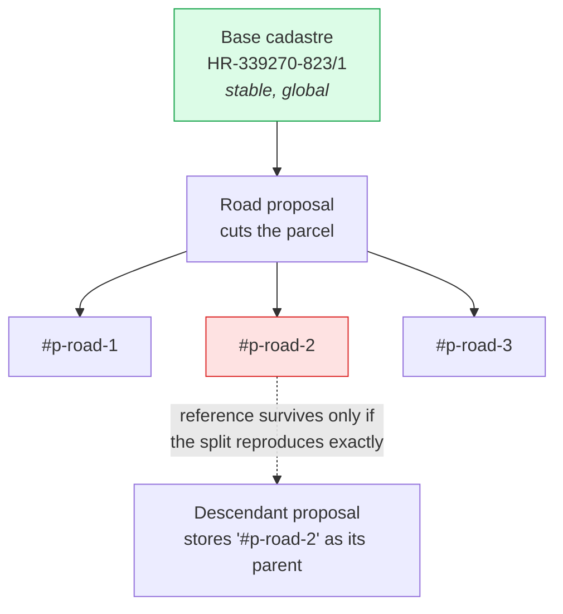
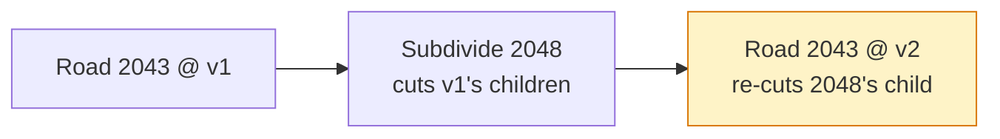

# Rethinking proposals, parcels and ancestry

Working document. Captures what broke, what we measured, which dilemmas are still open, and which
approaches are worth investigating. Nothing here is implemented yet except where marked SHIPPED.

Written 2026-07-21 after two production failures traced to the same root: **proposals identify the
land they affect by pointing at parcels that only exist in one browser's memory.**

---

## 1. The model we have today

Every proposal stores `parentParcelIds` — the parcels it was authored against. Those ids come in two
very different flavours, and the system treats them as one thing:

| Flavour | Example | Exists where |
|---|---|---|
| **Base cadastral** | `HR-339270-823/1` | Everywhere. Real-world land registry. |
| **Derived** | `HR-339270-823/1#p-2g0teu3onpu-2` | Only in the browser that generated it. |

A derived id is minted when a *fabric-changing* proposal (road, reparcellization) cuts a parcel. The
id is composed from `(root parcel, proposal token, running index)` and is **re-derived on every
apply** — deliberately:

> child parcel ids are assigned solely by the id subsystem from the current rules — deterministically
> derived from (proposalId → token, root parcel, running index). A proposal never carries a canonical
> id list to reproduce […] No canonical list is honored anywhere.
> — `proposal-parcel-identity.js`

That is sound as long as the split reproduces identically. It does not, and cannot in general.



---

## 2. What actually broke

### 2.1 The parcel hole (fixed)

An applied freeform building was counted as a *blocker* by
`_filterChildFeaturesBlockedByDescendants`. When the road beneath it was re-applied after an edit, the
road hid the parent parcel and skipped re-creating the slices the building claimed. Measured on prod:
parent `HR-339270-6804/1` (13,350 m²) came back as 2,644 m² of children — a **9,919 m² hole** with no
clickable parcel under the building.

Fixed in `350a9ed`: only typologies that genuinely *consume* their parents (road, reparcellization,
decide-later) may block a slice. Buildings and structures overlay, and `apply/buildings.js` /
`apply/structures.js` never touch the parcel layer at all. — **SHIPPED**

### 2.2 The unshareable plan (partly fixed)

Sharing a plan required every ancestor to already be on the server before its descendant could be
POSTed. Two proposals were each other's ancestor, so no order existed and five rows were permanently
stuck.

Fixed in `baddb2b`: the gate now checks **completeness** (is every ancestor part of the plan being
shared) rather than **order**. Nothing depends on upload order — proposals are POSTed independently,
the server stores ancestor ids as an opaque `ancestor_parcel_ids` column with no foreign key, and
apply order is decided at apply time. — **SHIPPED for the plan dialog only.** The single-proposal
upload paths (`dialog-upload.js`, `dialog-create.js`) still gate on order and can still deadlock.

### 2.3 Replay in a fresh browser (FIXED — §12 step 1)

The uploaded plan (#97–#104) applied 6/8 in a clean browser. The two failures were both
fabric-changers, both reporting "Missing prerequisite parcels". Root cause below.

Fixed 2026-07-23: the shared-plan route now (a) orders the queue by the A6 constraint graph
instead of trusting link order, and (b) when a dependency failure names only ghost derived ids,
re-resolves the proposal's parents from its geometry against the live fabric and retries once —
guarded by a ≥95% footprint-coverage check so genuinely missing land still fails loudly. See §12.

---

## 3. Measured evidence

All numbers below are reproducible with:

```
node scripts/analyze-plan-ancestry.js --ids 97-104
```

Read-only — it fetches the plan and the cadastre from the public API and writes nothing.

### 3.1 Ghost references exist at rest, on the server

Of 14 derived-parent references in the plan, **3 are ghosts** — they name parcels their own creator no
longer mints:

```
#100 -> #102  via HR-339270-823/1#p-2g0teu3onpu-2   << creator no longer mints this id
#100 -> #102  via HR-339270-823/2#p-2g0teu3onpu-1   << creator no longer mints this id
#100 -> #102  via HR-339270-823/6#p-2g0teu3onpu-1   << creator no longer mints this id
```

Road 2043's recorded children are `823/1#…-1, -3, -4` and `823/2#…-2`. The ids Subdivide 2048 depends
on were minted by an **earlier version** of Road 2043 and destroyed when it was edited. This is not a
race or a partial apply: the reference was already dead in the database before any recipient touched
it. These three are exactly the "Missing prerequisite parcels" from the failed replay.

### 3.2 The cycle is an artefact of having no proposal versions

```
#100 Road 2107-2043  ⇄  #102 Subdivide 2107-2048
```

Road 2043 lists **both** `HR-339270-823/1` (base) and `HR-339270-823/1#p-1mkonr8j4t2-1` (a child of
Subdivide 2048) as parents. That is two versions of one proposal collapsed into a single record. The
real history was linear:



As a sequence: fine. As a graph with one node per proposal: unsatisfiable. **We manufacture the cycle
ourselves by discarding the version dimension.**

### 3.3 Fabric-changers do not geometrically conflict

Pairwise intersection of every proposal footprint in the plan:

| Pair | Intersection | Relationship |
|---|---|---|
| #100 Road 2043 × #102 Subdivide 2048 | **0 m²** (raw 0.0012) | the "cycle" pair — they *abut*, sharing a border |
| #97 Subdivide 2042 × #98 Road 2045 | 128 m² | road operates **inside** the subdivided area (nesting) |
| #98 Road 2045 × #102 Subdivide 2048 | 15 m² | road clips the edge of the subdivided area |
| #97 Subdivide 2042 × #99 Square 2054 | 4,388 m² (100%) | overlay sits inside fabric — by design |
| #102 Subdivide 2048 × #103 Square 2049 | 2,907 m² (100%) | overlay sits inside fabric — by design |

The pair that made the plan unshareable **does not overlap on the map** — it shares a boundary and
nothing else. Where fabric-changers genuinely do intersect, one is *nested inside* the other's output
— a sequence, not a conflict.

This makes sense structurally: two proposals that were applied simultaneously on the author's machine
cannot be in true geographic conflict, or the apply would have refused. The exception is two
reparcellizations repartitioning the same area, which conflict by definition and are already
prevented.

### 3.4 Base ancestry replays cleanly

Recomputing every proposal's parents by intersecting its own geometry with the current cadastre:

| # | Proposal | Declared parents | Recomputed base parents |
|---|---|---|---|
| 97 | Subdivide 2042 | 1 base | `824` |
| 98 | Road 2045 | 1 derived | `824`, `823/1` |
| 99 | Square 2054 | 1 derived | `824` |
| 100 | Road 2043 | 8 base + 1 derived | `6804/1, 823/1, 6801, 823/2, 6804/9, 6804/6, 6811` |
| 101 | Park 2047 | 2 base + 3 derived | `6804/1, 6804/6, 6804/4, 6804/7, 6804/9` |
| 102 | Subdivide 2048 | 2 base + 3 derived | `823/1, 823/2, 823/6, 823/5, 823/7` |
| 103 | Square 2049 | 1 derived | `823/1, 823/2, 823/6, 823/5, 823/7` |
| 104 | Freeform-building 2053 | 4 derived | `6804/1, 6804/9` |

**Every proposal anchors to real cadastral parcels from its own geometry alone.** Creation order is a
valid replay order. Three proposals (99, 103, 104) currently declare *only* derived parents — those are
precisely the ones that cannot survive a trip to another browser.

### 3.5 Consent lists are currently incomplete

Square 2049 declares **one** parent (a derived parcel). Its geometry covers **five** base parcels:

```
823/1 (2279 m²), 823/2 (222), 823/6 (206), 823/5 (130), 823/7 (70)
```

Road 2045 takes 15 m² off `823/1`, which appears nowhere in its parent list — so that owner is never
asked. *(Caveat: 15 m² is near the noise floor; worth eyeballing before treating it as a real missed
owner.)*

Note what Square 2049 demonstrates: its affected-owner set is **five before** Subdivide 2048 executes
and **one after**. Both answers are correct. They differ only in when you ask.

### 3.6 Order matters only where footprints intersect — and only by that much

Section 4 of the script replays the plan through **all 24 permutations** of its four
fabric-changers (#97 reparcel, #98 road, #100 road, #102 reparcel), each step cutting the *current*
fabric, exactly as apply does. The four overlays change no fabric and are excluded.

Result: **4 distinct fabrics out of 24 orders** — and they are precisely the 2×2 of the two
intersecting pairs:

| total | parcels | #97 before #98 | #98 before #102 | sample order |
|---:|---:|:--:|:--:|---|
| 41,957 m² | 23 | true | true | `#97 → #98 → #100 → #102` |
| 41,942 m² | 23 | true | false | `#97 → #100 → #102 → #98` |
| 42,086 m² | 22 | false | true | `#98 → #97 → #100 → #102` |
| 42,071 m² | 22 | false | false | `#100 → #102 → #98 → #97` |

Cross-referenced against the measured footprint intersections from §3.3:

- `#97 × #98 = 128 m²` → toggling their order moves ~129 m² and one parcel (23 ↔ 22)
- `#98 × #102 = 15 m²` → toggling their order moves exactly 15 m²
- `#100 × #102 = 0 m²` (rounded; raw 0.0012 m², a sliver off their shared border — they abut, they
  do not overlap) → toggling their order changes **nothing at all**
- total road area is **identical (2,383 m²) in all 24 orders** — roads commute with each other

So: **fabric changes commute unless their footprints intersect, and where they do not commute the
discrepancy equals the intersection.** Order is not a global property of a plan; it is a pairwise
constraint over the few pairs that physically touch.

The decisive consequence: the pair that made the plan unshareable, `#100 ⇄ #102`, merely **abuts** —
the two footprints share a border and overlap by 0.0012 m², four orders of magnitude below the noise
floor. It commutes. Its ordering constraint was pure bookkeeping fiction.

### 3.7 The cadastre itself moves, and already has

Parcels are versioned (`version`, `current`, `date_missing`, `geom_hash`). When a cadastral parcel is
split or redrawn in the real world, the old row is marked `current = false` and new rows appear. That
is not a future risk — it has already happened at scale, identically on prod and locally:

```
current = true    579,674
current = false    54,918     ← ~8.6%, of which 40,631 carry a date_missing
```

So roughly one parcel in twelve has been superseded at some point. A proposal that stores
`HR-339270-1234` as a fact can therefore end up naming a parcel that no longer exists — structurally
the same dangling reference as §3.1, on a slower clock.

### 3.8 Formation is achievable everywhere, but it is not tidy

Next step 8, run over the live plan (`analyze-plan-ancestry.js` section 5). For each footprint:
`form(footprint) = merge(parcels wholly inside) ∪ cut(parcels straddling)`, then measure what the cuts
leave behind.

**The precondition holds.** Across all 8 proposals only **1 m²** of footprint fell on land belonging
to no cadastral parcel — a rounding artefact. Every target parcel is formable from cadastral land, so
A7's "portable lake" premise survives contact with real data.

**Merges are the exception, cuts are the rule.** Only #97 was a pure merge (its footprint is exactly
`HR-339270-824`). Everything else cuts: #104 merges 0 and cuts 2; #100 merges 0 and cuts 7.

**The real cost is fragmentation.** All 8 proposals shattered at least one parcel into disconnected
pieces. The worst, forming Road 2043, leaves the owner of `HR-339270-6804/1` holding **four** separate
fragments (9471 + 2219 + 365 + 308 m²) where they had one parcel.

Genuinely problematic remainders are rarer than fragmentation: **5** across the plan — four tiny
(36, 34, 11, 11 m²) and one shape degradation (`823/2` at compactness 0.345 from a parent at 0.766).

> **A metric that lied, and the control that caught it.** The first pass judged remainders by
> compactness alone (4πA/P²) and reported 13 slivers. But real cadastral parcels are long and thin:
> measured over the untouched parcels in this plan, the median is 0.517 and `HR-339270-6804/1` scores
> **0.083 before anyone touches it**. Its 0.132 remainder is an *improvement*. A remainder is only
> degraded relative to the parcel it came from, so `formationPlan` now records `parentCompactness` and
> compares against it. 13 → 5.

**What this says about A7.** Formation is feasible, not blocked. But it is not a clean operation: it
routinely hands a neighbour several disconnected fragments. A real land-readjustment process would
reshape those remainders too — which means A7 may imply that **every formation is a small
reparcellization of the affected block**, not a simple merge-and-cut. That is a larger commitment than
the model first suggests, and it should be priced in before adopting it.

---

## 4. The dilemmas

### D1. Replay a log, or ship a final state?

Two coherent models; we currently do a bit of both, which is why we get the failure modes of each.

- **Log / replay.** Record every step in order, share the log, replay it. Circularity is impossible
  because time is linear. Costly, and every step must be reproducible on a foreign machine.
- **Final state.** Share the end result. Simple, order-free — but "an urban plan for this area depends
  on the area existing, and the area is created by a road splitting a big parcel" is a genuine
  dependency that a pure final-state model discards.

Evidence from §3.3 suggests a third option: if fabric changes are **commutative** (base parcels minus
all road corridors, then repartitioned), then order does not matter and neither model is needed in
full.

**RESOLVED by A6 + A7:** ship final state, order geometrically at apply time (intersection +
creation time), resolve targets from geometry against whatever fabric the receiver has. The log is
never shipped; the ordering it would have encoded is recomputed from footprints.

### D2. What is the unit of consent?

If an owner's parcel is reparcelled, and an urban rule is then proposed on the resulting parcels, what
does the original owner vote on?

- **Per proposal.** Faithful to each step, but forces voting on hypotheticals: you cannot meaningfully
  accept step 5 without knowing steps 1–4 will happen. §3.5 shows the owner set is genuinely
  ambiguous before execution.
- **Per plan.** One vote, fully specified outcome, no hypothetical chaining. Matches how these are
  actually authored ("we create these complex plans"). Loses the ability to accept part of a plan.

**RESOLVED — see §10.** Neither. The unit is the owner's **slice**: the plan restricted to
everything whose base ancestry touches their parcel, accepted per proposal but fingerprint-bound to
the slice. Nobody ever confronts (or blocks) the city-wide object.

### D3. How much parcel identity does a proposal need?

- A building of a given size fits many parcel shapes, so in theory it is parcel-independent…
- …except **in Croatia a building must sit on its own parcel, exactly one**. So a building spanning
  three parcels legally implies a merge. A building is a fabric-changer in disguise.
- A park genuinely does not care about the parcel composition beneath it.
- But we still need base ancestry for **consent**, for **clickability** (originals must stay
  selectable and show what is stacked on them), and for **ownership**.

Conclusion so far: "parcelless" was too strong. The right split is **base** ancestry (needed by
everything) versus **derived** ancestry (needed by almost nothing, and the source of every bug here).

### D4. Live editing versus recorded ancestry

Dragging a road node changes the geometry of parcels under other proposals. It works locally. It is
also what mints a new generation of derived ids and orphans every reference to the old ones (§3.1).
Any model has to answer: when geometry moves, what happens to the references and to consent already
given?

**RESOLVED across §10–§11:** references are stamped at PUBLISH (not creation, not edit), so local
dragging mints nothing anyone else can see; consent binds to the **effect hash** (footprint +
per-owner cession), so a re-frame that leaves the effect unchanged keeps consent and a material
change voids it automatically.

### D5. Ancestor *geography* rather than ancestor *parcels*

If a proposal is made against `HR-1234` and that parcel is later split in two, is it now a proposal
against both? **Yes — and geometry gives you that answer for free, while a stored id gives you a
dangling reference.**

The clearest way to see it: `cadastreParcelIds` is produced by intersecting the proposal's geometry
with the cadastre. The geometry is the input; the id list is the *output of a query*. So the geometry
is already the truth, and the id list is **a materialised view of a query against a particular
cadastre version** — currently stored as though it were a fact.

This is *not* an argument to drop the field. Because it is stamped at PUBLISH (§A1), it already means
"the parcels this covered when it was published", which is the right shape for a snapshot. Two things
are missing to make that honest:

1. **The cadastre version is not recorded.** The table has `version` / `geom_hash` / `date_missing`,
   but we stamp the ids without saying what they were computed against, so a reader cannot distinguish
   a current snapshot from a stale one.
2. **Nothing marks it read-only-as-of-then.** Today nothing reads the field, so the cost of getting
   this wrong is still zero. That makes now the cheap moment to write the rule down rather than the
   moment to discover it.

It collides with invariant #2 (consent is immutable): if an owner accepted as the owner of `HR-1234`
and it then splits, their consent cannot be silently repointed at two parcels they never saw. The
resolution needs three layers, not two:

| Layer | Mutable? | Role |
|---|---|---|
| **Geometry** | no | the proposal's identity — what was published |
| **Parcel ids @ time T** | recomputed | a view: "who is affected", against a *stated* cadastre version |
| **Acceptances** | frozen | keyed to who consented, against the parcel as it was |

**Recommendation: note it, do not build it.** The design already degrades gracefully — geometry is
stored, so the view can be recomputed at any time against any cadastre version, including
retroactively. The one cheap thing worth doing soon is recording the cadastre snapshot alongside the
ids so staleness is detectable. Everything else can wait for a real split to matter.

*(History: adjacent to this, the "cadastre drift" bullet under A2 noted that replaying a plan a year
later derives against a different base. That was about replay. This is the sharper question — whether
the ancestor is a shape or a name — and it was never previously considered or discarded.)*

---

## 5. Approaches to investigate

### A1. Base-parcel ancestry (flattening) — *WRITER SIDE BUILT; nothing reads it yet*

Every proposal stores the **base cadastral** parcels its geometry intersects, computed at creation and
recomputed on edit. Derived ids never appear in `parentParcelIds`.

If A is split by a road into B and C, and C is split into D and E, then B, D and E are all recorded as
descendants of **A**, not of C. Chains never form, so they can never dangle.

- Fixes: ghost references, cross-machine replay, incomplete consent lists.
- Loses: which *piece* of A a proposal sits on. §3.5 argues that loss is correct pre-execution.
- Cost: an intersection pass on create/edit.

Built so far — `cadastreParcelIds`, written alongside `parentParcelIds` and read by nothing:

| Layer | Where |
|---|---|
| pure logic | `frontend/js/proposals/plan-order.js` — `computeCadastreParcelIds`, `cadastreRootId`, `footprintOf` |
| map adapter | `frontend/js/proposals/cadastre-ancestry.js` — reads the live parcel index |
| stamped at **publish** | `buildUploadReadyProposal()` in `proposals/create.js` — the single funnel for upload, plan share and mint |
| API | `cadastreParcelIds` accepted, stored in `proposal.cadastre_parcel_ids`, returned by the serializer |
| migration | `backend/scripts/add-cadastre-parcel-ids.js` — dry-run by default, additive, idempotent |

Geometry is the primary source; the roots of whatever the proposal declared are merged in, so a
proposal can never be recorded as touching *less* land than it already claimed.

`cadastreParcelIds` is best understood as a **timestamped view, not a fact** — see D5. It records what
the geometry covered against the cadastre as it stood at publication; the geometry remains the truth.

**Computed at publication, not at creation.** A road can be dragged around all afternoon, so there is
no useful "the parcels of this proposal" while it is still local and mutable — and a creation-time
stamp would freeze an answer nobody ever saw, then go stale on the first node drag. The moment that
counts is upload/mint: that snapshot is what other people replay and what owners consent to. So
`cadastreParcelIds` means *the cadastral parcels this proposal covered when it was published*, and its
absence means the proposal has never been published. It is not in `proposalContentFingerprint`'s
allowlist, so adding it can never change a share id.

### A2. Ship derived geometry with fabric-changers — *INSURANCE, not a necessity. Demoted.*

A road or reparcellization would transmit its **resulting parcels** (geometry, not ids), so apply
becomes "stamp these polygons down" instead of "re-derive and hope". The server already has a
`childParcelIds` column; the geometry beside it is deliberately dropped today:

```js
// Do not persist child geometries on the proposal object; IDs and persisted storage are the source of truth
delete roadProposal.childFeatures;
```

**But shipping the road IS enough to re-derive its cuts** — provided every input is identical on the
recipient's machine. The inputs are: the base cadastre, the corridor, and the cutting code. Derivation
was never the broken part; the broken part was that proposals referenced DERIVED parcels, so a
recipient needed the author's exact intermediate fabric, which they never had. With A1 (everything
anchors to base parcels) and A6 (ordering from intersection + creation time), re-derivation is
deterministic again — §3.6 showed order only ever matters for footprints that actually touch.

So A2 only buys immunity to three kinds of drift, none of which is the current problem:

1. **Cadastre drift.** Parcels are versioned (`current`, `date_missing`). A plan replayed a year later
   derives against a different base than the author had.
2. **Code drift.** A geometry-library upgrade that changes polygon clipping by an epsilon silently
   changes everyone's derived parcels.
3. **Speed.** Stamping is O(1); re-deriving is not.

Worth doing eventually for (1). Not worth doing before A6.

### A3. Commutative fabric — *TESTED, see §3.6. Partially true, and the partial truth is the fix.*

Order matters only between fabric-changers **whose footprints intersect**, and the magnitude of the
difference is exactly the intersection area. Everything else commutes.

That converts global ordering into a **pairwise** constraint over a tiny set — and it is the constraint
that kills cycles for good. See §3.6 and A6.

### A4. Version the proposal graph

Give each edit a version node, so `Road2043@v1 → Subdivide2048 → Road2043@v2` stays a DAG (§3.2).
Honest to history, but adds a dimension everywhere. Probably unnecessary if A3 holds.

### A5. Plan as the unit

Share, vote and apply plans rather than individual proposals. Ordering becomes internal to a plan;
cross-plan derived references never exist. Complements A1–A3; addresses D2.

### A6. Order by intersection + creation time — *WIRED into shared-plan apply (2026-07-23, §12 step 1)*

Replace the derived-id dependency graph entirely:

- Two fabric-changers are **related** only if their footprints intersect (cheap, geometric, needs no
  ids at all).
- Related pairs are ordered by **creation timestamp**.

Because creation time is a *total* order, any partial order induced from it is **acyclic by
construction**. A cycle becomes impossible — not "detected and handled", but unrepresentable. Compare
with today's derived-id graph, whose edges come from mutable parcel state and which cycled in
production within one afternoon's editing.

Unrelated proposals get no edge, so they upload, apply and share in any order. In the measured plan
that reduces six possible fabric-changer pairs to **two** real constraints.

Combines naturally with A1 (base ancestry supplies stable identity) and A2 (shipped geometry removes
the need to re-derive). Does not require A4.

### A7. Proposals declare a target parcel FORMATION — *the unifying idea; supersedes much of the above*

Several typologies implicitly imply a cadastral parcel of their own: a freeform building (in Croatia a
building must sit on exactly one parcel), and plausibly a park, square or lake as a public surface.
They do not merely sit *on* parcels — they define what the parcel underneath should *become*.

So a proposal stops declaring inputs and declares an **output**: *"the land under this footprint shall
become a parcel of exactly this shape."* Realising that against a given fabric is a derived operation:

```
form(footprint) = merge(parcels wholly inside) ∪ cut(parcels straddling the boundary)
```

**Not "merge on creation, cut later".** Measured on the live plan, no footprint is ever wholly
contained even on the day it was drawn:

| Proposal | Parcel | Covers | Parcel total | |
|---|---|---|---|---|
| #104 Freeform-building | `6804/1` | 3,562 m² | 13,354 m² | 27% |
| #104 Freeform-building | `6804/9` | 1,016 m² | 1,666 m² | 61% |
| #103 Square 2049 | `823/1` | 2,279 m² | 4,999 m² | 46% |

Forming #104's parcel required cutting both parents on day one. So it is merge ∪ cut at every
application, with no special first case — which makes the model simpler, not more complex.

#### Why this is the important one: dependency becomes precondition

Today a proposal says *"I need `HR-339270-823/1#p-2g0teu3onpu-2` to exist"* — a reference to another
proposal's output. That is the direct cause of the ghosts (§3.1), the cycle (§3.2) and the failed
replay (§2.3).

Under A7 it says *"the land under my footprint must be formable into my target parcel"* — a
**precondition on the current fabric**, checkable on any machine, at any time, with no knowledge of
who cut what first. A lake becomes portable in exactly the sense that matters: apply it anywhere its
footprint can still be formed.

What that collapses:

- **D5** (shape or name) — settled: the shape is the spec, the parcel operation is derived.
- **D3** (how much parcel identity) — none as *input*; the target parcel is the *output*.
- **A2** (ship derived geometry) — unnecessary: you ship the target, not the recipe nor the result.
- The overlay/fabric split — dissolves. One operation over different footprints.

#### What it costs

This is a **behavioural redesign of apply, not bookkeeping.** `apply/buildings.js` and
`apply/structures.js` contain no parcel-layer operations at all today — that is the basis of the §2.1
fix and of invariant #4. Under A7 those typologies *do* consume: a park forms its own parcel and cuts
what lies beneath. **Invariant #4 would have to be rewritten, not extended**, and the §2.1
hole-prevention rule re-derived under the new regime.

It also redraws the taxonomy along a better line — **forming** (building, park, square, lake, road,
reparcellization, boundary adjustment) versus **non-forming** (votes, designations, decide-later),
rather than overlay-versus-fabric.

**Open question only Simun can answer:** whether a park or square legally requires its own parcel in
Croatia the way a building does. If not, parks are non-forming and the line moves.

---

## 6. Invariants worth keeping whatever we choose

1. **The base cadastre is the only globally stable identity.** Anything else is local.
2. **Consent is immutable.** Never silently repoint what an owner agreed to (rules out
   retarget-on-edit as a *stored* mutation; fine as a *derived view*).
3. **Original parcels stay clickable** and show what is stacked on them.
4. **Overlays never consume.** Buildings, parks, squares and lakes draw on top; they must never block
   the fabric from re-forming (§2.1). — **CONTESTED by A7**, which argues these typologies should form
   a parcel of their own. If A7 is adopted this invariant is rewritten, not extended; the §2.1
   hole-prevention rule then has to be re-derived under the new regime.
5. **A green apply is not proof.** Verify the resulting fabric, not the absence of an error.

---

## 7. Next steps

1. ~~Test A3 (commutativity).~~ **DONE — see §3.6.** Order matters only between fabric-changers whose
   footprints intersect; the discrepancy equals the intersection area. Roads commute outright.
2. ~~Prototype A1 + A6.~~ **DONE end to end** — `cadastreParcelIds` is computed at publish, stored,
   and backfilled (92 of 98 rows); `plan-order.js` implements the A6 ordering; and as of 2026-07-23
   the shared-plan apply route *reads* it: constraint-graph ordering + geometry re-parenting (§12
   step 1).
3. **Stamp the cadastre snapshot** next to `cadastreParcelIds` (version or capture date), so a stale
   view is detectable — cheap now. See D5. Superseded in shape by §11: what should be recorded is
   the **effective-frame version**, not just the official snapshot.
4. ~~A6 before A2.~~ **A6 shipped; A2 stays demoted** — ordering + geometric resolution made the
   plan replayable without shipping derived geometry.
5. **Improve the failure message.** Partly moot: the ghost case now self-heals (§12 step 1), so a
   surviving "Missing prerequisite parcels: …" means the land is genuinely absent (<95% coverage) —
   the message should say *that*, and name the proposal whose output is missing rather than the
   parcel ids.
6. **Extend the completeness gate + re-parenting** to the single-proposal upload paths
   (`dialog-upload.js`, `dialog-create.js`) and the payload-share route
   (`applySharedProposalsFromPayload`), which still use the old order-based gating and can still
   deadlock.
7. ~~Decide D2.~~ **DECIDED — §10.** Unit of consent = the owner's slice, per-proposal acceptance
   bound to the slice fingerprint.
8. ~~Evaluate A7.~~ **DONE — see §3.8.** Formable everywhere (1 m² uncovered across the plan), but
   every proposal fragments at least one neighbouring parcel; the worst leaves one owner with four
   disconnected pieces. Open question it raises: does A7 imply that each formation is really a small
   reparcellization of the affected block?

---

## 9. Formation + content: the typology normal form

The observation that completes the collapse (2026-07-23): once roads decompose, **nothing in the
typology zoo is primitive**. Every proposal is the same two-part object:

```
proposal = formation (re-form parcels, with an ownership flow) + content (what goes on the result)
```

| Typology | Formation part | Content part |
|---|---|---|
| Reparcellization | merge ∪ cut, ownership per plan | *none* — pure formation |
| Road | cut corridor from every crossed parcel, merge, ownership → public | use = road (profile, lanes…) |
| Park / square / lake | merge ∪ cut into the footprint parcel, ownership → public (usually) | use = park / square / water |
| Freeform building | form the building's own parcel (one building, one parcel) | the building |
| Building on an existing parcel | *none* | the building |
| Urban rule | *none* | rule — pure content |
| Vote | *none* | a question |

Reparcellization and rules are the degenerate ends — formation with no content, content with no
formation. A road only *looked* special because its footprint is authored as centerline + width; the
operation it performs is the same `formationPlan` as a lake's.

**Roads already do cut-then-merge.** Verified in `_buildChildFeaturesFromDefinition`
(`proposal-manager.js:1855`): the road mints **one** corridor feature whose geometry is the whole
corridor, with `parentParcelIds` listing every crossed parent; the per-parent derived slices are the
*remainders* carved out afterwards. Two artefacts of that code worth naming:

- **The corridor's identity is a naming accident.** Its id borrows the FIRST crossed parcel's root
  (`HR-339270-823/1#p-road-2` can name a corridor spanning a dozen parents). Base ancestry records
  the truth regardless of what the id claims.
- **The formation happens but the ownership flow is forgotten.** The merged corridor's
  `ownershipDetails` is the proposer at 100%; nobody records who ceded how much, even though
  per-parent cession (parent minus remainder) is trivially computable at the cut stage, before the
  merge erases it.

What the normal form buys:

1. **Uniform consent triage** (§10) — nothing typology-specific; the triage reads the formation's
   ownership flow and the content's nature.
2. **Ownership flow becomes one declared word per typology** — road/park/square/lake → public,
   freeform building → proposer or per-deal, reparcellization → explicit mapping. It is also what
   distinguishes a road from a private driveway with identical geometry.
3. **One formation engine, eventually** — roads, structures and reparcellization become callers of
   one primitive (`formationPlan` prototypes it). Refactor-when-it-hurts, not a prerequisite (§12
   step 5).

The §3.8 remainder problem now applies uniformly — and bites hardest for roads (Road 2043 leaves one
owner four disconnected fragments). Answering "does a formation owe the block reshaped remainders?"
once answers it for every typology.

**Ownership is ASSUMED WORKING for now** (Simun, 2026-07-23): design the declared-flow field, do not
build redistribution/valuation machinery yet.

Jurisdictions plug in at exactly three seams: who must accept a formation (unanimity vs qualified
majority), which contents are proprietary offers vs political votes, and formation constraints like
Croatia's one-building-one-parcel. The geometry core is jurisdiction-free.

---

## 10. Consent: dossiers in the current frame (resolves D2)

The knot D2 circles — "reparcellization turns your parcel A into B, and a second proposal targets
B; what do you vote on?" — dissolves once "against parcel X" stops being treated as primitive.

**B is a name, not a thing.** B is R's *output*, a name inside R's hypothesis. "P is against B" is
shorthand for "P is against the piece of ground R would call B" — and that ground, today, is part of
A. Consent must be collected in the **current frame**, because it is the only frame where owners
exist: who owns B is an output of R, not an input. Every consent question, however deep the chain,
is pulled back to current parcels — and the pullback is the machinery we already built.
`cadastreParcelIds` **is** the projection; replay pulls geometry back to the base frame, consent
pulls rights-questions back. One mechanism, two uses.

**What the owner of A sees: both proposals — but not as two votes of the same kind.**

| The (owner, proposal) pair | Channel |
|---|---|
| Formation consuming/reshaping their parcel (R itself) | **binding acceptance**, per affected base parcel — the existing per-parcel acceptance rows |
| Content on a descendant they RETAIN (building/purchase on B they keep) | **offer** — acceptance addressed to them |
| Pure rule anywhere (zoning-like) | **vote** — the existing non-binding vote flow; rules are political, never per-owner vetoed |
| Content on a descendant they CEDE (school on the strip taken for it) | **disclosure** — it prices their decision on R; not theirs to veto |

The general rule: *walk the chain, track whose rights each step consumes; that is whose acceptance
it needs. Everything else reaching your land is a vote or disclosure.* The classification needs one
datum the model currently lacks: the formation's **ownership flow** (§9) — without it we can compute
relevance (done, geometrically) but not the acceptance/disclosure split.

**The unit of consent is the slice, bound by fingerprint.** The owner's dossier = the plan
restricted to proposals whose base ancestry touches their parcel, told as one story ("R recuts A
into B1 — stays yours — and B2 — becomes public; on B1, rule P; on B2, school S"). Their acceptance
of R binds to the **content-hash of that dossier** (the `a3eef9c` share-fingerprint discipline,
reused):

- Edits across town don't change the slice-hash → acceptance stands. City-scale plans stop being a
  consent problem: the 600-parcel railway is 600 one-strip dossiers, never one 600-parcel question.
  The city-wide object belongs to elections, not owners.
- Any change inside the slice → hash changes → acceptance lapses, re-consent.

**Dials and defaults:**

- *Ceded-content in the fingerprint?* Default **yes** — accepting a taking "for a school" and
  getting a casino is bait-and-switch; the cost (authors can't repurpose ceded land without
  re-consent until execution) is arguably the point.
- *Severability:* accepting P implies accepting every formation beneath it on your land; rejecting R
  moots everything above it. "Yes to R, no to the school" is a counter-proposal, not a partial vote.
- *Holdouts:* R spanning A and a refusing neighbour cannot execute as drawn. Default unanimity per
  connected component of fabric change; qualified-majority schemes (as real komasacija/Umlegung use)
  are a jurisdiction plug-in, not core model.

This is also how a century of land-readjustment law splits it: owners consent to the readjustment of
*their* unit with intended use disclosed (parcel value depends on designated use); zoning itself
stays political. The model is boring in the best way.

---

## 11. Three frames: official, effective, hypothetical

Execution is **legal**, not registral (Simun, 2026-07-23): proposals live on-chain, and when all
required acceptances arrive the proposal **auto-executes** — funds disburse, obligations bind. The
official cadastre is a separate registry CB cannot write; it catches up on its own schedule. That
gives a three-layer stack:

1. **Official frame** — the cadastre as imported. Observed, never written.
2. **Effective (legal) frame** — official frame + every *executed* formation replayed in execution
   order. Legal reality: the contract binds even while uknjižba is pending. **Owners exist in this
   frame** — consent for new proposals pulls back to here, not to the official frame.
3. **Hypothetical frames** — per-plan, on top of effective, as everywhere above.

An executed-but-unregistered parcel and a derived parcel in someone's browser are the same *kind* of
object — a formation output — differing only in status. One derivation stack, with a watermark:
below it official, between watermark and legal line executed-awaiting-registry, above it hypothesis.

**Executed formations are shared ground truth.** They stop being optional overlays: the server holds
an append-only executed-formations log and every client force-applies it before rendering anything.
The "nudge to build on resulting parcels" then solves itself — users draw against what they see, and
what they see is the effective frame. One UI element needed: a badge on effective-but-unofficial
parcels — *"legal, awaiting registry"* — so the map's disagreement with the official cadastre viewer
is explained, not confusing.

**"Reality changed" is not a label, it is a computable three-state status.** After any frame advance
(an execution nearby, or an official-cadastre import), re-project every pending proposal's geography
onto the new effective frame (`formationPlan` again) and compare **effects**:

- **unaffected** — footprint disjoint from the changed area (cheap: `cadastreParcelIds` ∩ changed
  set = ∅). The vast majority; show nothing.
- **re-based** — touches changed land but the re-projected formation is materially identical (same
  footprint, same per-owner cessions within tolerance). Silently restamp; at most a passive marker.
- **impacted** — the effect changed (the executed road ate a corner of the pending lake; cessions
  now fall on different owners). Prominent label; author must revise.

**Consent survives re-framing iff the consented effect is unchanged.** Acceptance therefore binds
not to frame-relative parcel ids but to an **effect hash** — footprint + per-owner cession.
Re-based → acceptances stand; impacted → affected owners' acceptances lapse automatically. Frame ids
churn; effects are what people consented to. (This is the §D5/invariant-#2 tension resolved: consent
is frozen against the *effect*, and the parcel-id view is free to be recomputed.)

**Reconciliation** (registry catches up) is geometric matching — geography-as-invariant one more
time. The registry assigns numbers we cannot predict and surveyors redraw boundaries by centimeters,
so: match executed outputs against new official parcels within tolerance; on match, swap synthetic
ids for official, restamp ancestry above, and the formation sinks below the waterline. Material
divergence → human review. And the executed log **is the paperwork**: each entry carries geometry,
ownership flow and collected consents — essentially a parcelacijski elaborat. Exporting it
surveyor-ready turns the registry lag from a nuisance into the product's output: CB becomes the
queue that feeds the official registry, not a simulation waiting for it.

**Lifecycle** (extends the existing `lifecycle_status` direction):

```
draft → published → accepted → executed → registered
                                  (+ re-based / impacted as orthogonal flags on anything pending)
```

Open questions this layer adds (none block §12):

- **Reversal.** Courts annul; deals unwind off-chain even if funds moved on-chain. Keep the log
  append-only and record a reversal as a compensating formation; consent downstream of a reverted
  execution needs thought.
- **Tolerance policy** — one number for "same effect" and registry matching (sub-meter surveyor
  drift vs material change).
- **Partial registration** — the registry registering 2 of 5 outputs of one formation;
  reconciliation must work per-parcel.
- **Cross-plan conflicts.** "Two applied proposals never overlap" holds *within* one hypothesis. Two
  independent plans forming over the same land conflict for real. Presumably an owner may accept
  both slices (competing offers) and conflict resolves at execution — first to execute wins the
  frame, the loser goes *impacted* — but this is undesigned.

---

## 12. The rework plan

Shippable steps, each independently valuable. Authoring UX, local apply, derived ids as local
bookkeeping, per-parcel acceptance rows, the vote flow and share fingerprinting all stay.

1. **Fix replay: order + geometry re-parenting.** — **DONE 2026-07-23.**
   `handleSharedPlanRoute` now (a) pre-fetches the plan's payloads and orders the queue with
   `resolveApplyOrder` (footprint intersection + creation time) instead of trusting link order, and
   (b) on a dependency failure whose missing ids are all ghost-derived (`…#p-…`), resolves the
   proposal's parents from its geometry against the LIVE fabric
   (`cadastre-ancestry.js: resolveParentsByGeometry` — derived slices included, consumed parents
   excluded), rewrites every parent list the apply path reads
   (`plan-order.js: rewriteParentParcelIds`), and retries once. Guard: live fabric must cover ≥95%
   of the footprint, so genuinely missing land still fails visibly — a rename is never used to paper
   over an absent ancestor. The requeue loop remains as a safety net, not the mechanism.
   **Second iteration (same day), after the first incognito replay came back 6 applied + 2
   "occupied":** chaining was being misread as conflict. The two stragglers declared parents that
   are fellow plan members' children (the fixture shows the cycle in the flesh: #100's parents
   include #102's child `823/1#p-1mkonr8j4t2-1`, while #102's parents are #100's older-generation
   children), and the occupancy index exact-matches declared id strings, so stale generations
   surfaced as `parcel-conflict` — a path the dependency-only re-parent hook never saw. Three
   additions: (a) `parcel-conflict` failures now carry `conflictProposalIds`, (b) when every
   occupier is a member of the incoming plan the route re-parents ghosts and retries once with
   `applyAnyway` — proposals that coexisted applied at share time cannot genuinely conflict
   (§3.3), so intra-plan occupancy is stale bookkeeping by definition; cross-plan occupiers still
   park as overlapped, and (c) `cadastreParcelIds` joined the prerequisite set, so the route
   fetches the true ground under each footprint before applying — the field's first reader in the
   apply path, and what keeps the ≥95% coverage guard honest when every declared parent is
   derived.
   **Third iteration (verified in a live browser before shipping):** the second run still parked
   one road, and a clean-state sandbox replay (localhost origin + prod API, driven via
   claude-in-chrome) exposed two more layers of the same disease. (a) The intra-plan retry never
   engaged because occupier identity was stripped THREE times on its way to the route —
   `_setLastApplyFailure`, `getLastApplyFailureInfo` and `getStoredApplyFailureInfo` each
   whitelist fields, and none kept `conflictTitles`/`conflictProposalIds` (so the overlapped
   modal had also never once named an occupier). All three now pass them through. (b) The
   geometry resolver trusted `isParcelReplacedByChildren`, but on replay a subdivided base (824)
   stayed layer-ready and unreplaced NEXT TO its own slices, so the resolver handed apply a
   parent occupied by the very proposal that cut it. `loadedLiveParcels` now derives consumption
   from the id structure itself: every `#`-prefix of a live derived id is consumed fabric,
   whatever the flag says. With both fixed, the 97–104 plan replays **8/8** from clean state —
   observed directly, map fabric and parent rewrites inspected, zero residual failure records.
   *Not yet covered:* the payload-share route (`applySharedProposalsFromPayload`) and the
   single-proposal upload gates (next steps 6) still use the old logic.
2. **Stamp ownership flow at publish.** Additive, like `cadastreParcelIds` was: per crossed base
   parcel, ceded area (parent minus remainder, computed before the merge erases it) and destination
   (public / proposer / mapping). Backfillable from stored geometry. Fills §10's one data gap.
   Ownership *machinery* stays assumed-working (§9).
3. **Dossiers, read-only.** "As the owner of A": every proposal whose base ancestry touches A,
   triaged per §10, including the remainder report ("you end up with four fragments of
   9471/2219/365/308 m²" — §3.8 as disclosure, not blocker). Pure read over steps 1–2 + the
   existing fingerprint discipline. First user-visible product of the rethink.
4. **Bind acceptance to slice fingerprints / effect hashes.** The semantic change (§10, §11). Do it
   after dossiers make slices a visible, understood thing.
5. **One formation engine — only when it hurts.** Unify roads/structures/reparcellization behind
   `formationPlan` with characterization tests, per typology, opportunistically. Roads already do
   cut-then-merge; conceptual clarity does not require immediate code unification.

Between 4 and 5 sits the **executed-formations log** (§11): server-held, force-applied, badge-worthy
— its trigger (on-chain auto-execution) is already decided.

---

## 13. Related notes

- `feature-proposal-goals.md` — proposal typologies
- `impact-resolver.md` — obstacle/impact handling on fabric changes
- `advanced-readjustment.md` — reparcellization internals
- Code: `frontend/js/proposals/plan-order.js` (pure: ancestry, ordering, formation, re-parent
  rewrite), `frontend/js/proposals/cadastre-ancestry.js` (map adapter: live parcels, geometry
  resolution), `frontend/js/proposals/sharing-routes.js` (`handleSharedPlanRoute`: A6 ordering +
  ghost re-parenting)
- Tests: `backend/test/plan-order.test.js`, `backend/test/cadastre-ancestry-resolve.test.js`,
  fixture `backend/test/fixtures/plan-97-104.json`
- Commits: `350a9ed` (parcel hole), `baddb2b` (completeness gate), `70d9f82` (cadastreParcelIds),
  `32a01d0` (backfill + legacy road footprints)
