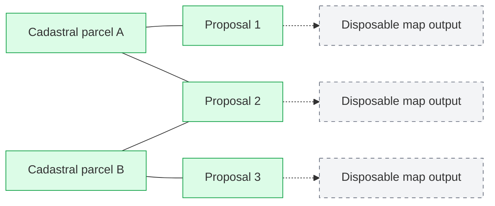
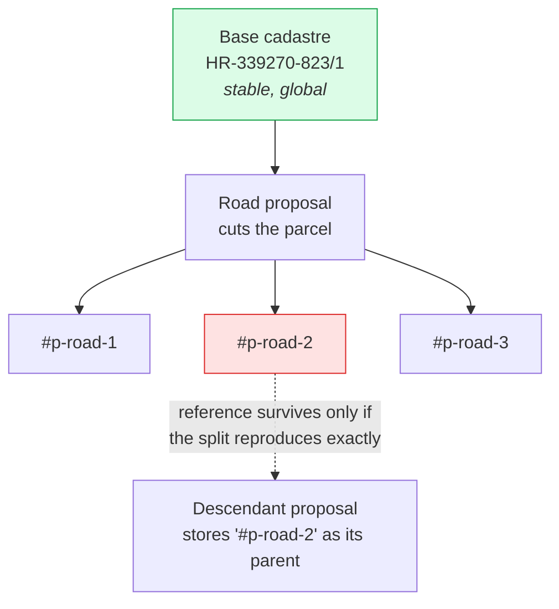
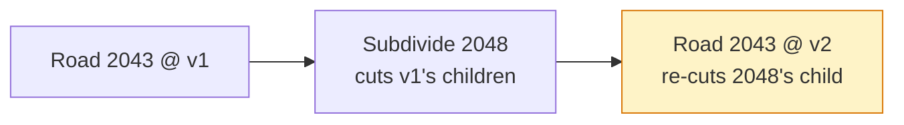

# Rethinking proposals, parcels and ancestry

Architecture decision record and historical investigation. The current contract is stated first;
later sections preserve the failures and experiments that led to it and must not be read as current
runtime design.

Written 2026-07-21 after two production failures traced to the same root: **proposals identify the
land they affect by pointing at parcels that only exist in one browser's memory.**

---

## 0. Current architecture: flat cadastral components

Implemented 2026-08-27. Durable land state has only two kinds of entity:

1. original cadastral parcels;
2. authored proposal records, each stamped with the original parcel IDs in `cadastreParcelIds`.

`parentParcelIds` remains a transport-compatibility alias, but after normalization it contains the
same flat cadastral IDs. Generated parcel IDs, child lists, formation receipts, parent-feature
snapshots, demolition scans, and map layers are replay output. They may exist in memory or a cache,
but they are not proposal prerequisites and are stripped from durable proposal storage.


```mermaid
flowchart LR
    C1["Cadastral parcel A"] --- P1["Proposal 1"]
    C1 --- P2["Proposal 2"]
    C2["Cadastral parcel B"] --- P2
    C2 --- P3["Proposal 3"]

    P1 -.-> O1["Disposable map output"]
    P2 -.-> O2["Disposable map output"]
    P3 -.-> O3["Disposable map output"]

    classDef durable fill:#dcfce7,stroke:#16a34a
    classDef output fill:#f3f4f6,stroke:#6b7280,stroke-dasharray: 5 5
    class C1,C2,P1,P2,P3 durable
    class O1,O2,O3 output
```

Applying, unapplying, editing, or deleting a proposal follows one materialization path:

1. resolve the changed record's geometry to original cadastral IDs;
2. find the transitive connected component in the flat
   `cadastral parcel <-> standing proposal` graph;
3. purge every generated layer in that component and reveal its cadastral ground;
4. derive corridor fabric from cadastral geometry and authored corridor takes;
5. replay the component's authored records in immutable creation order.

The scoped path and the full boot rebuild call the same replay pass. If complete cadastral coverage
cannot be proved, the scoped path falls back to the canonical full rebuild; it never guesses through
a generated predecessor.

Runtime output can carry `producedByProposalId` for click routing and ownership presentation. This is
one-hop provenance only. It is not an ancestry edge, does not affect replay scope or order, and new
output never writes the legacy `ancestorProposal` key.

The contract is enforced in:

- `frontend/js/proposals/claims.js` — flat anchors and connected components;
- `frontend/js/proposal-manager.js` — the sole component materializer;
- `frontend/js/proposals/data.js` — authored-log persistence projection;
- `frontend/js/proposal-editor-adapters.js` — base IDs resolved to current live pieces at edit time.

## 1. Historical model (retired)

Every proposal stores `parentParcelIds` — the parcels it was authored against. Those ids come in two
very different flavours, and the system treats them as one thing:

| Flavour | Example | Exists where |
|---|---|---|
| **Base cadastral** | `HR-339270-823/1` | Everywhere. Real-world land registry. |
| **Derived** | `HR-339270-823/1#p-2g0teu3onpu-2` | Only in the browser that generated it. |

A derived id is minted when a *fabric-changing* proposal (road, reparcellization) cuts a parcel. The
id is composed from `(root parcel, proposal token, running index)` and is **re-derived on every
apply** — deliberately:

> child parcel ids are assigned solely by the id subsystem from the current rules — deterministically
> derived from (proposalId → token, root parcel, running index). A proposal never carries a canonical
> id list to reproduce […] No canonical list is honored anywhere.
> — `proposal-parcel-identity.js`

That is sound as long as the split reproduces identically. It does not, and cannot in general.


```mermaid
graph TD
    B["Base cadastre<br/>HR-339270-823/1<br/><i>stable, global</i>"]
    R["Road proposal<br/>cuts the parcel"]
    D1["#p-road-1"]
    D2["#p-road-2"]
    D3["#p-road-3"]
    X["Descendant proposal<br/>stores '#p-road-2' as its parent"]

    B --> R
    R --> D1
    R --> D2
    R --> D3
    D2 -.->|"reference survives only if<br/>the split reproduces exactly"| X

    style B fill:#dcfce7,stroke:#16a34a
    style D2 fill:#fee2e2,stroke:#dc2626
```

---

## 2. What actually broke

### 2.1 The parcel hole (fixed)

An applied freeform building was counted as a *blocker* by
`_filterChildFeaturesBlockedByDescendants`. When the road beneath it was re-applied after an edit, the
road hid the parent parcel and skipped re-creating the slices the building claimed. Measured on prod:
parent `HR-339270-6804/1` (13,350 m²) came back as 2,644 m² of children — a **9,919 m² hole** with no
clickable parcel under the building.

Fixed in `350a9ed`: only typologies that genuinely *consume* their parents (road, reparcellization,
decide-later) may block a slice. Buildings and structures overlay, and `apply/buildings.js` /
`apply/structures.js` never touch the parcel layer at all. — **SHIPPED**

### 2.2 The unshareable plan (partly fixed)

Sharing a plan required every ancestor to already be on the server before its descendant could be
POSTed. Two proposals were each other's ancestor, so no order existed and five rows were permanently
stuck.

Fixed in `baddb2b`: the gate now checks **completeness** (is every ancestor part of the plan being
shared) rather than **order**. Nothing depends on upload order — proposals are POSTed independently,
the server stores ancestor ids as an opaque `ancestor_parcel_ids` column with no foreign key, and
apply order is decided at apply time. — **SHIPPED for the plan dialog only.** The single-proposal
upload paths (`dialog-upload.js`, `dialog-create.js`) still gate on order and can still deadlock.

### 2.3 Replay in a fresh browser (FIXED — §12 step 1)

The uploaded plan (#97–#104) applied 6/8 in a clean browser. The two failures were both
fabric-changers, both reporting "Missing prerequisite parcels". Root cause below.

Fixed 2026-07-23: the shared-plan route now (a) orders the queue by the A6 constraint graph
instead of trusting link order, and (b) when a dependency failure names only ghost derived ids,
re-resolves the proposal's parents from its geometry against the live fabric and retries once —
guarded by a ≥95% footprint-coverage check so genuinely missing land still fails loudly. See §12.

---

## 3. Measured evidence

All numbers below are reproducible with:

```
node scripts/analyze-plan-ancestry.js --ids 97-104
```

Read-only — it fetches the plan and the cadastre from the public API and writes nothing.

### 3.1 Ghost references exist at rest, on the server

Of 14 derived-parent references in the plan, **3 are ghosts** — they name parcels their own creator no
longer mints:

```
#100 -> #102  via HR-339270-823/1#p-2g0teu3onpu-2   << creator no longer mints this id
#100 -> #102  via HR-339270-823/2#p-2g0teu3onpu-1   << creator no longer mints this id
#100 -> #102  via HR-339270-823/6#p-2g0teu3onpu-1   << creator no longer mints this id
```

Road 2043's recorded children are `823/1#…-1, -3, -4` and `823/2#…-2`. The ids Subdivide 2048 depends
on were minted by an **earlier version** of Road 2043 and destroyed when it was edited. This is not a
race or a partial apply: the reference was already dead in the database before any recipient touched
it. These three are exactly the "Missing prerequisite parcels" from the failed replay.

### 3.2 The cycle is an artefact of having no proposal versions

```
#100 Road 2107-2043  ⇄  #102 Subdivide 2107-2048
```

Road 2043 lists **both** `HR-339270-823/1` (base) and `HR-339270-823/1#p-1mkonr8j4t2-1` (a child of
Subdivide 2048) as parents. That is two versions of one proposal collapsed into a single record. The
real history was linear:


```mermaid
graph LR
    A["Road 2043 @ v1"] --> B["Subdivide 2048<br/>cuts v1's children"]
    B --> C["Road 2043 @ v2<br/>re-cuts 2048's child"]
    style C fill:#fef3c7,stroke:#d97706
```

As a sequence: fine. As a graph with one node per proposal: unsatisfiable. **We manufacture the cycle
ourselves by discarding the version dimension.**

### 3.3 Fabric-changers do not geometrically conflict

Pairwise intersection of every proposal footprint in the plan:

| Pair | Intersection | Relationship |
|---|---|---|
| #100 Road 2043 × #102 Subdivide 2048 | **0 m²** (raw 0.0012) | the "cycle" pair — they *abut*, sharing a border |
| #97 Subdivide 2042 × #98 Road 2045 | 128 m² | road operates **inside** the subdivided area (nesting) |
| #98 Road 2045 × #102 Subdivide 2048 | 15 m² | road clips the edge of the subdivided area |
| #97 Subdivide 2042 × #99 Square 2054 | 4,388 m² (100%) | overlay sits inside fabric — by design |
| #102 Subdivide 2048 × #103 Square 2049 | 2,907 m² (100%) | overlay sits inside fabric — by design |

The pair that made the plan unshareable **does not overlap on the map** — it shares a boundary and
nothing else. Where fabric-changers genuinely do intersect, one is *nested inside* the other's output
— a sequence, not a conflict.

This makes sense structurally: two proposals that were applied simultaneously on the author's machine
cannot be in true geographic conflict, or the apply would have refused. The exception is two
reparcellizations repartitioning the same area, which conflict by definition and are already
prevented.

### 3.4 Base ancestry replays cleanly

Recomputing every proposal's parents by intersecting its own geometry with the current cadastre:

| # | Proposal | Declared parents | Recomputed base parents |
|---|---|---|---|
| 97 | Subdivide 2042 | 1 base | `824` |
| 98 | Road 2045 | 1 derived | `824`, `823/1` |
| 99 | Square 2054 | 1 derived | `824` |
| 100 | Road 2043 | 8 base + 1 derived | `6804/1, 823/1, 6801, 823/2, 6804/9, 6804/6, 6811` |
| 101 | Park 2047 | 2 base + 3 derived | `6804/1, 6804/6, 6804/4, 6804/7, 6804/9` |
| 102 | Subdivide 2048 | 2 base + 3 derived | `823/1, 823/2, 823/6, 823/5, 823/7` |
| 103 | Square 2049 | 1 derived | `823/1, 823/2, 823/6, 823/5, 823/7` |
| 104 | Freeform-building 2053 | 4 derived | `6804/1, 6804/9` |

**Every proposal anchors to real cadastral parcels from its own geometry alone.** Creation order is a
valid replay order. Three proposals (99, 103, 104) currently declare *only* derived parents — those are
precisely the ones that cannot survive a trip to another browser.

### 3.5 Consent lists are currently incomplete

Square 2049 declares **one** parent (a derived parcel). Its geometry covers **five** base parcels:

```
823/1 (2279 m²), 823/2 (222), 823/6 (206), 823/5 (130), 823/7 (70)
```

Road 2045 takes 15 m² off `823/1`, which appears nowhere in its parent list — so that owner is never
asked. *(Caveat: 15 m² is near the noise floor; worth eyeballing before treating it as a real missed
owner.)*

Note what Square 2049 demonstrates: its affected-owner set is **five before** Subdivide 2048 executes
and **one after**. Both answers are correct. They differ only in when you ask.

### 3.6 Order matters only where footprints intersect — and only by that much

Section 4 of the script replays the plan through **all 24 permutations** of its four
fabric-changers (#97 reparcel, #98 road, #100 road, #102 reparcel), each step cutting the *current*
fabric, exactly as apply does. The four overlays change no fabric and are excluded.

Result: **4 distinct fabrics out of 24 orders** — and they are precisely the 2×2 of the two
intersecting pairs:

| total | parcels | #97 before #98 | #98 before #102 | sample order |
|---:|---:|:--:|:--:|---|
| 41,957 m² | 23 | true | true | `#97 → #98 → #100 → #102` |
| 41,942 m² | 23 | true | false | `#97 → #100 → #102 → #98` |
| 42,086 m² | 22 | false | true | `#98 → #97 → #100 → #102` |
| 42,071 m² | 22 | false | false | `#100 → #102 → #98 → #97` |

Cross-referenced against the measured footprint intersections from §3.3:

- `#97 × #98 = 128 m²` → toggling their order moves ~129 m² and one parcel (23 ↔ 22)
- `#98 × #102 = 15 m²` → toggling their order moves exactly 15 m²
- `#100 × #102 = 0 m²` (rounded; raw 0.0012 m², a sliver off their shared border — they abut, they
  do not overlap) → toggling their order changes **nothing at all**
- total road area is **identical (2,383 m²) in all 24 orders** — roads commute with each other

So: **fabric changes commute unless their footprints intersect, and where they do not commute the
discrepancy equals the intersection.** Order is not a global property of a plan; it is a pairwise
constraint over the few pairs that physically touch.

The decisive consequence: the pair that made the plan unshareable, `#100 ⇄ #102`, merely **abuts** —
the two footprints share a border and overlap by 0.0012 m², four orders of magnitude below the noise
floor. It commutes. Its ordering constraint was pure bookkeeping fiction.

### 3.7 The cadastre itself moves, and already has

Parcels are versioned (`version`, `current`, `date_missing`, `geom_hash`). When a cadastral parcel is
split or redrawn in the real world, the old row is marked `current = false` and new rows appear. That
is not a future risk — it has already happened at scale, identically on prod and locally:

```
current = true    579,674
current = false    54,918     ← ~8.6%, of which 40,631 carry a date_missing
```

So roughly one parcel in twelve has been superseded at some point. A proposal that stores
`HR-339270-1234` as a fact can therefore end up naming a parcel that no longer exists — structurally
the same dangling reference as §3.1, on a slower clock.

### 3.8 Formation is achievable everywhere, but it is not tidy

Next step 8, run over the live plan (`analyze-plan-ancestry.js` section 5). For each footprint:
`form(footprint) = merge(parcels wholly inside) ∪ cut(parcels straddling)`, then measure what the cuts
leave behind.

**The precondition holds.** Across all 8 proposals only **1 m²** of footprint fell on land belonging
to no cadastral parcel — a rounding artefact. Every target parcel is formable from cadastral land, so
A7's "portable lake" premise survives contact with real data.

**Merges are the exception, cuts are the rule.** Only #97 was a pure merge (its footprint is exactly
`HR-339270-824`). Everything else cuts: #104 merges 0 and cuts 2; #100 merges 0 and cuts 7.

**The real cost is fragmentation.** All 8 proposals shattered at least one parcel into disconnected
pieces. The worst, forming Road 2043, leaves the owner of `HR-339270-6804/1` holding **four** separate
fragments (9471 + 2219 + 365 + 308 m²) where they had one parcel.

Genuinely problematic remainders are rarer than fragmentation: **5** across the plan — four tiny
(36, 34, 11, 11 m²) and one shape degradation (`823/2` at compactness 0.345 from a parent at 0.766).

> **A metric that lied, and the control that caught it.** The first pass judged remainders by
> compactness alone (4πA/P²) and reported 13 slivers. But real cadastral parcels are long and thin:
> measured over the untouched parcels in this plan, the median is 0.517 and `HR-339270-6804/1` scores
> **0.083 before anyone touches it**. Its 0.132 remainder is an *improvement*. A remainder is only
> degraded relative to the parcel it came from, so `formationPlan` now records `parentCompactness` and
> compares against it. 13 → 5.

**What this says about A7.** Formation is feasible, not blocked. But it is not a clean operation: it
routinely hands a neighbour several disconnected fragments. A real land-readjustment process would
reshape those remainders too — which means A7 may imply that **every formation is a small
reparcellization of the affected block**, not a simple merge-and-cut. That is a larger commitment than
the model first suggests, and it should be priced in before adopting it.

---

## 4. The dilemmas

### D1. Replay a log, or ship a final state?

Two coherent models; we currently do a bit of both, which is why we get the failure modes of each.

- **Log / replay.** Record every step in order, share the log, replay it. Circularity is impossible
  because time is linear. Costly, and every step must be reproducible on a foreign machine.
- **Final state.** Share the end result. Simple, order-free — but "an urban plan for this area depends
  on the area existing, and the area is created by a road splitting a big parcel" is a genuine
  dependency that a pure final-state model discards.

Evidence from §3.3 suggests a third option: if fabric changes are **commutative** (base parcels minus
all road corridors, then repartitioned), then order does not matter and neither model is needed in
full.

**RESOLVED by A6 + A7:** ship final state, order geometrically at apply time (intersection +
creation time), resolve targets from geometry against whatever fabric the receiver has. The log is
never shipped; the ordering it would have encoded is recomputed from footprints.

### D2. What is the unit of consent?

If an owner's parcel is reparcelled, and an urban rule is then proposed on the resulting parcels, what
does the original owner vote on?

- **Per proposal.** Faithful to each step, but forces voting on hypotheticals: you cannot meaningfully
  accept step 5 without knowing steps 1–4 will happen. §3.5 shows the owner set is genuinely
  ambiguous before execution.
- **Per plan.** One vote, fully specified outcome, no hypothetical chaining. Matches how these are
  actually authored ("we create these complex plans"). Loses the ability to accept part of a plan.

**RESOLVED — see §10.** Neither. The unit is the owner's **slice**: the plan restricted to
everything whose base ancestry touches their parcel, accepted per proposal but fingerprint-bound to
the slice. Nobody ever confronts (or blocks) the city-wide object.

### D3. How much parcel identity does a proposal need?

- A building of a given size fits many parcel shapes, so in theory it is parcel-independent…
- …except **in Croatia a building must sit on its own parcel, exactly one**. So a building spanning
  three parcels legally implies a merge. A building is a fabric-changer in disguise.
- A park genuinely does not care about the parcel composition beneath it.
- But we still need base ancestry for **consent**, for **clickability** (originals must stay
  selectable and show what is stacked on them), and for **ownership**.

Conclusion so far: "parcelless" was too strong. The right split is **base** ancestry (needed by
everything) versus **derived** ancestry (needed by almost nothing, and the source of every bug here).

### D4. Live editing versus recorded ancestry

Dragging a road node changes the geometry of parcels under other proposals. It works locally. It is
also what mints a new generation of derived ids and orphans every reference to the old ones (§3.1).
Any model has to answer: when geometry moves, what happens to the references and to consent already
given?

**RESOLVED across §10–§11:** references are stamped at PUBLISH (not creation, not edit), so local
dragging mints nothing anyone else can see; consent binds to the **effect hash** (footprint +
per-owner cession), so a re-frame that leaves the effect unchanged keeps consent and a material
change voids it automatically.

### D5. Ancestor *geography* rather than ancestor *parcels*

If a proposal is made against `HR-1234` and that parcel is later split in two, is it now a proposal
against both? **Yes — and geometry gives you that answer for free, while a stored id gives you a
dangling reference.**

The clearest way to see it: `cadastreParcelIds` is produced by intersecting the proposal's geometry
with the cadastre. The geometry is the input; the id list is the *output of a query*. So the geometry
is already the truth, and the id list is **a materialised view of a query against a particular
cadastre version** — currently stored as though it were a fact.

This is *not* an argument to drop the field. Because it is stamped at PUBLISH (§A1), it already means
"the parcels this covered when it was published", which is the right shape for a snapshot. Two things
are missing to make that honest:

1. **The cadastre version is not recorded.** The table has `version` / `geom_hash` / `date_missing`,
   but we stamp the ids without saying what they were computed against, so a reader cannot distinguish
   a current snapshot from a stale one.
2. **Nothing marks it read-only-as-of-then.** Today nothing reads the field, so the cost of getting
   this wrong is still zero. That makes now the cheap moment to write the rule down rather than the
   moment to discover it.

It collides with invariant #2 (consent is immutable): if an owner accepted as the owner of `HR-1234`
and it then splits, their consent cannot be silently repointed at two parcels they never saw. The
resolution needs three layers, not two:

| Layer | Mutable? | Role |
|---|---|---|
| **Geometry** | no | the proposal's identity — what was published |
| **Parcel ids @ time T** | recomputed | a view: "who is affected", against a *stated* cadastre version |
| **Acceptances** | frozen | keyed to who consented, against the parcel as it was |

**Recommendation: note it, do not build it.** The design already degrades gracefully — geometry is
stored, so the view can be recomputed at any time against any cadastre version, including
retroactively. The one cheap thing worth doing soon is recording the cadastre snapshot alongside the
ids so staleness is detectable. Everything else can wait for a real split to matter.

*(History: adjacent to this, the "cadastre drift" bullet under A2 noted that replaying a plan a year
later derives against a different base. That was about replay. This is the sharper question — whether
the ancestor is a shape or a name — and it was never previously considered or discarded.)*

---

## 5. Approaches to investigate

### A1. Base-parcel ancestry (flattening) — *WRITER SIDE BUILT; nothing reads it yet*

Every proposal stores the **base cadastral** parcels its geometry intersects, computed at creation and
recomputed on edit. Derived ids never appear in `parentParcelIds`.

If A is split by a road into B and C, and C is split into D and E, then B, D and E are all recorded as
descendants of **A**, not of C. Chains never form, so they can never dangle.

- Fixes: ghost references, cross-machine replay, incomplete consent lists.
- Loses: which *piece* of A a proposal sits on. §3.5 argues that loss is correct pre-execution.
- Cost: an intersection pass on create/edit.

Built so far — `cadastreParcelIds`, written alongside `parentParcelIds` and read by nothing:

| Layer | Where |
|---|---|
| pure logic | `frontend/js/proposals/plan-order.js` — `computeCadastreParcelIds`, `cadastreRootId`, `footprintOf` |
| map adapter | `frontend/js/proposals/cadastre-ancestry.js` — reads the live parcel index |
| stamped at **publish** | `buildUploadReadyProposal()` in `proposals/create.js` — the single funnel for upload, plan share and mint |
| API | `cadastreParcelIds` accepted, stored in `proposal.cadastre_parcel_ids`, returned by the serializer |
| migration | `backend/scripts/add-cadastre-parcel-ids.js` — dry-run by default, additive, idempotent |

Geometry is the primary source; the roots of whatever the proposal declared are merged in, so a
proposal can never be recorded as touching *less* land than it already claimed.

`cadastreParcelIds` is best understood as a **timestamped view, not a fact** — see D5. It records what
the geometry covered against the cadastre as it stood at publication; the geometry remains the truth.

**Computed at publication, not at creation.** A road can be dragged around all afternoon, so there is
no useful "the parcels of this proposal" while it is still local and mutable — and a creation-time
stamp would freeze an answer nobody ever saw, then go stale on the first node drag. The moment that
counts is upload/mint: that snapshot is what other people replay and what owners consent to. So
`cadastreParcelIds` means *the cadastral parcels this proposal covered when it was published*, and its
absence means the proposal has never been published. It is not in `proposalContentFingerprint`'s
allowlist, so adding it can never change a share id.

### A2. Ship derived geometry with fabric-changers — *INSURANCE, not a necessity. Demoted.*

A road or reparcellization would transmit its **resulting parcels** (geometry, not ids), so apply
becomes "stamp these polygons down" instead of "re-derive and hope". The server already has a
`childParcelIds` column; the geometry beside it is deliberately dropped today:

```js
// Do not persist child geometries on the proposal object; IDs and persisted storage are the source of truth
delete roadProposal.childFeatures;
```

**But shipping the road IS enough to re-derive its cuts** — provided every input is identical on the
recipient's machine. The inputs are: the base cadastre, the corridor, and the cutting code. Derivation
was never the broken part; the broken part was that proposals referenced DERIVED parcels, so a
recipient needed the author's exact intermediate fabric, which they never had. With A1 (everything
anchors to base parcels) and A6 (ordering from intersection + creation time), re-derivation is
deterministic again — §3.6 showed order only ever matters for footprints that actually touch.

So A2 only buys immunity to three kinds of drift, none of which is the current problem:

1. **Cadastre drift.** Parcels are versioned (`current`, `date_missing`). A plan replayed a year later
   derives against a different base than the author had.
2. **Code drift.** A geometry-library upgrade that changes polygon clipping by an epsilon silently
   changes everyone's derived parcels.
3. **Speed.** Stamping is O(1); re-deriving is not.

Worth doing eventually for (1). Not worth doing before A6.

### A3. Commutative fabric — *TESTED, see §3.6. Partially true, and the partial truth is the fix.*

Order matters only between fabric-changers **whose footprints intersect**, and the magnitude of the
difference is exactly the intersection area. Everything else commutes.

That converts global ordering into a **pairwise** constraint over a tiny set — and it is the constraint
that kills cycles for good. See §3.6 and A6.

### A4. Version the proposal graph

Give each edit a version node, so `Road2043@v1 → Subdivide2048 → Road2043@v2` stays a DAG (§3.2).
Honest to history, but adds a dimension everywhere. Probably unnecessary if A3 holds.

### A5. Plan as the unit

Share, vote and apply plans rather than individual proposals. Ordering becomes internal to a plan;
cross-plan derived references never exist. Complements A1–A3; addresses D2.

### A6. Order by intersection + creation time — *WIRED into shared-plan apply (2026-07-23, §12 step 1)*

Replace the derived-id dependency graph entirely:

- Two fabric-changers are **related** only if their footprints intersect (cheap, geometric, needs no
  ids at all).
- Related pairs are ordered by **creation timestamp**.

Because creation time is a *total* order, any partial order induced from it is **acyclic by
construction**. A cycle becomes impossible — not "detected and handled", but unrepresentable. Compare
with today's derived-id graph, whose edges come from mutable parcel state and which cycled in
production within one afternoon's editing.

Unrelated proposals get no edge, so they upload, apply and share in any order. In the measured plan
that reduces six possible fabric-changer pairs to **two** real constraints.

Combines naturally with A1 (base ancestry supplies stable identity) and A2 (shipped geometry removes
the need to re-derive). Does not require A4.

### A7. Proposals declare a target parcel FORMATION — *the unifying idea; supersedes much of the above*

Several typologies implicitly imply a cadastral parcel of their own: a freeform building (in Croatia a
building must sit on exactly one parcel), and plausibly a park, square or lake as a public surface.
They do not merely sit *on* parcels — they define what the parcel underneath should *become*.

So a proposal stops declaring inputs and declares an **output**: *"the land under this footprint shall
become a parcel of exactly this shape."* Realising that against a given fabric is a derived operation:

```
form(footprint) = merge(parcels wholly inside) ∪ cut(parcels straddling the boundary)
```

**Not "merge on creation, cut later".** Measured on the live plan, no footprint is ever wholly
contained even on the day it was drawn:

| Proposal | Parcel | Covers | Parcel total | |
|---|---|---|---|---|
| #104 Freeform-building | `6804/1` | 3,562 m² | 13,354 m² | 27% |
| #104 Freeform-building | `6804/9` | 1,016 m² | 1,666 m² | 61% |
| #103 Square 2049 | `823/1` | 2,279 m² | 4,999 m² | 46% |

Forming #104's parcel required cutting both parents on day one. So it is merge ∪ cut at every
application, with no special first case — which makes the model simpler, not more complex.

#### Why this is the important one: dependency becomes precondition

Today a proposal says *"I need `HR-339270-823/1#p-2g0teu3onpu-2` to exist"* — a reference to another
proposal's output. That is the direct cause of the ghosts (§3.1), the cycle (§3.2) and the failed
replay (§2.3).

Under A7 it says *"the land under my footprint must be formable into my target parcel"* — a
**precondition on the current fabric**, checkable on any machine, at any time, with no knowledge of
who cut what first. A lake becomes portable in exactly the sense that matters: apply it anywhere its
footprint can still be formed.

What that collapses:

- **D5** (shape or name) — settled: the shape is the spec, the parcel operation is derived.
- **D3** (how much parcel identity) — none as *input*; the target parcel is the *output*.
- **A2** (ship derived geometry) — unnecessary: you ship the target, not the recipe nor the result.
- The overlay/fabric split — dissolves. One operation over different footprints.

#### What it costs

This is a **behavioural redesign of apply, not bookkeeping.** `apply/buildings.js` and
`apply/structures.js` contain no parcel-layer operations at all today — that is the basis of the §2.1
fix and of invariant #4. Under A7 those typologies *do* consume: a park forms its own parcel and cuts
what lies beneath. **Invariant #4 would have to be rewritten, not extended**, and the §2.1
hole-prevention rule re-derived under the new regime.

It also redraws the taxonomy along a better line — **forming** (building, park, square, lake, road,
reparcellization, boundary adjustment) versus **non-forming** (votes, designations, decide-later),
rather than overlay-versus-fabric.

**Open question only Simun can answer:** whether a park or square legally requires its own parcel in
Croatia the way a building does. If not, parks are non-forming and the line moves.

---

## 6. Invariants worth keeping whatever we choose

1. **The base cadastre is the only globally stable identity.** Anything else is local.
2. **Consent is immutable.** Never silently repoint what an owner agreed to (rules out
   retarget-on-edit as a *stored* mutation; fine as a *derived view*).
3. **Original parcels stay clickable** and show what is stacked on them.
4. **Overlays never consume.** Buildings, parks, squares and lakes draw on top; they must never block
   the fabric from re-forming (§2.1). — **CONTESTED by A7**, which argues these typologies should form
   a parcel of their own. If A7 is adopted this invariant is rewritten, not extended; the §2.1
   hole-prevention rule then has to be re-derived under the new regime.
5. **A green apply is not proof.** Verify the resulting fabric, not the absence of an error.
6. **A refusal explains itself** (decided 2026-08-02). Every `return false` in an apply path
   records a structured reason (`_setLastApplyFailure`: code + human message + context ids)
   before returning — "Proposal did not apply" with nothing stored is a debugging dead end, and
   a shared-plan summary can only echo what was recorded. All four apply modules
   (road/buildings/structures/parcels) comply; new refusal paths must too.

---

## 7. Next steps

1. ~~Test A3 (commutativity).~~ **DONE — see §3.6.** Order matters only between fabric-changers whose
   footprints intersect; the discrepancy equals the intersection area. Roads commute outright.
2. ~~Prototype A1 + A6.~~ **DONE end to end** — `cadastreParcelIds` is computed at publish, stored,
   and backfilled (92 of 98 rows); `plan-order.js` implements the A6 ordering; and as of 2026-07-23
   the shared-plan apply route *reads* it: constraint-graph ordering + geometry re-parenting (§12
   step 1).
3. ~~Stamp the cadastre snapshot.~~ **DONE 2026-08-02** — `cadastreFrame` (`{ capturedAt }`) is
   stamped in `buildUploadReadyProposal` beside `cadastreParcelIds` and stored in
   `proposal.cadastre_frame`. Historical rows are left NULL (no honest capture date exists for
   them). The §11 refinement — recording the effective-frame version — waits for the
   executed-formations log to exist.
4. ~~A6 before A2.~~ **A6 shipped; A2 stays demoted** — ordering + geometric resolution made the
   plan replayable without shipping derived geometry.
5. ~~Improve the failure message.~~ **DONE 2026-08-02** — `describeMissingPrereqs`
   (sharing-routes.js) renders every surviving miss as *who*, not *which ids*: ghost-derived
   misses name the plan member whose output is absent ("waiting on Road 2043") or say the re-cut
   land is not present here; base misses list cadastral parcels. Used by the plan route (both
   give-up sites) and the payload route; raw id dumps stay in the console. i18n en/es/hr/sr.
6. ~~Extend the completeness gate + re-parenting.~~ **DONE 2026-08-02** —
   (a) `applySharedProposalsFromPayload` now orders by `resolveApplyOrder` (footprints from the
   in-memory payload; numeric-id sort kept as fallback) and heals ghost prerequisites via
   `reparentSharedProposalByGeometry` (same ≥95% coverage guard as the plan route).
   (b) `ensureAncestorProposalsUploaded` derives its prerequisite set from the **A6 constraint
   graph** — older intersecting APPLIED fabric-changers — instead of the live-parcel ancestry walk
   that manufactured cycles. Strictly-older is antisymmetric, so the §2.2 deadlock is now
   unrepresentable on every path (dialog-upload, dialog-create walk gate, plan dialog); overlays
   have no upload prerequisites at all (recipients re-parent them from geometry — single links go
   through the healed plan route). Legacy walk kept only as fallback when no footprint resolves.
   Locked by `ancestor-upload-gate.test.js` (A6 describe block).
7. ~~Decide D2.~~ **DECIDED — §10.** Unit of consent = the owner's slice, per-proposal acceptance
   bound to the slice fingerprint.
8. ~~Evaluate A7.~~ **DONE — see §3.8.** Formable everywhere (1 m² uncovered across the plan), but
   every proposal fragments at least one neighbouring parcel; the worst leaves one owner with four
   disconnected pieces. Open question it raises: does A7 imply that each formation is really a small
   reparcellization of the affected block?
9. ~~Demote derived ids from the proposal's IDENTITY.~~ **DONE 2026-08-02 (fingerprint v2).**
   `proposalContentFingerprint` (`c2-…`, the upload/dedup id) no longer hashes parent-parcel
   lists — top level or inside the typology payloads — so derived-name churn (a re-apply, a heal)
   can never mint a new share url for byte-identical content; the geometry was always in the hash
   and is the actual truth. The legacy `c-…` bytes live on as
   `proposalContentFingerprintLegacy`, doing two jobs: upload ADOPTION (unchanged content already
   on the server under its v1 id keeps that id — verified live: staged v1 row, unchanged
   re-upload, same serial, no new row) and CONSENT binding for content-only proposals, where the
   parcel targets ARE part of the terms (an offer silently retargeted must lapse). Wire-format
   demotion continues: the declared parent lists still ship as hints; the next slice is
   geometry-first parent resolution on the receiving side.
   **Geometry-first landed same day:** both shared routes now run the ghost re-parent BEFORE the
   first apply attempt (idempotent, same ≥95% coverage guard) — declared derived parents are
   consulted, found dead, and replaced from geometry without burning an apply→fail→heal→retry
   round-trip. Verified: clean replay 8/8 with 7 proactive re-parents and the failure round-trips
   gone.
10. ~~Read the effect stamp on replay.~~ **DONE 2026-08-02 (§11's first rung).**
   `compareOwnershipFlows` (tolerance: 5 m² or 5%, whichever is larger; a parcel missing from the
   live flow counts only when it is actually loaded) checks every applied shared proposal's
   stamped ownership flow against one re-derived from the receiver's cadastre. Divergence — a
   different cadastre vintage, a missing sibling formation — surfaces as one summary line naming
   the re-based proposals, detail in the console. Invariant #5 is now a check, not a motto: a
   green apply that took different ground SAYS so.

---

## 9. Formation + content: the typology normal form

The observation that completes the collapse (2026-07-23): once roads decompose, **nothing in the
typology zoo is primitive**. Every proposal is the same two-part object:

```
proposal = formation (re-form parcels, with an ownership flow) + content (what goes on the result)
```

| Typology | Formation part | Content part |
|---|---|---|
| Reparcellization | merge ∪ cut, ownership per plan | *none* — pure formation |
| Road | cut corridor from every crossed parcel, merge, ownership → public | use = road (profile, lanes…) |
| Park / square / lake | merge ∪ cut into the footprint parcel, ownership → public (usually) | use = park / square / water |
| Freeform building | form the building's own parcel (one building, one parcel) | the building |
| Building on an existing parcel | *none* | the building |
| Urban rule | *none* | rule — pure content |
| Vote | *none* | a question |

Reparcellization and rules are the degenerate ends — formation with no content, content with no
formation. A road only *looked* special because its footprint is authored as centerline + width; the
operation it performs is the same `formationPlan` as a lake's.

**Roads already do cut-then-merge.** Verified in `_buildChildFeaturesFromDefinition`
(`proposal-manager.js:1855`): the road mints **one** corridor feature whose geometry is the whole
corridor, with `parentParcelIds` listing every crossed parent; the per-parent derived slices are the
*remainders* carved out afterwards. Two artefacts of that code worth naming:

- **The corridor's identity is a naming accident.** Its id borrows the FIRST crossed parcel's root
  (`HR-339270-823/1#p-road-2` can name a corridor spanning a dozen parents). Base ancestry records
  the truth regardless of what the id claims.
- **The formation happens but the ownership flow is forgotten.** The merged corridor's
  `ownershipDetails` is the proposer at 100%; nobody records who ceded how much, even though
  per-parent cession (parent minus remainder) is trivially computable at the cut stage, before the
  merge erases it.

What the normal form buys:

1. **Uniform consent triage** (§10) — nothing typology-specific; the triage reads the formation's
   ownership flow and the content's nature.
2. **Ownership flow becomes one declared word per typology** — road/park/square/lake → public,
   freeform building → proposer or per-deal, reparcellization → explicit mapping. It is also what
   distinguishes a road from a private driveway with identical geometry.
3. **One formation engine, eventually** — roads, structures and reparcellization become callers of
   one primitive (`formationPlan` prototypes it). Refactor-when-it-hurts, not a prerequisite (§12
   step 5).

The §3.8 remainder problem now applies uniformly — and bites hardest for roads (Road 2043 leaves one
owner four disconnected fragments). Answering "does a formation owe the block reshaped remainders?"
once answers it for every typology.

**Ownership is ASSUMED WORKING for now** (Simun, 2026-07-23): design the declared-flow field, do not
build redistribution/valuation machinery yet.

Jurisdictions plug in at exactly three seams: who must accept a formation (unanimity vs qualified
majority), which contents are proprietary offers vs political votes, and formation constraints like
Croatia's one-building-one-parcel. The geometry core is jurisdiction-free.

---

## 10. Consent: dossiers in the current frame (resolves D2)

The knot D2 circles — "reparcellization turns your parcel A into B, and a second proposal targets
B; what do you vote on?" — dissolves once "against parcel X" stops being treated as primitive.

**B is a name, not a thing.** B is R's *output*, a name inside R's hypothesis. "P is against B" is
shorthand for "P is against the piece of ground R would call B" — and that ground, today, is part of
A. Consent must be collected in the **current frame**, because it is the only frame where owners
exist: who owns B is an output of R, not an input. Every consent question, however deep the chain,
is pulled back to current parcels — and the pullback is the machinery we already built.
`cadastreParcelIds` **is** the projection; replay pulls geometry back to the base frame, consent
pulls rights-questions back. One mechanism, two uses.

**What the owner of A sees: both proposals — but not as two votes of the same kind.**

| The (owner, proposal) pair | Channel |
|---|---|
| Formation consuming/reshaping their parcel (R itself) | **binding acceptance**, per affected base parcel — the existing per-parcel acceptance rows |
| Content on a descendant they RETAIN (building/purchase on B they keep) | **offer** — acceptance addressed to them |
| Pure rule anywhere (zoning-like) | **vote** — the existing non-binding vote flow; rules are political, never per-owner vetoed |
| Content on a descendant they CEDE (school on the strip taken for it) | **disclosure** — it prices their decision on R; not theirs to veto |

The general rule: *walk the chain, track whose rights each step consumes; that is whose acceptance
it needs. Everything else reaching your land is a vote or disclosure.* The classification needs one
datum the model currently lacks: the formation's **ownership flow** (§9) — without it we can compute
relevance (done, geometrically) but not the acceptance/disclosure split.

**The unit of consent is the slice, bound by fingerprint.** The owner's dossier = the plan
restricted to proposals whose base ancestry touches their parcel, told as one story ("R recuts A
into B1 — stays yours — and B2 — becomes public; on B1, rule P; on B2, school S"). Their acceptance
of R binds to the **content-hash of that dossier** (the `a3eef9c` share-fingerprint discipline,
reused):

- Edits across town don't change the slice-hash → acceptance stands. City-scale plans stop being a
  consent problem: the 600-parcel railway is 600 one-strip dossiers, never one 600-parcel question.
  The city-wide object belongs to elections, not owners.
- Any change inside the slice → hash changes → acceptance lapses, re-consent.

**Dials and defaults:**

- *Ceded-content in the fingerprint?* Default **yes** — accepting a taking "for a school" and
  getting a casino is bait-and-switch; the cost (authors can't repurpose ceded land without
  re-consent until execution) is arguably the point.
- *Severability:* accepting P implies accepting every formation beneath it on your land; rejecting R
  moots everything above it. "Yes to R, no to the school" is a counter-proposal, not a partial vote.
- *Holdouts:* R spanning A and a refusing neighbour cannot execute as drawn. Default unanimity per
  connected component of fabric change; qualified-majority schemes (as real komasacija/Umlegung use)
  are a jurisdiction plug-in, not core model.

This is also how a century of land-readjustment law splits it: owners consent to the readjustment of
*their* unit with intended use disclosed (parcel value depends on designated use); zoning itself
stays political. The model is boring in the best way.

---

## 11. Three frames: official, effective, hypothetical

Execution is **legal**, not registral (Simun, 2026-07-23): proposals live on-chain, and when all
required acceptances arrive the proposal **auto-executes** — funds disburse, obligations bind. The
official cadastre is a separate registry CB cannot write; it catches up on its own schedule. That
gives a three-layer stack:

1. **Official frame** — the cadastre as imported. Observed, never written.
2. **Effective (legal) frame** — official frame + every *executed* formation replayed in execution
   order. Legal reality: the contract binds even while uknjižba is pending. **Owners exist in this
   frame** — consent for new proposals pulls back to here, not to the official frame.
3. **Hypothetical frames** — per-plan, on top of effective, as everywhere above.

An executed-but-unregistered parcel and a derived parcel in someone's browser are the same *kind* of
object — a formation output — differing only in status. One derivation stack, with a watermark:
below it official, between watermark and legal line executed-awaiting-registry, above it hypothesis.

**Executed formations are shared ground truth.** They stop being optional overlays: the server holds
an append-only executed-formations log and every client force-applies it before rendering anything.
The "nudge to build on resulting parcels" then solves itself — users draw against what they see, and
what they see is the effective frame. One UI element needed: a badge on effective-but-unofficial
parcels — *"legal, awaiting registry"* — so the map's disagreement with the official cadastre viewer
is explained, not confusing.

**"Reality changed" is not a label, it is a computable three-state status.** After any frame advance
(an execution nearby, or an official-cadastre import), re-project every pending proposal's geography
onto the new effective frame (`formationPlan` again) and compare **effects**:

- **unaffected** — footprint disjoint from the changed area (cheap: `cadastreParcelIds` ∩ changed
  set = ∅). The vast majority; show nothing.
- **re-based** — touches changed land but the re-projected formation is materially identical (same
  footprint, same per-owner cessions within tolerance). Silently restamp; at most a passive marker.
- **impacted** — the effect changed (the executed road ate a corner of the pending lake; cessions
  now fall on different owners). Prominent label; author must revise.

**Consent survives re-framing iff the consented effect is unchanged.** Acceptance therefore binds
not to frame-relative parcel ids but to an **effect hash** — footprint + per-owner cession.
Re-based → acceptances stand; impacted → affected owners' acceptances lapse automatically. Frame ids
churn; effects are what people consented to. (This is the §D5/invariant-#2 tension resolved: consent
is frozen against the *effect*, and the parcel-id view is free to be recomputed.)

**Reconciliation** (registry catches up) is geometric matching — geography-as-invariant one more
time. The registry assigns numbers we cannot predict and surveyors redraw boundaries by centimeters,
so: match executed outputs against new official parcels within tolerance; on match, swap synthetic
ids for official, restamp ancestry above, and the formation sinks below the waterline. Material
divergence → human review. And the executed log **is the paperwork**: each entry carries geometry,
ownership flow and collected consents — essentially a parcelacijski elaborat. Exporting it
surveyor-ready turns the registry lag from a nuisance into the product's output: CB becomes the
queue that feeds the official registry, not a simulation waiting for it.

**Lifecycle** (extends the existing `lifecycle_status` direction):

```
draft → published → accepted → executed → registered
                                  (+ re-based / impacted as orthogonal flags on anything pending)
```

Open questions this layer adds (none block §12):

- **Reversal.** Courts annul; deals unwind off-chain even if funds moved on-chain. Keep the log
  append-only and record a reversal as a compensating formation; consent downstream of a reverted
  execution needs thought.
- **Tolerance policy** — one number for "same effect" and registry matching (sub-meter surveyor
  drift vs material change).
- **Partial registration** — the registry registering 2 of 5 outputs of one formation;
  reconciliation must work per-parcel.
- **Cross-plan conflicts.** "Two applied proposals never overlap" holds *within* one hypothesis. Two
  independent plans forming over the same land conflict for real. Presumably an owner may accept
  both slices (competing offers) and conflict resolves at execution — first to execute wins the
  frame, the loser goes *impacted* — but this is undesigned.

---

## 12. The rework plan

Shippable steps, each independently valuable. Authoring UX, local apply, derived ids as local
bookkeeping, per-parcel acceptance rows, the vote flow and share fingerprinting all stay.

1. **Fix replay: order + geometry re-parenting.** — **DONE 2026-07-23.**
   `handleSharedPlanRoute` now (a) pre-fetches the plan's payloads and orders the queue with
   `resolveApplyOrder` (footprint intersection + creation time) instead of trusting link order, and
   (b) on a dependency failure whose missing ids are all ghost-derived (`…#p-…`), resolves the
   proposal's parents from its geometry against the LIVE fabric
   (`cadastre-ancestry.js: resolveParentsByGeometry` — derived slices included, consumed parents
   excluded), rewrites every parent list the apply path reads
   (`plan-order.js: rewriteParentParcelIds`), and retries once. Guard: live fabric must cover ≥95%
   of the footprint, so genuinely missing land still fails visibly — a rename is never used to paper
   over an absent ancestor. The requeue loop remains as a safety net, not the mechanism.
   **Second iteration (same day), after the first incognito replay came back 6 applied + 2
   "occupied":** chaining was being misread as conflict. The two stragglers declared parents that
   are fellow plan members' children (the fixture shows the cycle in the flesh: #100's parents
   include #102's child `823/1#p-1mkonr8j4t2-1`, while #102's parents are #100's older-generation
   children), and the occupancy index exact-matches declared id strings, so stale generations
   surfaced as `parcel-conflict` — a path the dependency-only re-parent hook never saw. Three
   additions: (a) `parcel-conflict` failures now carry `conflictProposalIds`, (b) when every
   occupier is a member of the incoming plan the route re-parents ghosts and retries once with
   `applyAnyway` — proposals that coexisted applied at share time cannot genuinely conflict
   (§3.3), so intra-plan occupancy is stale bookkeeping by definition; cross-plan occupiers still
   park as overlapped, and (c) `cadastreParcelIds` joined the prerequisite set, so the route
   fetches the true ground under each footprint before applying — the field's first reader in the
   apply path, and what keeps the ≥95% coverage guard honest when every declared parent is
   derived.
   **Third iteration (verified in a live browser before shipping):** the second run still parked
   one road, and a clean-state sandbox replay (localhost origin + prod API, driven via
   claude-in-chrome) exposed two more layers of the same disease. (a) The intra-plan retry never
   engaged because occupier identity was stripped THREE times on its way to the route —
   `_setLastApplyFailure`, `getLastApplyFailureInfo` and `getStoredApplyFailureInfo` each
   whitelist fields, and none kept `conflictTitles`/`conflictProposalIds` (so the overlapped
   modal had also never once named an occupier). All three now pass them through. (b) The
   geometry resolver trusted `isParcelReplacedByChildren`, but on replay a subdivided base (824)
   stayed layer-ready and unreplaced NEXT TO its own slices, so the resolver handed apply a
   parent occupied by the very proposal that cut it. `loadedLiveParcels` now derives consumption
   from the id structure itself: every `#`-prefix of a live derived id is consumed fabric,
   whatever the flag says. With both fixed, the 97–104 plan replays **8/8** from clean state —
   observed directly, map fabric and parent rewrites inspected, zero residual failure records.
   ~~*Not yet covered:* the payload-share route (`applySharedProposalsFromPayload`) and the
   single-proposal upload gates (next steps 6) still use the old logic.~~ **Covered 2026-08-02 —
   see §7 step 6.**
2. ~~Stamp ownership flow at publish.~~ **DONE 2026-08-02.** New pure module
   `frontend/js/proposals/ownership-flow.js`: `computeOwnershipFlow(proposal, baseParcels)` →
   `[{ parcelId, cededM2, destination }]`, destination declared per typology
   (road/park/square/lake/station → `public`, freeform building → `proposer`, reparcellization →
   `mapping`, decide-later → `undecided`; content-only goals have no formation). Stamped in
   `buildUploadReadyProposal` and in the payload-share builder, stored in
   `proposal.ownership_flow`, validated server-side, returned by the serializer, carried through
   import. Backfill: `backend/scripts/backfill-ownership-flow.js` (dry-run default) recomputes
   from stored geometry via the same module. Ownership *machinery* stays assumed-working (§9).
3. ~~Dossiers, read-only.~~ **DONE 2026-08-02.** New pure module
   `frontend/js/proposals/dossier.js`: `buildDossier(parcelId, proposals, opts)` triages every
   proposal claiming the parcel's ground into the four §10 channels, plus `remainderReport` (what
   the owner keeps, piece by piece). The §10 chain rule is computable via creation time: a take
   that falls (within noise) inside ground an EARLIER formation already consumes is a
   *disclosure* — the school on the strip taken for the road defers to the road; A6's total order
   makes the deferral acyclic. Surfaced in the parcel panel's Proposals tab: a channel chip per
   proposal (Consent needed / Offer to you / Vote / Info), a "takes N m² → destination" line on
   acceptances, and the remainder note (amber when fragmented). Missing geometry degrades to
   *acceptance* — over-asking is safe, silently skipping an owner is the §3.5 bug.
4. ~~Bind acceptance to slice fingerprints / effect hashes.~~ **DONE 2026-08-02 (local).**
   `effectFingerprintOf(proposal)` (ownership-flow.js) hashes the EFFECT — footprint quantised to
   ~0.1 m (surveyor drift must not void consent) + per-parcel cession + goal — from STORED fields
   only, so it is identical on every machine; content-only proposals fall back to
   `proposalContentFingerprint` (an offer's effect is its terms). Every acceptance record stamps
   `effectHash` at accept time (`execution.js`); `refreshAcceptanceValidity` (pure, in
   ownership-flow.js) recomputes which acceptances count against the current hash and runs before
   any execute decision — so a proposal can never execute on consent given to a different effect.
   Records are never deleted (consent history immutable; an edit back to the accepted effect
   revalidates). Pre-mechanism records carry no hash and stay valid. *Out of scope for now:* the
   on-chain accept/vote path still keys on raw `parentParcelIds` strings
   (`ProposalNFT.sol:_requireParcelInProposal`) — moving the chain to base ids + effect hashes is
   a contract change, deliberately deferred.
5. **One formation engine — only when it hurts.** Unify roads/structures/reparcellization behind
   `formationPlan` with characterization tests, per typology, opportunistically. Roads already do
   cut-then-merge; conceptual clarity does not require immediate code unification.

Between 4 and 5 sits the **executed-formations log** (§11): server-held, force-applied, badge-worthy
— its trigger (on-chain auto-execution) is already decided.

---

## 13. The claims model: what a click means (resolves the clickability tension)

Decided 2026-07-23, built on branch `proposals-rework`. The tension: invariant #3 said base
parcels stay clickable, but the implementation drifted to frame-swapping — applied fabric-changers
hide their parents and the derived pieces become the map. The resolution follows from this week's
identity work: once nothing identity-critical lives in derived ids, "which layer is clickable"
becomes a free choice.

**Everything clickable is a CLAIM about a piece of ground.** A proposal's content (building,
lake), a fabric-changer's output piece (corridor, remainder, slice), or the null claim — the bare
cadastral parcel, meaning "no change proposed here". One uniform click semantics; z-order:
content > fabric piece > ground. Two surfaces, not three: base parcels (land identity) and
proposals (their outputs, reachable as proposal interaction); derived parcels stop being an
interactive class of their own.

Built and browser-verified (clean-state sandbox against the prod API):

- **Structures flip** — park/square/lake base fills are clickable and open their proposal
  (`bindStructureClaimClick` in structures.js). Reverses the deliberate earlier choice; the
  ground stays one tap away via the breadcrumb.
- **The breadcrumb** (invariant #3 restored) — every proposal details panel opens with "On
  parcels: [823/1] …", the BASE parcels the proposal stands on (`__claims.baseParcelIdsOf`:
  cadastreParcelIds stamp first, declared roots as fallback). Clicking one opens the base
  parcel's panel **even when the parcel is consumed and hidden** — claims-ui falls back to the
  layer index, which is why hidden layers were kept all along.
- **The dossier** — the parcel panel's Proposals tab gains a claims rescue: any proposal whose
  base ancestry includes this parcel's root lists there, whatever generation its declared ids
  are from. Verified: 6804/1 (hidden under the plan) lists Road 2043 + Park 2047 + Freeform 2053.
- **Cadastre view** — a map-corner toggle; the original cadastral parcels render full-strength
  and interactive (clones in a dedicated pane, consumed parents included), every proposal pane
  dims to 0.25 and goes inert. This is the dossier surface and the first rung of the §11 frame
  ladder (official / effective / plan).

**The conflict tour** (§12 step 1 companion, same branch): cross-plan occupations during a
shared-plan replay stop the ordered apply, highlight both footprints, and ask — Replace existing
or Keep existing, optionally for all remaining conflicts. Intra-plan occupancy stays automatic;
dismissing is the non-destructive keep; nothing is unapplied before the user says so (the silent
scenario-2 auto-replace from `84d30ea` is gone). Skip-cascades need no bookkeeping: a member that
loses its ground to a kept existing proposal simply surfaces as the next stop, and one that
chained onto a REPLACED occupier's fabric is detected (applied-state sweep) and requeued to
re-apply on the post-replace fabric. Verified both paths in the sandbox: keep → 7 applied + kept
section naming the occupier; replace → 8/8 applied, the existing proposal unapplied but preserved
in the list.

**The unapply tour (2026-08-02, same family).** The "dependent items will be removed" confirm
modal is replaced by an impact-tour-style dock (`unapply-tour.js`): dependents listed over the
live map, each entry clickable — the map focuses and blinks that item (proposal footprints red,
parcel slices orange; fabric dependents listed first). Dismissal is the non-destructive cancel;
the old modal survives only as fallback. Same removal SEMANTICS for now — the panel discloses,
it does not yet shrink the cascade (an overlay on a road remainder could in principle survive by
re-parenting, exactly like replay healing; that behavioural change is future work).

**The recut disclosure gap (found 2026-08-02, not yet fixed).** Width lives in the lane list
(`corridorProfileWidth` = sum; the profile editor is the only width editor), and every
placed-road edit funnels through `runLocalCorridorGeometryUpdate` which ALREADY does the recut:
auto-unapply → re-derive parents from the new footprint → fresh re-apply. Two gaps: (a) it
passes `skipConfirm: true`, so child slices are destroyed and re-minted with zero disclosure —
this silent re-mint is the ghost factory of §3.1 (Road 2043 v1→v2); the building impact tour
fires only for newly-hit buildings on widening, never for parcels/dependents. (b) ~~A placed-road
profile save has no width-diff gate~~ **FIXED 2026-08-02**: `runLocalCorridorGeometryUpdate` now
derives the footprint from both the pre-edit snapshot and the mutated definition
(`buildRoadUnionPolygonForDefinition` + tunnel edge keys + edgeFill) and compares — an unchanged
footprint takes a short path (persist + mirror + re-render, identity still detached since the
CONTENT changed), and a fully unchanged definition is a pure no-op that keeps even the published
identity. Only a real footprint change re-litigates the ground. *Untested headlessly* —
road-drawing.js has no node harness; verified by syntax + suite + manual browser pass.
~~Remaining fix: run the unapply tour (disclosure variant) before a real recut.~~ **DONE
2026-08-03**: a footprint-changing edit of an applied road WITH dependent proposals opens the
unapply tour in its recut variant — dependents listed and clickable over the live map, cancel
rolls the definition back before the identity detach (the proposal is left exactly as it was),
confirm proceeds to the recut. Drags are exempt (the user is watching the road move; a prompt
per drag-end would kill the tool), and a dependent-free road recuts silently as before. Verified
live: cancel → rolled back and still applied; confirm → footprint moved, re-applied, identity
forked. Same day, the per-building cut/demolish/tunnel verdicts JOINED the effect hash
(`collectImpactModes` — records read from the stored definition; absent records leave existing
hashes untouched), so a mind-change like cut → tunnel now lapses acceptances automatically —
the choices are consent-bearing demands, not rendering hints. Consent-side of a plain width
change was already covered (footprint moves the hash, §12 step 4).

**The drill panel (2026-08-03) — the claims z-order made visible.** One click anywhere resolves
the full vertical stack at that point (`drill-stack.js`, pure + tested: content proposals →
formed slices → the formation that minted them → base parcels, depth-ordered with formations
seated BETWEEN the ground they consume and the slices they mint; ties by creation time). The
click selects the topmost claim — now including roads, which the old parcel funnel deliberately
excluded — and a button column docks under the proposal card (`drill-ui.js`): one row per level,
derivation arrows between rows, chips from the shared goal vocabulary, the selected level
marked. Any row hops the selection: proposal rows via the normal proposal selection, parcel rows
via `openBaseParcel` (consumed base parcels included — invariant #3 again). Hovering the map
highlights the topmost claim (buildings had no hover at all before); hovering a row previews
that level. All three click funnels (parcel, structure fill, corridor hit target) route through
the drill, with the pre-drill behaviour kept only as the no-module fallback. En route, two
old-format literals died: `getProposalsForParcel` projected derived ids with a hardcoded `#p-`
(new `#c-…` slices never inherited their ancestors' proposals) and `hasLiveReplacementSlice`
matched only `#p-` children — both now strip on any `#`. Verified live on the Borovje plan: a
five-level chain (recreation → street slice → street network → parcelacija → base 1791/69),
chain-hopping, and the base-parcel row opening the parcel panel from under applied fabric.

Two modal-helper gotchas locked into comments because they cost a debugging cycle each:
`showSimpleShareModal` fires `onClose` BEFORE the clicked action's `onClick` (the dismiss-default
must yield a tick), and it removes the modal DOM before `onClick` runs (checkbox state must be
cached on change, not read at decision time).

---

## 14. Decisions 2026-08-02 (Simun) — the open questions, answered

1. **Parks/squares/lakes DO form their own parcel** (the A7 open question, leaning yes). The
   current structure typologies mean "form the parcel, transfer ownership to public" — hence
   `destination: 'public'` in their ownership flow. The *other* meaning — parcel stays yours but
   only a (private) park may be built on it — is a legitimate future typology, but it belongs to
   **urban rules** (a use-restriction content, no formation), not to the structure typologies.
   When rules grow a vocabulary, "park" joins it there. Invariant #4's rewrite (structures
   actually consuming in apply) remains deferred with §12 step 5.
2. **A formation owes the owner their remainders, not a reshape.** A road leaves the owner every
   fragment it does not take; if the proposer wants the leftovers too, that is ANOTHER proposal
   against them. So §3.8's fragmentation is a *disclosure* (the dossier's remainder report shows
   it, amber when the parcel shatters), never an automatic small-reparcellization. This closes
   §3.8's open question.
3. **Cross-plan conflicts at apply: ask the user.** "Not all of this plan can be applied — some
   land is taken by other applied proposals. Unapply the previous? Apply only the non-conflicting?
   Cancel?" — this IS the conflict tour (§13), which pauses the ordered apply per cross-plan
   occupation with Replace/Keep (+ blanket), dismissal = non-destructive keep. Already built and
   browser-verified; no further mechanism needed for now. (Execution-time conflict resolution —
   first-to-execute wins the frame — stays an open §11 question.)
4. **The land is assumed FIXED for now.** Reversal, cadastral re-surveys, court annulments and
   everything upstream of the effective frame are explicitly out of scope until the fixed-state
   model is complete. Proposals are made against the imported cadastre as-is; the §11 frame
   machinery (re-based/impacted recompute, reconciliation) stays designed-not-built. Revisit when
   execution goes on-chain.

---

## 15. Decisions 2026-08-03 (Simun) — the flat record, and what a park is

Prompted by reading the Borovje UPU on clean fabric and finding overlaps nobody had flagged.
Measured evidence for every claim here is in `formation-depth.js` + its scan of that plan.

1. **The flat-record invariant — three levels, never more.** A record reaches at most
   `base cadastral parcel → one formation → content`. A road cutting a building proposal must NOT
   produce two buildings whose ancestor is the road whose ancestor is the original building; and
   three roads successively cutting a parcel into four pieces must leave each piece traceable to
   the cadastral parcel below it and **one** operation, not three chained ones.
   - **Temporally separate operations stay legal.** Drawing is sequential and stays that way; the
     flattening happens when the thing becomes a shared artifact — at draw/mint time where the cut
     is computed (the base ids are already known there, so the declaration can be written flat
     immediately), with **publish as the gate** that verifies it, because imported, healed and
     older records arrive from outside the drawing path.
   - **Flat ≠ single-parent.** The invariant is DEPTH. A comasation plot spanning thirty original
     parcels is one formation at one level with thirty base parents.
   - **Id parsing cannot compute base ancestry.** Every derived id is minted against ONE root
     (`_assignSyntheticChildIdentitiesImpl` uses `rootParcelId`), so Borovje's 38 comasation slices
     are all named `1791/25#…` although 29 base parcels were consumed. Flattening must use the
     geometric ancestry (`computeBaseAncestry` / the `cadastreParcelIds` stamp); id projection is a
     last-resort fallback only.
   - **Roles are behavioural, not goal-based.** What matters is whether a record MINTS ground. A
     park sitting on a plot a reparcellization already shaped for it mints nothing and is content
     on that plot — the legal third level. The first cut of this rule flagged 18 of Borovje's 19
     records; keying it on minting instead leaves exactly one true offender, the road.
   - **Formation is adoptive/idempotent.** If the ground a formation would create already exists as
     a parcel matching its footprint, it TAKES that parcel (ownership moves) instead of re-cutting
     it. This is what keeps plan-style composition at depth 1.
   - **BUILT 2026-08-03 — drawing is additive at the finish.** A stroke that joins an existing road
     no longer becomes a new proposal that absorbs the old one. It merges INTO the established road
     (`growExistingCorridorWithDrawing`, host = oldest touched body): the host keeps its
     proposalId, terms and applied fabric, `corridor-grow.js` derives the ground the corridor did
     not already hold (a 0.1 m edge tolerance keeps the re-outlined shared edge out of it), and
     `apply/road-grow.js` forms only that. Further roads on the same stroke hand their parcels over
     as they are (`_adoptCorridorFabric` — same ids, same geometry, new owner). Nothing is
     unapplied, so no slice is re-minted and no proposal standing on this road's ground is dragged
     off the map. *Still chained:* a crossing the user did NOT merge (a track, a grade-separated
     crossing, a minted road) is still cut by the newcomer, and the drag/edit path still unapplies
     and re-applies the road it edits — both wait on §12 step 5.
2. **A road may not silently claim ground it never declared.** Borovje's street network declares 3
   parcelacija slices, cuts them into 32 pieces — and its footprint covers **3,733 m² (22%) outside
   that declared ground**, where it cuts nothing and asks nobody. Every "why is this proposal on
   top of / below the road" oddity in the plan traces to this one fact: the parks each fill their
   own plot exactly (100%, 0 m² outside), and the buildings sit inside their plots, so the corridor
   is the only geometry out of place. Geometry must be reconciled with declared ground, not merely
   drawn over it.
3. **Content colliding with a formation: unapply, don't cut.** A road crossing an applied BUILDING
   proposal must not split it into two proposals — half a building is not something its author
   proposed, and forging two records in their name destroys the authorship. The existing proposal
   is unapplied first (the conflict tour's Replace/Keep, blanket included). This applies to
   PROPOSED fabric only: surveyed buildings are facts on the ground and keep the cut/tunnel/
   demolish impact modes. Today proposed buildings are invisible to corridors entirely — the
   collision pool holds 123 GDI survey buildings and zero proposed ones, which is why the street
   network runs through M1-9 (25% of it), M1-4 and M1-11 with `demolishedBuildings: 0`.
4. **Two kinds of park, and only one is supported.**
   - *Structure park* — forms/takes its own parcel, ownership → public. **Supported.** For now it
     must occupy a WHOLE parcel exactly: one parcel, filled completely. Borovje already satisfies
     this (all six parks fill their plot 100%).
   - *Urban-rule park* — the parcel stays yours, but only a park may be built on it: a use
     restriction, no formation, no ownership move. **Not supported yet**; it belongs to the urban
     rules vocabulary (§14 decision 1 already placed it there).

---

## 15a. Decisions 2026-08-05 (Simun) — one readjustment deep, and edits are partition edits

Prompted by the Tehnički muzej plan (97–104): hovering a sliver between a narrowed road and a park
resolved to the base ancestor because the road's recut had minted a new slice generation while its
neighbours still referenced the old one.

1. **The flat fabric rule, restated as the invariant:** `cadastral parcel(s) → one readjustment →
   proposal on top`. When land is cut, recut and readjusted, the record flattens along the way into
   ONE formation per piece — never a chain of operations. Genealogy (which formation a sliver came
   from) stays recorded but is *not crucial*: base anchors + geometry are what everything durable
   reads.
2. **Terminology unified: land readjustment ≡ reparcellation ≡ (a bundle of) formations.**
   *Formation* is the mechanical atom — "the land under this footprint becomes a parcel of exactly
   this shape", realised as merge ∪ cut against current fabric, with derived remainders (§14.2) and
   one ownership word. *Land readjustment / reparcellization* is a PLAN of formations over a pool
   with an explicit mapping and value balance. Same engine, two levels; UI may pick the friendlier
   word per surface, code and docs say *formation* for the atom.
3. **Plots of a readjustment are independently formable at apply time.** A proposal standing on one
   output plot depends on THAT plot's formation being realisable on current fabric (A7's
   precondition, adoptive/idempotent per §15.1) — never on the whole readjustment having happened
   somewhere remote or in the future. What stays joint at the readjustment level is consent
   fairness and execution (severability, holdouts, the value ledger) — a readjustment is the
   decentralised composition of its formations plus those joint terms, not an indivisible geometry
   operation.
4. **An edit to a formation is a PARTITION edit, never a new generation** — §12 step 5 declared
   "hurting" and built for the road edit path (width change, node drag, reroute — all funnel
   through `runLocalCorridorGeometryUpdate`):
   - *Identity carry-over*: the new partition is diffed against the previous one
     (`formation-edit.js: matchPieces` — tier 1 same-ground, tier 2 reshaped-but-same ≥50%
     overlap, corridor by role); surviving pieces keep their parcel id through the recut
     (`__carryIdentity`, consumed in `_assignSyntheticChildIdentitiesImpl`); fresh mints continue
     numbering PAST every prior index so a freed id never renames different ground.
   - *Scoped disclosure*: the recut tour lists applied proposals standing on the old△new footprint
     delta (`footprintDelta` + `proposalsOnChangedGround`), not the whole descendant tree —
     content on unchanged ground is left alone. Geometry decides; the reference tree is only the
     fallback.
   - *Self-ghost fix*: parent re-derivation no longer re-declares the road's own just-destroyed
     children as "unloaded parents" (`retainedUnloadedParents`).
   - *Flat anchors written at the cut*: every minted piece gets `baseParcelIds` (one hop to the
     cadastre; the corridor records ALL crossed roots, fixing §9's single-root naming accident),
     and the proposal gets `cadastreParcelIds` stamped at build time, not only at upload (§15.1).
   Code: `frontend/js/proposals/formation-edit.js` (pure) + wiring in `proposal-manager.js`
   (`_buildChildFeaturesFromDefinition`, `_assignSyntheticChildIdentitiesImpl`),
   `proposals/apply/road.js` (`options.priorChildren`), `road-drawing.js`. Tests:
   `backend/test/formation-edit.test.js`, carry-over block in
   `backend/test/proposal-manager-ids.test.js`.
5. **Implemented throughout (same day, second pass).** The partition-edit rule now covers every
   path that mints or re-mints parcels:
   - *Reparcellization edits*: `commitGeometryEditInPlace` captures the previous plots before the
     unapply; `_applyReparcellizationProposal` matches, carries surviving plot identities, seeds
     numbering past the priors, stamps per-plot `baseParcelIds` from the ground actually under
     each plot (`overlappingBaseIds` — a multi-parent comasation plot anchors to every base it
     covers, not the primary-root naming accident) and writes `cadastreParcelIds` at apply.
   - *Merge-on-connect (edit path)*: an absorbed road's children are captured before its unapply,
     so the ground a merge swallows keeps its parcel names inside the combined road (the draw
     path already adopted fabric — §15.1; the edit path now matches it in effect).
   - *Split-on-disconnect*: each split-off piece carries the priors under its own footprint
     (corridor prior excluded — a split piece is a new road object), with straddling priors
     consumed sequentially so no id lands on two proposals.
   - *Content anchors*: buildings and structures stamp `cadastreParcelIds` from their parents'
     base ids at apply — content is positioned against the cadastre whatever generation it
     overlays.
   Tests: `backend/test/apply-parcels.characterization.test.js` (carry-over + flat anchors
   through the REAL identity funnel), helper blocks in `formation-edit.test.js`.
   *Still open from §12 step 5:* structures actually FORMING their parcel (invariant #4 rewrite —
   behavioural redesign, deferred); the legacy no-polygon road path and government-roads splits
   (anchors stamp via the funnel, no matching); read-side consumers switching from geometric
   resolution to the stamped `baseParcelIds` (works today, stamps make it cheaper later); and
   re-anchoring existing stored records (the Tehnički muzej plan's ghosts predate this change —
   replay heals them via re-parenting; new edits stop making more of them).
6. **Errors over healing (Simun, 2026-08-05, same day): the stored records were MIGRATED flat and
   the healing machinery removed.**
   - *Migration*: `backend/scripts/migrate-flat-records.js` (dry-run default) flattens every
     parent declaration to base ids — top-level `ancestor_parcel_ids` plus the lists inside
     road/building/structure/reparcellization payloads and `proposal_data` — leaving consent
     fields, child bookkeeping and government-roads underscore ids untouched. Run + verified
     locally (146/342 rows changed, re-run idempotent, zero derived ids left in declarations);
     `backfill-cadastre-parcel-ids.js --force` re-stamped `cadastre_parcel_ids` on all 300 rows
     with usable geometry. **Prod not yet run.**
   - *Geometric resolution promoted from healer to mechanism*: `_applyRoadProposal` and
     `_applyReparcellizationProposal` now derive the ground they consume from the footprint
     against the LIVE fabric first-pass (`resolveParentsByGeometry`, ≥95% coverage guard, kept
     unloaded declared parents), so a formation applies onto whatever generation stands here —
     the declaration is the flat consent anchor, never a resolution chain.
   - *Removed*: the ghost re-parent retry ladder + pre-attempt heal in both share routes
     (`tryReparentGhostPrereqs`, `reparentSharedProposalByGeometry`), the payload route's 8-pass
     requeue carousel (now ONE A6-ordered pass with intra-payload occupancy exemption — §3.3 as a
     first-class rule on both routes), the plan route's intra-plan conflict RETRY (first-pass
     exemption is the rule; a conflict that still surfaces parks visibly as overlapped), the
     mixed/derived prerequisite waiting ladder, the catch-path requeue, and decide-later's
     PersistentStorage scan-recovery. Base-parcel prefetch stays (loading, not healing) with one
     bounded fetch-then-retry per missing base id.
   - *The gate that replaces healing*: `formation-depth.js: preparePublishRecord` — mechanical
     flatten of a formation's declarations, then `conformanceOf` verification — wired into
     `buildUploadReadyProposal`; a non-flat record REFUSES to publish with the violations named
     (surfaced through `uploadProposalToServer` and the upload dialog). formation-depth's first
     callers. Module-missing fallbacks (formation-edit/plan-order absent) now log errors: a
     wiring bug is loud, never silently degraded.
   - Old pre-migration `?proposalShare=` payload links carrying ghost ids now fail loudly with
     named prerequisites instead of being healed — accepted deliberately (there is no legacy to
     support). Tests: `migrate-flat-records.test.js`, publish-gate block in
     `formation-depth.test.js`; suite 2016.
7. **Structures FORM (invariant #4 rewritten for park/square/lake — same day).** The §14.1
   decision is now behaviour: a park/square/lake TAKES whole parcels at apply, ownership → City
   (the reparcellization pattern), via `formation-edit.js: wholeParcelTakePlan` +
   `apply/structures.js: _formStructureParcel`:
   - *Adopt* — the footprint matches ONE live parcel (sameGround tolerance): the parcel is taken
     as-is — ownership snapshot recorded, owner → City, nothing cut or minted. §15.1's
     adoptive rule as code; Borovje's six parks are the acceptance case.
   - *Merge-take* — the footprint is a union of WHOLE parcels: they are consumed and ONE parcel
     minted with the authored footprint, `baseParcelIds` = every base underneath (one hop),
     ownership → City. No cuts, so no remainder/sliver/hole is possible and the §2.1 guarantee
     survives untouched.
   - *Refuse* — partial coverage of any parcel fails loudly naming the offenders and their
     covered share: "cut the ground first with a road or a land readjustment"
     (`structure-partial-parcels`). The no-partial-cut rule is a hard validation, per Simun's
     directive that structures are never drawn over parts of parcels.
   - *Station forms nothing* — content on its corridor/attachment, unchanged.
   - *Unapply reverses the formation*: adopted parcels get their ownership snapshot back;
     merge-takes remove the minted parcel and restore the consumed parents; the City agent's
     owned-parcels index re-derives in one pass.
   Candidates come from the live fabric geometrically (`resolveParentsByGeometry`), declared
   parents only as fallback. Tests: take-plan block in `formation-edit.test.js`, adopt path in
   the per-kind characterization + merge/refuse blocks in
   `apply-structures.characterization.test.js`; suite 2024. *Urban-rule park* (use restriction,
   no taking) remains a future rules-vocabulary entry — deliberately NOT a checkbox on the
   structure (§15.4).
8. **Buildings form (same day): footprint parcel by default, whole parcels as an option.** A
   FREEFORM building (goal `single`, one footprint) forms its own parcel at apply
   (`apply/buildings.js: _formBuildingParcel`) — one building, one parcel:
   - *Footprint mode (default)*: the building's parcel is minted from its footprint (flat
     anchors via `overlappingBaseIds`, ownership → proposer via `getOrCreateAgentForRecipient`);
     each host parcel's remainder is cut back to ITS owner (§14.2 — minimal taking), cloned from
     the host so owner and numbering inherit; the identity funnel splits multi-part remainders
     into one parcel per piece. A footprint hanging off the live fabric refuses loudly.
   - *Whole-parcel option*: `buildingProposal.takeWholeParcels` → adopt/merge the whole hosts as
     the building's parcel (the family-house-with-yard case); merge unions the HOST ground, not
     the building outline. Chosen in the freeform design modal ("Building parcel" select:
     Footprint parcel / Take the whole parcels), carried through drafts and edit-reopen.
   - Blocks/row/detached stay content on existing parcels (§9 table). Unapply reversal is shared
     with structures (`_reverseFormationRecord` in unapply.js — adopt snapshots restored, minted
     parcels removed + parents restored, touched agents' owned-parcels re-derived).
   Tests: `backend/test/form-building-parcel.test.js` (real turf + the real identity funnel).
9. **Palette regrouped (same day).** The Build palette now draws the taxonomy: **Land
   readjustment** stands alone first (the formation primitive), the **Urban rules** fieldset
   holds Block/Row/Detached (rules-based), and the **Structures** fieldset holds Freeform
   Building/Park/Square/Lake (they take their parcel) — labelled legends like the existing
   Transport/Ownership groups (`proposal-actions.js`, `panels.css`). "Freeform" renamed
   **"Freeform Building"** (hr/sr: Slobodna zgrada, es: Edificio libre). Suite 2029.
10. **Exemption moved to the gate (same day, found by the first Cibona replay).** The teardown in
   item 6 removed the intra-plan conflict retry believing `occupationExemptKeys` covered it —
   but the exemption was only wired into the road-content check, never into
   `_resolveParentAvailabilityOrDefer`, where `parcel-conflict` is actually raised; the retry
   had been silently load-bearing (replay parked 3 members as overlapped and cascaded a park
   refusal). Fixed at the source: the availability gate now DROPS conflicts whose occupier is in
   `options.occupationExemptKeys` on the first attempt — §3.3 as a rule where the decision is
   made, for every apply type. A park refusing because its shaping formation is a server-dead
   ghost generation remains an HONEST failure: the plan predates the model, and the in-plan
   formations must recreate its ground or the refusal stands.
11. **Drill panel: the base row shows every base parcel (same day).** A formed parcel minted from
   several bases (a merged park, a corridor) renders its "Cadastral parcel (N)" row as a count
   chip plus a horizontally scrollable strip of clickable parcel numbers (`drill-ui.js:
   baseGroupIdsFor`/`renderBaseGroupRow`, reading the §15a `baseParcelIds` anchor; clicked
   parcel listed first). Pre-§15a fabric without the anchor keeps the single row.
12. **Geometry made authoritative — derive-or-refuse (same day, from the incognito replays).**
   Three rules, each earned by a real failure driving the browser against Cibona 97-104:
   - *Features follow the ids.* When first-pass geometry resolution (≥95% coverage) swaps the
     declared parents for the live working set, `parentFeatures` is RE-RESOLVED for those ids —
     the availability gate had been comparing the new ids against step-1's stale features, so a
     sibling's minutes-old slice read as "absent" (the phantom "prerequisite parcels
     unavailable" on Road 2043).
   - *Derive or refuse.* When a resolver is present and coverage falls below 95%, the formation
     REFUSES (`formation-ground-unresolved`) instead of proceeding on declared ids — the old
     decline path let formations consume nothing and mint on top of live pieces (double fabric).
   - *LIVE means on the map.* `loadedLiveParcels` requires `parcelLayer.hasLayer` — the same
     test the gate uses — because the `#`-prefix structural inference cannot see cross-token
     consumption (a readjustment consuming another road's slice), so hidden pieces kept
     resurfacing as resolver candidates.
   Also fixed on the way: the apply layer no longer persists its per-attempt working set into
   the stored record (a failed attempt used to poison the next one), and dead-generation child
   snapshots were migrated out (`migrate-flat-records.js dropForeignChildIds` — a child id whose
   `#token` isn't the record's own is a dead predecessor's snapshot; children are derived data).
   Three stored Cibona records also got one-off geometry surgery in the DB (plots clipped by the
   road corridors they double-claimed; the square rebuilt deterministically from its take-set;
   the park snapped to whole parcels) rather than apply-time healing. Verified by fresh-profile
   browser runs: Cibona 8/8 applied, Borovje 19/19, twice each.
13. **§14.2 completed on the reparcellization path (same day — the Cibona sliver).** The
   geometric pool can consume more ground than the authored plots tile; the apply used to mint
   ONLY the plots, leaving consumed-but-unminted holes (hover fell through to the hidden
   ancestor's ownership highlight). After minting plots, the pool−plots leftover is now minted
   back per-parent as remainder parcels — cloned from the parent so the owner keeps them, ≥0.5 m²,
   multipart pieces split. Side effect: a structure standing on such a plot now merge-takes plot
   + remainder instead of silently adopting the oversized plot.
14. **Conservation guard on road parent-hiding (same day — the 6804/5 case).** A road that
   grazed ~1 m² off a 38 m² parcel minted no remainder yet hid and consumption-marked the whole
   parent. Two rules in `apply/road.js`: the child builder reports parents whose cut was skipped
   (`uncutParentIds`) and those are never removed or marked; and a parent in the removal set
   with NO remainder child may be hidden only when ≥98% of it lies under the corridor — unknown
   or unresolvable geometry means DON'T hide. Ground is conserved: every m² consumed is either a
   minted child or still a visible parent.
15. **Map-surface hover shows no parcel-number label (same day).** The hover label only ever
   appeared for parcels belonging to a non-executed proposal (the proposal-hover overlay), which
   read as inconsistency, not information. Map hover now highlights geometry only; labels come
   from the explicit "Show parcel numbers" toggle, which shows all of them. Panel-driven
   highlights (proposal list, drill) keep their labels — there the label answers a click.
   Placed freeform buildings also recolored blue (`#1d4ed8`) — they were the same red as
   selected parcels.
16. **A reload replays nothing — presence is honest (same day, evening).** Ctrl+R on an applied
   plan link re-applied 4 of its 8 members every time, and each needless re-apply ran against
   the STANDING later members with the intra-plan exemption on — the road consumed the park's
   parcel, the write-back recorded the inversion, and the fabric degraded a little more per
   reload. Boot restore is snapshot-faithful (it rehydrates the saved end-state and deliberately
   does not re-add a child a later formation consumed), so any presence check that demands every
   stored child id in the registry must fail for exactly those records, forever. Five rules fix
   it at the source:
   - *Presence* (`isProposalAppliedAndMaterialized`, now the single predicate for both routes):
     a stored child missing from the registry still counts as materialized when its SAVED
     feature carries the descendant marker — the same criterion restore skips by — and an
     adopt-mode structure verifies `formation.parcelIds` instead of failing on "no children".
   - *The restore barrier is unconditional*: the routes wait for `_initialReapplyDone` whenever
     anything is applied. "Re-opening applies nothing" is only true after the check can SEE the
     restored fabric — unbarriered, the same reload skipped 8 or re-applied 6 by race.
   - *Canonical sync never rewrites an applied record's lists* — parents name what this
     browser's apply actually consumed (what unapply must restore), children what it minted;
     the uploader's snapshot is derived data from a different fabric.
   - *The consumed-by-structure shadow comes from ON-MAP ids only* (`loadedLiveParcels`): the
     registry keeps dead layers forever, so an unapplied road's removed slices were vetoing
     their own freshly restored base parents (coverage 21% → refusal on every edit).
   - *The intra-plan exemption covers members under construction in THIS pass*, not members
     already applied and standing; a re-applier overlapping standing fabric goes to the
     conflict tour. Queue-excluded members count as skipped in the summary.
17. **A road edit re-partitions its own ground (same evening).** Extending an applied road past
   a park/building FORMED from its remainders died with `formation-ground-unresolved` (55%
   coverage): the edit's unapply restores a consumed parent only while no other formation's
   children live on it, so where the park stood the corridor ground became a HOLE the resolver
   rightly refused to form over. Mid-edit that ground still belongs to the road:
   - after the unapply, prior pieces whose parent did not come back are RE-SHOWN (captured with
     `wasVisible`/`parentParcelId`; pieces hidden at capture stay hidden — their ground belongs
     to the formation that consumed them), so the re-apply consumes them like live fabric;
   - an id carried onto a NEW child (identity continuity) is never hidden, marked, or recorded
     as a consumed parent — one apply hid its own corridor strip that way;
   - the record's parents keep only ground TRULY consumed (post uncut/conservation guards) —
     a spared parent recorded as consumed gets hidden by the next boot's restore (the park's
     parcel vanished that way);
   - a prior another formation consumed is not a carry candidate: its name is frozen inside the
     consumer's record (a park's merge sources), and carrying it onto new ground made that
     ground vanish on every reload. Consumed priors still seed the allocator so their index is
     never re-issued.
   Verified end-to-end on fresh profiles: apply 8/8 → reload skips all 8 (no re-applies, three
   times) → extend the road through 8 buildings, cut all → road re-applies with the extension →
   reload again: everything skipped, corridor live.
18. **Ground-authoring never outranks foreign live fabric (same evening — "clicking the road
   selects a subdivision").** In a profile that had lived through the pre-item-16 reload
   cycles, the subdivision's record claims road ground (its degraded write-backs recorded the
   corridor slice as a parent and its footprint covers it), and the drill ranked it ABOVE the
   road at a corridor point — parent-depth plus the newer-first tiebreak — so clicking the
   corridor selected the subdivision. The claims model now says it outright
   (`drill-stack.js`): a ground-authoring formation (reparcellization/decide-later) that did
   not mint the live parcel at the point never places above live fabric minted by a different
   proposal; base ground is unaffected, so a readjustment still sits above the pool parcels it
   stands on. Clean records were already ordered correctly — the cap makes degraded ones
   read sanely too.
19. **A restore returns only the ground live fabric does not own (same evening — "the sliver
   is gone").** Extending the road buried Subdivide 2048's 213 m² plot under a 3,610 m² road
   remainder. Lineage (traced on clean fabric): the edit's unapply RESTORED Road 2045's
   long-dead slice `823/1#c-w3dzvsn5qx0w-1` at full stale geometry — its direct children
   (2043's pieces) were dead, so the structural restorable test passed, but its GRANDCHILDREN
   (2048's plots, minted across a dead intermediate generation) were live on that ground; the
   recut then baked the stale geometry into a 3,984 m² remainder overlapping five live plots.
   The structural `<parent>#` prefix test cannot see cross-token consumption, so the honest
   test is geometric: `formation-edit.residualGround(feature, liveEntries, ctx)` (pure,
   tested) returns the part of a parcel's ground live fabric does not already own.
   `_filterRestorableParents` now restores a parent clipped to that residual (refusing
   entirely when live fabric owns ~all of it; keeping geometry verbatim under 1% overlap so
   micro-slivers cannot churn stored geometry), and the edit path's prior re-show applies the
   same rule. Verified: the same extend-edit now produces ZERO >2 m² overlaps between road
   children and 2048's plots (was 3,980 m² across five), both restore sites log their clips,
   and the state survives reload (Skipped 8, corridor live, plots intact).
20. **Full apply/unapply audit (same evening, on request).** Every type × apply / unapply /
   shared-apply / conflict, code-read against the §15a invariants plus an empirical battery on
   fresh profiles. FIXED: the merge/footprint formation reversal removed children from the
   RECORD but never from the MAP — un-applying the merged park left its City-owned parcel
   orphaned on the map, which (under item 19's residual test) blocked all five consumed
   sources from restoring, and the re-apply then silently ADOPTED the orphan, so the original
   owners never got their ground back; buildings leaked all four minted parcels the same way.
   `_reverseFormationRecord` now takes the minted parcels off the map (and out of persistence)
   before restoring parents; park-merge and building-footprint round-trips verified (minted
   gone, sources restored, re-apply re-forms under the same ids). Verified sound: adopt
   reversal (ownership snapshot restores), reparcellization unapply ordering and its
   round-trip under a standing square (plots keep ids; square-owned bases correctly refused
   restoration), delete-applied (unapplies per type first), undo (re-enters the partition
   engine), urban rules / votes (no fabric), payload-route sanitize (whitelist, no formation).
   OPEN findings, recorded not fixed:
   - *Upload keeps `formation`* (`buildUploadReadyProposal` strips only applied/appliedAt from
     nested payloads): a structure/building uploaded AFTER being applied ships its formation
     record, and the receiver's apply guard (structures.js/buildings.js "already formed —
     skip") then never forms, while unapply would restore the UPLOADER's ownership snapshots.
     Not yet triggered — every server row predates formations. Fix: strip `formation` (and
     nested child lists, next item) at upload or import.
   - *Imported child lists poison presence*: nested childParcelIds/childFeatures survive
     upload+import, and the apply's `_addChildParcels` MERGES minted ids into them — a future
     import whose canonical children differ from local minting re-enters the item-16 re-apply
     loop through a new door. Children are derived data (§15a): strip them on import.
   - *Re-apply under a standing dependent re-mints consumed ground*: unapply Subdivide 2048 →
     re-apply (also what an edit does) re-minted plot -2 UNDER the still-applied square that
     had merge-consumed it — double fabric. The plot derivation needs the same residual
     exclusion against standing content-formation parcels.
   - *Residual restores persist clipped geometry into BASE parcel records* — locally
     self-consistent, but the cadastral shape shrinks in storage and "Refresh Parcel Data"
     resurrects the full shape over live plots. Needs a decision: clip visibility vs record.
   - *Fast-reload persistence race*: IndexedDB puts are async fire-and-forget; a reload within
     ~100 ms of the last mutation can lose it. Accepted risk (no sync flush exists for IDB).
21. **Records travel light; dependents follow the rules (same night — closing the audit's open
   items).** Four changes, each verified end-to-end on fresh profiles:
   - *`stripDerivedRecordData` (formation-depth.js, pure, tested)*: children, child features,
     formation records, demolition scans and parent snapshots are DERIVED — apply regenerates
     them against the receiver's fabric — so the publish gate strips them from every upload and
     `prepareProposalForImport` strips them again on the way in (old server rows still carry
     them). Government-plan roads keep their child features: those ARE the authored plan. The
     gate verifies conformance BEFORE stripping (children decide the record's role), and a
     formation-role structure/building now flattens its sub-payload parents like any other
     formation — publishing an applied merged park used to throw formation-on-formed-ground on
     its own consumed slices.
   - *A formed body is occupied fabric*: the availability gate raises a named conflict when a
     working-set parcel is an applied structure/building's minted body (adopt bodies excluded —
     they ARE the live fabric), with the same clean-unapply metadata the conflict machinery
     expects. A plain re-apply of a subdivision under its standing square now refuses loudly;
     the edit path's autoParkConflicts parks the square instead, and the square re-applies
     cleanly afterwards. The applied-descendant index likewise learned that merge/footprint
     formations CONSUME their sources (the old "structures only overlay" rule pre-dated
     formations), so a re-applying minter never resurrects a consumed plot as live fabric.
   - *Only a formation's own apply revives its minted body*: `_filterRestorableParents` vetoes
     restoring another proposal's formation children — a stale parent claim used to make every
     unapply resurrect the square's dead parcel as ownerless fabric, which the next derive then
     honestly consumed again, forever.
   - *The write-back records only ground consumed LIVE*: after the gate (which may have just
     parked a conflict), the working set re-derives, and the recorded parents are filtered to
     parcels actually on the map at cut time — the registry keeps dead layers, so feature
     resolution alone let a parked parcel's id ride the success write-back into the record.
22. **Reload replay closed for merge-consumed children; two building items OPEN (same night).**
   The witness (`_shouldSkipChildFeature`) now accepts a merge/footprint structure's marker as
   proof a child was consumed — the old "structures only overlay" rule made every reload
   re-apply Road 2043 and Subdivide 2048 (their pieces live inside the park/squares; the new
   descendant index rightly stopped re-adding them, and the witness then refused to vouch).
   Verified: wipe → apply 8/8 → two reloads, no modal, nothing re-applied. OPEN, found while
   verifying, not yet diagnosed to root:
   - *The freeform building record degrades across a reload*: after a clean apply the boot
     ends with 2053 unapplied, childless and formationless — the route stays silent (nothing
     re-applied), and the likely mechanism is a building-overlay/record reconciliation pass
     un-applying it post-route. Needs its own investigation (symptom to look for: the blue
     building missing after a reload).
   - *Buildings lack the geometric derive-or-refuse*: `_applyBuildingProposal` walks straight
     from DECLARED parents into the availability gate, so a manual re-apply with flattened
     (base-id) parents refuses on the roads that consumed those bases — the plan route only
     succeeds because member exemptions mask it. Buildings should resolve hosts from the
     footprint first, exactly as roads and reparcellizations do.
23. **The cross-section editor owns the map, and road operations show the buildings (same
   night).** Two reports from live use:
   - *Clicks leaked during a profile edit and the panel blew up blank.* The editor's open path
     could throw mid-render AFTER entering deep zoom but BEFORE its click-lock engaged —
     leaving a half-mounted blank panel over an unlocked map where clicks kept selecting
     parcels. The open is now atomic: the map is claimed FIRST (both the editor's own lock and
     the shared `__mapEditLock`, so the drill and parcel selection are refused uniformly), the
     render runs inside a rollback (zoom, locks, partial DOM, listeners all undone on failure,
     with a loud toast naming the failure). Close releases both locks. Verified: editor open →
     lock held by `corridor-editor`, `blocksSelection` true, close → released.
   - *Buildings appear automatically on every road operation.* `ensureRoadOperationBuildings`
     (road-drawing.js): if no building survey is on, GDI — the survey detection and cutting
     run on — switches on with NO dialog and the choice is remembered; an existing survey
     combination is left alone. Wired into drawing-mode enter, node-handle mount (drag
     sessions), and the cross-section editor (whose pick-a-survey dialog and restore-on-close
     are gone — buildings stay on after the editor closes). Verified: editor open → GDI on, no
     dialog; drawing mode → GDI on.
24. **The cadastral anchor is base ids, everywhere (same night).** A corridor minted by a recut
   copied each consumed parent's `rootParcelId` property raw into `baseParcelIds` — and a piece
   cut from another formation's slice inherits whatever "root" that slice carried, so a DERIVED
   id (`823/1#c-…-1`) surfaced under "Cadastral parcel" in the drill. The stamp now flattens
   every id through `baseIdOf`, and the drill's cadastral row flattens defensively too (fabric
   stamped before the fix still carries the wart). The stack the drill was showing is otherwise
   correct by design: Road above → Subdivide below → cadastre at the bottom is the TIME view
   (the road's edit consumed ground the readjustment had authored); the RECORD view — what the
   road depends on for consent — is only the cadastral row, per the publish-time flattening.
   Formations stack in time locally; records never stack.

---

## 15b. Decision 2026-08-06 (Simun) — one partition, latest wins: no time view

The 2026-08-05 marathon proved a structural point: most of that day's bugs — the presence
witnesses, the blocked-children filter, the residual restores, the formed-body conflicts, the
zombie-parcel veto, the drill ranking cap — exist to arbitrate between STALE AUTHORED CLAIMS and
the live fabric. A record kept claiming ground a later formation had taken, and every subsystem
needed logic to reconcile the two. Simun's call: stop preserving the competing claim at all.

1. **The invariant: applied formations' plans TESSELLATE.** At every moment the applied fabric is
   ONE partition of the ground. No applied record claims ground another applied record holds.
   The drill at any spot shows at most `content → formed parcel → its formation → cadastre` —
   never two formations stacked. There is no time view; there is only the current partition.

2. **Flatten with each edit: the taker amends the taken.** When an action takes ground that
   another applied formation's plan holds, that formation's LOCAL plan is amended immediately —
   clipped by the taken footprint — and its fabric re-derived (identity carry via matchPieces, so
   surviving pieces keep their names). Latest action wins; the previous holder loses that ground,
   permanently: un-applying the taker later frees the strip to base remainders — the amended plan
   does NOT auto-expand back (the fixed-land doctrine, and exactly how an annulled expropriation
   works). Amendment per type:
   - *reparcellization*: `plan.polygons` and the §14.2 pool clipped; sub-floor slivers dropped; a
     fully-taken plot leaves the plan; owner assignments carry onto the clipped plots.
   - *road/track*: the corridor definition itself is trimmed (segments clipped by the taken
     footprint) — the recut machinery already knows this geometry.
   - *content (buildings/structures standing on taken ground)*: NOT silently clipped — content
     keeps the existing disclosure flow (cut / demolish / unapply tour); a formation's geometry is
     bookkeeping, content is somebody's object.
   Every amendment is LOUD: one toast naming taker, taken and area ("Road X took 213 m² from
   Subdivide Y — plot 3 reduced"), and the amended record's details reflect the current plan.

3. **Why amending someone else's proposal is fine (Simun, explicit):** local records are COPIES.
   Nothing edits a published record in place — any change becomes a NEW proposal on save/publish,
   and consent attaches to what was published. So the local plan IS the working plan, and
   amending it is bookkeeping, not consent violation. Share-import applies the published plan and
   then the same rule governs local edits on top.

4. **Determinism: `editSeq` + `localEditAt`.** `editSeq` versions every geometry amendment on a
   record. A committed USER geometry edit additionally receives a strictly increasing local action
   timestamp, because per-record counters cannot order road A's first edit against road B's third.
   Rebuild uses A6 creation order for published/imported snapshots and `localEditAt` for this
   browser's working-copy precedence. Publish promotes that action time to the new snapshot's
   `createdAt` and strips the local field — reload cannot drift, and local metadata never travels.

5. **What this deletes** (the payoff, all shipped 2026-08-05 as reconciliation and retired by
   this decision once implemented): the saved-feature presence witness; the
   blocked-by-descendants filter and the consuming-formation index semantics; the residual
   restore CLIP (it remains as an assertion — under tessellation a restore can never overlap);
   the foreign-formed-body veto; the drill's ground-authoring cap (no second formation to rank);
   most of the intra-plan exemption choreography (in-plan takings become sequential amendments).
   Presence becomes "are my current-plan pieces on the map"; restore becomes order-free
   re-derivation of current plans.

6. **Implementation plan (own session):**
   1. Pure amend engine in formation-edit.js — `amendPlanByTaking(plan, takenFootprint, ctx)`
      per type (plot/pool clip, corridor segment trim), headless tests first.
   2. Apply/recut pipeline: after a successful formation apply, run the amend pass over
      intersecting applied formations (bbox-pruned), re-derive their children with carry,
      persist, toast the summary.
   3. Retire the reconciliation machinery from (5), converting the safety-critical ones into
      loud assertions.
   4. Simplify restore + presence to the current-plan form.
   5. One-off migration flattening existing local records against the applied fabric; full
      Cibona/Borovje battery incl. edits and reload cycles as the verdict.

   **Implementation status (2026-08-06): steps 1–2 BUILT and verified.**
   - Pure engine: `clipPiecesByTaking` + `amendReparcellizationPlanByTaking` in
     formation-edit.js (5 headless tests: split keeps carry fields and area accounting,
     full-take removes, untouched pieces return by reference, sub-floor grazes are rounding,
     plan-level wrapper is pure).
   - Amend pass: `_amendAppliedPlansByTaking` wired into all three takers — road apply/recut
     (SURFACE footprint, never on restore), reparcellization apply (its authored polygons),
     structure merge-take (its geometry; adopt takes nothing). Amends victims' plan polygons
     AND the record-level pool geometry (the outer claim footprintOf unions in), bumps
     `editSeq`, persists, and toasts: measured live — a strip through Subdivide 2048 took
     331 m², split 1 plot into 2 (1508→1177 m², exact), zeroed the victim's claim over the
     taken ground, and a second identical pass was a silent no-op. The drill at a corridor
     point now shows the road alone. `editSeq` bumps on every road edit (one funnel in
     updateLocalCorridorGeometry) and every editor-shell geometry commit; those user commits also
     stamp the cross-record `localEditAt` precedence. Reload after an
     amendment: Skipped 8, amended plan persisted, nothing re-applied.
   - **Steps 3–5 progress (same day): telemetry, pruning, migration.** The four
     reconciliation mechanisms (presence witness, blocked-children filter, residual restore
     clip, formed-body veto) now announce every firing as `[§15b]` warns — behaviour kept,
     silence removed; each firing is a named work item, and quiet telemetry is the retirement
     criterion. The amend pass prunes amended victims' dead child ids (records become
     self-consistent, so presence passes without the witness), and a versioned boot-once
     migration replays every applied taking in historical order through the amend pass
     (`cb_flat_partition_v1`). The battery then made the system enumerate its own remaining
     old world, exactly as designed:
     1. *A taking path that is not the surface corridor* — ADDRESSED: the taking geometry now
        equals the CUT geometry (`_takingFootprintOf` prefers the full `definition.polygon`,
        tunnels included, exactly what the resolver and parcel cut consume; the surface form
        remains the fallback). Whether a tunnelled stretch SHOULD take the surface parcel is a
        recorded model question — until the cut changes, taking and amending stay consistent.
        Verified: fresh apply 8/8 → two reloads, NO modal, nothing re-applies (the 2042
        once-per-reload symptom is gone); the telemetry remains the watchdog if any taking
        path still escapes the pass.
     2. *Remainder ground has no amendable plan* — CLOSED: the reparcellization apply now
        persists the RESOLVED POOL (union of consumed parents) as the record's geometry — the
        record's current claim, which the amend pass already clips and footprintOf already
        reads, so the next re-derivation avoids taken ground. The pool is stripped at publish
        (derived; receivers re-derive their own). And a merge-take's taking is the WHOLE
        PARCELS taken, not the drawn footprint — a 1 m² graze used to take a whole remainder
        while the amend clipped only the graze. Verified: the unapply/re-apply-under-the-square
        roundtrip that fired `blocked a child` on every earlier run now completes with ZERO
        blocked-child warns, both proposals applied and intact.
     3. *Roads as victims* — CLOSED: a road's plan is its CENTERLINE, and the amend pass now
        trims it like a readjustment's plots. Pure engine `trimCenterlineByTaking`
        (formation-edit.js, 4 headless tests): splits each segment where the taking crosses,
        drops the midpoint-inside stretches and sub-metre slivers beside them, and — the rule
        that matters — a segment changes ONLY when a piece actually lies INSIDE the taking; a
        boundary graze (lineSplit firing where a centerline touches a taken plot's edge at a
        junction) returns the original points by reference, because the first wiring without
        that rule produced "0 m of corridor trimmed" churn amends on the pristine Cibona
        apply. Orchestrator `_trimRoadDefinitionByTaking` (apply/road.js, called from the one
        victim loop so every taker gets it): rebuilds `points`/`segmentIds` (split pieces
        SHARE the source segment's id, so id-keyed segmentProfiles survive on both sides of
        the gap), drops edge-keyed tunnel/grade-separation records with their edges, re-derives
        `polygon`/`latLngPairs`/`surfaceFootprint` exactly as the edit funnel does, mirrors the
        definition to all three record locations, and redraws applied corridor strips once per
        pass. A taking that swallows the whole centerline leaves the record applied with an
        empty centerline and a loud warn. The full recut of remaining ground stays deferred to
        the road's own next edit. Verified live: a square over Road 2043's one surviving
        corridor piece swallowed it (454 m, 6 segments, loud), stayed trimmed across reloads
        and PERMANENTLY after the square un-applied (ground freed, road still empty — latest
        wins); a synthetic strip across Road 2045 split 1 stretch into 2 (36→30 m, segIds
        [s3,s3], polygon 143→121 m², mirrors in sync). Government-plan roads (no centerline)
        are skipped with a warn only when the taking overlaps their claim.
     The same battery exposed a regression the aggressive prune had been hiding: the amend
     tail pruned victims' dead child ids by liveness alone, and when a taker's cut consumed
     EVERY plot of a victim (road 2045's corridor ate both of Subdivide 2042's plots), the
     record emptied to `childParcelIds: []` — which presence reads as "never materialized",
     re-applying the victim on every reload. The prune now keeps dead-but-WITNESSED ids
     (`_isChildConsumedInSavedFabric` — the exact mechanism built to excuse them); the witness
     noise it keeps is the honest telemetry that identity does not yet carry over ACROSS
     proposals. Pristine apply 8/8 → NO modal on repeated reloads, with only the two real
     amends firing (2045 took 128 m² from 2042; 2049 took 2903 m² from 2048).
     Items 1–3 are closed; the four mechanisms stay in place, loud, until their telemetry
     goes quiet in real use.

   **Identity carry-over ACROSS proposals (decision + build 2026-08-06, Simun: "2042 is
   amended, its children, those that remain, are its children and know nothing about 2045
   or any other readjustment").** The full-switchover piece: when a taker's cut partially
   consumes ANOTHER proposal's formed plot, the surviving remainder IS that plot — same
   parcel, smaller — so it keeps the victim's id, proposalId, parents, roots and ownership
   (the clone is left untouched); a split's extra pieces continue the VICTIM's own
   numbering (`derivedIdParts` in formation-edit.js parses the token; a per-run allocator
   scans the registry — which keeps dead layers — plus every record's child lists, so a
   freed index is never re-issued). Wired in BOTH silent-partial takers: the road cut
   (`_buildChildFeaturesFromDefinition`'s remainder loop; the own-prior matcher never
   overrides a foreign stamp) and the reparcellization's §14.2 remainder mint. Structure
   merges take whole parcels only — full consumption, nothing to carry. Record side
   (`_adoptForeignPlotPieces`): carried pieces append to the victim's child lists (bump
   `editSeq`), and are excluded from the taker's children, parents, hide and descendant
   marks (the existing `newChildIds` guards catch them structurally, since a carried id IS
   a minted-feature id).
   - *The taker's record anchors to BASE ids*: the strip a foreign plot lost is recorded as
     `baseIdOf(plot)`, never the plot id (which is alive) — so the taker's unapply frees
     the strip as a BASE remainder, never resurrects the victim's plot at stale geometry.
     Two consequences fixed with it: `_parentStillConsumedElsewhere` no longer hard-blocks
     a restore when the residual can be computed (a base is legitimately named by several
     records at once; GEOMETRY decides — the residual clip subtracts exactly what stands,
     and fully-consumed ground still blocks as residual-NONE), and a residual-clipped
     restore stamps `residualOfConsumedBase: true` into its properties so the boot
     visibility predicate (proposals/core.js) does not hide it as claimed-by-children —
     without the flag the freed strip existed only until the next reload (re-apply then
     refused at 0% coverage over the hole). A later full restore spreads fresh properties
     and self-clears the flag.
   - *Presence for amended-empty records* (`_recordClaimsNoGround`, execution.js): a record
     every plot of which was taken is legitimately childless — applied, standing, claiming
     nothing; `editSeq > 0` + empty plan = materialized, not "needs apply".
   - *Government-plan roads* (Simun: "government plan comes as polygons"): they have no
     centerline, so the road trim couldn't touch them — they now amend like a readjustment:
     `clipPiecesByTaking` on the authored polygon claim AND the authored childFeatures.
   - *Tunnel ruling recorded*: a tunnelled stretch DOES take the surface parcel (current
     behavior confirmed — the app does level tunnels only, no underground); taking = full
     `definition.polygon` stays correct.
   - VERIFIED fresh-profile: pristine 8/8 — 2042 ends with ALL THREE children LIVE
     (`824#c-942ac24kurky-1/-2/-3`, the split minted `-3` under 2042's own token), road
     2045's remainders survived two successive cuts with numbering continued (`-1,-2,-3`
     then `-1,-4,-5`), and boot ran with ZERO presence-witness warns (the retirement
     signal). Unapply road 2045 → 97/97 transect points over its old footprint stay
     covered (bases restore residual-clipped: 824 at 99% owned restored its free 1%),
     2042's carried pieces untouched; boot after the unapply keeps 97/97 (flag honored);
     re-apply over the freed ground succeeds; final reload NO-MODAL, all 8 standing.
     Suite 2060 (one parallel-run flake, area-monitors, passes isolated).
   - *Road-edit regression caught by Simun's live extend (same day)*: the edit funnel's
     unapply→re-apply refused at 21–27% coverage over a fully covered corridor. Three
     places still treated the flagged base residuals as their FULL cadastral parcels:
     (1) the blocked-children filter dropped a restored residual BY ID because other
     records' children live on that base — but a flagged residual is clipped around every
     dependent by construction, so it is exempt; (2) the resolver's structural
     consumed-shadow (`loadedLiveParcels`) excluded any base with a live `#`-derived child
     on the map — flagged residuals are exempt for the same reason; (3) at reload, ingest
     rebuilt the base from the SERVER row (full geometry, no flag), so the residual claim
     vanished at boot — a persisted record flagged `residualOfConsumedBase` now replaces
     the server row wholesale (force-refresh stays deliberately fabric-destructive).
     Verified fresh-profile: apply 8 → 40 m extend (cut-all) applies, corridor carries
     `-1/-4/-5…` and mints extension pieces, presence true with every child
     registry+persisted → reload ×2 = Skipped 8, record byte-identical, 495 m intact,
     2042's carried children untouched. Suite 2061, zero failures.
   - *Stale residual flags (Simun's sliver-merged-across-the-road)*: the flag asserts
     "clipped around every live claim AT WRITE TIME" — when a later apply consumes flagged
     ground, a flag left behind makes ingest and the visibility predicate resurrect the
     pre-cut shape on every boot: a base parcel spanning both sides of the road that
     consumed it, swallowing a previously separate sliver. Two-part fix: consumption
     clears the flag at the one marking choke point (`_setDescendantProposalOnParcels` —
     as explicit `false`, because `_upsertParcelProperties` merges properties by spread
     and a deleted key silently survives), and the ingest swap heals records already
     stale (flag + a consumption marker naming an APPLIED proposal → drop the flag, use
     the server row; profiles from the broken window self-heal at next boot). Verified:
     post-extend zero flag+consumer records, zero parcels with ground on both sides of
     the corridor, reload ×2 Skipped 8 with clean probes; a hand-staled record healed at
     boot. Suite 2060 (docs flake passes isolated).

## 15c. Drawing board (decision 2026-08-06): tessellation, never restoration

Simun's four rules, verbatim intent:

1. **Nothing is ever restored.** Cadastral parcels are the physical/ground FACT. The only
   thing that changes is the tessellation the land readjustments stamp over them. A change
   to a readjustment re-derives the tessellation — it never "restores" copies of ground.
2. **Subdivisions are contiguous.** If a subdivision turned 1 parcel into 3 and a road cut
   would sever it so the 3 become 6: there is no restoration step. The subdivision is
   DESTROYED (unapplied); the cadastral parcels are simply the ground again; the road then
   applies against the CADASTRAL parcels — never against the subdivision or its children.
3. **A cut that only reduces does not destroy.** If the road only trims the subdivision,
   the subdivision is amended by the cut: output parcels intersecting the cut are reduced,
   or destroyed individually when fully under it. (Severance test: if the pool or any
   surviving plot would become non-contiguous, that is rule 2, not rule 3.)
4. **Non-conforming records migrate.** An existing proposal that violates the standing
   rules (a non-contiguous subdivision, etc.) has its data/geometry adjusted so it works.

**Architecture that follows.** The live fabric is a DERIVATION:
`cadastre → applied formations in order (appliedAt), each cutting what stands`. Every
change operation (edit a road, unapply anything, resolve a severance) = flip the record,
then REBUILD: reset the derived fabric to pristine cadastre and replay the applied list in
order through the existing apply layer. Identity stays stable across rebuilds via the
matchPieces prior-children carry (each proposal replays with its previous pieces as
priors). Decisions already recorded in definitions (building cuts, tunnels, demolitions)
replay silently; only genuinely NEW obstacles prompt.

This RETIRES the entire restore machinery: `_filterRestorableParents`, residualGround
clipping of restores, `residualOfConsumedBase` flags and their ingest/visibility/resolver
exemptions, the `r-` restore-token pieces, re-show-priors in the edit funnel, and the
witness-based presence excuses — a rebuild leaves no ground needing any of them.

Severance rule in the amend pass: when a taking would leave a victim readjustment's pool
or any surviving plot non-contiguous, the victim is DESTROYED (unapplied, cascading to
its dependents), and the rebuild replays the taker against the cadastre beneath — rule 2
exactly. A taking that only reduces amends as today (§15b).

Migration (rule 4): a ONE-TIME SCRIPT against the database (per Simun: "done once by a
script, not live by fallback code") — it examines stored records, adjusts the data and
geometry of any that violate the standing rules (non-contiguous subdivision polygons,
stale derived fields), and writes them back; dry-run by default like every migration here.
The app carries NO live fallback for non-conforming records.

**§15c implementation status (2026-08-06, same day):** BUILT and verified end-to-end.
`rebuildAppliedFabric` (proposal-manager.js): captures every applied proposal's pieces as
priors, resets the derived fabric (derived-id layers off the map, replay-set persistence
cleared, cadastre shown), and replays the applied list through the ordinary apply layer in
the constraint-graph order (published `createdAt`, plus local user-edit precedence — `appliedAt`
is restamped by every re-apply and cannot order anything). Each member's ground is fetched by
its base anchors and footprint bounds first (the derive is geometric against LOADED
fabric; without the fetch, coverage depended on where the viewport happened to be — 0%,
65% and 95% for the same operation). The parcelDataLoaded reapply listener stands down
while a rebuild runs. Severance (`severanceVerdict`, pure, 7 tests): destroyed only on
the rule-2 signature — pool fragments AND a plot fragments with it ("cuts it in half so
the 3 become 6"); a whole-plot take that merely disconnects the pool, and an edge cut
that splits one plot, are rule 3 and amend. Severance outside a rebuild schedules ONE
deferred rebuild that waits for the apply queue to go idle (firing mid-plan-apply wrecked
the remaining members). The edit funnel's unapply→re-show→re-apply core is REPLACED by
one rebuild call; `unapplyProposal` rebuilds AFTER its transaction commits (inside it,
the rebuild's own applies deadlock on the transaction queue). The restore machinery is
DELETED: `_filterRestorableParents`, `_liveGroundEntriesNear`,
`_parentStillConsumedElsewhere`, residual clipping, `residualOfConsumedBase` flags and
their ingest/visibility/resolver exemptions, `r-` restore pieces, re-show-priors.
Two long-standing predicates were corrected on the way: `hasLiveReplacementSlice` now
requires the replacement slice ON THE MAP (a hidden dead registry key made every base
with historical children read "replaced" after a reset — the resolver went blind), and
the structure/building formation guards re-persist standing bodies and fall through to
re-form only on VERIFIED absence (bodies survived the session but vanished at boot).
Verified fresh-profile: apply 8/8 → drag-sweep across the plan → ALL 8 stay applied,
zero multipart parcels, zero parcels under the road, zero overlaps → reload ×2 Skipped 8
→ unapply road 2045 → clean cascade (dependent road follows), freed ground shows
cadastre (remaining bare points are genuinely unparceled street ground), reload Skipped
6\. Suite 2068. Migration script `backend/scripts/migrate-tessellation.js` (dry-run
default) explodes non-contiguous stored subdivision slices; the local DB is already
fully conforming (342 rows, 0 changes).

**§15c follow-up (same day, Simun's hover screenshot):** hovering a sliver between the
road and the square outlined ground UNDER the square — the hover was honest, the fabric
was not: after a rebuild the structure/building formation guard saw its body layer
standing (the apply's own earlier steps re-add it from stored data) and skipped the
re-take, leaving the replay's freshly re-minted road remainders VISIBLE beneath the body
(measured: five parcels totalling the square's whole area). Two changes: (1) a rebuild
ALWAYS re-takes formations; (2) because a road edit reshapes the parcels a standing
structure once took whole, the rebuild take CUTS partial parcels at the body's edge
instead of refusing — "whole parcels" is the AUTHORING gate, not a rebuild gate. The
inside is consumed; each outside piece is re-minted with identity flowing to its owner
(a derived parent's pieces stay its proposal's children via the §15b carry; a base
parent's leftover becomes the structure's own §14.2 remainder). Verified: apply 8/8 →
drag-sweep → all 8 applied, ZERO parcels under any body, reload ×2 Skipped 8 with the
settled state clean. Suite 2068.

## 15d. Decisions 2026-08-07 (Simun) — contiguity everywhere, crossroads, cadastre-anchored readjustments

Four rulings, given while reviewing the §15c enumeration, that close the geometry model.

### 1. Every proposal footprint is ONE connected piece — always

Not just parcels (rule 8): the proposal's own footprint must stay contiguous at authoring, at
publish, and through every amendment. Severance therefore simplifies to pure geometry:
**severed = the taking consumes the victim's footprint, or leaves it in more than one
meaningful part** (`severanceVerdict`, crumb floor 1 m²). The old "pool AND plots fragment"
conjunct is gone — a whole-plot take that disconnects the pool now severs too. A plot split
while the domain holds together stays rule 3 (the plot becomes two contiguous output
parcels). "If a land readjustment is cut in two, it should be unapplied, not get two
footprints."

### 2. Crossroads: a road crossing a road is a JUNCTION, not a taking

No road ever takes ground from another applied road — same as a self-crossing noding into a
junction inside one proposal. Mechanics: the later road's apply drops applied-road-held
parcels from its parent set (`_appliedRoadHeldParcelIds`) — they are neither cut, hidden nor
recorded — and mints its corridor AROUND the boxes; the amend pass skips road victims when
the taker is a road; `trimCenterlineByTaking` no longer runs road-against-road. Junction-box
ownership is a DERIVATION: unapply the holder and the §15c rebuild replays the other road
against holderless ground, so it mints the box itself. A corridor lying entirely over
applied road ground refuses (`road-over-road`).

### 3. Severing a road is impossible — it refuses with an error

There is no structure/readjustment editing gesture that legitimately severs a road, so a
take that would disconnect (or wholly consume) an applied road REFUSES before any mutation
(`_appliedRoadSeveredByTaking` pre-checks in structures + both building paths;
`structure-severs-road` / `building-severs-road`). An end-take that leaves the road one
connected piece is still a legal trim. A disconnected trim result reaching
`_trimRoadDefinitionByTaking` anyway logs a loud `[contiguity]` error — it means a pre-check
was bypassed.

### 4. Readjustments stand on the CADASTRE, take whole parcels, and their plan covers them

- **Cadastral anchors only**: a readjustment on parcels created by another proposal refuses
  (`readjustment-derived-ground`); the interactive apply first ASKS to unapply the holders
  (`_offerToFreeReadjustmentGround`, outside the fabric queue so the real unapply flow runs
  unnested), and the reparcellization editor blocks derived parcels in a fresh selection.
- **The plan must tessellate every input parcel** (strict reading, chosen over
  "consume-whole + §14.2 remainders satisfy it"): a pristine record whose slices leave >1 m²
  of any parent uncovered refuses (`readjustment-partial-parcels`). Ten stored plans
  (incl. Cibona's Subdivide 2107-2048) violate this and now refuse until their geometry is
  redesigned — accepted explicitly.
- **Amended records are exempt** (`amendedByTaking`, stamped by the amend pass): a taker
  clipped their slices, so under-covering parents is the one-partition model working, and
  their §14.2 remainders are exactly the ground the taker consumes on replay. Remainder
  minting stays for that purpose.

### Editor and migration

- An authored edit that disconnects a road's graph SPLITS at save into one proposal per
  connected component (`corridorComponents` — endpoint↔vertex matching, since a T-branch
  shares a mid-polyline node), each carrying its subset of profiles/tunnels/grade
  separations; the largest stretch keeps the title, the others get "(2)", "(3)"….
- `migrate-tessellation.js` extended: splits stored disconnected roads (Golden Street →
  13, Silver Way → 12, UPU Borovje ulice → 2 — applied locally 2026-08-07, idempotent),
  REPORTS non-contiguous pools and partial-input readjustments (10 locally; author work,
  not script work).

Open (noted, not ruled): a road cutting an applied STRUCTURE's parcel mid-body would
fragment the structure's footprint; by ruling 1 it should sever the structure, but
structure-as-victim handling isn't in the amend pass yet. Gov-plan roads applied OVER an
existing applied road keep their authored child polygons un-clipped (double cover) — rare
direction, unhandled.

## 15e. Open tradeoff 2026-08-10 — where the live fabric is derived (DEFERRED)

Not a decision. A tradeoff, recorded while it was understood, deliberately left open.

### What forced the question

An imported 17 km track (transit project 141) would not apply. The chase ended at the replay's
per-member ground prefetch, which asked for the footprint's BOUNDING BOX: the corridor occupies
9.35 ha inside a 56.6 km² box — **605×** — so it asked for 37,164 parcels to find the 661 that touch
it, ingested ~98,000 layers, and the tab never came back.

The fix was to ask the real question instead of a rectangle: `POST /parcels/under`. Measured on that
corridor, and the numbers matter for anything similar:

| | |
|---|---|
| whole geometry, one query | **20.2 s** |
| `ST_Subdivide` into 10 pieces, query each | **0.32 s** |

A GIST index prefilters on bounding boxes, so a long diagonal defeats the index exactly as it
defeated the client. Subdividing is not an optimisation, it is the price of using the index at all.
Apply went from never finishing to 2.4 s.

### The question that is left

If parents are resolved from geometry (§15a onwards), why does the client resolve them at all?

Two different things wear the word *parent*:

- **the cutter's working set** — the live polygons this footprint cuts. Recomputed from geometry on
  every apply, never looked up. Not a relationship; a local variable.
- **the stored declaration** — `cadastre_parcel_ids`, `ownership_flow`: whose land this takes,
  frozen at publish so consent binds to the effect (§9/§12). Consumed by claims, drill-down,
  disclosure depth, sharing, the parcel panel. Never by the cutter. This one is a legal record and
  is not geometry's to remove.

So the client keeps the first only because **the live fabric exists nowhere else**. The server holds
every applied proposal and its footprint — 313 applied at the time of writing — but **0 of them
carry derived children**: the replay runs in the browser and its output is never persisted. Observed
directly, on a page where the corridor was already applied:

```
server: 649 parcels · coverage 0.9778     (base cadastre)
client:   3 parcels · coverage 0.9999     (live fabric — the corridor's own 1,167 children)
```

Neither is wrong. They answer different questions, and only the client can answer the second one
today. On a clean fabric the two agree exactly — 649 = 649, coverage within 0.01%, which is only the
projected-versus-geodesic ruler difference of §area-measurement-authority.

### The tradeoff

**Leave the replay in the client** (today): applying works offline and without the server knowing;
the most intricate logic in the app stays where it is. Cost: the client keeps a geometry engine,
coverage is computed twice by two rulers, and the O(n²) live-fabric overlap check exists only
because a client-derived partition cannot be trusted to be one.

**Move the replay to the server**: the fabric becomes a served layer — base cadastre plus the
ordered replay — and everything else falls out. Parentage stops being a client concept; coverage is
one number by construction; the overlap check disappears, because a server-derived partition IS a
partition; the client becomes fetch-and-draw. Cost: the replay is ordering, §15b amendment, junction
ownership and severance — a project, not a patch — and "applied" stops being something a browser can
decide alone.

### What was built in the meantime

The half that is right either way: the ground now comes from the database by geometry, so the
bounding box and the declared-id dependency are both gone from the fetch path, and parentage is
already only a derivation. The decision above changes *where* that derivation runs, not whether it
is geometric.

Code: `backend/routes/parcels.js` (`POST /parcels/under`), `frontend/js/parcels/fetch.js`
(`fetchParcelsUnderGeometry`), `frontend/js/proposal-manager.js` (`_rebuildPass` prefetch, live-fabric
overlap prefilter). Tests: `backend/test/parcels-under-geometry.test.js`,
`backend/test/live-fabric-overlap-prefilter.test.js`.

## 16. Related notes

- `feature-proposal-goals.md` — proposal typologies
- `impact-resolver.md` — obstacle/impact handling on fabric changes
- `advanced-readjustment.md` — reparcellization internals
- Code: `frontend/js/proposals/plan-order.js` (pure: ancestry, ordering, formation, re-parent
  rewrite), `frontend/js/proposals/ownership-flow.js` (pure: ownership flow, effect fingerprint,
  consent validity), `frontend/js/proposals/dossier.js` (pure: §10 triage + remainder report),
  `frontend/js/proposals/cadastre-ancestry.js` (map adapter: live parcels, geometry resolution,
  live ownership flow), `frontend/js/proposals/sharing-routes.js` (`handleSharedPlanRoute`: A6
  ordering + ghost re-parenting; `applySharedProposalsFromPayload`: same, for payload shares;
  `describeMissingPrereqs`), `frontend/js/proposals/server-sync.js`
  (`ensureAncestorProposalsUploaded`: A6 prerequisite graph), `frontend/js/parcels/ui/parcel-panel.js`
  (dossier chips + remainder note), `frontend/js/proposals/formation-edit.js` (pure §15a engine:
  matchPieces identity carry-over, footprintDelta, wholeParcelTakePlan, overlappingBaseIds),
  `frontend/js/proposals/formation-depth.js` (pure: flat-record conformance + the
  `preparePublishRecord` publish gate), `frontend/js/proposals/apply/road.js` /
  `parcels.js` / `structures.js` / `buildings.js` / `unapply.js` (apply-layer formation per type +
  shared `_reverseFormationRecord`)
- Migrations: `backend/scripts/add-ownership-flow.js`, `backend/scripts/backfill-ownership-flow.js`,
  `backend/scripts/migrate-flat-records.js` (§15a items 6/12: flatten parents to base ids + drop
  dead-generation child snapshots), `backend/scripts/backfill-cadastre-parcel-ids.js`
  (all dry-run by default)
- Tests: `backend/test/plan-order.test.js`, `backend/test/cadastre-ancestry-resolve.test.js`,
  `backend/test/ownership-flow.test.js`, `backend/test/dossier.test.js`,
  `backend/test/ancestor-upload-gate.test.js`, `backend/test/formation-edit.test.js`,
  `backend/test/migrate-flat-records.test.js`, `backend/test/form-building-parcel.test.js`,
  `backend/test/apply-parcels.characterization.test.js`, fixture `backend/test/fixtures/plan-97-104.json`
- Commits: `350a9ed` (parcel hole), `baddb2b` (completeness gate), `70d9f82` (cadastreParcelIds),
  `32a01d0` (backfill + legacy road footprints)
