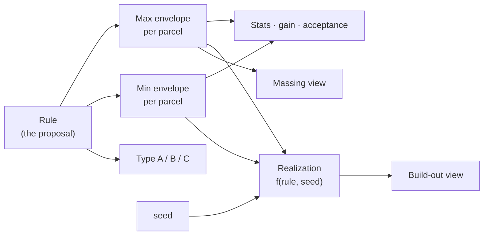

# Urban rules: permitted massing vs. example build-out

Design agreed 2026-08-08. Companion to `URBAN-RULE-BLOCKS-ROADMAP.md` (which covers making the
*block form* more expressive); this one covers the separation between **what a rule permits** and
**what a plausible result of that rule looks like**, for all three urban-rule typologies.

## The problem

Today an urban rule draws one form and the app assumes everyone builds it. That is one of three
kinds of rule people actually write, and it is the reason the 3D view reads as machine-drawn: every
plot is maxed out and identical. Detached/parcel-based already varies its houses inside the rule
(`parcel-based.js:206-265`) — block and row cannot, because they emit a single polygon at a single
height.

We want two readings of the same proposal:

- **Massing** — the permitted volume. This *is* the proposal; it is what gets voted on.
- **Build-out** — one plausible, legal realization of it. Illustration only.

## Model

The rule is the source of truth. The realization is derived and disposable — never the other way
round.

### Rule types

| | Meaning | Envelopes stored | Randomizable |
|---|---|---|---|
| **A** | maximum only — you *may* build up to this | max | ✅ |
| **B** | minimum and maximum — you must build at least the min, at most the max | min + max | ✅ |
| **C** | exact — you must build precisely the envelope | max (min = max) | ❌ |

A and C are the same design process with a flag. B adds a second step. **The max envelope is what
gets drawn everywhere by default** — massing view, 2D map, thumbnails, stats — regardless of type.

**Defaults preserve each editor's current behaviour**: C for block and row (they already draw one
specific form), A for detached (it already samples inside a max). Do not default detached to C — it
would turn its preview into identical maxed-out boxes, which is a visible downgrade.

Under C the massing and build-out views are identical, so the representation control and the
randomize button are hidden, not shown inert.

### Per-parcel buildings, for all three typologies

Block and row currently emit one feature (`building-blocks.js:2780`, `row-house.js:517-527`). They
must emit **one building per parcel**, as `massing ∩ parcel`, each carrying its `parcelId` — the
shape all three typologies then share. Parcels are shaded differently even in the massing view, so
a block reads as a street of buildings rather than one extruded ring.

This is a simplification, not a complication, and it lands the unfinished item at the bottom of
`TODO-urban-rules.txt` almost for free: gain becomes attributable per parcel with no intersection
guesswork, so "who is better off, and by how much" is a direct read.

Interior parcels are included exactly as everything else is: if the massing covers them (a
courtyard building, a detached rear wing), they get their intersection. No special case.

### Seeds, not stored randomness

Every variation source in the app is currently unseeded `Math.random()`, which breaks reload
stability, share links (two people see different cities), and the server-side thumbnails. It also
makes `parcel-based.js:855-856` false — it claims the parameters reproduce the geometry, and they
do not.

Store `seed` (int) + `variationVersion` on the proposal; derive per-parcel seeds by hashing
`proposalId + parcelId + seed`; run mulberry32. Geometry is then `f(rule, seed)` and stored
footprints for planned proposals become a cache rather than the truth.

Precedent already in the repo: park decoration randomizes once, persists, regenerates only on a
version bump (`structures.js:370-373`).

### Numbers come from the envelope, never from the sample

`gain.js:62-95` computes € gain from the proposed geometry × height. Today, clicking Regenerate in
the detached editor changes the proposal's value. That is already wrong and becomes indefensible
once a global randomize exists.

**All stats, gain, floor area and acceptance read the envelope. Variation is presentation only.**

The payoff is that the rule type becomes visible in the headline number:

- **A** → "permits **0 – 12,400 m²**" (nobody is obliged to build)
- **B** → "guarantees **4,100 – 12,400 m²**"
- **C** → "delivers **12,400 m²**"

That is a far more honest thing to put in front of someone deciding whether to accept.

## Deriving the minimum (type B)

The max envelope can be arbitrarily complex — chamfers, gaps, wings, courtyard holes, detached
parts over interior parcels, imported shapes. So the min **cannot** be a freely drawn second
polygon in the general case: a min that pokes outside the max makes the rule unsatisfiable.

The min is therefore *derived from the max by shrinking only*, and which shrinking controls exist
depends on how the max was authored:

| Max authored as | Min controls | Containment |
|---|---|---|
| **Parametric** (block/row sliders) | re-run the generator with reduced scalars: depth `0..maxDepth`, floors `0..maxFloors` | guaranteed by construction |
| **Manual** (hand-drawn ring) | uniform inward erosion `0..∅`, floors `0..maxFloors` | guaranteed (erosion is monotone) |
| **Imported** (GeoJSON) | floors `0..maxFloors`; optionally a second imported min | floors guaranteed; imported min must be **validated** |

Two things fall out of this that are worth knowing:

**The build-to line comes free from the parametric case.** The block ring is built by buffering the
superparcel inward by `setback` (fixing the outer/street edge) and then insetting by `width`
(fixing the inner edge). Reducing `width` shrinks the ring *from the courtyard side only*, so the
street facade stays put — which is exactly the obvezni građevni pravac. Any legal building must
contain the min, therefore must reach the street. B subsumes the mandatory building line without a
separate concept.

**Uniform erosion does not.** Eroding a ring thins it from both sides, so the required building
floats inside the permitted band and the facade is no longer required on the street line. That is
why erosion is the fallback for shapes with no parameters, not the primary mechanism.

For imported shapes the vertical range (floors) is the only lossless min, and it is often enough —
"same footprint, fewer floors" is a perfectly good B rule. An imported second polygon is the escape
hatch, and it is the one case where `min ⊆ max` must be checked rather than constructed.

**Wings need a flag, not a second topology.** A gap is a void and exists in both envelopes by
definition. A wing may be optional ("you may build into the courtyard") or required, so it carries
`required: bool` rather than forcing a separate min outline.

**Correction found while building step 3: for a free-standing building the minimum is scalar, not a
polygon.** A detached house may sit anywhere inside its setback envelope, so there is no region it
can be compelled to cover — a "minimum envelope you must contain" is meaningless there. Its minimum
is *at least this many floors* and *at least this much ground floor*. The polygon form of the
minimum only becomes meaningful for block and row, where the street line pins one side of it and
"must reach the street" is a real constraint. So B is implemented as scalars for parcel-based, and
the two-envelope model stays waiting for steps 4–5.

That distinction also produces a status the planner has to be shown: a plot big enough to build on
but too small to satisfy the minimum the rule itself compels. That is a **conflict in the rule**,
not a property of the plot, and it is reported separately from "too small to build on"
(`cannot-meet-minimum` vs `below-min-plot` / `no-room-after-setback`).

**UI**: either a two-step wizard (max, then min) or dual-handle sliders — storage is the same
either way (`{ param: [lo, hi] }` for all three types, so switching type never loses data). Whatever
the form, the max must stay visible as a ghost while the min is being edited.

## Provenance decides editability

An uploaded GeoJSON today goes straight into **manual mode** as a single outer ring
(`building-blocks.js:3336`), which means the import is already lossy in a way nothing tells the
user about:

- `extractOuterRingFromGeoJSON` keeps only **the largest polygon's outer ring** — holes dropped,
  every other MultiPolygon part dropped
- manual mode then simplifies to **≤60 vertices** (`MANUAL_MAX_VERTICES`), because every vertex is
  draggable
- nothing checks coordinates, area, or whether the shape is anywhere near the selected parcels

So the current path *cannot represent* the complex massing this design calls for — a courtyard
hole or a detached rear volume is silently discarded on import.

The fix is to stop treating an import as a hand-drawn ring:

| Provenance | Stored as | Editor |
|---|---|---|
| `parametric` | params | full slider editor |
| `manual` | outer ring, ≤60 vertices | vertex dragging; footprint sliders inert |
| `imported` | verbatim MultiPolygon incl. holes, full precision | **footprint read-only** |

"Read-only" means the *footprint-shaping* half only. Height, floors, rule type and min derivation
stay live for an imported massing — same principle as the roadmap's "height is always live". The
editor opens, shows the shape, and says why the shaping controls are disabled rather than refusing
to open.

Validation of imported massing is a prerequisite — see BACKLOG.

## Minimum parcel size

All three typologies carry a **minimum building-plot size**, as GUP does (najmanja površina
građevne čestice). Default **50 m²** — buildings are possible on very small plots — author-settable
from 0 to 10,000 m².

A parcel below the threshold gets no building under the rule. It must be **visibly excluded**
(distinct shade or hatch) and counted in the stats ("3 parcels excluded, below 50 m²"), never
silently empty — an empty plot that looks like a bug will be reported as one.

Under type C an excluded parcel is a hole in an otherwise mandatory block, which is correct: you
cannot compel a building on a non-conforming plot. In real planning such plots must be merged
first — which is a reparcellization, which this app has. Worth surfacing as a suggestion rather
than leaving it as a puzzle.

**A second, separate threshold is still needed**: a conforming parcel that clips only a sliver of
the massing (a 500 m² plot catching 0.8 m² of a corner) yields an unbuildable splinter. Decide
whether that goes to the neighbour or is dropped; it is not the same question as min plot size.

## Views

No third mode next to model/photo. The 3D panel already has Built and Planned display selects
(`three-mode.js:823-865`); add one row, orthogonal to solid/ghost/off:

**Planned as: ⟨ Massing · Build-out · Both ⟩** + a 🎲 Randomize, enabled outside Massing.

*Both* — solid varied buildings inside a translucent permitted envelope — is the classic planning
drawing, shows the rule and a sample in one image, and is the right default and the right
thumbnail.

**The global randomize is a session display seed and does not write to proposals.** Applied
geometry is fabric other things depend on (parcels, stacked proposals, gain, acceptance);
re-rolling it from a toolbar button would be a data mutation disguised as a view control. Only the
editor's reroll persists.

That implies the generator must be a **pure module shared by the editor and the main view**
(`rule + seed → features`) rather than living inside the modal, which is the direction the codebase
is already moving.

Later, once it works: pin a plot (reroll everything except the ones you liked) and reroll-just-this-one.

## Build order

1. ✅ **Seeded PRNG; `rule` + `seed` on the proposal; detached moved to `f(rule, seed)`; stats read
   the envelope.** Fixes the existing gain bug and delivers Massing/Build-out/Both on one typology.
2. ✅ **Panel row + global display salt + 🎲.**
3. ✅ **Rule types A/B/C in the detached editor + min derivation + min plot size** (default 50 m²,
   0–10,000; excluded plots drawn hatched with the reason on hover and counted in the summary).
4. ✅ **Block: per-parcel split at parcel lines**, A/B/C, per-parcel height variation and shades.
5. ✅ **Row: per-parcel split**, same rule machinery, same shades.

### Steps 4–5: the split is one seam, not a rewrite

The block generator is 3.6k lines and every mode (parametric, manual, imported GeoJSON, gaps,
wings, chamfer) ends at **one** finished massing feature. So the cut happens THERE, at
`displayBuildingInModal`, and nothing upstream knows about it: `splitMassingByParcels` intersects
the finished massing with each constituent parcel and hands back one building per parcel, each with
its own id, shade and variation seed. The row is the same call on its bar. `generatedBuildingFeature`
stays the whole outline, so the gap/wing handles and the vertex editor are untouched.

**What varies for a block or row piece is the height only** — its footprint is fixed by the parcel
it sits on and the building line it was cut from, which is exactly what makes a street read as
separate buildings rather than one slab. Heights are metres (the block editor's own parameter) but
vary in **whole storeys**, rounding down so a build-out can never exceed the envelope.

**Default is C (`exactly this height`) for block and row**, which is precisely what those editors
have always drawn — so nothing changes until a rule type is chosen. Detached stays A.

**Slivers go to nobody.** A piece under 20 m² is dropped and reported, not merged into a
neighbour: choosing *which* neighbour is a reparcellization, not a rendering decision.

## 6. The mandatory building line (done)

`buildToMinimum(massing, minDepthM)` takes a band that deep **inward from the massing's outer
boundary**: fill the holes, erode by the depth, subtract, then clip back to the massing. Courtyards
and gaps are voids in the maximum and stay voids in the minimum, so `min ⊆ max` holds by
construction whatever shape the ring has — parametric, hand-drawn or imported. When the massing is
nowhere thicker than the depth asked for, the erosion vanishes and the minimum *is* the maximum:
"build all of it", which is the right reading rather than a failure.

Any legal building must contain that band, therefore must reach the street. **The obvezni građevni
pravac falls out of the two-envelope model with no separate concept**, exactly as predicted.

**Blocks only.** A block's outer boundary *is* its street frontage — the courtyard is what tells
inside from outside. A row bar has gardens behind it, so a band around its whole perimeter would
compel building along the back too; a row's minimum stays its height. `normalizeBlockRule` zeroes
`minDepthM` for rows so this can't be set by accident.

Two things fall out:

- **Depth variation, which is also the shape variation deferred at step 4.** With both footprints
  stored on the piece, a build-out picks between them per parcel at no geometry cost — some plots
  build only to the compelled line, others fill the plot. Two states, not a continuum: legible, and
  it keeps the share payload small. The depth is drawn *after* the height, so adding it did not
  restyle any design that predates it.
- **The range headline the design promised.** `summariseBlockRule` returns permitted vs guaranteed
  floor area, and the block editor's info line now reads *permits 0 – 12,400 m²* (A),
  *guarantees 4,100 – 12,400 m²* (B) or *delivers 12,400 m²* (C). The rule type is visible in the
  one number people vote on.

In the editor the compelled part is drawn solid and the merely-permitted remainder lighter, so the
building line reads as a line and not only as a number.

### What steps 1–2 actually built (2026-08-08)

`frontend/js/urban-rule-variation.js` — the pure module, unit-tested in
`backend/test/urban-rule-variation.test.js` (26 tests):

- `hashSeed` (FNV-1a) / `mulberry32` / `rngFor` / `hashIndex` — deterministic randomness, stable
  across browsers and node so a shared link and a server-rendered thumbnail agree.
- `normalizeParcelRule` — the canonical rule, already carrying `kind` (A/B/C), `minFloors` and
  `minPlotAreaM2` so step 3 adds UI rather than a new shape.
- `parcelEnvelope(parcel, rule, deps)` — the permitted volume; `null` means the rule leaves this
  parcel nothing buildable.
- `realizeFromEnvelope` / `realizeFeature` — one legal build-out. Draw order is a contract: floors
  first, so the count depends on the seed alone and not on how many slide attempts the parcel's
  shape needed. `realizeFeature` takes an optional **salt** that re-rolls without touching the
  stored seed.
- `plannedDrawPlan(feature, representation, deps, salt)` — what a view should draw. It lives here,
  not in the renderer, because it is the one branch the whole feature turns on and a renderer
  cannot be unit-tested. It never returns two coincident volumes.

Each envelope feature is **self-describing**: it carries `urbanRule` and `variationSeed` in its
properties, so any consumer can derive the same build-out from the feature alone, with no proposal
lookup. A feature without a rule (an import, a single building, anything saved earlier) returns
unchanged from every entry point and draws as itself in all three representations.

Wiring: `parcel-based.js` saves envelopes in `geometry.buildings` and shows the build-out inside a
dashed envelope; its metrics are now *Permitted* footprint and volume plus *Example floors (avg)*.
Regenerate advances the seed; a slider does not, so raising the height limit no longer reshuffles
every footprint on the street. `three-mode.js` gains the **Planned as** row and the 🎲, whose salt
is session-only — it never writes to a proposal.

## Risks

- **Mesh count** rises roughly an order of magnitude for blocks. Merge per proposal; do not emit a
  mesh per segment.
- **i18n**: HR/ES/SR strings for the new controls. *Massing* is "gabarit"; build-out something like
  "primjer izgradnje".
- **`buildingFeature: buildings[0]`** — the legacy single-feature field has several readers and
  needs auditing before block/row become multi-feature.
